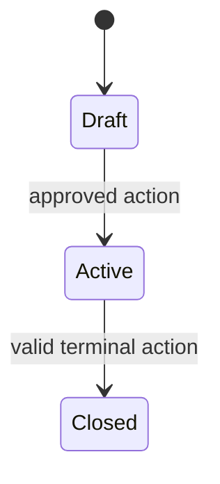

# Feature Specification: [FEATURE NAME]

> Delete no mandatory section. Use `N/A — <objective reason>` where a section is truly inapplicable. `NEEDS CLARIFICATION` blocks `SPEC_APPROVED`; legal/clinical/UX/vendor choices must not be silently selected. Do not create this file unless every target ID passed the active-scope eligibility gate; `DEFERRED_POST_MVP`, `RETIRED`, reserved, and unknown IDs are forbidden.

## 0. Metadata and traceability

| Field | Value |
|---|---|
| SpecKit feature ID | `[NNN-short-name]` |
| Status | `DRAFT` |
| Target FR IDs | `[FR-...]` |
| Target NFR IDs | `[NFR-...]` |
| Scope eligibility | `ACTIVE — [PRD version, section/row, gate decision/date]` |
| Target app/service/package | `[path(s)]` |
| Owner | `[name/role]` |
| Reviewers | Product `[ ]`; QA `[ ]`; Architecture `[ ]`; Security `[ ]`; DPO/Legal `[ ]`; Clinical `[ ]`; Design/A11y `[ ]` |
| Risk class | `[routine / sensitive-data / clinical-safety / emergency / financial / AI]` |
| Regulatory domains | `[PDPL / EDA-MoHP / MOSS / CBE / facility-professional licensing / N/A]` |
| Clinical sign-off required | `[yes — roles / no — objective reason]` |
| Dependencies | `[feature IDs and approved contract versions]` |
| Parent roadmap entry | `[path + immutable ID or N/A]` |
| Created / updated | `[YYYY-MM-DD / YYYY-MM-DD]` |

## 1. Problem and scope

### Problem statement

[Who cannot do what, in which Egyptian operating context, and what objective outcome is required?]

### Actors and authorization context

| Actor | Facility/patient relationship | Permitted outcome | Explicitly prohibited |
|---|---|---|---|
| [actor] | [context] | [outcome] | [prohibition] |

### In scope

- [Behavior mapped to an FR]

### Non-goals

- [Behavior explicitly outside this feature and why]

### Dependencies and assumptions

| Item | Type (`verified fact`, `SHIFAA policy`, `assumption`, `OPEN`) | Evidence / open ID |
|---|---|---|
| [item] | [type] | [primary source or OPEN-*] |

## 2. Egyptian regulatory and legal validation

Complete against `docs/compliance/EGYPT-Compliance-Baseline.md`.

- [ ] Controller/processor and lawful basis recorded in processing inventory.
- [ ] Sensitive, health, biometric, financial, and child-data classification completed.
- [ ] Arabic-first privacy notice and granular consent/withdrawal behavior defined, or lawful non-consent basis explained.
- [ ] Data minimization, recipients, processors, and prohibited telemetry fields specified.
- [ ] Retention class and approved duration/action linked; `OPEN-LEGAL-002` used if unresolved.
- [ ] Storage/processing countries and PDPC license/permit/transfer evidence linked.
- [ ] DPO review and required category/registration evidence linked.
- [ ] Facility/professional/EDA/MoHP/MOSS/UHI/CBE obligations identified when relevant.
- [ ] Controlled drug, e-prescription, EPTTS, disability entitlement, payment, and AI gates checked when relevant. Donation is `N/A — ADR-016 deferred` unless a prior approved re-entry ADR has already restored `FR-FIN-*` to active PRD scope.
- [ ] Breach/incident and data-subject request impact specified.
- [ ] Every legal statement cites the controlling primary/official Arabic instrument; a non-official host or translation is labeled secondary and carries `OPEN-LEGAL-007` until counsel validates the article mapping. SHIFAA policy remains separately labeled.

**Blocking open items:** [OPEN-* or `None`]

## 3. User Scenarios & Testing *(mandatory)*

### Journey [J-01] — [name]

1. Given [preconditions and actor context].
2. When [action].
3. The system [observable result].
4. Audit/notification/next state: [result].

### Alternate, failure, and degraded paths

| Case | Trigger | UI/API result | State/audit effect | Recovery |
|---|---|---|---|---|
| Permission denied | [trigger] | [result] | none + denied-access audit if required | [recovery] |
| Offline/disconnected | [trigger] | [result] | [no queue / safe queue] | [reconcile] |
| Vendor timeout/failure | [trigger] | [explicit pending/failed state] | [state] | [fallback] |
| Duplicate/replay | [trigger] | [stored result/conflict] | one effect | [recovery] |
| Concurrent change | [trigger] | `409`/refresh | no partial effect | [retry] |
| Invalid transition | [trigger] | problem code | no partial effect | [correct action] |
| Stale data | [threshold] | timestamp + stale/unknown | [restriction] | refresh/manual confirm |
| Clinical override | [if relevant] | [hard stop/workflow] | signatures/audit | [alternative] |

## 4. Requirements *(mandatory)*

### Functional Requirements

Use the immutable PRD requirement IDs. Do not create replacement feature-local FR numbers.

| Target PRD requirement | Required feature behavior | Acceptance coverage |
|---|---|---|
| `[FR-...]` | [behavior implementing the existing PRD requirement] | `[AC-...]` |

## 5. Domain model and invariants

### Entities and ownership

| Entity | Owning domain | Authoritative source | Lifecycle owner |
|---|---|---|---|
| [entity] | [domain] | [table/system] | [role] |

### State machine

List every allowed transition with actor, guard, side effects, and failure code. All other transitions are denied.

### Invariants and concurrency

- [Database-enforced invariant]
- [Transaction boundary]
- [Version/If-Match or lock rule]
- [Separation-of-duties rule]

## 6. Exact data and RLS contract

### Tables and fields

| Table.column | Type | Null/default | Key/check/index | Classification | Encryption | Retention class |
|---|---|---|---|---|---|---|
| `[schema.table.column]` | [type] | [rule] | [rule] | [class] | [method/N/A] | [class] |

### Migration

- Forward order: [steps]
- Existing-data validation/backfill: [steps]
- Rollback or roll-forward: [steps]
- Backup/restore impact: [steps]

### RLS/action matrix

| Actor/context | SELECT | INSERT | UPDATE | DELETE/state action | Negative test ID |
|---|---|---|---|---|---|
| [actor] | [row/field predicate] | [check] | [predicate/check] | [rule] | [test] |

State whether tables use `ENABLE` and `FORCE ROW LEVEL SECURITY`, which non-owner role executes online queries, and how security-definer helpers fix `search_path` and avoid stale JWT authorization.

## 7. API endpoint specifications

One subsection per operation. The feature contract at `contracts/openapi.yaml` is machine-readable and must match this text.

### `[operationId]` — `[METHOD /v1/path]`

| Field | Contract |
|---|---|
| FR/NFR | `[IDs]` |
| Actors/context/AAL/purpose | `[exact]` |
| Headers | Authorization, Accept-Language, X-Request-Id, Idempotency-Key `[required/N/A]`, If-Match `[required/N/A]` |
| Path/query | `[name: type, constraints, defaults]` |
| Request body | `[schema and example]` |
| Success | `[status + complete schema/example]` |
| Errors | `[status + stable problem code + trigger]` |
| Idempotency scope/TTL | `[exact]` |
| Concurrency/pagination/rate | `[exact]` |
| Audit | `[action, purpose, fields excluded]` |
| Events | `[event name, minimum payload, ordering]` |

## 8. UI/UX and edge-state matrix

| App/route/viewport | State | Arabic/English content | Controls/focus | Permission/offline behavior | Design baseline ID |
|---|---|---|---|---|---|
| [path] | loading | [keys] | [order] | [behavior] | [ID or OPEN-UX-001] |
| [path] | empty | [keys] | [order] | [behavior] | [ID] |
| [path] | error | [keys] | [order] | [behavior] | [ID] |
| [path] | success | [keys] | [order] | [behavior] | [ID] |

Also specify RTL mirroring/bidi isolation, 200% text, keyboard/screen-reader announcements, touch targets, reduced motion, staleness, destructive/high-risk confirmation, and clinical override UI where applicable.

## 9. Notifications and asynchronous events

| Source event | Recipient policy | Template/channel | Allowed data fields | Dedup key | Retry/DLQ | Acknowledgement/escalation |
|---|---|---|---|---|---|---|
| [event] | [exact actor relationship] | [version] | [minimum list] | [key] | [policy] | [policy] |

Explicitly state whether Emergency Contacts can receive each event. Default is **no**; only an approved active life-safety SOS template may say yes.

## 10. Security, privacy, and abuse cases

| Threat/misuse | Control | Verification |
|---|---|---|
| Broken object/facility authorization | [API + RLS] | [negative tests] |
| Account/session/recovery abuse | [control] | [tests] |
| Replay/race/duplicate | [control] | [tests] |
| Insider/excessive data access | [purpose/audit/min fields] | [tests/review] |
| Injection/upload/webhook/vendor | [control] | [tests] |
| PHI/secret in logs or analytics | [redaction/prohibition] | [scanner/test] |

## 11. Success Criteria *(mandatory)*

### Measurable Outcomes

| ID | Outcome | Measurement method | Required threshold |
|---|---|---|---|
| `SC-001` | [technology-independent user or business outcome] | [method] | [threshold] |

### Acceptance Criteria and Test Vectors

Use deterministic values, not “works correctly.”

### AC-[NN] — [name]

- **Given** [exact records, roles, states, versions, locale, vendor outcome]
- **When** [one action with method/route or UI control]
- **Then** [HTTP/UI/state/audit/event result]
- **And** [negative side effect that must not occur]
- **Automated by** `[test path/ID]`

Required categories: happy path, each state transition, negative authorization/RLS, replay/same-key-different-body, race/version conflict, offline/reconnect, vendor timeout/permanent failure, Arabic/English/RTL, keyboard/screen reader, redaction, and rollback. Clinical features also include approved positive/negative content vectors and override/signature failures.

## 12. Observability, rollout, rollback, and incidents

- SLO/SLI and capacity assumption: [exact]
- Metrics/traces/logs and redaction: [exact]
- Dashboard/alerts and owner: [exact]
- Feature flag and cohort: [exact]
- Data migration/rollback or roll-forward: [exact]
- Kill switch/degraded behavior: [exact]
- Incident/runbook link: [path]

## 13. Evidence and approvals

| Gate | Reviewer(s) | Artifact/version/digest | Decision/date | Blocking findings |
|---|---|---|---|---|
| Product/QA | [name] | [link] | [decision] | [items] |
| Legal/DPO | [name] | [link] | [decision] | [items] |
| Clinical | physician `[name]`; pharmacist `[name]` | [link] | [decision] | [items] |
| Architecture/Security | [name] | [link] | [decision] | [items] |
| Design/Accessibility | [name] | [link] | [decision] | [items] |
| Release | [names] | evidence manifest | [decision] | [items] |

## 14. Open items and change log

| Open ID | Owner | Next action/evidence | Blocks gate |
|---|---|---|---|
| [OPEN-*] | [owner] | [action] | [gate] |

| Date | Version | Change and affected FR/NFR/contracts |
|---|---|---|
| [date] | [version] | [change] |
