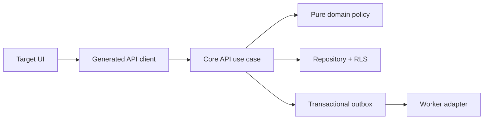

# Implementation Plan: [FEATURE]

> **Feature:** `[NNN-short-name]` · **Spec version/status:** `[version / SPEC_APPROVED]`  
> **Target FR/NFR:** `[IDs]` · **Owner:** `[name/role]` · **Updated:** `[YYYY-MM-DD]`

## 1. Approved inputs

| Input | Version/digest | Approval/gate |
|---|---|---|
| `spec.md` | [value] | Product/QA |
| Active-scope eligibility | [PRD version + IDs + gate decision] | must be ACTIVE before planning |
| Constitution | [value] | check below |
| PRD/Master/supporting contracts | [values] | [review] |
| Legal/clinical/design evidence | [links or OPEN-* blocker] | [gate] |

## 2. Constitution check

For Articles I–XV, write `PASS — <implementation evidence>`, `N/A — <objective reason>`, or `BLOCKED — <OPEN-ID + blocked capability/gate>`. A blocker mapped to research/specification/architecture/plan prevents `PLAN_APPROVED`; a production-release-only blocker may remain as an overlay only when the plan keeps that capability feature-flagged off and uses synthetic data. `N/A` without a reason is invalid.

| Article | Result and evidence |
|---|---|
| I Least privilege/default deny | [result] |
| II Internal typed identity | [result] |
| III Canonical care relationships | [result] |
| IV Facility membership/attribution | [result] |
| V Patient-centric purpose-limited data | [result] |
| VI Dual clinical governance | [result] |
| VII Regulated evidence gate | [result] |
| VIII Separation of duties | [result] |
| IX MFA/purpose | [result] |
| X Portable domain logic | [result] |
| XI One app per surface | [result] |
| XII Arabic-first consent/privacy | [result] |
| XIII Accessibility/localization | [result] |
| XIV Safety UI clarity | [result] |
| XV Human authority over AI | [result] |

## 3. Technical context

- Target apps/services/packages: [paths]
- Runtime/toolchain versions: [from checked-in toolchain]
- Performance/SLO and dataset assumptions: [exact]
- Existing modules/contracts reused: [paths/operation IDs/tables]
- External adapters and sandbox/production gates: [ports, OPEN IDs]

## 4. Proposed design and dependency flow

Explain only deviations/additions. Dependencies must follow the canonical repository direction; no app-to-app or core-to-vendor import.

## 5. Work products

### Data and migration

- Tables/columns/constraints/indexes/state functions: [summary; exact in `data-model.md`]
- RLS helpers/policies/negative tests: [summary]
- Forward/backfill/validation/rollback or roll-forward: [summary]
- Retention/encryption/key impact: [summary]

### API and generated clients

- Catalog operation IDs added/changed: [IDs]
- `contracts/openapi.yaml` changes: [summary]
- Idempotency/version/pagination/rate/audit/events: [summary]
- Backward compatibility/deprecation: [summary]

### UI, localization, and accessibility

- Routes/components/design baseline IDs: [values]
- Loading/empty/error/offline/stale/success/permission states: [summary]
- Arabic/English/RTL/bidi, keyboard/screen reader, 200% text, reduced motion: [summary]
- Safety/override/confirmation behavior: [summary]

### Events, notifications, and vendors

- Outbox events, minimum payload, ordering, consumers: [summary]
- Template versions/recipient/data-field allow-list: [summary]
- Retry/dedup/dead-letter/acknowledgement: [summary]
- Adapter timeout/fallback/kill switch: [summary]

### Security, privacy, and abuse controls

- Threats and controls: [summary]
- Prohibited logs/analytics/uploads: [summary]
- AAL/purpose/audit/separation: [summary]

## 6. Test and evidence plan

| Requirement/test family | Level | Fixture/vector | Expected evidence/path |
|---|---|---|---|
| [FR/NFR + TV-*] | unit/integration/contract/RLS/E2E/a11y/visual/security/load/DR | [exact] | [path/output] |

Include every acceptance criterion, state transition, negative authorization, replay, race, offline/reconnect, vendor failure, Arabic/English, accessibility, redaction, and rollback case from the spec.

## 7. Delivery sequence

1. Contract/test fixtures before production code.
2. Expand migration + RLS negative tests.
3. Core policy/state tests.
4. API use case + contract/idempotency/audit/outbox tests.
5. Generated client.
6. UI states + localization/accessibility/visual tests.
7. Adapter/worker/degraded-path tests.
8. Integrated acceptance, performance/security, migration validation.
9. Documentation/trace/evidence manifest.
10. Release gate and feature flag rollout.

Identify parallel-safe items and exact blockers; undefined dependencies cannot be scheduled as parallel work.

## 8. Rollout, rollback, and operations

- Feature flag/cohort/order: [exact]
- Database deploy strategy: [expand/migrate/contract]
- Rollback/roll-forward and irreversible boundary: [exact]
- Dashboards/alerts/on-call/runbook: [paths]
- Incident/kill switch and user-visible degraded behavior: [exact]

## 9. Plan approval

| Gate | Reviewer | Decision/date | Evidence/blocker |
|---|---|---|---|
| Architecture/data | [name] | [decision] | [link] |
| Security/privacy/legal | [name] | [decision] | [link/OPEN] |
| Clinical (if applicable) | [physician + pharmacist] | [decision] | [link/OPEN] |
| Design/accessibility | [name] | [decision] | [link/OPEN] |
| QA/Product | [names] | [decision] | [link] |
