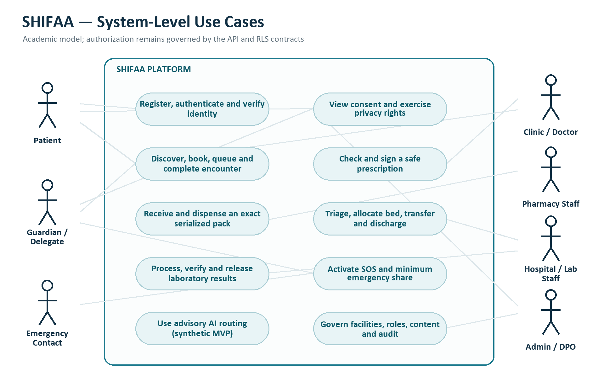
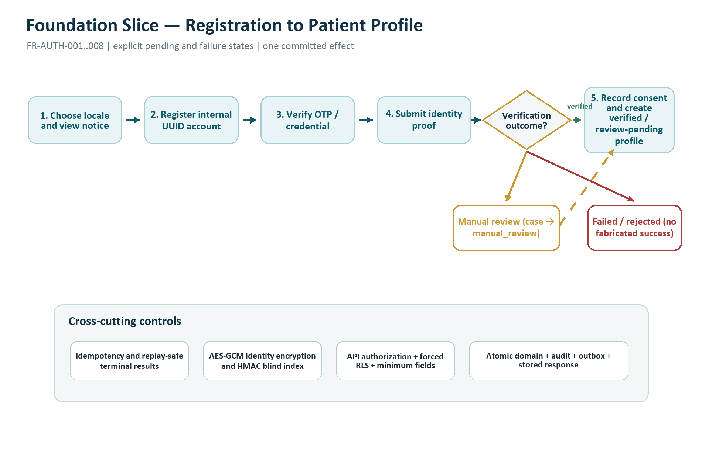
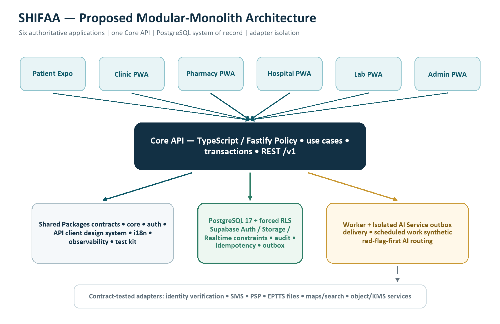
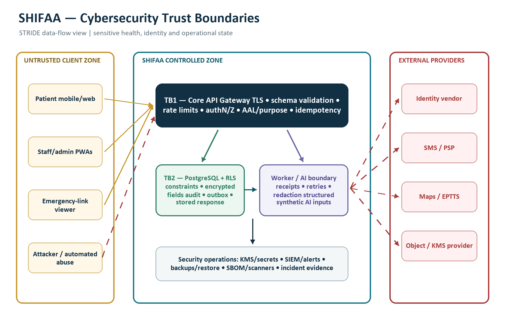

# SHIFAA (شفاء): Integrated Digital Health Platform for Egypt

**Chapter 1 — Project Analysis**  
**Egyptian Chinese University — Graduation Project**  
**Prepared by:** SHIFAA Graduation Project Team  
**Academic year:** 2026/2027  
**Document date:** 9 August 2026  
**Normative sources:** SHIFAA PRD v2.1.0 and Master Implementation Plan v2.1.0

> **Document authority.** This chapter is an academic presentation of the approved SHIFAA product and architecture baseline. It does not replace or amend the PRD, Master, Constitution, supporting contracts, ADRs, or open-item register. Where this chapter summarizes scope, requirements, or architecture, the source documents remain normative. New diagrams, AI methodology, and cybersecurity analysis in Sections 4, 6, and 7 are analytical deliverables consistent with that baseline. The proposed AI algorithm does not close `OPEN-AI-001`; the named owners must still approve the model card and locked evaluation set.

---

## 1. Project Overview

### 1.1 Project Title

**SHIFAA (شفاء): An Integrated, Arabic-First Digital Health Platform for the Arab Republic of Egypt.**

### 1.2 Introduction

SHIFAA is an Egyptian integrated digital-health platform that connects patients, clinics, pharmacies, hospitals, and diagnostic laboratories around a longitudinal patient record and a common set of safety, privacy, and traceability rules. Its graduation MVP is not a collection of disconnected demonstrations. It must prove an end-to-end care journey in which identity, clinical, dispensing, admission, laboratory, emergency, consent, and audit states are real system states with deterministic acceptance evidence.

The product is Arabic-first (`ar-EG`, right-to-left) with complete English (`en-EG`, left-to-right) parity. It uses Egyptian operating conventions including EGP, `Africa/Cairo`, governorate/city/district addresses, Egyptian mobile-number flows, and explicit gates for Egyptian identity, health-data, professional-licensing, pharmaceutical-traceability, and payment obligations. Production use of real patient data remains blocked until the applicable legal, DPO, vendor, clinical, and infrastructure evidence in the PRD open-item register is complete.

### 1.3 Problem Statement

Egyptian patients often interact with separate care providers and service-specific digital tools. Appointments, encounter records, prescriptions, medicine availability, hospital capacity, laboratory results, family-care authority, and emergency communication may therefore be fragmented across organizations and channels. Fragmentation can force patients to repeat information, prevent authorized professionals from seeing the minimum longitudinal context needed for safe care, and make it difficult to trace whether a medicine, bed, result, consent decision, or emergency disclosure was handled correctly.

The problem is not merely the absence of another booking application. The engineering problem is to connect the care journey while preserving contextual authorization, patient relationships, clinical safety, serialized medicine traceability, concurrent resource allocation, Arabic accessibility, and Egyptian privacy constraints. SHIFAA addresses that problem through a single contract-governed platform rather than by treating each facility as an isolated database or allowing every client application to implement its own rules.

### 1.4 Project Objectives

SHIFAA has the following objectives, adapted from PRD Sections 2, 6, and 7:

1. Establish an internal, non-semantic patient identity and support verified or explicitly review-pending Egyptian identity proofing without using National ID, passport, or UNHCR document numbers as usernames or exposed identifiers.
2. Enable a patient to discover and book a licensed clinic, join a live queue, complete an encounter, and receive a prescription that passes the governed medication-safety workflow.
3. Enable a licensed pharmacy to receive serialized packs, preserve exact-pack provenance, and dispense safely and atomically against a valid prescription.
4. Enable a hospital to record arrival and triage, allocate beds without double assignment, transfer patients atomically, and complete a versioned discharge.
5. Enable a laboratory to execute the order-to-result lifecycle, including controlled release, correction history, and closed-loop critical-result acknowledgement.
6. Provide Family Care, delegation, emergency contacts, SOS discovery, and short-lived emergency sharing without disclosing health data beyond the authorized purpose.
7. Provide Arabic-first consent, privacy-rights requests, auditability, and default-deny authorization across every application and database path.
8. Deliver accessible Arabic and English experiences across the patient application and five facility/governance applications.
9. Demonstrate the mandatory AI Triage scope as an isolated, non-public, seeded-synthetic track that runs deterministic red flags first and produces advisory routing only.
10. Produce reproducible, traceable implementation evidence in which every active FR/NFR maps to specification, contract, implementation, and automated verification.

### 1.5 Project Scope

The graduation MVP includes six authoritative applications: patient, clinic, pharmacy, hospital, laboratory, and platform administration. One Core API performs all user-driven domain mutations; an asynchronous worker processes outbox events; and an isolated AI service supports the mandatory AI Triage track.

The end-to-end scope includes:

- identity, authentication, verification, recovery, consent, and privacy-rights workflows;
- self, guardianship, and adult-delegation care relationships;
- facility and professional licensing, memberships, five-role administration, and four-eyes decisions where required;
- clinic discovery, appointments, queueing, encounters, referrals, prescriptions, allergies, interactions, and governed overrides;
- product import, serialized pharmacy receiving, EPTTS file/manual adapter behavior, stock discovery, exact-pack dispensing, substitution, returns, and refills;
- hospital arrival, triage, beds, admission, transfer, discharge, and capacity signals;
- laboratory orders, specimens, results, corrections, release, and critical-result acknowledgement;
- vaccination, chronic observations, medication reminders/adherence, disability entitlement credential, reviews, complaints, contextual messages, notifications, and care-payment routing;
- SOS, minimum emergency disclosure, and the access-controlled synthetic AI Triage track.

Explicit MVP non-goals include autonomous diagnosis or treatment; ambulance dispatch; insurance/UHI claim adjudication; representing a disability card as money or insurance; unapproved national EDA/UHI/MoHP integrations; medicine-shortage prediction or logistics; open-ended medical consultation chat; a second gRPC API; and donations, fundraising, collection, custody, disbursement, or donor-impact reporting. `FR-FIN-001..003` remain reserved post-MVP IDs and must not generate graduation specifications, routes, migrations, jobs, UI, or release evidence.

---

## 2. Background Study

### 2.1 Literature Review / Existing Systems

Digital health is increasingly framed as infrastructure for equitable, person-centred health systems rather than as a collection of independent mobile applications. The World Health Organization's Global Strategy on Digital Health 2020-2027 emphasizes that digital initiatives require coordinated organizational, human, financial, and technical resources [R3]. In Egypt, the Egypt Healthcare Authority reports a digital-transformation program that includes unified electronic medical records, electronic prescriptions, digital imaging archives, telemedicine, coding, and operational dashboards within Universal Health Insurance governorates [R4]. This establishes a strong national direction toward connected health information while not implying that a public third-party API is available to SHIFAA.

Existing systems demonstrate valuable parts of the problem:

- **Vezeeta** offers doctor discovery, appointment booking, teleconsultation, pharmacy ordering, and home visits in Egypt [R5]. It demonstrates demand for consumer discovery and access workflows.
- **Altibbi** provides Arabic health content and remote consultation services across the region [R6]. It demonstrates the value of Arabic health communication and telehealth access.
- **OpenMRS** is a configurable open-source electronic medical record platform with registration, appointments, queues, clinical documentation, billing, stock, laboratory, dispensing, role management, translation, and interoperability capabilities [R7]. It demonstrates the breadth and extensibility expected of a serious EMR platform.
- **HL7 FHIR** provides standard resource models and exchange patterns for clinical and administrative health information [R8]. SHIFAA uses FHIR R4-aligned semantics selectively for medication and provenance contracts without claiming national certification or exposing a second public FHIR server in the MVP.
- **Symptom checkers** show both accessibility potential and safety limitations. A benchmark audit found wide variation in diagnostic and triage performance [R9], while a systematic review reported low primary diagnostic accuracy and inconsistent triage accuracy across evaluated tools [R10]. These findings support SHIFAA's decision to avoid diagnosis, execute deterministic red flags before inference, disclose uncertainty, and require licensed-human confirmation for consequential hospital workflow.

### 2.2 Gap Analysis

The comparison indicates that no single reviewed system description establishes the same combined graduation scope and governance contract as SHIFAA. Consumer marketplaces focus primarily on discovery, booking, consultation, or delivery. Facility EMRs provide powerful clinical records but are normally deployed around organization workflows rather than one Egyptian patient-facing journey spanning clinic, pharmacy, hospital, laboratory, family authority, emergency disclosure, and serialized dispensing. Public Egyptian transformation announcements demonstrate national progress but do not publish an open national interface that SHIFAA may assume.

SHIFAA's intended contribution is therefore the governed integration of these concerns:

| Observed gap | SHIFAA response |
|---|---|
| Fragmented patient and facility journeys | One patient-facing journey across six authoritative applications and one Core API |
| Identity documents used as convenient account keys | Internal UUID subject plus encrypted typed identity attributes and HMAC blind-index deduplication |
| Authorization implemented only in UI or API middleware | Contextual API policy plus forced PostgreSQL row-level security and negative cross-tenant tests |
| Medication availability without exact provenance | Serialized pack receipt, remaining units, movement history, and atomic exact-pack dispense |
| Bed state vulnerable to concurrent assignment | Versioned bed holds/assignments and transactionally enforced occupancy invariants |
| Emergency contact treated as a general clinical subscriber | Life-safety-only, consented minimum notification separate from clinical access |
| Clinical AI presented as diagnosis | Red-flag-first, no-diagnosis advisory routing with uncertainty, version, human confirmation, and kill switch |
| Arabic added after implementation | `ar-EG` and RTL are first-screen release criteria with English parity and accessibility evidence |
| Academic prototype disconnected from implementation evidence | Immutable FR/NFR IDs, SpecKit lifecycle, generated contracts, and traceability-gated CI |

---

## 3. System Analysis

### 3.1 Proposed System

SHIFAA is a modular monolith with independently deployable user applications, a single TypeScript Core API, a transactional worker, PostgreSQL as system of record, and an isolated Python AI service. The modular-monolith choice preserves strong transaction boundaries for prescriptions, inventory, consent, beds, and audit while remaining operable by a ten-person graduation team. Domain modules expose explicit ports so vendors or selected modules can be replaced or extracted later without changing the public contract.

Supabase Auth issues identities, while the Core API verifies the token, resolves actor/facility/patient/purpose context, opens a database transaction with request-scoped RLS context, and executes the use case. Clients never call domain tables, service-role endpoints, storage administration, vendors, or AI directly. External systems such as identity verification, SMS, payments, maps, EPTTS exchange, and AI remain behind contract-tested adapters with a documented degraded path.

### 3.2 Functional Requirements

The normative wording and acceptance ownership remain in PRD Section 4 and the traceability matrix. The following academic summary covers all active functional domains without redefining them:

| Domain | Active requirement IDs | Required capability |
|---|---|---|
| Identity, authentication, privacy | `FR-AUTH-001..008` | UUID identity, OTP/password/passkey/MFA, verification, recovery, encrypted proof, consent, DSR, processing inventory |
| Family Care and emergency contacts | `FR-FAM-001..008` | self/guardianship/delegation, evidence, transition, scoped authority, life-safety-only contacts, auditable context |
| Facilities and administration | `FR-FAC-001..007`, `FR-ADMIN-001..004` | licensed facilities/professionals, memberships, contextual roles, schedules/chat, five-role governance and separation of duties |
| Clinic and queue | `FR-CLINIC-001..008` | discovery, concurrency-safe appointments, queue, delay/absence, encounter, referral, facility fees |
| Medication and clinical safety | `FR-SAFE-001..012` | allergy/interaction checks, versioned clinical content, severity, warning rationale, contraindication hard stop, governed emergency path, FHIR-aligned provenance |
| Pharmacy and EPTTS | `FR-PHARM-001..010` | GS1 pack receipt, aggregation exceptions, exact-pack/partial dispense, stock freshness, product provenance, movements, substitution/refill |
| Hospital | `FR-HOSP-001..007` | arrival/triage, bed state/hold/race control, admission, atomic transfer, versioned discharge, safe capacity projection |
| Laboratory | `FR-LAB-001..004` | coded orders, specimen/result lifecycle, professional verification, immutable correction, critical-result acknowledgement |
| Discovery and SOS | `FR-DISC-001`, `FR-SOS-001..004` | verified facilities, fresh capacity, explicit SOS, informational match, short-lived minimum emergency share |
| Longitudinal care | `FR-VAX-001..002`, `FR-CHRONIC-001..002`, `FR-MED-001..003` | governed vaccination, patient observations, trend display, reminders/adherence, non-automatic refill request |
| Access and trust | `FR-ACCESS-001..002`, `FR-TRUST-001..002` | disability entitlement credential, verified reviews, private SLA-tracked complaints |
| Notifications and payments | `FR-NOTIF-001..002`, `FR-PAY-001..003` | bilingual minimum-data templates, outbox delivery, licensed hosted/tokenized digital payment with cash fallback |
| AI Triage | `FR-AI-001..005` | deterministic red flags, advisory symptom routing and hospital severity, minimum synthetic input, governed evaluation/release/rollback |

Reserved `FR-FIN-001..003` are deliberately excluded from the active graduation denominator.

### 3.3 Non-Functional Requirements

The 24 normative NFRs define the quality bar:

| Quality area | IDs | Acceptance direction |
|---|---|---|
| Security | `NFR-SEC-001..007` | default-deny API/RLS, encryption, short rotating sessions, AAL2, idempotency, tamper-evident audit, ASVS/API testing |
| Privacy | `NFR-PRIV-001..004` | Arabic-first granular consent, production authorization evidence, breach timers, approved retention rules |
| Localization and accessibility | `NFR-I18N-001`, `NFR-A11Y-001` | complete `ar-EG`/`en-EG` parity, RTL/bidi correctness, WCAG 2.2 AA and assistive-technology tests |
| Performance | `NFR-PERF-001..002` | patient cold-start/interaction targets and API/SOS p95 targets under approved profiles |
| Availability | `NFR-AVAIL-001..002` | 99.9% target, 15-minute RPO, 60-minute RTO, reconnect/reconcile/stale-state behavior |
| Data integrity | `NFR-DATA-001..002` | PostgreSQL authority, constrained transactional states, append-only corrections, UTC timestamps and explicit money/units |
| API | `NFR-API-001..002` | `/v1` OpenAPI 3.1.1, RFC 9457 problems, generated schemas/clients, cursor pagination, request IDs and version control |
| Observability | `NFR-OBS-001` | shared trace IDs and strict exclusion of identifiers, tokens, free text and full clinical payloads from telemetry |
| Quality engineering | `NFR-QUALITY-001` | formatting, lint, type, unit, contract, migration, RLS, accessibility, security and P0 E2E gates |
| Portability | `NFR-PORT-001` | framework/vendor-free domain logic and contract-tested adapters |

### 3.4 Stakeholders / Target Users

| Stakeholder | Primary interest or responsibility |
|---|---|
| Self-managed patient | identity, appointments, record, prescriptions, results, consent and emergency action |
| Guardian | approved management of a dependent without impersonation |
| Adult delegate | explicitly granted, revocable actions for another adult |
| Emergency contact | minimum life-safety notification only after confirmation |
| Clinic staff and doctors | schedules, queues, encounters, referrals and safe prescribing |
| Pharmacists and directors | licensing, receipt, inventory, EPTTS evidence and exact-pack dispense |
| Hospital staff | arrival, triage, admission, beds, transfer, discharge and capacity |
| Laboratory staff | order acceptance, specimen work, result verification/release and critical escalation |
| Platform administrators | least-privilege support, clinical review, facility approval, finance review and super-administration |
| DPO / legal counsel | privacy evidence, processing inventory, DSR, transfers, retention and production authorization |
| Medical and pharmacy governance | clinical content, hard stops, overrides, AI safety and test-set approval |
| Product, design, QA, security and architecture leads | scope, screen baselines, deterministic tests, threat controls and system contracts |
| Egyptian regulators and authorities | applicable health-data, facility, pharmacy, medicines, identity, social-protection and payment oversight |
| Egyptian Chinese University | academic supervision and evaluation of the graduation deliverables |

---

## 4. System Modeling

### 4.1 Use Case Diagram

**Figure 1.** System-level use cases and external actor boundaries. The diagram groups actions by user outcome; it does not grant authorization. The API policy and RLS contracts remain authoritative for each action.

### 4.2 Use Case Descriptions

#### UC-01 — Register and establish a patient profile

- **Primary actor:** Patient.
- **Preconditions:** User does not have an active SHIFAA account; the required privacy notice and processing-inventory purpose versions exist.
- **Trigger:** User selects registration in Arabic or English.
- **Main flow:** The system captures the minimum account data, verifies the selected factor, creates an internal UUID subject and person/patient profile, records required notice/consent evidence, and establishes the patient's self relationship.
- **Alternates:** Duplicate handle, rate limit, invalid OTP, refusal of optional consent, interrupted network, or replayed idempotency key returns an explicit safe state without duplicate identity/profile creation.
- **Postconditions:** A usable authenticated session and patient profile exist, or the flow ends in a documented pending/failed state.
- **Mapped requirements:** `FR-AUTH-001`, `FR-AUTH-002`, `FR-AUTH-007`, `FR-AUTH-008`; applicable security/privacy/API NFRs.

#### UC-02 — Verify identity

- **Primary actor:** Patient; Facility Approval Administrator for manual review.
- **Preconditions:** Authenticated patient profile; identity purpose is approved in the processing inventory.
- **Trigger:** Patient submits Egyptian National ID proof or uploads passport/UNHCR evidence.
- **Main flow:** The API encrypts the identity value, creates a blind index for exact-match deduplication, creates a verification case, and routes through the vendor adapter or manual-review worklist.
- **Alternates:** Vendor timeout or unavailability produces `verification_pending` or `verification_failed`; rejected documents retain a reason and evidence; malware/type/size failure prevents document use.
- **Postconditions:** Verification is `verified`, `rejected`, `failed`, `manual_review`, or `pending`; no fabricated success is permitted.
- **Mapped requirements:** `FR-AUTH-003..006`, `NFR-SEC-001..006`, `NFR-PORT-001`.

#### UC-03 — Book and complete a clinic encounter

- **Primary actors:** Patient, clinic reception, doctor.
- **Preconditions:** Active licensed facility and professional membership; patient care basis.
- **Main flow:** Patient discovers a doctor and slot, creates an idempotent appointment, checks in, enters the queue, completes an encounter, and receives orders/referrals or a safely checked prescription.
- **Critical alternates:** Concurrent slot conflict, facility delay/absence, permission loss, incomplete safety standardization, contraindicated medicine, or governed override.
- **Postconditions:** Appointment/encounter/prescription histories and audit events are consistent and versioned.
- **Mapped requirements:** `FR-CLINIC-001..008`, `FR-SAFE-001..012`.

#### UC-04 — Dispense a serialized prescription

- **Primary actor:** Pharmacist.
- **Preconditions:** Active pharmacy membership and professional licence; valid signed prescription; received stock.
- **Main flow:** Pharmacist retrieves fulfilment, scans/selects the exact serialized pack, verifies identity/product/status/expiry/recall, records dispensed units, and commits inventory movement and medication state atomically.
- **Alternates:** Duplicate/unknown serial, quarantine, expiry, mismatch, insufficient units, substitution restriction, partial dispensing, rejection, return or correction.
- **Postconditions:** Exact-pack trace, remaining quantity, fulfilment state and audit/outbox events agree.
- **Mapped requirements:** `FR-PHARM-001..010`, `FR-SAFE-009..010`.

#### UC-05 — Admit, transfer and discharge a patient

- **Primary actor:** Hospital staff.
- **Preconditions:** Active hospital membership and licensed role appropriate to the action.
- **Main flow:** Staff record arrival/triage, place an expiring bed hold, admit using a version check, transfer atomically if required, and create a signed discharge version.
- **Alternates:** Stale bed version returns `409 bed-version-conflict`; failed transfer leaves original assignment unchanged; AI severity remains advisory until human confirmation.
- **Postconditions:** At most one active occupant per bed and one active bed assignment per admission; history remains append-only.
- **Mapped requirements:** `FR-HOSP-001..007`, `FR-AI-003`.

#### UC-06 — Complete a laboratory order

- **Primary actors:** Ordering clinician, lab reception/technician/verifier, patient.
- **Main flow:** Clinician creates a coded order; lab accepts it, collects/processes the specimen, records and verifies a result, and releases the governed version to the patient.
- **Critical alternate:** A critical result starts acknowledgement and escalation to the ordering clinician and patient; it never notifies an Emergency Contact. A correction creates a new version.
- **Mapped requirements:** `FR-LAB-001..004`.

#### UC-07 — Activate SOS and emergency share

- **Primary actor:** Patient or authorized guardian/delegate.
- **Supporting actors:** Hospital capacity service, optional confirmed Emergency Contact.
- **Main flow:** Explicit activation captures current coordinates, finds nearby verified hospitals using freshness-qualified capacity, offers call-123 guidance when needed, and may create a single-purpose emergency share link.
- **Privacy limits:** No ambulance dispatch claim; no bed guarantee; share expires within 30 minutes and contains only the approved minimum record; contact notification contains only the approved life-safety template.
- **Mapped requirements:** `FR-SOS-001..004`, `FR-FAM-005..006`.

#### UC-08 — Request privacy rights

- **Primary actor:** Patient or legally authorized guardian; DPO for review.
- **Main flow:** Subject views notice/consent history, withdraws optional consent, submits an access/export/correction/restriction/erasure-review request, tracks events, and receives a reasoned decision or fulfilment.
- **Alternates:** Identity re-verification, partial approval, legal/clinical retention limitation, expired one-time export link.
- **Postconditions:** Every decision and fulfilment is evented and auditable; no unsupported hard deletion occurs.
- **Mapped requirements:** `FR-AUTH-007..008`, `NFR-PRIV-001..004`.

#### UC-09 — Use AI-assisted routing

- **Primary actor:** Synthetic patient persona or synthetic hospital user in the graduation environment.
- **Main flow:** A structured allow-listed payload is validated; identifiers and free text are rejected; deterministic red flags run first; a safe case receives specialty/routing or advisory severity with uncertainty and version; a licensed user confirms any hospital workflow effect.
- **Alternates:** Red flag routes immediately without model wait; timeout returns safe fallback; kill switch disables inference; harmful or unsupported output fails the evaluation/release gate.
- **Postconditions:** No diagnosis, prescription, treatment, production-PHI training, or unconfirmed clinical state change occurs.
- **Mapped requirements:** `FR-AI-001..005`, ADR-014.

### 4.3 Activity Diagram / System Flowchart

**Figure 2.** Foundation slice: Registration → Authentication → Identity Verification → Consent → Patient Profile. The decisive design rule is explicit terminal or review-pending states; no vendor failure is converted into success.

---

## 5. Technical Planning

### 5.1 Proposed Tools and Technologies

The technology choices below are pulled from Master Section 2. Exact patch versions, image digests, lockfiles, checksums, and SBOMs become authoritative only when the Phase-0 scaffold closes `OPEN-TECH-001`.

| Layer | Proposed technology | Role |
|---|---|---|
| Monorepo/runtime | Node.js 24 LTS, Corepack-managed pnpm, TypeScript strict, Turborepo | deterministic JavaScript/TypeScript workspace and task graph |
| Patient application | Expo / React Native with native Android/iOS and web export | one patient codebase with Arabic/English and accessibility parity |
| Staff applications | Next.js installable PWAs | clinic, pharmacy, hospital, lab and administration surfaces |
| Core API | Fastify and JSON Schema generated from `packages/contracts` | sole external mutation boundary and `/v1` REST API |
| API contract | OpenAPI 3.1.1 and RFC 9457 problem details | machine-readable request/response/error source of truth [R12] |
| Database | PostgreSQL 17 with forced row-level security | transactional system of record, constraints, state transitions, RLS and outbox [R13] |
| Platform services | Self-hosted Supabase Auth, Storage and Realtime | identity issuance, private objects and selective realtime behind the deployment boundary |
| AI service | Python, FastAPI and a locked model/evaluation environment | isolated synthetic AI Triage; exact model remains `OPEN-AI-001` |
| Maps/search | Self-hosted MapLibre-compatible tiles, Nominatim and PostgreSQL/PostGIS | Egypt discovery without routine third-party coordinate disclosure |
| Testing | unit, integration, contract, migration, RLS-negative, E2E, accessibility, visual, security, performance and restore tests | deterministic Definition of Done |
| Delivery | OCI containers, Docker Compose locally, CI ephemeral containers, signed/checksummed images and SBOMs | reproducible environments and supply-chain evidence |

The canonical repository has `apps/` for six user applications; `services/api`, `services/worker`, and `services/ai`; shared `packages/auth`, `contracts`, `core`, `api-client`, `design-system`, `i18n`, `observability`, `test-kit`, and `config`; plus `infra/`, `specs/`, and `docs/`. Dependency direction is inward toward contracts and pure domain core. Applications do not import other applications, and `packages/core` has no framework, database, network, Supabase, UI, or vendor imports.

### 5.2 Proposed System Architecture

**Figure 3.** Modular-monolith runtime and adapter boundaries. Only the Core API performs user-driven domain mutations. The database transaction atomically commits the domain change, audit record, outbox event, and completed idempotent response before asynchronous external delivery.

The architecture uses three major trust and consistency boundaries:

1. **Application boundary:** each application is authoritative for one user surface, but none owns domain rules or direct table access.
2. **Core transaction boundary:** the API and PostgreSQL enforce contextual authorization, invariants, audit, outbox and idempotency as one use-case transaction.
3. **Adapter boundary:** vendor calls occur after commit or through explicit synchronous ports with safe timeouts and fallbacks; provider failure cannot fabricate a domain success.

### 5.3 Implementation Methodology

Implementation follows the mandatory SpecKit lifecycle in Master Section 11:

1. Verify that every target FR/NFR is active in the Product Owner-approved PRD.
2. Create one vertical, independently testable `spec.md` with immutable traceability, Egyptian regulatory checklist, journeys, data/RLS/API/UI/events, threat cases, and Given/When/Then vectors.
3. Clarify only material ambiguity. Objective answers are incorporated; legal, clinical, vendor, and UX judgment remains tied to an explicit owner or `OPEN-*` gate.
4. Pass the specification and research gates.
5. Produce `plan.md`, `research.md`, `data-model.md`, `contracts/openapi.yaml`, and `quickstart.md`; re-run Constitution and domain gates.
6. Generate dependency-ordered `tasks.md` with exact file paths, requirement IDs, tests and evidence tasks.
7. Run cross-artifact analysis; zero CRITICAL inconsistencies are permitted before implementation.
8. Implement bounded task ranges with continuous CI evidence, then update traceability and release evidence.

The delivery sequence is Governance/Contracts → Foundation → Discovery/SOS → Clinic/Safety → Pharmacy → Hospital/Lab → Longitudinal/Trust → parallel AI Triage → Integrated Release. Undefined earlier contracts cannot be bypassed because of schedule pressure.

### 5.4 References

- **[R1]** SHIFAA Product Requirements Document, v2.1.0, 9 Aug. 2026, `shifaa-prd.md`.
- **[R2]** SHIFAA Master Implementation Plan, v2.1.0, 9 Aug. 2026, `SHIFAA-Implementation-Plan-MASTER.md`, together with the supporting architecture, data/RLS, API, UI, compliance and traceability contracts.
- **[R3]** World Health Organization, [Global Strategy on Digital Health 2020-2027](https://www.who.int/publications/i/item/9789240116870), accessed 9 Aug. 2026.
- **[R4]** Egypt Healthcare Authority, [Digital transformation and telemedicine in Universal Health Insurance governorates](https://eha.gov.eg/en/news/highlights-transformation/), 19 Aug. 2024, accessed 9 Aug. 2026.
- **[R5]** Vezeeta, [Egypt patient services: doctor booking, telehealth and pharmacy](https://www.vezeeta.com/en), accessed 9 Aug. 2026.
- **[R6]** Altibbi, [Arabic digital health content and teleconsultation platform](https://altibbi.com/), accessed 9 Aug. 2026.
- **[R7]** OpenMRS, [OpenMRS EMR product and feature overview](https://openmrs.org/product/), accessed 9 Aug. 2026.
- **[R8]** HL7 International, [FHIR overview](https://hl7.org/fhir/overview.html), accessed 9 Aug. 2026.
- **[R9]** H. L. Semigran et al., [Evaluation of symptom checkers for self diagnosis and triage: audit study](https://www.bmj.com/content/351/bmj.h3480), *BMJ*, 2015, 351:h3480.
- **[R10]** W. Wallace et al., [The diagnostic and triage accuracy of digital and online symptom checker tools: a systematic review](https://pmc.ncbi.nlm.nih.gov/articles/PMC9385087/), *npj Digital Medicine*, 2022, 5:118.
- **[R11]** J. Walonoski et al., [Synthea: an approach, method, and software mechanism for generating synthetic patients and the synthetic electronic health care record](https://pmc.ncbi.nlm.nih.gov/articles/PMC7651916/), *JAMIA*, 2018, 25(3), pp. 230-238.
- **[R12]** OpenAPI Initiative, [OpenAPI Specification 3.1.1](https://spec.openapis.org/oas/v3.1.1.html), 24 Oct. 2024.
- **[R13]** PostgreSQL Global Development Group, [PostgreSQL 17 Row Security Policies](https://www.postgresql.org/docs/17/ddl-rowsecurity.html), accessed 9 Aug. 2026.
- **[R14]** Egyptian Personal Data Protection Center, [Data Subject Consent Guideline](https://pdpc.gov.eg/assets/pdf-data/Guidelines/DSConsent.pdf), accessed 9 Aug. 2026.
- **[R15]** Egyptian Personal Data Protection Center, [Privacy Notice Guideline](https://pdpc.gov.eg/assets/pdf-data/Guidelines/Privacy%20Notice.pdf), accessed 9 Aug. 2026.
- **[R16]** Egyptian Drug Authority, [EPTTS Technical FAQ v3](https://edaegypt.gov.eg/media/fs1folht/egyptian-track-trace-for-pharmaceutical-eptts-technical-faq-v3_20262.pdf), 23 Apr. 2026.
- **[R17]** World Health Organization, [Ethics and governance of artificial intelligence for health](https://www.who.int/publications/i/item/9789240037403), 28 Jun. 2021.
- **[R18]** National Institute of Standards and Technology, [AI Risk Management Framework 1.0](https://www.nist.gov/publications/artificial-intelligence-risk-management-framework-ai-rmf-10), NIST AI 100-1, 2023.
- **[R19]** OWASP Foundation, [Application Security Verification Standard](https://owasp.org/www-project-application-security-verification-standard/), accessed 9 Aug. 2026.
- **[R20]** OWASP Foundation, [API Security Top 10 — 2023](https://owasp.org/API-Security/editions/2023/en/0x04-release-notes/), accessed 9 Aug. 2026.
- **[R21]** National Institute of Standards and Technology, [Secure Software Development Framework, SP 800-218](https://csrc.nist.gov/pubs/sp/800/218/final), 2022.

---

## 6. Data Science and Artificial Intelligence Components

### 6.1 Dataset Description and Source

The graduation AI dataset is a **locked, versioned collection of seeded synthetic clinical-routing scenarios**, not a copy of production records and not a scraped collection of patient conversations. Each scenario contains only allow-listed structured fields such as age band, selected symptom codes, duration band, severity flags, selected vital-sign bands, pregnancy/relevant context flags where clinically approved, and the expected routing label. Direct identifiers, document numbers, contact details, precise addresses, uploaded documents, and open clinical free text are excluded by schema.

Three source classes are proposed:

1. **Clinician-authored Egyptian routing vignettes.** The Medical Director and Clinical Pharmacist convert approved clinical guidance into synthetic cases, including red flags, ordinary routing, uncertain cases, and safe fallback expectations.
2. **Programmatically varied synthetic personas.** Controlled generators vary non-identifying attributes, combinations, missingness, boundary values, Arabic labels, and error conditions while preserving clinician-approved labels.
3. **Optional interoperability fixtures from Synthea.** Synthea can provide realistic but synthetic longitudinal records in FHIR/CSV formats [R11]. These may support integration and data-contract tests, but they are not assumed to be representative of Egyptian prevalence or sufficient for clinical routing labels.

The dataset is partitioned by scenario family before variation so near-duplicate cases cannot leak across training and test sets. Every record carries provenance, content version, reviewer, expected red-flag result, expected routing class, and approved rationale. Dataset limitations—especially synthetic-to-real distribution shift and limited Egyptian epidemiological representativeness—are recorded in the model card.

### 6.2 Data Collection Method

Data collection is a controlled content-engineering process:

1. Define the structured input vocabulary and output taxonomy.
2. Create a source register for every clinical rule or routing statement.
3. Author canonical vignettes covering high-frequency presentations, high-harm red flags, ambiguity, missing data, and out-of-distribution inputs.
4. Obtain independent medical/pharmacy review of labels and rationale.
5. Generate bounded variations using deterministic seeds.
6. Run privacy/schema validation that rejects identifiers and free text.
7. Freeze a versioned training set, validation set, and inaccessible final test set with SHA-256 digests.

No real SHIFAA patient interaction is used for graduation training. Inference inputs are not retained as model-training data. Any future real-world data collection would be a separate production decision requiring the PRD's legal/privacy, processor, consent/lawful-basis, clinical, and monitoring gates.

### 6.3 Data Preprocessing

The preprocessing pipeline is deterministic and versioned:

- validate the request against the allow-listed schema and reject extra fields;
- normalize bilingual UI selections to language-neutral clinical codes;
- map age and numeric observations to approved continuous values or bands while retaining explicit missingness;
- encode multi-select symptoms as sparse binary features and categorical context using fixed vocabularies;
- prevent leakage by grouping related vignette families before train/validation/test splitting;
- balance or weight rare high-harm routing classes without duplicating final test scenarios;
- store preprocessing code, vocabulary version, seed, environment lock and artifact digest;
- test Arabic/English semantic parity at the UI-to-code boundary rather than training separate language-dependent clinical behavior.

The deterministic red-flag engine is evaluated before and independently from the statistical model. A red flag immediately produces the approved emergency/call guidance; the model cannot downgrade or delay that result.

### 6.4 Proposed AI Model / Methodology

The proposed university implementation is a **hybrid safety architecture**, selected for reproducibility and explainability:

1. **Layer A — deterministic red-flag rules.** Versioned clinician-approved rules evaluate urgent features before inference and short-circuit to the safe route.
2. **Layer B — calibrated structured-data classifier.** A multinomial logistic-regression baseline is compared with a gradient-boosted decision-tree classifier using the same structured features. The chosen candidate must improve routing performance without breaching harmful-output, subgroup, latency, or calibration gates.
3. **Layer C — policy post-processor.** The service applies minimum-confidence rules, converts uncertain or out-of-distribution cases to `clinical_review_required`, attaches source/model version and uncertainty, and produces no diagnosis or treatment language.
4. **Layer D — human confirmation.** Hospital severity remains a recommendation until an authorized licensed staff member confirms or changes it with attribution.

This approach deliberately avoids an open-ended generative model for the core graduation routing decision. Structured inputs make Arabic and English interface choices converge to the same codes, reduce prompt-injection and data-leakage exposure, and enable exact test vectors. The statistical model recommendation remains **proposed academic methodology**; `OPEN-AI-001` is closed only when its owners approve the model card, thresholds, locked evaluation set, monitoring, and rollback evidence.

### 6.5 Training and Testing Strategy

1. Freeze canonical vignette families and group-split them into 60% training, 20% validation, and 20% locked testing; adjust only if the final case count makes stratification unstable.
2. Tune the candidate model only on training/validation data. The final test set is opened once per candidate release.
3. Compare against two baselines: majority-class routing and multinomial logistic regression.
4. Evaluate deterministic red flags separately with a zero-tolerance release gate for false negatives on the jointly approved red-flag set.
5. Perform stratified analysis by age band, sex/pregnancy context where present, governorate-neutral persona, Arabic/English UI path, missingness pattern, and urgency class.
6. Run robustness tests for contradictory selections, unknown codes, boundary vital values, absent required fields, replay, timeout, model unavailability, and out-of-distribution combinations.
7. Conduct harmful-output review by independent clinical reviewers and security abuse testing before release.
8. Package model, preprocessing, rules, vocabulary, model card, evaluation report, signatures, and rollback artifact as one immutable release unit.

Because all graduation cases are synthetic, reported metrics demonstrate engineering performance on the locked synthetic benchmark, not clinical validity in the Egyptian population. Public or real-PHI use requires a new production evaluation and authorization process.

### 6.6 Evaluation Metrics

| Metric | Purpose | Graduation gate direction |
|---|---|---|
| Red-flag recall / false-negative count | prevent missed urgent scenarios | 100% recall and zero false negatives on approved locked red-flag cases |
| Macro F1 | prevent large classes from hiding weak minority-class routing | report overall and per class; threshold approved in `OPEN-AI-001` |
| Sensitivity and specificity per routing class | reveal under/over-triage behavior | report with confidence intervals |
| Under-triage rate | measure recommendations less urgent than approved label | explicit harm threshold; must be lower than the approved maximum |
| Over-triage rate | measure unnecessary urgent routing | reported and balanced against red-flag safety |
| Calibration error / Brier score | verify uncertainty corresponds to observed correctness | compare candidates and set abstention threshold |
| Harmful-output rate | detect diagnosis, treatment, unsupported certainty or unsafe route | zero on prohibited-output vectors; approved bound for broader review set |
| Abstention / `clinical_review_required` rate | show how often uncertainty is handled safely | reported by class and subgroup, not optimized away |
| Subgroup performance delta | identify inequitable behavior | approved maximum delta across sufficiently sized synthetic groups |
| p95 inference latency and timeout rate | confirm usable isolated service behavior | threshold defined in the model card; timeout must degrade safely |
| Arabic/English parity | ensure both UIs submit equivalent coded cases and receive equivalent decisions | 100% decision parity for paired fixtures |

WHO health-AI guidance emphasizes autonomy, safety, transparency, accountability, equity and continuous evaluation [R17]. NIST AI RMF's govern-map-measure-manage functions provide a complementary engineering structure for the model card, risk register and release evidence [R18].

---

## 7. Cybersecurity Components

### 7.1 Security Problem and Threat Model

SHIFAA concentrates highly sensitive identity, health, relationship, facility, pharmaceutical, laboratory and operational data. It also exposes high-impact state changes: role approval, identity verification, prescription signing, controlled override, serialized dispensing, bed allocation, result release, emergency sharing, consent withdrawal and privacy-rights fulfilment. A successful attacker could violate confidentiality, change clinical or inventory state, deny urgent service, impersonate a workforce member, or conceal actions.

The threat model uses STRIDE across the system data-flow diagram and treats every application, vendor callback, workforce session, facility/patient relationship and asynchronous consumer as untrusted until verified. The security objective is not “trusted internal users”; it is continuously checked actor, action, purpose, patient, facility, relationship, assurance level and resource state.

**Figure 4.** Trust boundaries and high-value data flows. TB1 separates public clients from the Core API, TB2 separates the application tier from forced-RLS data services, and TB3 separates SHIFAA from external providers. Dashed flows are asynchronous outbox/callback paths.

### 7.2 Potential Threats and Attack Scenarios

| ID | STRIDE category | Attack scenario | Primary impact |
|---|---|---|---|
| T-01 | Spoofing | Attacker takes over a patient, workforce, or administrator session through credential theft, OTP abuse or recovery downgrade | unauthorized health-data access and state change |
| T-02 | Tampering | Client alters patient/facility identifiers, appointment versions, bed versions, pack serials or consent targets | cross-tenant mutation, double booking/bed assignment or false consent |
| T-03 | Repudiation | Privileged user denies an identity, clinical, role, dispense, result or DSR decision | loss of accountability and legal evidence |
| T-04 | Information disclosure | Broken object-level authorization exposes another patient, facility, document, result or emergency link | sensitive-data breach |
| T-05 | Information disclosure | Logs, analytics, crash reports or traces capture identity values, access tokens, document images or clinical free text | secondary telemetry breach |
| T-06 | Denial of service | Registration/OTP, SOS, search, login, vendor callbacks or heavy API queries exhaust capacity | delayed care or unavailable platform |
| T-07 | Elevation of privilege | User forges JWT metadata, bypasses MFA/purpose capture, exploits direct table access, or self-approves a role | administrator or clinical authority compromise |
| T-08 | Supply chain | Malicious or vulnerable npm/Python/OCI/GitHub Action dependency enters the build | arbitrary code execution or credential theft |
| T-09 | Vendor compromise | Identity, SMS, PSP, maps or AI adapter returns malicious data, replays callbacks or leaks payloads | false verification, fraud, data disclosure or unsafe output |
| T-10 | Business-logic abuse | Replay creates duplicate bookings/messages/payments; concurrency race double-allocates stock or bed | integrity and financial/clinical harm |
| T-11 | File attack | Uploaded identity or evidence object contains malware, polyglot content or oversized payload | service compromise or unsafe reviewer workstation |
| T-12 | AI abuse | Prompt-like free text, identifier injection, model extraction, poisoning, unsafe confidence, subgroup bias or red-flag bypass | unsafe routing or privacy loss |
| T-13 | Insider misuse | Authorized user browses unrelated records or exports excessive data | confidentiality breach despite valid credentials |
| T-14 | Emergency-link abuse | Guessing, sharing, replaying or retaining an SOS link exposes emergency data | time-limited but high-sensitivity disclosure |
| T-15 | Backup/operations compromise | Unencrypted backup, over-privileged break-fix account or failed restore undermines confidentiality/availability | mass breach or unrecoverable loss |

### 7.3 Security Requirements

The cybersecurity requirements are derived from the Constitution and `NFR-SEC-001..007`, with related privacy, availability, API, observability and quality NFRs:

- deny by default at both API policy and PostgreSQL RLS layers;
- use internal UUID subjects and prohibit identity documents as usernames, URLs, log fields or credentials;
- require TLS 1.2+ in transit, encrypted volumes/backups, and application-layer AES-256-GCM envelope encryption for designated identity secrets;
- keep encryption and blind-index keys separate and outside the database;
- issue access tokens for no more than 15 minutes; rotate refresh tokens and detect reuse; require secure cookies on web and OS secure storage on mobile;
- require AAL2 for sensitive workforce/admin actions and prevent recovery from downgrading MFA;
- require non-null scoped idempotency on mutations, optimistic versioning on concurrent resources, and one committed effect/response;
- create append-only, partitioned, hash-chained audit events and export them to write-once retention storage;
- prohibit direct user access through table-owner, service-role, superuser or `BYPASSRLS` credentials;
- enforce separation of duties in both service and database representation;
- minimize external-adapter payloads, verify callbacks, apply timeouts/circuit breakers and retain a kill switch;
- keep SMS/push bodies free of PHI beyond approved templates and keep Emergency Contacts outside clinical subscriptions;
- gate releases on ASVS and OWASP API security testing, RLS-negative tests, secret/SAST/dependency scans, restore evidence, and zero unresolved P0/P1 defects.

### 7.4 Proposed Security Mechanisms

| Control layer | Mechanisms |
|---|---|
| Identity and session | verified factors, passkeys/TOTP for AAL2, short access tokens, refresh rotation/reuse detection, CSRF/Origin controls, secure mobile storage, rate limits |
| Authorization | centralized action policy, authoritative facility/relationship/grant lookup, request-scoped DB context, forced RLS, column minimization, purpose capture |
| Data protection | TLS, encrypted disks/backups, private object storage, random object keys, short signed URLs, AES-GCM envelope encryption, HMAC blind indexes, key rotation |
| Integrity and concurrency | database constraints and transition functions, transactions, `If-Match`, unique partial indexes, idempotency, transactional outbox, consumer receipts |
| Audit and non-repudiation | attributable append-only events, hash chains, immutable signature/evidence digests, write-once exports, independent approvals |
| Application/API | generated OpenAPI schemas, strict input validation, RFC 9457 errors, no undocumented endpoints, object/function/property authorization tests, safe pagination |
| File handling | size/type allow-list, malware scanning, quarantine, no active content execution, controlled reviewer download |
| Vendor and callback | adapter isolation, minimum payload, signed callback verification, replay protection, timeout, circuit breaker, synthetic CI stubs, kill switch |
| Observability | structured low-cardinality telemetry, shared request/trace IDs, redaction library, prohibited-field scanners, alerting on auth/RLS/outbox anomalies |
| Supply chain | exact lockfiles, signed/checksummed artifacts, pinned CI actions and OCI digests, SBOM, dependency/SAST/secret/container scans, protected reviews |
| AI safety/security | structured schema only, identifier/free-text rejection, red-flag short circuit, model/evaluation digests, release signatures, abuse vectors, monitoring and rollback |

### 7.5 Security Tools and Testing Environment

The proposed environment combines preventive checks and executable adversarial tests:

- **Static quality/security:** TypeScript strict checks, ESLint or approved equivalent, Python Ruff/mypy, Semgrep/CodeQL-style SAST, Gitleaks, dependency and licence scanning.
- **API and web security:** OWASP ASVS verification [R19], OWASP API Security Top 10 scenarios [R20], OWASP ZAP authenticated scans, schema fuzzing and rate-limit tests.
- **Database security:** ephemeral PostgreSQL 17/Supabase containers, migration tests, pgTAP or equivalent constraint tests, exhaustive RLS positive/negative matrices, stale-token and concurrent-revocation tests.
- **Application E2E:** Playwright for staff PWAs, approved Expo/mobile automation for patient flows, paired Arabic/English accessibility journeys, replay/race/vendor-failure test vectors.
- **Supply chain:** pinned package and container locks, CycloneDX SBOM, Trivy or equivalent image/filesystem scan, pinned GitHub Actions by commit SHA, clean-room reproducible-build log.
- **Dynamic operations:** k6 or equivalent load tests, network fault injection, outbox retry/dead-letter drills, backup/restore drill, breach tabletop and privileged-access review.
- **AI security:** locked synthetic corpus, schema-based adversarial cases, out-of-distribution inputs, paired-language parity, timeout/kill-switch tests, harmful-output review and release rollback rehearsal.

Local development and CI use synthetic data only. CI uses isolated ephemeral containers and no live vendor calls. Staging uses synthetic or irreversibly anonymized data. Production-PHI infrastructure is a later, explicitly gated environment.

### 7.6 Security Evaluation and Validation Criteria

Security is accepted only through archived evidence:

1. 100% of cross-patient, cross-relationship, cross-facility and cross-admin negative authorization tests are denied by both API policy and RLS where applicable.
2. Idempotency tests prove identical replay returns the stored result, changed-body reuse returns `409`, and crash recovery cannot create a second effect.
3. Concurrency tests prove one appointment per slot, one active bed occupant, one active pack movement result, and atomic transfer/dispense behavior.
4. Session tests prove maximum access-token lifetime, refresh rotation, reuse-family revocation, CSRF/Origin enforcement and no MFA downgrade through recovery.
5. Telemetry scans find zero raw identity documents, access tokens, signed links, document images, clinical free text or full clinical payloads.
6. Audit verification detects any altered/missing chained event and confirms write-once export evidence.
7. ASVS and API-security release profiles have no unresolved P0/P1 finding; all accepted lower findings have owner, deadline and compensating control.
8. Dependency, secret, SAST, container and SBOM gates pass against the approved baseline; exceptions are attributable and time-bounded.
9. Restore tests meet the 15-minute RPO and 60-minute RTO targets; failure produces a blocking incident, not a paper pass.
10. AI red-flag, prohibited-output, identifier/free-text rejection, timeout, human-confirmation and kill-switch tests pass before an AI release is publishable.
11. Arabic/English and accessibility security-sensitive flows preserve the same authorization, confirmation and error semantics.
12. A final threat-model review confirms every material STRIDE scenario has a preventive, detective or recovery control and an executable validation vector.

NIST SSDF provides the general secure-development framing for integrating these practices into the lifecycle [R21]. The OWASP API guidance is particularly relevant because authorization, sensitive business-flow abuse, inventory management, resource consumption and unsafe third-party API consumption are central risks for SHIFAA [R20].

