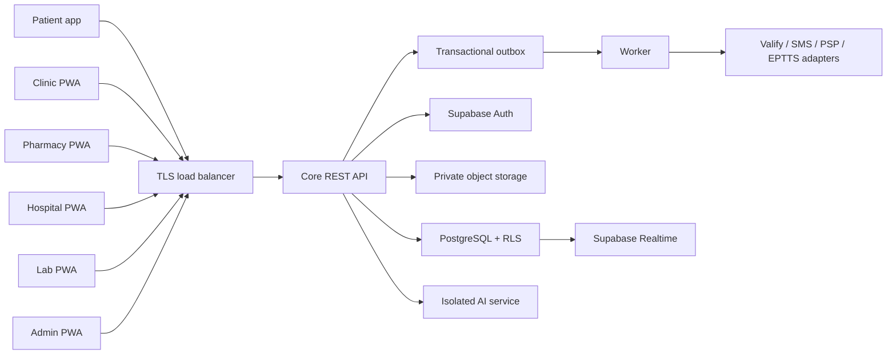

# SHIFAA Architecture Contract

> **Version:** 1.1.0 · **Status:** Proposed normative contract · **Last verified:** 2026-08-09  
> **Owner:** Architecture Lead · **Requirements:** [`../../shifaa-prd.md`](../../shifaa-prd.md)

## 1. System context

SHIFAA is a modular monolith serving six user applications through one versioned REST API. PostgreSQL is the transactional source of truth. Supabase supplies self-hosted Auth, Storage, and Realtime infrastructure; clients never receive table-level domain access. External providers are replaceable adapters.

## 2. Component responsibilities

| Component | Owns | Must not own |
|---|---|---|
| User apps | presentation, local form state, secure session client, generated API calls, accessibility | authorization decisions, clinical rules, direct database/vendor calls |
| Core API | use cases, authorization, validation, transactions, idempotency, audit, adapter orchestration | provider-specific domain policy, long-running delivery loops |
| Domain core | entities, invariants, state machines, pure calculations, ports | HTTP, SQL, Supabase, UI, vendor SDKs |
| PostgreSQL | durable state, constraints, RLS, transactions, outbox, projections | plaintext encryption keys, unbounded jobs |
| Worker | retryable async delivery/import/export, scheduled work, dead-letter processing | accepting public user traffic, bypassing use-case authorization |
| AI service | graduation-MVP normalization/retrieval/inference/evaluation inside the access-controlled seeded-synthetic environment, using structured allow-listed fields | direct user access, public traffic, identifiers/free text, production PHI, input training, state mutation, authoritative triage/prescribing |
| Adapters | translate one external contract to a domain port | leaking vendor types into core or claiming success without provider evidence |

## 3. Request lifecycle

1. Client sends TLS request with access token, `Accept-Language`, `X-Request-Id` when available, and `Idempotency-Key` for mutations.
2. Gateway applies size/rate/WAF rules and forwards without caching authenticated or PHI responses.
3. API verifies issuer, audience, signature, expiry, session, and AAL. It does not trust client-supplied role/facility/patient claims.
4. API loads current memberships/grants and evaluates `(actor, action, facility, resource, patient, purpose, AAL)`.
5. API begins a database transaction, sets request-scoped actor/facility/purpose, and executes through a non-owner, non-`BYPASSRLS` role. For a mutation it atomically inserts or locks the `(idempotency principal, method, route template, key)` row and compares the canonical request hash; a completed identical request returns its stored result, while a changed hash returns `409 idempotency-key-reused`. The principal is an authenticated actor or the non-null server-derived pre-auth/token/provider scope defined by the API catalog.
6. Database RLS and constraints independently permit or reject the operation. A same-key request already marked `processing` cannot execute the use case concurrently; it waits for the first transaction or returns the catalogued retryable in-progress problem.
7. Domain change, audit event, outbox event, canonical response status/body, and idempotency state `completed` are written in the same database transaction.
8. API commits that single transaction, then returns the stored response/resource version. No background work or external call occurs before commit. A crash after commit therefore replays the stored result instead of repeating the effect.

## 4. Module boundaries

| Module | Public use cases | Publishes events | Consumes events |
|---|---|---|---|
| Identity | proofing, recovery, profiles, facilities, workforce | `identity.verification.*`, `membership.*`, `facility.*` | vendor verification result |
| Consent | notice, consent/withdrawal, DSR | `consent.*`, `dsr.*` | retention/legal-hold decisions |
| Family | guardianship, delegation, emergency contact | `relationship.*`, `emergency_contact.*` | identity verification |
| Discovery/SOS | facility search, capacity, SOS incident/share | `sos.*`, `share_link.*` | hospital capacity |
| Clinic | schedules, appointments, queues, encounters, referrals | `appointment.*`, `encounter.*`, `referral.*` | staff absence, notifications |
| Clinical safety | allergies, prescriptions, detected issues, overrides | `prescription.*`, `clinical_override.*` | clinical-content release |
| Medication | statements, doses, adherence, refills, vaccines/observations | `dose.*`, `refill.*`, `vaccination.*` | prescription/dispense |
| Pharmacy | products, packs, movements, fulfilment, EPTTS | `inventory.*`, `dispense.*`, `eptts.*` | signed prescriptions, recalls |
| Hospital | arrivals, triage, beds, admissions, transfers, discharge | `capacity.*`, `admission.*`, `discharge.*` | SOS pre-arrival |
| Laboratory | order, specimen, result, critical loop | `lab_result.*`, `critical_result.*` | clinical orders |
| Trust | contextual chat, reviews, complaints | `message.*`, `complaint.*` | completed interactions |
| Finance | care-payment intent only in MVP | `payment.*` | PSP callbacks; donation governance is reserved post-MVP under ADR-016 |
| Platform | notifications, content releases, idempotency, audit export | operational events | all domain events |

Cross-module writes occur through an application use case or event, not by importing another module’s repository. A single API transaction may call multiple core modules when atomicity is the requirement (bed transfer, prescription sign, dispense).

## 5. Monorepo dependency rules

The tree in Master Section 1.3 is canonical. Additional rules:

- `packages/core` contains one folder per domain and exports only public barrels.
- `packages/contracts` is the one schema source. It generates OpenAPI, TypeScript DTOs, API client types, and JSON Schema validators.
- `packages/auth` manages session lifecycle only; authorization belongs to API/core and RLS.
- `packages/design-system` exports tokens plus web/native primitives through explicit platform entrypoints.
- Application feature folders may import shared packages but not other applications or service internals.
- Vendor SDKs appear only in `services/*/src/adapters/<vendor>`.
- Database queries appear only in repository adapters; raw SQL is parameterized and reviewed.
- Boundary linting, unused-export checks, and dependency-cycle checks fail CI.

## 6. Storage and data flows

### 6.1 Transactional data

PostgreSQL schemas and ownership are defined in [`SHIFAA-Data-RLS.md`](./SHIFAA-Data-RLS.md). All mutations use transactions. External calls are never made while holding a database transaction; an outbox event performs them after commit.

### 6.2 Files

Document images, facility licenses, results, and exports use private object storage. Upload flow is: request upload intent → server validates authorization/metadata → short-lived single-object upload URL → quarantine → MIME/magic/size/malware checks → release → audit. Public buckets and guessable patient paths are prohibited.

### 6.3 Realtime

Realtime channels are server-authorized and restricted to small projections:

- appointment queue position/estimate;
- hospital capacity and bed state for authorized staff;
- contextual chat messages;
- notification badge counts.

Clients reconcile via REST after reconnect. Presence is ephemeral and not clinical/audit truth.

### 6.4 Search and maps

PostgreSQL full-text/trigram search and PostGIS own MVP discovery. Patient coordinates are sent for the query and not retained unless an SOS incident is explicitly created. Exact home coordinates are not analytics dimensions.

## 7. Asynchronous contract

`platform.outbox_events` contains `id`, `aggregate_type`, `aggregate_id`, `aggregate_version`, `event_type`, `payload`, `occurred_at`, `available_at`, `attempts`, and `status`. Payloads carry stable IDs and minimum fields, not entire clinical records.

Worker behavior:

- claim at most the configured batch with `FOR UPDATE SKIP LOCKED`;
- lease each event; reclaim expired leases;
- record a unique receipt per consumer;
- retry transient failures at 1m, 5m, 30m, 2h, and 12h plus jitter;
- send permanent/schema/auth failures directly to `dead_letter`;
- alert when oldest pending age or dead-letter count breaches SLO;
- allow authorized replay without changing the original event;
- preserve per-aggregate version order and postpone a gap.

## 8. External adapter contracts

| Port | Initial adapter | Required behavior | Degraded behavior |
|---|---|---|---|
| Identity proofing | Valify candidate | transaction ID, result mapping, signed/webhook verification, timeout, audit | pending/manual review; never auto-approve |
| SMS/OTP | OPEN-VENDOR-002 | Arabic templates, sender ID, delivery receipt, provider idempotency | retry/secondary or alternate recovery; show delayed state |
| EPTTS | Phase-1 file/manual adapter | validate published version/format; export/import receipt evidence | queued manual action; never label verified |
| Product catalog | EDA-approved/public import | signed/versioned import, diff review, provenance | last-approved catalog with staleness banner |
| Payment | OPEN-VENDOR-003 CBE-licensed PSP | hosted/tokenized intent, signed callback, reconciliation | cash on arrival; no local card capture |
| Maps | self-hosted [MapLibre](https://maplibre.org/maplibre-gl-js/docs)-compatible Egypt vector tiles + self-hosted [Nominatim](https://nominatim.org/release-docs/latest/admin/Installation/) over an approved OpenStreetMap Egypt extract | render/geocode without sending patient coordinates to a third party; preserve OSM attribution/license metadata | phone/address list and manual search |
| AI model | OPEN-AI-001 | seeded-synthetic environment; structured allow-listed inputs reject identifiers/free text; approved model/version, locked Arabic evaluation, no input training, timeout/kill switch | deterministic red flags + normal booking/triage |

No adapter result is trusted without schema validation and a provider correlation identifier. Webhook callbacks verify signature, timestamp/replay window, and idempotency.

## 9. Deployment profiles

| Environment | Data | Topology |
|---|---|---|
| Local | generated synthetic fixtures | Docker Compose; local Supabase; one API/worker/AI instance |
| CI | per-run synthetic database | ephemeral containers; no external vendor calls |
| Staging | synthetic or approved irreversible anonymization | production-shaped; sandbox adapters; access allow-list |
| Production | real data only after legal gates | Egypt-resident HA topology or specifically PDPC-authorized alternative |

Production has separate network zones for public gateway, application services, database/storage, and management. Database/object/KMS endpoints are private. Infrastructure and database administration endpoints are reachable only through the organization VPN and require MFA, just-in-time privileges, and session audit. Infrastructure is defined as code; manual drift is detected.

Backups are encrypted, immutable for the approved period, restored quarterly, and never copied to an unapproved geography. Releases are rolling or blue/green for stateless services; database changes use expand/migrate/contract and must support roll-forward when rollback would lose data.

## 10. Security architecture

- Threat model covers patient/guardian abuse, insider access, broken object authorization, document forgery, account recovery, clinical-content compromise, prescription/dispense tampering, bed races, webhook replay, supply chain, and backup/key loss.
- Rate limits key on authenticated actor plus route and risk; IP is supplemental. Login/proofing/SOS have abuse controls that do not prevent legitimate emergency use.
- Secrets never enter source, client bundles, issue text, logs, or seed data. Rotation and emergency revocation are runbook-tested.
- Dependency updates require lockfile, provenance/signature where available, minimum release age, SCA/license scan, and review of install scripts.
- Security headers include CSP, frame protection, HSTS, content sniffing protection, and explicit permissions policy. Authenticated/PHI responses use `Cache-Control: no-store`.

## 11. Performance and capacity

Each feature plan states expected query cardinality and indexes. Collection endpoints return bounded projections and cursor pages. N+1 database/vendor requests are prohibited. Images are resized outside request transactions. Worker and API pools have independent capacity.

Load tests cover concurrent slot booking, queue check-in, bed assignment, SOS search, prescription sign, pack dispense, result release, and notification bursts. Targets are PRD NFR-PERF-001/002; capacity evidence includes the reference dataset size and deployment resources.

## 12. Architecture change control

Any change to application count, public protocol, data store, auth subject, event delivery, field encryption, deployment geography, clinical override, payment custody, or AI authority requires an ADR, Constitution check, threat/privacy impact, migration, trace update, and Product Owner approval. Legal/clinical facts additionally require the named domain approval.
