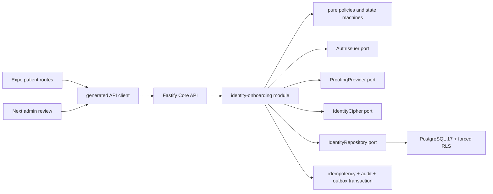

# Implementation Plan: Identity Onboarding

> **Feature:** `001-identity-onboarding` · **Spec version/status:** `0.1.0 / SPEC_REVIEW + BLOCKED overlay`  
> **Target:** first patient identity vertical slice · **Owner:** Yousef Osama / Product Owner · **Updated:** `2026-08-09`

## 1. Approved inputs

| Input | Version/digest | Approval/gate |
|---|---|---|
| `spec.md` | 0.1.0, digest captured at task-baseline commit | Product scope directed; formal specification reviewers blocked by `OPEN-TEAM-001` |
| Active-scope eligibility | PRD v2.1.0: `FR-AUTH-001..004`, `FR-AUTH-006..008`, `FR-ADMIN-002` | PASS — all IDs ACTIVE; partial-closure boundaries explicit |
| Constitution | v2.1.0, approved 2026-08-09 | checked below |
| Architecture/API/Data/UI/Trace | versions in approved baseline, verified 2026-08-09 | normative |
| Legal/vendor/session/design evidence | feature open-item table | blocked production/formal gates; synthetic engineering allowed by Master §11.4 step 6 |

## 2. Constitution check

| Article | Result and evidence |
|---|---|
| I Least privilege/default deny | PASS — policy module plus forced RLS; missing actor/action denies |
| II Internal typed identity | PASS — UUID auth subject; typed encrypted identities; masked DTOs |
| III Canonical care relationships | PASS — registration creates the one active self relationship atomically |
| IV Facility membership/attribution | N/A — no workforce facility action; admin review remains attributable |
| V Patient-centric purpose-limited data | PASS — self-only profile/identity/consent and active processing inventory |
| VI Dual clinical governance | N/A — no clinical content or decision |
| VII Regulated evidence gate | PASS — production proofing/SMS/PHI disabled by open gates |
| VIII Separation of duties | PASS — patient cannot review own case; assigned reviewer decision only |
| IX MFA/purpose | BLOCKED for formal approval by `OPEN-SEC-001/TEAM-001`; synthetic review uses explicit AAL2 fixture and purpose guard |
| X Portable domain logic | PASS — pure core modules; auth, proofing, crypto, clock, and persistence adapters injected |
| XI One app per surface | PASS — patient app plus existing canonical admin app only |
| XII Arabic-first consent/privacy | PASS — Arabic authored first; independent append-only decisions and withdrawal |
| XIII Accessibility/localization | PASS at contract level; automated checks planned; visual gate remains `OPEN-UX-001/002` |
| XIV Safety UI clarity | PASS — identity review/consent mutations use stable zero-motion decision regions |
| XV Human authority over AI | N/A — no AI |

The blockers above prevent formal `PLAN_APPROVED`; they do not prevent seeded-synthetic implementation because the affected production capabilities remain disabled.

## 3. Technical context

- Repository: canonical pnpm/Turborepo monorepo from Master §1.3.
- Runtime: Node `24.18.0`, pnpm `11.13.0`, TypeScript `7.0.2`, Turbo `2.10.9`.
- Patient: Expo `57.0.11`, Expo Router `57.0.11`, React `19.2.8`, React Native `0.86.2`, web export.
- Admin: Next.js `16.3.0`, React `19.2.8`.
- API: Fastify `5.11.3`, TypeBox `0.34.52`, RFC 9457 problem responses.
- Production auth/data: self-hosted Supabase and PostgreSQL 17; feature implementation also provides explicit seeded-synthetic in-memory adapters for deterministic local/E2E tests.
- SLO: read p95 ≤400 ms; mutation p95 ≤800 ms excluding proofing adapter; 100 concurrent synthetic onboarding sessions.
- External seams: `AuthIssuer`, `IdentityCipher`, `ProofingProvider`, `IdentityRepository`, `Clock`. Each has production and deterministic test/development adapters.
- Production gates: Valify `OPEN-VENDOR-001`, SMS `OPEN-VENDOR-002`, PHI/legal `OPEN-LEGAL-001/002/007`, session policy `OPEN-SEC-001`.

## 4. Proposed design and dependency flow

The external interface is the feature use-case module rather than a collection of pass-through handlers. Fastify routes validate/translate only. Local adapters are impossible to enable when `NODE_ENV=production`; production adapters must satisfy the same contract tests.

## 5. Work products

### Data and migration

- Create schemas/roles/helpers, identity/consent/platform/audit tables listed in `data-model.md`, required indexes, append-only guards, and verification transition function.
- Apply `ENABLE` and `FORCE ROW LEVEL SECURITY`; API execution role is non-owner and non-`BYPASSRLS`.
- Seed only synthetic notice, purposes, and reviewer fixtures.
- Migration validation is run against PostgreSQL 17 in Docker. Roll forward is canonical after shared use; destructive rollback is test-only.
- Identity ciphertext/nonce/key version and blind index are never selected into user projections. Production keys remain outside the database.

### API and generated clients

- Implement existing catalog operation IDs only: `registerPerson`, `login`, `verifyOtp`, `getMyProfile`, `updateMyProfile`, `createIdentityProof`, `listMyIdentities`, `createIdentityUpload`, `getVerificationCase`, `listIdentityVerificationCases`, `reviewVerificationCase`, `getPrivacyNotice`, `listMyConsents`, `recordConsent`, `withdrawConsent`, and internal `identityProviderCallback`.
- `contracts/openapi.yaml` is OpenAPI 3.1.1 and generates `packages/contracts` validators/types plus `packages/api-client` calls.
- Every mutation uses atomic idempotency except terminal OTP/callback replay as catalogued; profile/review/withdraw require current version.
- No backward compatibility issue exists because this is the first physical contract.

### UI, localization, and accessibility

- Patient routes: `/onboarding`, `/login`, `/profile`, `/identity`, `/privacy`, `/privacy/consents`.
- Admin route: `/identity-reviews`.
- Use only canonical semantic tokens and logical properties. Signature element: care-passport status rail, not a generic numbered wizard.
- Arabic is the source catalog; English parity test fails on missing/extra keys. Mixed-direction identifiers are isolated LTR.
- Every route supplies loading, empty, permission, recoverable/unrecoverable error, offline, success, and applicable review/vendor/rate-limit states.
- WCAG 2.2 AA, 44×44 targets, 200% text, screen-reader names, keyboard flow, focus summary, reduced motion; identity/consent/admin decisions use zero decorative motion.

### Events, notifications, and vendors

- Atomic outbox events: `identity.verification.changed`, `identity.manual_review.requested`, `consent.changed`.
- `auth.otp.requested` goes only to a local development inbox in synthetic mode. Production adapter is absent/disabled.
- Event payloads use subject/case/purpose IDs and status only; no identity plaintext, handle, OTP, document, or token.
- Worker consumes with receipt deduplication, bounded exponential retry, and dead-letter state. Emergency Contacts receive no event.

### Security, privacy, and abuse controls

- Default-deny policy plus RLS, AAL2/purpose/assignment review guard, constant-shape authentication failure, HMAC pre-auth idempotency principal, attempt/rate limits, randomized identity encryption and blind-index dedup.
- Private uploads use random object keys, allow-listed MIME/size, checksum, quarantine, scanner transition, short-lived upload/download authorization, and access audit.
- Recursive structured-log redaction and sentinel tests prohibit identities, credentials, tokens, OTPs, document data, and full bodies.

## 6. Test and evidence plan

| Requirement/test family | Level | Fixture/vector | Expected evidence/path |
|---|---|---|---|
| `FR-AUTH-001/002`, `TV-AUTH-IDENTITY-UUID`, `TV-AUTH-AAL-MATRIX` | core/API/E2E | new/duplicate handle, ID-as-handle, OTP terminal replay, AAL1/AAL2 reviewer | core/API/patient tests |
| `FR-AUTH-003/004`, `TV-AUTH-VALIFY-OUTCOMES`, `TV-AUTH-MANUAL-PROOF` | adapter/API/admin | verified/timeout/failed/manual, quarantine, assigned review, stale decision | adapter and API integration tests |
| `FR-AUTH-006`, `TV-SEC-ENCRYPTION-BLIND-INDEX` | unit/property | same plaintext, fresh nonces, separate keys, duplicate active identity | core crypto tests |
| `FR-AUTH-007/008`, `TV-PRIV-ARABIC-GRANULAR-WITHDRAW`, `TV-PRIV-INVENTORY-BEFORE-COLLECT` | domain/API/UI | two purposes, grant/refuse/withdraw, inactive inventory, offline | consent tests and patient route tests |
| `FR-ADMIN-002`, `NFR-SEC-001/004/006` | API/RLS/UI | other patient, delegate, unassigned reviewer, missing purpose, AAL1 | RLS matrix and admin tests |
| `NFR-SEC-005`, `TV-API-IDEMPOTENCY-SAME-DIFFERENT` | integration/race | same body/key, changed body/key, concurrent version | API integration tests |
| `NFR-I18N-001`, `NFR-A11Y-001` | static/UI/E2E | ar/en parity, RTL, keyboard, screen reader, 200%, reduced motion | i18n and UI tests; screenshots remain provisional |
| `NFR-OBS-001` | unit/integration | sentinel ID/password/OTP/token/document | redaction scanner output |
| `NFR-PERF-002` | load | 100 synthetic sessions | `specs/.../evidence/performance.json` |
| `NFR-QUALITY-001`, `NFR-PORT-001` | CI/architecture | lint/type/unit/contract/migration/RLS/E2E/security/SBOM; dependency graph | CI logs and architecture test |

## 7. Delivery sequence

1. Phase-0 workspace pins, canonical directories, CI, environment validation, and synthetic fixtures.
2. Contracts and test vectors.
3. Pure domain policy/crypto/state tests.
4. PostgreSQL migration, context helpers, RLS, and negative matrix.
5. Feature use cases with idempotency/audit/outbox and deterministic adapters.
6. Fastify routes and generated client.
7. Patient routes and admin review route with i18n/a11y/offline states.
8. Integrated acceptance, migration, security, redaction, and performance verification.
9. Commit/push immutable task baseline, publish enriched Issues, implement/check evidence, and re-analyze.

Contracts, i18n tokens, and test fixtures are parallel-safe after the workspace exists. Database policies, repository transactions, and API use cases remain sequential. Visual-baseline acceptance and production adapters are blocked and are not scheduled as engineering work.

## 8. Rollout, rollback, and operations

- Cohort: local/test seeded-synthetic only. `IDENTITY_ONBOARDING_ENABLED=false` and `SYNTHETIC_PROOFING_ENABLED=false` by default in production.
- Database: expand migrations; no contract/drop migration in this feature.
- Rollback: route/adapter kill switches first; forward corrective migration for append-only data. Test databases may be reset.
- Operations: health/readiness endpoints, structured metrics, outbox lag, auth failure/rate, proofing outcome, case age. Runbook `infra/runbooks/identity-onboarding.md`.
- Incident owner/on-call remains `OPEN-TEAM-001`; this blocks formal release, not local verification.

## 9. Plan approval

| Gate | Reviewer | Decision/date | Evidence/blocker |
|---|---|---|---|
| Architecture/data | unassigned | pending | `OPEN-TEAM-001`; exact artifacts produced below |
| Security/privacy/legal | unassigned | blocked | `OPEN-SEC-001`, `OPEN-LEGAL-001/002/007`, `OPEN-TEAM-001` |
| Clinical | N/A | N/A | no clinical decision/content |
| Design/accessibility | unassigned | blocked | `OPEN-UX-001/002`, `OPEN-TEAM-001` |
| QA/Product | Product: Yousef Osama; QA unassigned | implementation directed / formal gate pending | current directive; `OPEN-TEAM-001` |

**Plan state:** executable for seeded-synthetic engineering under Master §11.4 step 6; not `PLAN_APPROVED` and not production-authorized.
