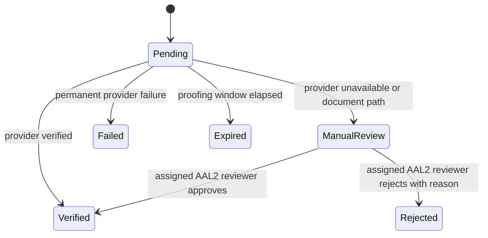

# Feature Specification: Identity Onboarding

## 0. Metadata and traceability

| Field | Value |
|---|---|
| SpecKit feature ID | `001-identity-onboarding` |
| Status | `SPEC_REVIEW` with `BLOCKED` overlay: `OPEN-TEAM-001`, `OPEN-SEC-001`, `OPEN-UX-001` |
| Target FR IDs | `FR-AUTH-001`, `FR-AUTH-002` (patient registration/login/OTP only), `FR-AUTH-003`, `FR-AUTH-004`, `FR-AUTH-006`, `FR-AUTH-007` (notice/consent only), `FR-AUTH-008`, `FR-ADMIN-002` (identity-review access only) |
| Target NFR IDs | `NFR-SEC-001`, `NFR-SEC-002`, `NFR-SEC-004`, `NFR-SEC-005`, `NFR-SEC-006`, `NFR-SEC-007`, `NFR-PRIV-001`, `NFR-PRIV-002`, `NFR-PRIV-004`, `NFR-I18N-001`, `NFR-A11Y-001`, `NFR-PERF-002`, `NFR-DATA-001`, `NFR-DATA-002`, `NFR-API-001`, `NFR-API-002`, `NFR-OBS-001`, `NFR-QUALITY-001`, `NFR-PORT-001` |
| Scope eligibility | `ACTIVE — SHIFAA PRD v2.1.0 §§4.1, 4.3, 5; Product Owner implementation directive 2026-08-09` |
| Target app/service/package | `apps/patient`, `apps/admin`, `services/api`, `packages/auth`, `packages/contracts`, `packages/core`, `packages/api-client`, `packages/design-system`, `packages/i18n`, `packages/observability`, `packages/test-kit`, `infra/db`, `infra/supabase` |
| Owner | Yousef Osama, Product Owner; implementation team assignment remains `OPEN-TEAM-001` |
| Reviewers | Product `Yousef Osama`; QA `[unassigned]`; Architecture `[unassigned]`; Security `[unassigned]`; DPO/Legal `[unassigned]`; Design/A11y `[unassigned]` |
| Risk class | `sensitive-data` |
| Regulatory domains | Egyptian PDPL; identity proofing; sensitive health/identity data; no clinical/EDA/MoHP decision in this slice |
| Clinical sign-off required | No — this slice does not make a diagnosis, prescribe, dispense, triage, or alter clinical data |
| Dependencies | Approved PRD/Master v2.1.0; Architecture/API/Data/UI/Traceability baselines verified 2026-08-09; Phase-0 scaffold created by this feature under `OPEN-TECH-001` |
| Parent roadmap entry | `SHIFAA-Implementation-Plan-MASTER.md §10, Phase 1 — Foundation` |
| Created / updated | `2026-08-09 / 2026-08-09` |

This vertical slice deliberately does **not** claim full closure of `FR-AUTH-002` (workforce/admin MFA), `FR-AUTH-005` (recovery/refresh/logout policy), or `FR-AUTH-007` (DSR lifecycle). Those capabilities receive separate Foundation specifications. This feature may create synthetic-development adapters, but production identity, SMS, PHI, and session enablement remain feature-flagged off.

## 1. Problem and scope

### Problem statement

A person in Egypt needs one Arabic-first path to create a SHIFAA account, authenticate without using a government identifier as a credential, establish their patient profile, submit a typed identity for verification, understand the applicable privacy purposes, and grant or refuse each optional purpose. An authorized reviewer needs a minimum-data queue to approve or reject manual identity cases. The path must remain demonstrable with seeded synthetic identities when production vendor, legal, and team-approval gates are open.

### Actors and authorization context

| Actor | Facility/patient relationship | Permitted outcome | Explicitly prohibited |
|---|---|---|---|
| `PUB` registrant | none | register, log in, verify an issued OTP challenge | use National ID/passport/UNHCR value as login or query another person |
| `PAT` self-managed patient | active `self` relationship created with the patient profile | view/update allowed profile fields, submit/list own identities, view/record/withdraw own consents | read identity plaintext/ciphertext, review own case, access another patient |
| `ADM-FACILITY` reviewer at AAL2 | assigned identity-review purpose | list minimum-data cases and approve/reject with reason | self-review, view unrelated profile/clinical data, act below AAL2 or without purpose |
| Core API | verified request context | authorize, transact, audit, and emit events | accept client-supplied actor/purpose context or expose tables directly |
| Identity-proofing adapter | one case, minimum typed payload | return verified/pending/failed provider result | fabricate success or retain unrelated attributes |

### In scope

- Create an internal UUID authentication subject, `identity.people`, `identity.patients`, and the unique active self relationship as one onboarding transaction (`FR-AUTH-001`).
- Patient email/phone plus password registration/login and challenge verification. OTP challenge issuance is part of `registerPerson` or `login`; no undocumented resend endpoint is introduced (`FR-AUTH-002`).
- Create and inspect typed Egyptian National ID, passport, and UNHCR identity proofing cases with deterministic local adapter results and manual fallback (`FR-AUTH-003`, `FR-AUTH-004`).
- Encrypt identity values with randomized AES-256-GCM and generate a separately keyed HMAC-SHA-256 blind index; return masked projections only (`FR-AUTH-006`).
- Display Arabic-first versioned notice/purposes and independently grant, refuse, list, or withdraw optional consent (`FR-AUTH-007`, `FR-AUTH-008`, `NFR-PRIV-001`).
- View and version-update the patient's allowed profile fields at provisional `/profile`; this route is required by the Product Owner's named Patient Profile slice and is recorded as provisional until the canonical UI inventory is amended.
- Provide the admin identity-review API and stable zero-motion review screen using only assigned minimum fields (`FR-ADMIN-002`).
- Provide a local seeded-synthetic mode and production-deny feature gates for unapproved identity/SMS/PHI integrations.

### Non-goals

- Session refresh, logout-all, recovery, passkey, patient MFA enrollment, workforce MFA enrollment, and reuse-family policy (`FR-AUTH-005`, unresolved `OPEN-SEC-001`).
- DSR access/export/correction/restriction/erasure workflow beyond the notice and consent records in this slice.
- Guardianship, delegation, Emergency Contacts, facilities, professional licenses, and clinical data.
- Production Valify or SMS credentials, production PHI, or legal-release claims.
- Pixel-identical visual acceptance; `OPEN-UX-001/002` remain visible.

### Dependencies and assumptions

| Item | Type | Evidence / open ID |
|---|---|---|
| Node 24.18.0, pnpm 11.13.0, TypeScript, Turborepo | verified repository toolchain decision | Master §2.1; exact pins created in this feature |
| Supabase Auth is the production identity issuer | SHIFAA policy | Master §§1.1, 2.2 |
| Local seeded-synthetic adapters are permitted before production gates | SHIFAA policy | Master §11.4 step 6 |
| Profile route is `/profile` | Product Owner directive applied to provisional UI contract | named first-slice scope, 2026-08-09; canonical UI amendment pending |
| Registration creates person, patient, and unique self relationship atomically | derived invariant | PRD MVP outcome plus Data-RLS `identity.patients`/`care_relationships`; architecture review pending under `OPEN-TEAM-001` |
| Production session lifetimes | OPEN | `OPEN-SEC-001`; refresh/recovery capabilities remain disabled |
| Approved compositions and snapshots | OPEN | `OPEN-UX-001/002` |

## 2. Egyptian regulatory and legal validation

- [x] Processing inventory rows precede collection of profile, login-handle, identity, and consent fields.
- [x] Identity values and health-platform membership are classified sensitive; synthetic fixtures carry no real identifiers.
- [x] Arabic is the authored privacy-notice language; purpose decisions are separate, affirmative, refusible, versioned, and withdrawable.
- [x] Only masked identity projections leave the API; raw values, credentials, tokens, document images, and full request bodies are prohibited from telemetry.
- [ ] Retention classes are assigned but durations/deletion actions remain blocked by `OPEN-LEGAL-002`.
- [ ] Production country/PDPC/DPO/processor authorization remains blocked by `OPEN-LEGAL-001/007`.
- [x] Identity proofing adapter has a local deterministic implementation and production kill switch; Valify production use remains `OPEN-VENDOR-001`.
- [x] SMS production use is absent; local OTP capture is synthetic-only and production SMS remains `OPEN-VENDOR-002`.
- [x] Facility/professional/EDA/MoHP/MOSS/UHI/CBE, controlled-drug, payment, donation, and AI obligations are not triggered by this slice.
- [x] DSR workflow impact is recorded as a later Foundation feature; breach operations are not changed.

**Blocking open items:** `OPEN-LEGAL-001`, `OPEN-LEGAL-002`, `OPEN-LEGAL-007`, `OPEN-VENDOR-001`, and `OPEN-VENDOR-002` block production enablement; `OPEN-SEC-001`, `OPEN-TEAM-001`, and `OPEN-UX-001` block the formal gates recorded in metadata.

## 3. User Scenarios & Testing

### Journey J-01 — Register and open a patient profile

1. Given a new synthetic person has selected `ar-EG` and supplied a unique verified-format handle and password.
2. When they choose **Create account** and verify the returned development OTP challenge.
3. The system creates an internal auth UUID, person, patient, and active self relationship once, returns a no-store session, and opens `/profile`.
4. Audit/next state: registration and OTP verification outcomes are recorded without handle, password, OTP, or identity plaintext.

### Journey J-02 — Submit identity for verification

1. Given an authenticated self-managed patient and a processing-inventory entry for identity proofing.
2. When the patient submits a typed synthetic identity and selects **Send for verification**.
3. The system stores randomized ciphertext and blind index, returns a masked value and `pending`, `manual_review`, `verified`, or `failed` case, never a fabricated success.
4. Audit/next state: a reviewer can decide a manual case only at AAL2 with purpose and a reason.

### Journey J-03 — Make privacy choices

1. Given the current Arabic notice and independently selectable purpose versions.
2. When the patient chooses **Save privacy choices**.
3. The system appends one consent record per purpose and shows the resulting decision, time, and next step.
4. Audit/next state: refusal does not block required lawful-basis processing; withdrawal appends a superseding record and cannot be queued offline.

### Journey J-04 — Review a manual identity case

1. Given an assigned `ADM-FACILITY` reviewer at AAL2 and a case in `manual_review`.
2. When the reviewer selects **Approve identity** or **Reject with reason**.
3. The system applies one allowed transition using `If-Match`, shows the terminal decision, and leaves a minimum-data audit record.
4. No decorative motion, identity plaintext, unrelated patient details, or self-approval path is present.

### Alternate, failure, and degraded paths

| Case | Trigger | UI/API result | State/audit effect | Recovery |
|---|---|---|---|---|
| Permission denied | other patient, missing review purpose, or reviewer below AAL2 | `403` problem plus plain localized explanation | no mutation; denied outcome audit where required | select own context or complete authorized AAL2 session |
| Offline | any consent, identity, or review mutation | persistent banner; action remains available only after reconnection | no queued write | reconnect and explicitly retry |
| Vendor timeout | proofing adapter timeout | `202`, case `pending` or `manual_review`; never verified | one case/event | refresh status or manual review |
| Duplicate replay | same idempotency principal/key/body | stored status/body returned | one effect | none |
| Reused key | same principal/key/route with different body | `409 idempotency-key-reused` | no second effect | use a new key |
| Concurrent profile/review | stale `If-Match` | `409 version-conflict` | no partial effect | refresh and retry intentionally |
| Duplicate identity | same type/blind index already active | `409 identity-already-registered` | no duplicate ciphertext row | use review/recovery channel |
| Missing inventory | purpose/field not approved | `503 processing-purpose-disabled` | no collection | governance enables approved inventory version |
| Rate limited | repeated login/OTP attempts | `429` plus retry interval | opaque security audit | wait; no account-existence leak |

## 4. Requirements

### Functional Requirements

| Target PRD requirement | Required feature behavior | Acceptance coverage |
|---|---|---|
| `FR-AUTH-001` | Internal UUID subject; government IDs never credentials/URLs/log properties; atomic self patient profile | `AC-01`, `AC-02`, `AC-14` |
| `FR-AUTH-002` | Patient register/login/OTP challenge only; privileged review requires AAL2 | `AC-01`, `AC-03`, `AC-12` |
| `FR-AUTH-003` | Adapter result preserves pending/failed/manual outcomes | `AC-05`, `AC-06` |
| `FR-AUTH-004` | Passport/UNHCR upload intent, quarantine, manual review, reasoned decision | `AC-06`, `AC-12` |
| `FR-AUTH-006` | AES-256-GCM ciphertext plus separately keyed deterministic blind index; masked output | `AC-04`, `AC-14` |
| `FR-AUTH-007` | Current notice, consent list, granular record/refuse/withdraw only | `AC-08`, `AC-09`, `AC-10` |
| `FR-AUTH-008` | Collection denied without active purpose/notice/inventory contract | `AC-07` |
| `FR-ADMIN-002` | AAL2, purpose, minimum-data review, reason, audit | `AC-11`, `AC-12` |

## 5. Domain model and invariants

### Entities and ownership

| Entity | Owning domain | Authoritative source | Lifecycle owner |
|---|---|---|---|
| Person / Patient / Self relationship | identity | PostgreSQL | patient via Core API |
| Authentication subject/challenge/session | Supabase Auth in production; local adapter in synthetic mode | auth issuer | auth adapter |
| Typed identity / verification case | identity | PostgreSQL plus proofing adapter outcome | patient then authorized reviewer/provider |
| Notice / purpose / consent record | consent | PostgreSQL | governance version; patient decision |
| Idempotency record / audit event | platform / audit | PostgreSQL | Core API |
| Evidence object | private Supabase Storage bucket | storage metadata/object | uploader, scanner, assigned reviewer |

### Identity verification state machine

All other transitions return `409 state-transition-invalid`. A reviewer decision requires current row version; provider callbacks are idempotent and cannot change a terminal decision.

### Invariants and concurrency

- Registration transaction creates exactly one person, patient, and active self relationship for the auth subject.
- Active `(identity_type, blind_index)` is unique; encryption nonce is fresh for every write.
- Consent is append-only; withdrawal creates a new `withdrawn` record referencing the prior record.
- Idempotency status/result commits atomically with domain mutation, audit event, and outbox event where present.
- Direct browser/mobile table access is denied; API transactions use forced RLS context.
- Profile and reviewer mutations require `If-Match`; stale versions cannot partially apply.

## 6. Exact data and RLS contract

The complete column-level contract is generated in `data-model.md` and migrations. It preserves Data-RLS v1.1.0 names: `identity.people`, `identity.patients`, `identity.identities`, `identity.verification_cases`, `identity.care_relationships`, `consent.notice_versions`, `consent.purpose_versions`, `consent.records`, `consent.processing_inventory`, `platform.idempotency_records`, `platform.outbox_events`, and `audit.events`. Supabase `storage.objects` is used for private evidence; the feature does not invent a competing public document table.

### Migration

- Forward: roles/schemas → helpers/context → identity → consent → platform/audit → indexes → RLS → synthetic notice/purpose seed.
- Validation: no duplicate active identity blind index, no person without patient/self relationship for this registration channel, and no consent pointing to inactive purpose/notice.
- Rollback: pre-production destructive rollback is permitted only for empty/synthetic databases; otherwise roll forward with disabling feature flag and append-only corrective migration.
- Backup/restore: no production approval claimed while `OPEN-LEGAL-001/002` remain.

### RLS/action matrix

| Actor/context | SELECT | INSERT | UPDATE/state action | DELETE | Negative test ID |
|---|---|---|---|---|---|
| `PAT` self | allowed profile/masked identity/own consent | own identity/consent through API use case | allowed profile fields and own withdrawal through API | denied | `TV-RLS-PAT-SELF` |
| `GUA` | not part of this slice | denied | denied | denied | `TV-RLS-GUA-NO-SCOPE` |
| `DEL` | denied for identity/consent | denied | denied | denied | `TV-RLS-DEL-IDENTITY` |
| `ADM-FACILITY`, assigned purpose, AAL2 | minimum assigned case projection | denied | case decision only | denied | `TV-RLS-REVIEWER-AAL2` |
| missing/other | denied | denied | denied | denied | `TV-RLS-DEFAULT-DENY` |

Every domain table uses `ENABLE ROW LEVEL SECURITY` and `FORCE ROW LEVEL SECURITY`. Only a non-owner, non-`BYPASSRLS` API execution role queries online. Security-definer helpers fix `search_path` and read request-scoped settings set by the server, never JWT app metadata.

## 7. API endpoint specifications

All operations use `/v1`, UTF-8 JSON, `Accept-Language`, `X-Request-Id`, no-store security responses, RFC 9457 problems, and the exact actor/flag mapping in API Catalog v1.1.0.

| Operation | Core request → success | Required controls and principal errors |
|---|---|---|
| `registerPerson` — `POST /auth/register` | locale, email/phone, password → challenge or person/session | `Idempotency-Key`; pre-auth HMAC principal; `409 handle-already-registered`; `429 rate-limited` |
| `login` — `POST /auth/login` | handle, password → session/AAL or OTP challenge | `Idempotency-Key`; constant-shape `401 authentication-failed`; no account enumeration |
| `verifyOtp` — `POST /auth/otp/verify` | challenge UUID, six digits → session | terminal replay rule plus idempotency; `400 otp-invalid`; `410 otp-expired` |
| `getMyProfile` — `GET /people/me` | none → allowed profile, verification summary, AAL, version | bearer token; `401`; `403`; no identity value |
| `updateMyProfile` — `PATCH /people/me` | display name, birth date, nationality, locale → profile/version | `Idempotency-Key`, `If-Match`; `409 version-conflict` |
| `createIdentityProof` — `POST /people/me/identities` | type, value, issuer/country/expiry → masked identity/case | `Idempotency-Key`; active inventory; `409 identity-already-registered`; adapter timeout returns non-verified state |
| `listMyIdentities` — `GET /people/me/identities` | none → masked identities/cases | self only; no ciphertext, blind index, provider secret |
| `createIdentityUpload` — `POST /identity-verifications/{caseId}/upload-intent` | MIME, size, SHA-256 → one-time private upload | `Idempotency-Key`; allow-list/size; case ownership; quarantine |
| `getVerificationCase` — `GET /identity-verifications/{caseId}` | none → status/reason/next action/version | subject or assigned reviewer projection |
| `listIdentityVerificationCases` — `GET /admin/identity-verifications` | status/type/age/cursor → minimum worklist | reviewer AAL2 plus purpose; cursor limit 25/100 |
| `reviewVerificationCase` — `POST /admin/identity-verifications/{caseId}/decision` | approve/reject, reason, evidence → decision/version | `Idempotency-Key`, `If-Match`, AAL2/purpose/assignment; terminal conflict |
| `getPrivacyNotice` — `GET /privacy/notices/current` | purpose/locale → notice/version/purposes | public; Arabic default; only active inventory purposes |
| `listMyConsents` — `GET /privacy/consents` | self → current decisions and versions | self only |
| `recordConsent` — `POST /privacy/consents` | purpose version, granted/refused → evidence | `Idempotency-Key`; offline queue prohibited; append-only |
| `withdrawConsent` — `POST /privacy/consents/{consentId}/withdraw` | optional reason → withdrawal/effective time | `Idempotency-Key`, `If-Match`; terminal stored replay |
| `identityProviderCallback` — `POST /internal/callbacks/identity/{provider}` | signed provider event → recorded result | verified provider signature/event principal; terminal replay; no public route registration |

Rate defaults for synthetic engineering: registration/login 5 attempts per 15 minutes per pre-auth HMAC principal; OTP verify 5 attempts per challenge; authenticated read 120/minute; mutation 30/minute. These are abuse-control defaults, not the unresolved production refresh/reauthentication policy.

## 8. UI/UX and edge-state matrix

The visual direction is a calm Egyptian health-service identity: cool white and mineral green surfaces from the canonical tokens, Arabic-led hierarchy, compact identity-status rail, and one distinctive **care passport** summary that shows what is complete without resembling a generic progress stepper. Patient zones may use restrained 180 ms content transitions; identity decisions, errors, consent writes, and admin review use zero decorative motion. Copy uses direct actions such as **Create account**, **Save profile**, **Send for verification**, **Save privacy choices**, and **Reject with reason**.

| App/route | Required states | Interaction/accessibility | Baseline |
|---|---|---|---|
| patient `/onboarding` | locale, register, issued challenge, loading, rate limit, recoverable/unrecoverable error, success | Arabic first, logical RTL, persistent labels, 48 dp action, focus summary | `OPEN-UX-001` |
| patient `/login` | credential, challenge, locked/rate-limited, offline, error, success | no account-existence disclosure; phone/email bidi isolation | `OPEN-UX-001` |
| patient `/profile` | loading, empty-required-fields, version conflict, offline, error, success | 200% text; **Save profile**; next action points to identity | `OPEN-UX-001` |
| patient `/identity` | no identity, pending, manual review, verified, rejected reason, vendor failed, quarantine upload | status icon + text; no raw value after submission; mutation blocked offline | `OPEN-UX-001` |
| patient `/privacy`, `/privacy/consents` | notice loading, no active purpose, choices, saved, withdrawn, offline/error | independent controls; refuse available; no prechecked consent; mutation blocked offline | `OPEN-UX-001` |
| admin `/identity-reviews` | AAL2 required, empty, loading, assigned queue, version conflict, decision success/error | zero motion; keyboard-first; stable primary action; minimum projection | `OPEN-UX-001` |

Every visible string exists in `ar-EG` and `en-EG`; missing keys fail CI. Phone, email, masked IDs, UUIDs, and timestamps use bidi isolation. Every control has default/focus/pressed/disabled/loading plus explicit text. Minimum target is 44×44; patient primary actions are 48 high. Reduced-motion is honored, and status never relies on color or icon alone. No consent/identity/review mutation is queued offline.

## 9. Notifications and asynchronous events

| Source event | Recipient policy | Template/channel | Allowed data | Dedup/retry | Emergency Contact |
|---|---|---|---|---|---|
| `auth.otp.requested` | synthetic registrant only | local development inbox; production adapter disabled | challenge reference, locale, expiry; OTP never logged | challenge/provider key; bounded retry | Never |
| `identity.verification.changed` | subject patient | in-app status | case ID, masked type, status, next action | event/recipient/template | Never |
| `identity.manual_review.requested` | assigned reviewer worklist | in-app only | case ID, type, age, assignment | outbox/event receipt | Never |
| `consent.changed` | subject patient | in-app confirmation | purpose code/version, decision, time | source/recipient/template | Never |

## 10. Security, privacy, and abuse cases

| Threat/misuse | Control | Verification |
|---|---|---|
| Broken patient/admin authorization | API policy plus forced RLS; reviewer AAL2/purpose/assignment | cross-person, delegate, reviewer negative matrix |
| Account enumeration/credential stuffing/OTP guessing | constant response shape, HMAC pre-auth principal, rate limits, challenge attempt cap | timing/shape/rate tests |
| Government ID used as credential or leaked | schema rejects ID as handle; envelope encryption; masked DTO; redaction scanner | `TV-AUTH-IDENTITY-UUID`, `TV-SEC-ENCRYPTION-BLIND-INDEX` |
| Replay/race | atomic idempotency result, terminal token replay, `If-Match` | same/different-body and concurrent-decision tests |
| Malicious upload | private random key, allow-listed MIME/size, SHA-256, quarantine, scan gate | type/size/malware-state tests |
| Vendor forgery/timeout | signed callback port, event dedup, timeout maps to pending/manual | adapter contract tests |
| PHI/secret telemetry | allow-listed structured fields and recursive redaction; no request bodies | log-capture scanner test |
| Synthetic mode accidentally enabled in production | startup environment guard and feature flags default deny | production-config rejection test |

## 11. Success Criteria

### Measurable Outcomes

| ID | Outcome | Measurement method | Required threshold |
|---|---|---|---|
| `SC-001` | A new synthetic patient reaches a saved profile, identity status, and recorded privacy choices without another system | automated J-01→J-03 E2E | 100% of deterministic fixtures |
| `SC-002` | No unauthorized actor reads or changes another person's profile, identity, case, or consent | RLS/API negative matrix | 100% denied, zero leaked fields |
| `SC-003` | Identity and consent mutations are replay-safe | idempotency/concurrency suite | one effect; stored identical result; changed body `409` |
| `SC-004` | Arabic and English onboarding remain operable with assistive technology | 360×800 and 1440×900 automated/manual matrix | WCAG 2.2 AA; zero missing keys; zero clipped action at 200% |
| `SC-005` | Core API latency remains within the approved regional target excluding adapters | integration load profile | read p95 ≤400 ms; mutation p95 ≤800 ms |
| `SC-006` | No prohibited identity or credential value reaches logs/analytics | seeded sentinel scan | zero sentinel matches |

### Acceptance Criteria and Test Vectors

#### AC-01 — Atomic registration
- **Given** a unique synthetic email, `ar-EG`, a valid password, and an active processing-inventory version
- **When** `registerPerson` and its returned OTP challenge complete
- **Then** exactly one auth UUID, person, patient, and active self relationship exist and the response is `private, no-store`
- **And** neither government identity nor password appears in URLs, logs, or analytics
- **Automated by** `services/api/test/identity-onboarding.integration.test.ts`

#### AC-02 — Government identifier is not a login
- **Given** a valid-format synthetic Egyptian National ID
- **When** it is supplied as the login handle
- **Then** validation returns `400 validation-failed`
- **And** no authentication lookup or account-enumeration signal occurs
- **Automated by** `packages/contracts/src/identity-onboarding.test.ts`

#### AC-03 — OTP replay and rate limit
- **Given** one challenge and the correct six-digit development code
- **When** the code is submitted twice with the same idempotency key
- **Then** the second request returns the stored terminal result without a second session effect
- **And** a sixth invalid attempt returns `429 rate-limited`
- **Automated by** `services/api/test/auth-abuse.integration.test.ts`

#### AC-04 — Encryption and blind index
- **Given** the same synthetic identity plaintext encrypted twice with distinct nonces
- **When** the encryption module is exercised
- **Then** ciphertext differs and blind indexes match
- **And** plaintext never enters stored DTOs or logs
- **Automated by** `packages/core/src/identity/identity-crypto.test.ts`

#### AC-05 — Vendor degradation never verifies
- **Given** deterministic proofing outcomes `timeout`, `failed`, and `manual`
- **When** a patient creates an identity proof
- **Then** results are respectively `pending/manual_review`, `failed`, and `manual_review`
- **And** none is `verified`
- **Automated by** `services/api/test/proofing-adapter.contract.test.ts`

#### AC-06 — Manual document review
- **Given** a passport case with a quarantined evidence object
- **When** an assigned AAL2 reviewer approves or rejects using the current version
- **Then** the allowed terminal state and reason are persisted once
- **And** self-review, missing purpose, or stale version is denied
- **Automated by** `services/api/test/identity-review.integration.test.ts`

#### AC-07 — Inventory before collection
- **Given** no active processing-inventory/purpose version for identity proofing
- **When** the patient submits an identity
- **Then** `503 processing-purpose-disabled` is returned
- **And** no identity ciphertext/case/audit payload is created
- **Automated by** `services/api/test/processing-inventory.integration.test.ts`

#### AC-08 — Arabic-first granular choices
- **Given** two optional purposes and the current Arabic notice
- **When** the patient grants one and refuses the other
- **Then** two independent append-only records and localized confirmation are returned
- **And** neither choice is preselected or bundled
- **Automated by** `apps/patient/src/features/onboarding/onboarding.test.tsx`

#### AC-09 — Withdrawal parity
- **Given** a current granted optional consent
- **When** the patient chooses **Withdraw consent** while online
- **Then** an append-only withdrawal with effective time is returned
- **And** the control requires no more interaction steps than granting
- **Automated by** `services/api/test/consent.integration.test.ts`

#### AC-10 — Offline mutation blocked
- **Given** the patient app is offline on the consent or identity screen
- **When** a mutation action is selected
- **Then** the persistent banner names the unavailable action and no local write is queued
- **And** the entered non-secret form data remains available for deliberate retry
- **Automated by** `apps/patient/src/features/onboarding/onboarding.test.tsx`

#### AC-11 — Default-deny RLS
- **Given** another patient, a delegate, an unassigned reviewer, and a reviewer below AAL2
- **When** each attempts profile/identity/consent/case access
- **Then** every unauthorized row/action is denied by API policy and PostgreSQL RLS
- **And** the response contains no existence or field oracle
- **Automated by** `infra/db/tests/identity-onboarding-rls.sql`

#### AC-12 — Reviewer stable decision surface
- **Given** an assigned manual case
- **When** keyboard and screen-reader users review it in Arabic and English
- **Then** focus order, accessible names, reason requirement, status text, and zero-motion decision layout pass
- **And** color/icon alone communicates nothing
- **Automated by** `apps/admin/src/app/identity-reviews/page.test.tsx`

#### AC-13 — Profile version conflict
- **Given** profile version 2 and two PATCH requests with `If-Match: "2"`
- **When** both attempt different names
- **Then** one succeeds with version 3 and one returns `409 version-conflict`
- **And** no mixed profile is stored
- **Automated by** `services/api/test/profile-concurrency.integration.test.ts`

#### AC-14 — Redaction
- **Given** sentinel National ID, password, OTP, token, and upload values
- **When** every success/failure path is exercised
- **Then** logs contain request/trace IDs and approved codes only
- **And** the sentinel scanner reports zero secret/identity matches
- **Automated by** `packages/observability/src/redaction.test.ts`

#### AC-15 — Rollback and production guard
- **Given** production environment with synthetic adapters or absent required secrets
- **When** the API starts
- **Then** startup fails closed before listening
- **And** the local synthetic profile starts successfully only with explicit `SHIFAA_SYNTHETIC_MODE=true`
- **Automated by** `services/api/test/config.test.ts`

## 12. Observability, rollout, rollback, and incidents

- SLO: Core API read p95 ≤400 ms and mutation p95 ≤800 ms excluding proofing provider; synthetic dataset supports 100 concurrent onboarding sessions.
- Metrics: operation ID, status class, duration, adapter outcome, idempotency result, and low-cardinality locale only. No handles, identity values, request bodies, or tokens.
- Feature flags: `IDENTITY_ONBOARDING_ENABLED=false` in production until release gates; `SYNTHETIC_PROOFING_ENABLED=false` outside development/test.
- Rollout: local/test seeded-synthetic cohort only; staging synthetic/anonymized only.
- Rollback: disable route registration through feature flag and roll forward data corrections; do not delete audit/consent history.
- Runbook: `infra/runbooks/identity-onboarding.md`; incident owner remains `OPEN-TEAM-001`.

## 13. Evidence and approvals

| Gate | Reviewer(s) | Artifact/version/digest | Decision/date | Blocking findings |
|---|---|---|---|---|
| Product | Yousef Osama | this spec plus PRD/Master v2.1.0 | directed implementation 2026-08-09 | none for active scope |
| QA | unassigned | requirements/acceptance evidence | pending | `OPEN-TEAM-001` |
| Legal/DPO | unassigned | compliance checklist | blocked for production | `OPEN-LEGAL-001/002/007`, `OPEN-TEAM-001` |
| Architecture/Security | unassigned | plan, threat/data/contracts | blocked | `OPEN-SEC-001`, `OPEN-TEAM-001` |
| Design/Accessibility | unassigned | provisional UI contract | blocked | `OPEN-UX-001/002`, `OPEN-TEAM-001` |
| Release | unassigned | evidence manifest | not requested | all applicable blockers |

## 14. Open items and change log

| Open ID | Owner | Next action/evidence | Blocks gate |
|---|---|---|---|
| `OPEN-TEAM-001` | Product Owner | assign and acknowledge named engineering, QA, Security, DPO/Legal, Design/A11y reviewers | `SPEC_APPROVED` and attributable acceptance |
| `OPEN-SEC-001` | Security + Architecture | approve refresh idle/absolute lifetime, reuse-family response, and reauthentication interval | production session spec; refresh/recovery excluded here |
| `OPEN-UX-001/002` | Product + Design + QA | approve compositions, fonts/render matrix, snapshots, and tolerance | formal UI plan/visual verification |
| `OPEN-LEGAL-001/002/007` | Legal + DPO | approve production PHI authorization, retention schedule, and controlling Arabic mapping | production release |
| `OPEN-VENDOR-001/002` | Procurement + Security + DPO | approve Valify/SMS vendors and contracts | production automated proofing/OTP |
| `OPEN-TECH-001` | Architecture + Platform | accept pinned scaffold, lockfile, container digests/SBOM, and reproducible build evidence | reproducible-build claim |

| Date | Version | Change and affected FR/NFR/contracts |
|---|---|---|
| 2026-08-09 | 0.1.0 | Initial active Foundation slice; records partial FR boundaries, provisional `/profile`, synthetic-only adapters, and explicit blockers |
