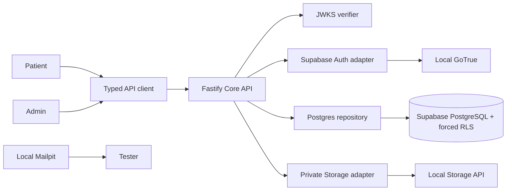

# Implementation Plan: Supabase Runtime Foundation

> **Feature:** `002-supabase-runtime-foundation` · **Spec:** `0.1.0 / SPEC_REVIEW + production BLOCKED overlay`  
> **Owner:** Yousef Osama / Product Owner · **Updated:** `2026-08-11`

## 1. Approved inputs

| Input           | Version/gate                                                                        |
| --------------- | ----------------------------------------------------------------------------------- |
| 002 `spec.md`   | 0.1.0; product-directed; no unresolved clarification                                |
| Active scope    | PRD v2.1.0 active 001 IDs; runtime-only implementation                              |
| Constitution    | v2.1.0; immutable articles checked below                                            |
| 001 baseline    | `9bb2245`; live bilingual browser evidence                                          |
| Vendor guidance | Supabase CLI docs checked 2026-08-10; npm registry pin `2.113.0` checked 2026-08-11 |

## 2. Constitution check

| Article                          | Result                                                                             |
| -------------------------------- | ---------------------------------------------------------------------------------- |
| I Least privilege/default deny   | PASS — non-owner API role, explicit grants, forced RLS                             |
| II Internal typed identity       | PASS — unique external auth-subject mapping to internal person UUID                |
| III Canonical care relationships | PASS — atomic patient/self creation reused                                         |
| IV Facility membership           | N/A — no facility mutation; reviewer remains assigned fixture                      |
| V Purpose-limited patient data   | PASS — transaction context and minimum projections                                 |
| VI Dual clinical governance      | N/A — no clinical decision/content                                                 |
| VII Regulated evidence gate      | PASS — real data and production remain disabled                                    |
| VIII Separation of duties        | PASS — assigned reviewer and self-review denial persist                            |
| IX MFA/purpose                   | BLOCKED for production by `OPEN-SEC-001`; synthetic AAL2/purpose test context only |
| X Portable domain logic          | PASS — vendor/database code only in adapters                                       |
| XI One app per surface           | PASS — no app added                                                                |
| XII Arabic-first privacy         | PASS — existing notice/consent preserved                                           |
| XIII Accessibility/localization  | PASS at executable contract; formal visual approval remains open                   |
| XIV Safety UI clarity            | PASS — existing zero-motion review/consent UI                                      |
| XV Human authority over AI       | N/A — no AI                                                                        |

**Plan state:** executable for local seeded-synthetic engineering; not formal or production `PLAN_APPROVED`.

## 3. Technical context

- Node `24.18.0`, pnpm `11.13.0`, Supabase CLI `2.113.0`, Docker Engine `29.6.2`/Compose `5.3.1`.
- Add `supabase` as an exact root dev dependency; invoke only through `pnpm supabase`.
- Local API gateway/Auth/DB/Storage/Mailpit use committed Supabase config. No local stack port is externally exposed.
- API dependencies: `@supabase/supabase-js` exact current compatible release, `jose` for JWKS verification, `postgres` pool for transactional repository.
- Pool uses bounded connections, short transactions, statement/lock timeout, transaction-local RLS context, and no external network call while locks are held.
- Existing 001 OpenAPI and domain ports remain stable.

## 4. Design and dependency flow

Apps never import Supabase. The Auth adapter owns registration/login/OTP. JWT verification resolves the external subject; repository transactions map it to internal person UUID and set RLS context. Storage returns only quarantine object identifiers.

## 5. Work products

- `supabase/config.toml`, ordered migrations and synthetic seed; private bucket configuration.
- Root `supabase:*` commands and `.env.supabase.example`; CI/local bootstrap documentation.
- Supabase Auth/JWKS, PostgreSQL repository/idempotency, and private Storage adapters selected by validated configuration.
- Integration harness against the local stack, restart-persistence tests, RLS pool-context negative tests, and direct-client denial tests.
- Updated runbook/evidence; no public API or UI contract change.

## 6. Test/evidence plan

| Family            | Evidence                                                                    |
| ----------------- | --------------------------------------------------------------------------- |
| clean stack/reset | `pnpm supabase:start; pnpm supabase:reset; pnpm supabase:status`            |
| Auth/JWT          | register/login/OTP via Mailpit; forged/expired/audience negatives           |
| persistence       | complete 001 then restart API and reload profile/admin queue                |
| RLS/pool          | same pooled connection cross-patient/missing-purpose/AAL1/unassigned denial |
| Storage           | private bucket, anonymous/public denial, quarantine metadata                |
| portability       | architecture scan bans Supabase/Postgres imports in apps/core               |
| full quality      | `pnpm verify` plus 002 integration/browser evidence                         |

## 7. Delivery sequence

1. Pin CLI/dependencies; initialize committed local stack.
2. Move the 001 database baseline into Supabase migration order and add auth mapping/storage seed.
3. Add Auth/JWKS and PostgreSQL transaction/repository adapters with tests.
4. Add private Storage adapter and negative tests.
5. Wire validated runtime selection/readiness; eliminate executable in-memory runtime.
6. Run automated integration/RLS/reset/restart checks.
7. Drive Arabic and English browser journeys, restart API, and verify persistent admin queue.
8. Analyze spec/plan/tasks/implementation drift, publish enriched task Issues, commit/push, and verify CI.

## 8. Rollout/rollback/operations

Local cohort only. `supabase stop` preserves local volumes; `supabase db reset` is permitted only against the named local project and destroys only its synthetic data. Runtime startup denies missing Supabase/Postgres configuration. Production remains disabled until the existing legal/security/team gates close; this feature does not create deployment credentials.
