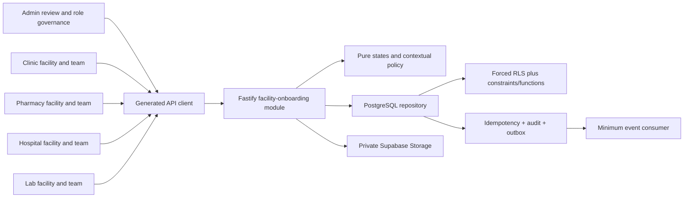

# Implementation Plan: Facility Onboarding and Contextual RBAC

> **Feature:** `003-facility-onboarding-rbac` · **Spec version/status:** `0.1.1 / SPEC_REVIEW + BLOCKED overlay`
> **Target FR/NFR:** `FR-FAC-001/002/003/007`, `FR-ADMIN-001/002/004` plus the security/data/API/i18n/a11y/quality NFRs listed in `spec.md` · **Owner:** Yousef Osama / Product Owner · **Updated:** `2026-08-11`

## 1. Approved inputs

| Input                           | Version/digest                                                          | Approval/gate                                                                         |
| ------------------------------- | ----------------------------------------------------------------------- | ------------------------------------------------------------------------------------- |
| `spec.md`                       | 0.1.1                                                                   | Product-directed; seeded-synthetic scope; formal reviewers blocked by `OPEN-TEAM-001` |
| Active-scope eligibility        | PRD v2.1.0 active rows `FR-FAC-001/002/003/007`, `FR-ADMIN-001/002/004` | PASS                                                                                  |
| Constitution                    | v2.1.0 ratified 2026-08-09                                              | checked below                                                                         |
| PRD/Master/supporting contracts | PRD/Master 2.1.0; Architecture/API/Data/Trace 1.1.0; UI 0.9.1           | normative repository baseline                                                         |
| Runtime dependency              | merged 001/002 at main `588498d0d80eb24c5664929fade5ddae5ceeb886`       | baseline `pnpm verify` PASS 2026-08-11                                                |
| Legal/session/design evidence   | canonical open register                                                 | production/formal overlay only; capabilities stay synthetic/disabled                  |

## 2. Constitution check

| Article                                | Result and evidence                                                                                                    |
| -------------------------------------- | ---------------------------------------------------------------------------------------------------------------------- |
| I Least privilege/default deny         | PASS — API policy plus current-state forced RLS; missing actor/facility/action/purpose/license denies                  |
| II Internal typed identity             | PASS — memberships/licenses reference internal person UUID; license numbers encrypted/masked                           |
| III Canonical care relationships       | PASS — patient relationship is evaluated only where an action declares it; no relationship type is added               |
| IV Facility membership/attribution     | PASS — every workforce effect requires named membership and records person plus facility                               |
| V Patient-centric purpose-limited data | PASS — no patient record is introduced; future patient actions require separate current relationship/purpose           |
| VI Dual clinical governance            | N/A — no clinical content or decision is implemented                                                                   |
| VII Regulated evidence gate            | PASS — evidence scan/review is required and production/official approval claims remain disabled                        |
| VIII Separation of duties              | PASS — owner cannot decide facility; proposer/target cannot decide admin grant/revocation; DB checks/functions enforce |
| IX MFA/purpose                         | PASS for deterministic AAL2/purpose enforcement; production values remain blocked by `OPEN-SEC-001`                    |
| X Portable domain logic                | PASS — state machines/policy live in pure core; DB/Auth/Storage/clock are ports/adapters                               |
| XI One app per surface                 | PASS — clinic/pharmacy/hospital/lab stay four independent apps with shared packages only                               |
| XII Arabic-first consent/privacy       | PASS — governance purpose is inventoried; all copy Arabic-authored with English parity                                 |
| XIII Accessibility/localization        | PASS at contract/engineering level; formal visual baseline remains `OPEN-UX-001/002`                                   |
| XIV Safety UI clarity                  | PASS — approvals, role decisions, denials, and evidence gates use stable zero-motion decision regions                  |
| XV Human authority over AI             | N/A — no AI                                                                                                            |

**Plan state:** executable for seeded-synthetic engineering under Master §11.4 step 6; not formal `PLAN_APPROVED`, `RELEASE_APPROVED`, or production-authorized.

## 3. Technical context

- Apps/services/packages: six canonical Next/Expo surfaces remain; add the four missing Next.js facility apps plus admin routes, Fastify module/routes, pure core package folder, generated contracts/client, worker event allow-list, shared i18n/design primitives, PostgreSQL/Supabase migrations/policies/tests, runbook/evidence.
- Runtime/toolchain: checked-in Node `24.18.0`, pnpm `11.13.0`, TypeScript `7.0.2` (Expo-supported TypeScript unchanged), Fastify `5.11.3`, Next.js `16.3.0`, React `19.2.8`, Supabase CLI `2.113.0`, PostgreSQL 17.
- Capacity: 100 concurrent synthetic facility sessions; 1,000 facilities, 10,000 memberships, 5,000 professional licenses, and 500 admin-governance rows in deterministic load fixtures; read p95 ≤400ms and mutation p95 ≤800ms excluding scanner.
- Reuse: 002 Auth/JWKS, bounded PostgreSQL repository pattern, transaction-local RLS context, private Storage adapter, atomic idempotency/audit/outbox; 001 request/problem/i18n/design/observability infrastructure.
- Exact operations: 22 API Catalog IDs listed in `contracts/openapi.yaml`; no directorship or downstream facility operation.
- External seams: `FacilityRepository`, `AuthorizationPolicy`, `EvidenceStore`, `EvidenceScanner`, `Clock`, `EventPublisher`. Scanner is deterministic local/test only; production adapter absent and startup remains deny-by-default.

## 4. Proposed design and dependency flow

The four facility apps share a package-level staff shell and feature controller but never import one another. Each app supplies a compile-time facility type and the API re-resolves the stored type. External upload preparation occurs before the short domain transaction; no provider/network call occurs while row locks are held. Concurrent governed transitions lock rows in stable UUID order and use current version plus structural constraints.

## 5. Work products

### Data and migration

- Extend the ordered Supabase baseline with facilities/licenses/memberships/professional licenses/role permissions/admin grants/revocation requests, required encrypted/masked fields, state checks, attribution, partial unique constraints, every FK/RLS predicate index, and transition functions.
- Keep Storage in one private `identity-evidence` bucket with random object paths and allow-listed metadata including resource owner, checksum, MIME/size, and scan status. Unauthorized list/download and non-released review deny.
- Add `ENABLE` + `FORCE RLS`, fixed-empty-search-path security-definer boolean helpers, explicit policies, revoked public/authenticated domain privileges, and direct SQL negative tests through `shifaa_api`.
- Migration is expand-only over 001/002. Validate existing roles/types, then seed canonical action permissions and synthetic fixtures. Shared environments roll forward; only the named local synthetic project may reset.

### API and generated clients

- Implement only the 22 catalog operations for professional licenses, facilities, memberships, and admin role governance.
- Contract source generates/exports validators, DTOs, client methods, operation/requirement inventory, and RFC 9457 problems; drift tooling compares feature YAML, TS exports, client, and registered routes.
- All mutations use authenticated-principal idempotency. `updateFacility`, `submitFacility`, `reviewFacility`, `reviewProfessionalLicense`, `updateFacilityMembership`, `endFacilityMembership`, `decideAdminRoleGrant`, `proposeAdminRoleRevocation`, and `decideAdminRoleRevocation` enforce current version as catalogued.
- Worklists use opaque cursor, default 25/max 100, bounded minimum projections, deterministic created/id ordering. No backward incompatibility: existing 16 identity operations remain stable.

### UI, localization, and accessibility

- Add `/facility/onboarding` and `/facility/team` independently in `apps/clinic`, `apps/pharmacy`, `apps/hospital`, and `apps/lab`; add admin `/facility-approvals`, `/professional-licenses`, and `/role-grants`.
- Build shared staff primitives/tokens in packages, not a generic facility application. Each app declares its facility type and distinct name/navigation.
- Implement all states in spec §8; Arabic-authored/English parity; logical RTL and LTR bidi isolation; keyboard tables and stacked compact rows; 200% text/400% zoom; focus summary/return; screen-reader status/live regions; 44px targets; reduced motion and zero-motion governance decisions.
- Evidence screenshots are informative under `OPEN-UX-001`; live QA still inspects every screenshot before acceptance.

### Events, notifications, and vendors

- Emit `facility.*`, `professional_license.*`, `membership.*`, and `admin_role.*` events atomically with minimum IDs/status/reason code only. No number, document, object path, token, contact, address, or clinical field.
- Worker performs receipt dedup, bounded exponential retry, dead-letter state, and recipient/template allow-list. Emergency Contacts never receive these events.
- Deterministic scanner maps fixture checksums to `quarantined|released|rejected`; production cannot select it and absence of a scanner fails closed.

### Security, privacy, and abuse controls

- Default-deny contextual policy tuple: `(actor person, facility, resource, action, admin/facility role, membership status/validity, professional license status/expiry, patient relationship if declared, AAL, purpose, time)`.
- API and forced RLS both enforce current database state; JWT/app type/role/facility hints never grant access.
- Four-eyes constraints exist in pure policy, repository use case, transition function/check constraint, and direct SQL tests.
- Logs/metrics/events exclude raw license numbers, private evidence, signed URLs, invite tokens, full request bodies, and free text. Recursive sentinel tests and secret/dependency/SAST/SBOM gates remain required.

## 6. Test and evidence plan

| Requirement/test family                          | Level                         | Fixture/vector                                                                                 | Evidence                                     |
| ------------------------------------------------ | ----------------------------- | ---------------------------------------------------------------------------------------------- | -------------------------------------------- |
| `FR-FAC-001`, `TV-FAC-LICENSE-GATE`              | core/API/DB/E2E               | four types, released/quarantined evidence, approve/reject/suspend/version                      | core, API integration, SQL, live screenshots |
| `FR-FAC-002`, `TV-FAC-NAMED-ACTOR`               | core/API/RLS/UI               | owner/invitee, accept/update/end, actor+facility audit                                         | tests + evidence manifest                    |
| `FR-FAC-003`, `TV-AUTH-CROSS-FACILITY`           | policy/API/RLS/browser        | facility A/B, wrong app/role, AAL/purpose, optional patient basis                              | negative matrix                              |
| `FR-FAC-007`, `TV-FAC-PROFESSIONAL-LICENSE-GATE` | core/API/clock/RLS/UI         | pending/verified/rejected/suspended/expired                                                    | license matrix                               |
| `FR-ADMIN-001`, `TV-ADMIN-ROLE-ACTION-MATRIX`    | policy/property/API           | five roles × every canonically admin-mapped active operation; only shipped operations seedable | generated catalog/matrix/seed parity test    |
| `FR-ADMIN-002`, `TV-ADMIN-MFA-PURPOSE`           | contract/API/RLS/UI           | AAL1/2, missing/wrong purpose, assigned/unassigned projection                                  | negative tests/screens                       |
| `FR-ADMIN-004`, `TV-GOV-SELF-APPROVAL-DENY`      | core/API/DB/race              | proposal/decision actors/target, grant/revocation replay/version                               | four-eyes suite                              |
| `NFR-SEC-005`                                    | API/real Postgres race        | identical replay, different body, concurrent requests                                          | exact one domain/audit/outbox row            |
| `NFR-I18N-001`, `NFR-A11Y-001`                   | static/component/live browser | ar/en, RTL/LTR, 360/768/1440, keyboard, reduced motion, zoom                                   | `evidence/live-qa.md` + images               |
| `NFR-PERF-002`                                   | load                          | 100 sessions/reference cardinality                                                             | `evidence/performance.json`                  |
| `NFR-OBS-001`, `NFR-SEC-007`, `NFR-QUALITY-001`  | scanner/CI/security diff      | sentinel values, secrets/deps/CodeQL, changed-file threat review                               | verification/security reports                |
| `NFR-DATA-001`, `NFR-SEC-001`                    | clean migration/RLS/Storage   | reset twice, forced-RLS and private-object negative matrix                                     | SQL/integration logs                         |

All 24 ACs in `spec.md` map to tasks and an exact automated or live evidence path. Offline/dependency failure, rollback/roll-forward, contract drift, architecture boundaries, and production synthetic-mode denial are explicit gates.

## 7. Delivery sequence

1. Contract schemas, canonical role/action fixtures, locale keys, and failing contract/policy tests.
2. Pure facility/license/membership/admin-governance state and authorization policy.
3. Expand Supabase migration, indexes, transition functions, forced RLS, Storage policies, seeds, and clean-reset negative tests.
4. PostgreSQL repository/use cases with short transactions, atomic idempotency/audit/outbox, deterministic scanner/clock adapters.
5. Fastify routes and generated client; route/contract drift and problem tests.
6. Shared staff UI primitives and the seven routes across five apps while preserving four separate facility app entrypoints.
7. Worker/event/redaction and operational runbook.
8. Integrated real-stack journeys, direct RLS/Storage negatives, concurrency/replay, performance, bilingual/accessibility browser evidence.
9. Final SpecKit analysis, trace/task/Issue evidence reconciliation, full verification, security diff validation.

Contract types, pure policy tests, locale catalogs, and initial app scaffolds are parallel-safe by file ownership after the baseline. Database migration/policies, repository transactions, route registration, and cross-app integration are sequential. Production legal/session/design approvals are not scheduled engineering tasks and remain explicit blockers.

## 8. Rollout, rollback, and operations

- Flags/cohort: local/CI only; `FACILITY_ONBOARDING_ENABLED` and `SYNTHETIC_LICENSING_ENABLED` default false outside development/test.
- Deploy: expand migration → deploy deny-by-default API/UI → seed/configure approved environment → enable synthetic cohort. No contract/drop phase in 003.
- Rollback: disable route registration and scanner first; roll forward data corrections after any shared use. Never delete audit, grant, membership, or licensing history.
- Metrics/alerts: operation latency/error/denial, pending-case age, evidence quarantine age, expiring licenses, idempotency conflicts, outbox lag/dead letters; owner remains `OPEN-TEAM-001`.
- Runbook: `infra/runbooks/facility-onboarding-rbac.md`; dependency or scanner failure displays a localized unavailable/pending state and denies approval/regulated authorization.

## 9. Plan approval

| Gate                   | Reviewer                             | Decision/date                            | Evidence/blocker                                                             |
| ---------------------- | ------------------------------------ | ---------------------------------------- | ---------------------------------------------------------------------------- |
| Architecture/data      | unassigned                           | pending                                  | exact artifacts below; `OPEN-TEAM-001`                                       |
| Security/privacy/legal | unassigned                           | production blocked                       | `OPEN-TEAM-001`, `OPEN-SEC-001`, `OPEN-LEGAL-001/002/007`                    |
| Clinical               | N/A                                  | N/A                                      | no clinical content/decision                                                 |
| Design/accessibility   | unassigned                           | formal visual gate blocked               | `OPEN-UX-001/002`, `OPEN-TEAM-001`; live engineering evidence still required |
| QA/Product             | Product: Yousef Osama; QA unassigned | implementation directed / formal pending | directive plus `OPEN-TEAM-001`                                               |
