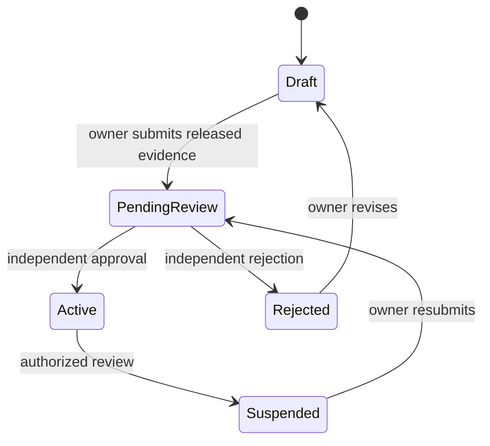

# Feature Specification: Facility Onboarding and Contextual RBAC

## 0. Metadata and traceability

| Field                      | Value                                                                                                                                                                                                                                                                                                                              |
| -------------------------- | ---------------------------------------------------------------------------------------------------------------------------------------------------------------------------------------------------------------------------------------------------------------------------------------------------------------------------------- |
| SpecKit feature ID         | `003-facility-onboarding-rbac`                                                                                                                                                                                                                                                                                                     |
| Status                     | `SPEC_REVIEW` with production/formal `BLOCKED` overlay: `OPEN-TEAM-001`, `OPEN-SEC-001`, `OPEN-LEGAL-001`, `OPEN-LEGAL-002`, `OPEN-LEGAL-007`, `OPEN-UX-001`, `OPEN-UX-002`                                                                                                                                                        |
| Target FR IDs              | `FR-FAC-001`, `FR-FAC-002`, `FR-FAC-003`, `FR-FAC-007`, `FR-ADMIN-001`, `FR-ADMIN-002`, `FR-ADMIN-004`                                                                                                                                                                                                                             |
| Target NFR IDs             | `NFR-SEC-001`, `NFR-SEC-002`, `NFR-SEC-004`, `NFR-SEC-005`, `NFR-SEC-006`, `NFR-SEC-007`, `NFR-PRIV-002`, `NFR-PRIV-004`, `NFR-I18N-001`, `NFR-A11Y-001`, `NFR-PERF-002`, `NFR-DATA-001`, `NFR-DATA-002`, `NFR-API-001`, `NFR-API-002`, `NFR-OBS-001`, `NFR-QUALITY-001`, `NFR-PORT-001`                                           |
| Scope eligibility          | `ACTIVE — SHIFAA PRD v2.1.0 §§4.3 and 5; Product Owner directive 2026-08-11`                                                                                                                                                                                                                                                       |
| Target app/service/package | `apps/admin`, `apps/clinic`, `apps/pharmacy`, `apps/hospital`, `apps/lab`, `services/api`, `services/worker`, `packages/contracts`, `packages/api-client`, `packages/core`, `packages/auth`, `packages/i18n`, `packages/design-system`, `packages/observability`, `packages/test-kit`, `supabase/`, `infra/db/`, `infra/runbooks/` |
| Owner                      | Yousef Osama, Product Owner; engineering/reviewer assignment remains `OPEN-TEAM-001`                                                                                                                                                                                                                                               |
| Reviewers                  | Product `Yousef Osama`; QA `[unassigned]`; Architecture `[unassigned]`; Security `[unassigned]`; DPO/Legal `[unassigned]`; Clinical `N/A`; Design/A11y `[unassigned]`                                                                                                                                                              |
| Risk class                 | `sensitive-data` and regulated facility/professional licensing                                                                                                                                                                                                                                                                     |
| Regulatory domains         | Egyptian PDPL; facility and professional licensing; production legal authorization remains open                                                                                                                                                                                                                                    |
| Clinical sign-off required | No — the slice verifies eligibility evidence and denies regulated actions but implements no clinical decision, prescription, dispense, triage, result, or clinical content                                                                                                                                                         |
| Dependencies               | merged `001-identity-onboarding`; merged `002-supabase-runtime-foundation`; PRD/Master/Constitution v2.1.0; Architecture/API/Data/UI/Traceability v1.1.0/0.9.1                                                                                                                                                                     |
| Parent roadmap entry       | `SHIFAA-Implementation-Plan-MASTER.md §10 Phase 1 — Foundation`                                                                                                                                                                                                                                                                    |
| Created / updated          | `2026-08-11 / 2026-08-11`                                                                                                                                                                                                                                                                                                          |

This specification authorizes seeded-synthetic engineering only. It does not authorize real Egyptian licensing approval, real professional/facility documents, production PHI, production session values, or a production legal/regulatory claim. No canonical `OPEN-*` item is closed by this feature.

## 1. Problem and scope

### Problem statement

An authenticated owner of a clinic, pharmacy, hospital, or laboratory needs to create one facility, attach private licensing evidence, submit it for attributable administrative review, and invite individually authenticated workers only after approval. Each worker must enter only the application and facility context permitted by current membership, named action permissions, professional-license state, authentication assurance, purpose, and patient relationship. Platform administrators need minimum-data worklists and independent four-eyes role-grant and revocation workflows without gaining broad clinical access.

### Actors and authorization context

| Actor                                     | Facility/patient relationship                                             | Permitted outcome                                                                                                  | Explicitly prohibited                                                                                                  |
| ----------------------------------------- | ------------------------------------------------------------------------- | ------------------------------------------------------------------------------------------------------------------ | ---------------------------------------------------------------------------------------------------------------------- |
| Verified owner candidate                  | no membership until draft creation; then owner membership at one facility | create/update/submit own draft, upload quarantine evidence, view own facility, manage memberships after activation | approve/suspend own facility, enumerate private objects, use another facility context                                  |
| Invited workforce person                  | named invitation for one facility                                         | accept invitation and enter only the matching facility app after all gates pass                                    | shared account, self-selected role/facility, cross-facility access, regulated action with invalid professional license |
| `ADM-FACILITY` (`facility_approver`) AAL2 | assigned facility/professional-license case and explicit review purpose   | minimum-data worklist; approve/reject/suspend with evidence and reason                                             | own-case approval, unrelated person/profile/clinical data, role-grant decisions                                        |
| First `ADM-SUPER` (`super_admin`) AAL2    | active grant                                                              | propose a canonical admin-role grant or revocation                                                                 | decide own proposal, obtain target-role data access from proposal alone                                                |
| Independent second `ADM-SUPER` AAL2       | active grant and not proposer/target                                      | approve/reject a pending grant or revocation                                                                       | decide own proposal, mutate grant directly outside state function                                                      |
| Other canonical admin roles               | exact action-level grants                                                 | only the operation families listed in the canonical role matrix                                                    | implicit hierarchy, arbitrary facility/patient/clinical access                                                         |
| Core API / PostgreSQL / Storage           | verified request context                                                  | enforce policy twice, atomically persist mutation/audit/outbox/idempotency, keep evidence private                  | trust client claims, use owner/service-role for user requests, bypass forced RLS                                       |

### In scope

- Facility draft creation, bilingual identity/address, encrypted license number, private evidence upload, submission, administrative approval/rejection, later suspension, and authorized projection for all four facility types (`FR-FAC-001`).
- Automatic attributable owner membership, invitation/acceptance/update/end of sub-user memberships, named action permissions, validity, and facility context (`FR-FAC-002`).
- Default-deny authorization over actor, facility, resource, action, canonical role, AAL, purpose, professional-license status, and patient relationship when an action later requires a patient (`FR-FAC-003`).
- Professional-license creation, private upload, minimum review worklist, verify/reject/suspend, expiry evaluation, and denial predicate for regulated actions (`FR-FAC-007`).
- The exact five admin roles with no hierarchy and operation-level permission mapping (`FR-ADMIN-001`).
- AAL2, purpose capture, minimum projections, immutable attribution, and denial audit for sensitive administrative access (`FR-ADMIN-002`).
- Independent proposer/decider workflows for admin-role grants and revocations; owner versus independent reviewer separation for facility activation; immutable attribution (`FR-ADMIN-004`).
- Arabic/English responsive, keyboard-first screens for facility onboarding/team in each distinct facility app and review/role governance in admin.
- Deterministic seeded-synthetic Supabase Auth/PostgreSQL/Storage execution extending feature 002.

### Non-goals

- `FR-FAC-004` pharmacy directorship; pharmacy ownership limits; dispensing; inventory; EPTTS.
- `FR-FAC-005` schedules/absence, `FR-FAC-006` contextual chat, appointments/queues/encounters, hospital beds/admissions, laboratory orders/results, SOS/discovery, DSR, Family Care, clinical safety, payments, donations, or AI.
- A generic facility application. `apps/clinic`, `apps/pharmacy`, `apps/hospital`, and `apps/lab` remain separate authoritative applications under Constitution Article XI.
- Real documents, real regulator/provider calls, production credentials, production auth/session values blocked by `OPEN-SEC-001`, or claims that SHIFAA approval is official Egyptian approval.
- Closing `OPEN-LEGAL-*`, `OPEN-TEAM-001`, `OPEN-UX-*`, or `OPEN-TECH-*`.

### Dependencies and assumptions

| Item                                                                                   | Type                     | Evidence / open ID                                                |
| -------------------------------------------------------------------------------------- | ------------------------ | ----------------------------------------------------------------- |
| Core-API-only Supabase runtime, non-owner PostgreSQL role, forced RLS, private Storage | verified repository fact | merged feature 002                                                |
| Facility types are exactly clinic, pharmacy, hospital, laboratory                      | SHIFAA policy            | PRD `FR-FAC-001`; Data/RLS `identity.facilities`                  |
| Five admin roles are exact and non-hierarchical                                        | SHIFAA policy            | PRD `FR-ADMIN-001`; API Catalog actor mappings                    |
| Operation IDs and paths are immutable                                                  | SHIFAA policy            | API Catalog v1.1.0; `NFR-API-001`                                 |
| Synthetic review is SHIFAA-local eligibility evidence, not legal approval              | SHIFAA policy            | Constitution VII; production legal gates open                     |
| Exact statutory retention duration/action                                              | OPEN                     | `OPEN-LEGAL-002`                                                  |
| Production session/re-authentication interval                                          | OPEN                     | `OPEN-SEC-001`; this feature uses deterministic AAL fixtures only |
| Screen compositions/tolerances                                                         | OPEN                     | `OPEN-UX-001/002`; no pixel-identical claim                       |

## 2. Egyptian regulatory and legal validation

- [x] Processing inventory records facility onboarding, licensing evidence, workforce membership, professional licensing, and admin governance before collection.
- [x] Facility/professional identifiers and evidence are sensitive governance data; seeded fixtures are deliberately synthetic and impossible for real use.
- [x] No consent is used as the basis for platform licensing administration; the processing purpose and SHIFAA policy basis are explicit and data-minimized.
- [x] API projections, events, logs, metrics, Issues, and screenshots exclude raw license numbers, documents, tokens, signed URLs, and unrelated profile/clinical fields.
- [ ] Retention classes are assigned but durations/actions remain `OPEN-LEGAL-002`.
- [ ] Production country/processor/PDPC/DPO evidence remains `OPEN-LEGAL-001/007`.
- [x] Facility/professional licensing is treated as a production evidence gate. A SHIFAA synthetic reviewer decision is never described as government approval.
- [x] Pharmacy directorship/EDA, controlled drugs, MOSS/UHI/CBE, payments, donations, AI, and clinical-content gates are outside this slice.
- [x] Breach runbook impact includes private evidence and role/membership misuse; DSR execution remains outside scope.

**Blocking open items:** `OPEN-LEGAL-001`, `OPEN-LEGAL-002`, `OPEN-LEGAL-007`, `OPEN-TEAM-001`, `OPEN-SEC-001`, `OPEN-UX-001`, `OPEN-UX-002`. These block formal/production gates, not approved seeded-synthetic engineering.

## 3. User Scenarios & Testing

### Journey J-01 — Onboard each facility type

1. Given a verified synthetic owner at AAL2 and one of `clinic`, `pharmacy`, `hospital`, or `laboratory`.
2. When the owner creates a draft, enters bilingual/address/license metadata, uploads private evidence, and submits the current version.
3. The system creates one attributable owner membership, keeps evidence quarantined until scan release, and creates one `pending_review` case without claiming approval.
4. An independent assigned `facility_approver` sees only the minimum projection and approves or rejects; approval activates the facility, rejection records localized next steps, and all effects are audited.

### Journey J-02 — Verify a professional license and join a facility

1. Given an approved facility owner and a synthetic worker with a pending professional license.
2. When the worker uploads evidence and an independent assigned `facility_approver` verifies the released evidence, the owner invites the worker with a named facility role and validity.
3. The worker accepts once and enters only the application matching that facility type.
4. Regulated authorization returns allow only while membership, permission, AAL/purpose, facility context, patient relationship when required, and professional license are all valid.

### Journey J-03 — Govern admin role grants and revocations

1. Given two distinct active `super_admin` synthetic actors at AAL2.
2. When actor A proposes a canonical role grant and actor B approves the current version, the grant becomes active once with immutable proposer/decider attribution.
3. When one actor later proposes revocation and the other approves, the grant is revoked atomically and authorization changes on the next check.
4. Self-decision, target-as-decider, stale version, replay with changed body, and direct database state update are denied.

### Alternate, failure, and degraded paths

| Case                 | Trigger                                                                 | UI/API result                                                             | State/audit effect                     | Recovery                               |
| -------------------- | ----------------------------------------------------------------------- | ------------------------------------------------------------------------- | -------------------------------------- | -------------------------------------- | -------------------------------------- | --------------------------------- |
| Permission denied    | cross-facility, wrong role/app, missing purpose, AAL1, ended membership | localized `403 forbidden                                                  | purpose-required                       | mfa-required`                          | no domain effect; minimum denial audit | select authorized context/step up |
| Offline              | any licensing, membership, approval, grant, or revocation mutation      | persistent banner; write not queued                                       | no effect                              | reconnect and deliberately retry       |
| Evidence quarantined | upload not scanned/released                                             | `409 evidence-not-released`; approve control unavailable with explanation | case remains pending                   | scanner releases or replacement upload |
| Duplicate replay     | same principal/route/key/body                                           | stored status/body                                                        | exactly one domain/audit/outbox effect | none                                   |
| Changed replay       | same scope/key, different canonical body                                | `409 idempotency-key-reused`                                              | no second effect                       | new key                                |
| Concurrent change    | stale `If-Match`                                                        | `409 version-conflict`                                                    | no partial effect                      | refresh and retry                      |
| Invalid transition   | terminal/rejected/ended state action                                    | `409 state-transition-invalid`                                            | no partial effect                      | use allowed next action                |
| License invalid      | expired, suspended, rejected, unverified                                | regulated action `403 professional-license-required`                      | no action effect                       | obtain current verified license        |
| Dependency failure   | Auth/DB/Storage unavailable                                             | localized `503 dependency-unavailable`                                    | no partial DB effect                   | restore dependency/retry               |
| Production gate      | real/production adapter requested                                       | startup/feature `503 legal-gate-disabled`                                 | no data collected                      | close canonical gate outside feature   |

## 4. Requirements

| Target PRD requirement | Required feature behavior                                                                         | Acceptance coverage       |
| ---------------------- | ------------------------------------------------------------------------------------------------- | ------------------------- |
| `FR-FAC-001`           | Four-type draft/submission/review/approve/reject/suspend lifecycle with private released evidence | `AC-01..05`, `AC-16`      |
| `FR-FAC-002`           | Owner/sub-user membership lifecycle, named permissions, person+facility attribution               | `AC-06..08`, `AC-17`      |
| `FR-FAC-003`           | Contextual default-deny policy over facility/resource/action/role/license/patient basis           | `AC-09..11`, `AC-18`      |
| `FR-FAC-007`           | Professional-license evidence/review/expiry/suspension and regulated-action denial                | `AC-12..14`               |
| `FR-ADMIN-001`         | Exact five roles and operation-level permission matrix without hierarchy                          | `AC-15`, `AC-19`          |
| `FR-ADMIN-002`         | Minimum worklists, AAL2/purpose, immutable access/action audit                                    | `AC-03`, `AC-13`, `AC-15` |
| `FR-ADMIN-004`         | Independent facility decision and two-person admin-role grant/revocation                          | `AC-04`, `AC-20`, `AC-21` |

## 5. Domain model and invariants

### Entities and ownership

| Entity                                         | Owning domain  | Authoritative source                         | Lifecycle owner                            |
| ---------------------------------------------- | -------------- | -------------------------------------------- | ------------------------------------------ |
| Facility / facility license                    | identity       | PostgreSQL + private Storage object metadata | owner then independent facility approver   |
| Facility membership / permission               | identity       | PostgreSQL                                   | facility owner; invitee accepts            |
| Professional license                           | identity       | PostgreSQL + private Storage object metadata | subject then independent facility approver |
| Admin role permission/grant/revocation request | identity       | PostgreSQL                                   | independent super-admin actors             |
| Idempotency/audit/outbox                       | platform/audit | PostgreSQL                                   | Core API transaction                       |

### State machines

- `closed` remains a readable canonical terminal status for compatibility, but 003 exposes no close operation and creates no transition to it.
- Facility license/professional license: `pending → verified|rejected`; `verified → suspended|expired`; `rejected → pending` only after new evidence/version; `suspended → pending` only after resubmission. All other transitions deny.
- Membership: `invited → active|rejected|expired`; `active → suspended|ended|expired`; `suspended → active|ended|expired` with owner authorization and gates. Ended/rejected/expired are terminal.
- Admin grant: `pending → active|rejected`; `active → revoked|expired`; only an approved independent revocation request may produce `revoked`.
- Admin revocation request: `pending → approved|rejected|cancelled`; approval atomically revokes an active grant.

### Invariants and concurrency

- Facility type is a closed set and immutable after draft creation; one application route set is selected from stored type, never a client claim.
- Draft creation atomically creates exactly one active owner membership attributed to the creator.
- Facility cannot activate without at least one required verified unexpired facility license and released evidence.
- Regulated action requires active membership, named action permission, matching facility/application, and verified unexpired/non-suspended professional license where the action declares one.
- Every workforce audit row has authenticated person and facility; no shared/anonymous actor.
- Proposer, decider, and target are distinct where required; facility owner cannot approve their own facility.
- Every mutation uses an atomic idempotency claim/result plus domain, audit, and outbox effects and current version where catalogued.

## 6. Exact data and RLS contract

### Tables and fields

| Table.column group                        | Type/rule                                                                                                               | Key/check/index                                              | Classification/encryption/retention                                |
| ----------------------------------------- | ----------------------------------------------------------------------------------------------------------------------- | ------------------------------------------------------------ | ------------------------------------------------------------------ |
| `identity.facilities`                     | canonical bilingual names, type, status, address/location, creator, timestamps/version                                  | type/status checks; creator/status/location indexes          | licensing governance; `IDENTITY_PROOF`; address/location minimized |
| `identity.facility_licenses`              | facility, type, encrypted number, HMAC hash, issuer, dates, licensed activities, status, object/reviewer/reason/version | active hash/type uniqueness; facility/status/expiry indexes  | encrypted number; private evidence; `IDENTITY_PROOF`               |
| `identity.facility_memberships`           | facility, person, role, optional employment license, invite hash/expiry, validity, status/version                       | partial active unique; facility/person/status indexes        | workforce governance; `SECURITY_AUDIT` linkage                     |
| `identity.role_permissions`               | role/action/resource/min AAL/purpose/profession requirement                                                             | PK role/action/resource; closed seeded role/action matrix    | policy configuration; `SECURITY_AUDIT`                             |
| `identity.professional_licenses`          | person, profession/specialty, encrypted number/hash, issuer/expiry/status, object/reviewer/reason/version               | person/profession/status/expiry indexes; verified uniqueness | encrypted number; private evidence; `IDENTITY_PROOF`               |
| `identity.admin_role_grants`              | person, exact role, status/validity, proposed/decided attribution/reason/version                                        | partial active unique; proposer != decider/target checks     | privileged governance; `SECURITY_AUDIT`                            |
| `identity.admin_role_revocation_requests` | grant, status, reason, proposed/decided attribution/version                                                             | one pending/grant; proposer != decider/target                | privileged governance; `SECURITY_AUDIT`                            |
| `storage.objects.metadata`                | owner/case/resource/checksum/MIME/size/`scan_status`                                                                    | private bucket, random key, allow-list; no list/public read  | private evidence; `IDENTITY_PROOF`                                 |

### Migration

- Forward order: processing inventory and private buckets → identity tables/columns/checks/indexes → canonical permissions → state functions/triggers → fixed-search-path helpers → grants/RLS/Storage policies → synthetic fixtures.
- Existing-data validation: preserve 001/002 rows; assert no invalid auth mapping, duplicate active grant/membership, or unexpected role/type; add no fabricated evidence.
- Roll-forward is canonical after shared use. Test-only reset is allowed only for the named local synthetic project; audit/grant/license history is never destructively rolled back.
- Production backup/retention behavior remains blocked by canonical legal/operations gates.

### RLS/action matrix

| Actor/context                               | SELECT                                             | INSERT                             | UPDATE/state action                   | DELETE | Negative test ID          |
| ------------------------------------------- | -------------------------------------------------- | ---------------------------------- | ------------------------------------- | ------ | ------------------------- |
| owner at matching facility                  | own full authorized facility/membership projection | own facility/license/member invite | draft/update/submit/team actions only | denied | `TV-RLS-FAC-OWNER`        |
| active facility member                      | own membership + authorized facility minimum       | license subject only               | accept own invite; named action only  | denied | `TV-RLS-FAC-MEMBER`       |
| assigned `facility_approver`, AAL2, purpose | minimum assigned facility/license cases            | denied                             | guarded decision/suspension only      | denied | `TV-RLS-FAC-APPROVER`     |
| active independent `super_admin`, AAL2      | role-grant governance projection                   | proposal                           | guarded independent decision only     | denied | `TV-RLS-ADMIN-FOUR-EYES`  |
| other/missing/cross-facility                | none                                               | denied                             | denied                                | denied | `TV-RLS-FAC-DEFAULT-DENY` |

All feature tables use `ENABLE` and `FORCE ROW LEVEL SECURITY`. The online `shifaa_api` role is non-owner/non-`BYPASSRLS`. Helpers fix `search_path` to `pg_catalog`, schema-qualify every object, use transaction-local verified actor/facility/purpose/AAL, and read current grants/memberships/licenses instead of trusting JWT role metadata.

## 7. API endpoint specifications

The machine-readable feature contract defines exactly these canonical operations and no others. All mutations require `Idempotency-Key`; catalogued versioned mutations also require `If-Match`. Errors are RFC 9457, sensitive responses are `private, no-store`, and every response carries `X-Request-Id`.

| Operation IDs                                                                                                                                         | Method/path family         | Actors/controls                                                                                         | Success/primary problems                                                                             | Audit/events                                      |
| ----------------------------------------------------------------------------------------------------------------------------------------------------- | -------------------------- | ------------------------------------------------------------------------------------------------------- | ---------------------------------------------------------------------------------------------------- | ------------------------------------------------- |
| `createProfessionalLicense`, `createProfessionalLicenseUpload`, `getProfessionalLicense`, `listProfessionalLicenseCases`, `reviewProfessionalLicense` | exact API Catalog §2 paths | subject or assigned `facility_approver`; review AAL2/purpose/version                                    | pending/masked/upload/worklist/verify-reject-suspend; evidence/role/state conflicts                  | `professional_license.*`; minimum IDs/status only |
| `createFacility`, `updateFacility`, `submitFacility`, `createFacilityLicenseUpload`, `listFacilityApprovalCases`, `reviewFacility`, `getFacility`     | exact API Catalog §3 paths | verified owner; assigned `facility_approver` AAL2/purpose; version on update/submit/review              | draft/pending/active/rejected/suspended projections; quarantine, self-review, stale/version problems | `facility.*`; no license number/document          |
| `listFacilityMemberships`, `inviteFacilityMember`, `acceptFacilityMembership`, `updateFacilityMembership`, `endFacilityMembership`                    | exact API Catalog §3 paths | owner or invitee; version on update/end                                                                 | paged membership/invited/active/ended; cross-facility, invalid license, terminal invite problems     | `membership.*`; actor+facility+role/status only   |
| `listAdminRoleGrants`, `proposeAdminRoleGrant`, `decideAdminRoleGrant`, `proposeAdminRoleRevocation`, `decideAdminRoleRevocation`                     | exact API Catalog §9 paths | two distinct active `super_admin` actors; AAL2 for mutations; versions on decisions/revocation proposal | paged governance projection, pending/active/rejected/revoked; self-decision, stale, invalid role     | `admin_role.*`; immutable proposer/decider IDs    |

Collections use opaque cursor with default 25/max 100. Synthetic limits are 30 mutations/minute per actor and 120 reads/minute; review worklists are 60 reads/minute. Idempotency scope is authenticated actor + method + route template + key, retained under the canonical technical class; exact TTL is environment configuration and not a statutory retention claim.

## 8. UI/UX and edge-state matrix

| App/route                                                                                   | Required states                                                                                                                | Controls/focus/permission behavior                                                                        | Baseline      |
| ------------------------------------------------------------------------------------------- | ------------------------------------------------------------------------------------------------------------------------------ | --------------------------------------------------------------------------------------------------------- | ------------- |
| each of `apps/clinic`, `apps/pharmacy`, `apps/hospital`, `apps/lab`: `/facility/onboarding` | loading, draft, upload/quarantine/scanning/released, pending, rejected, active, suspended, offline, conflict, error, success   | Arabic-first persistent labels; one stable decision region; 44px targets; focus summary; no queued writes | `OPEN-UX-001` |
| each facility app: `/facility/team`                                                         | loading, empty, invited, active, suspended, ended, expired, permission, license-invalid, offline/conflict/success              | keyboard table/stacked rows; invite/update/end confirmations; person+facility attribution visible         | `OPEN-UX-001` |
| admin `/facility-approvals`                                                                 | AAL2/purpose, empty/loading, quarantine blocked, decision/reason, conflict, rejected/active/suspended                          | minimum projection, zero decorative motion, stable approve/reject action                                  | `OPEN-UX-001` |
| admin `/professional-licenses`                                                              | same plus pending/verified/rejected/suspended/expired                                                                          | masked number, released-evidence indicator, reason and current version                                    | `OPEN-UX-001` |
| admin `/role-grants`                                                                        | list/empty, propose, pending independent decision, self-decision denial, active, revocation pending/rejected/approved/conflict | exact role/action summary; proposer and required independent actor named; zero motion                     | `OPEN-UX-001` |

Arabic uses root `dir=rtl`, logical properties, mirrored directional icons, and LTR bidi isolation for UUIDs, license masks, codes, dates, email, and phone. English uses `dir=ltr`. Required checks cover 1440×900 and 768×1024 staff viewports plus 360×800 budget/compact reflow, keyboard-only flow, screen-reader names/live regions, 200% text, 400% browser zoom where applicable, high contrast, reduced motion, loading/empty/error/offline/permission/conflict/rejected/suspended/expired/success. Approval and role decisions use zero decorative motion.

## 9. Notifications and asynchronous events

| Source event                    | Recipient policy    | Allowed fields                                      | Dedup/retry                         | Emergency Contact                         |
| ------------------------------- | ------------------- | --------------------------------------------------- | ----------------------------------- | ----------------------------------------- | ----------------------------------------------- | ------------------------------------------------------ | ----- | ----- |
| `facility.submitted             | approved            | rejected                                            | suspended`                          | owner and assigned worklist as applicable | facility ID/type/status/reason code/next action | source event + recipient + template; bounded retry/DLQ | Never |
| `professional_license.submitted | verified            | rejected                                            | suspended                           | expired`                                  | license subject and assigned reviewer           | license ID/profession/status/reason code/expiry band   | same  | Never |
| `membership.invited             | accepted            | changed                                             | ended`                              | invitee/owner                             | membership/facility/role/status/validity only   | same; token never in event                             | Never |
| `admin_role.grant               | revocation.changed` | proposal target/proposer/decider governance channel | grant/request/role/status/actor IDs | same                                      | Never                                           |

## 10. Security, privacy, and abuse cases

| Threat/misuse                             | Control                                                                                                    | Verification                                            |
| ----------------------------------------- | ---------------------------------------------------------------------------------------------------------- | ------------------------------------------------------- |
| Cross-facility/BOLA and wrong application | server-resolved current membership/permission/type + forced RLS                                            | API/RLS negative matrix and browser route denial        |
| Forged/stale role/license metadata        | database current-state lookup; JWT metadata ignored                                                        | token tampering and immediate revocation tests          |
| Self-approval/collusion path              | structural proposer/decider/owner/target checks and immutable audit                                        | API + direct SQL negative tests                         |
| Malicious/private upload exposure         | random private key, MIME/magic/size/checksum, quarantine/scanner release, short-lived single-object access | anonymous/list/cross-owner/quarantine denial            |
| Replay/race                               | atomic reservation/result, canonical body hash, `If-Match`, DB unique/check constraints                    | same/different/concurrent vectors                       |
| Excessive admin projection                | assigned case, AAL2, purpose, field allow-list                                                             | snapshot/contract/RLS assertions                        |
| License expiry bypass                     | request-time status/expiry predicate                                                                       | clock-bound expired/suspended/rejected/unverified tests |
| PHI/secret telemetry                      | recursive redaction and event allow-lists; no full bodies/URLs/numbers/docs                                | sentinel scan                                           |
| Supply-chain/secret regression            | lockfile, audit, CodeQL, secret/SBOM and install-script gates                                              | CI required checks                                      |

## 11. Success Criteria

### Measurable Outcomes

| ID       | Outcome                                                                 | Measurement method            | Required threshold                                                     |
| -------- | ----------------------------------------------------------------------- | ----------------------------- | ---------------------------------------------------------------------- |
| `SC-001` | A synthetic owner completes the governed facility journey for each type | live E2E matrix               | 4/4 types reach a valid approved or rejected state                     |
| `SC-002` | Authorized workers enter only their facility application and context    | API/RLS/browser matrix        | 100% allowed cases succeed; 100% cross-facility/wrong-app cases denied |
| `SC-003` | Invalid professional evidence never authorizes regulated activity       | policy/clock matrix           | expired, suspended, rejected, unverified all deny                      |
| `SC-004` | Role governance is independently attributable and replay-safe           | concurrency/replay suite      | zero self-decisions; one effect per accepted mutation                  |
| `SC-005` | Bilingual staff journeys are operable accessibly                        | live/automated matrix         | Arabic/English parity, WCAG 2.2 AA, no clipped core action             |
| `SC-006` | Core performance remains within approved target                         | 100-session synthetic profile | read p95 ≤400ms; mutation p95 ≤800ms excluding scanner                 |
| `SC-007` | No prohibited evidence/license/token value reaches telemetry or events  | sentinel scan                 | zero matches                                                           |

### Acceptance Criteria and Test Vectors

- `AC-01`: each exact facility type creates one draft and owner membership atomically.
- `AC-02`: only released private evidence allows submission; quarantine/unscanned evidence denies.
- `AC-03`: assigned AAL2/purpose approver receives only the minimum facility projection.
- `AC-04`: owner/self/wrong-role facility decision denies in API and forced RLS.
- `AC-05`: facility approve/reject/suspend follows only the state matrix and current version.
- `AC-06`: active owner invites a named worker; token hash only is stored.
- `AC-07`: invitee accepts once; replay returns stored result; terminal/other-person use denies.
- `AC-08`: membership role/update/end changes authorization on the next check and remains attributable.
- `AC-09`: worker can enter only the facility app matching current facility type.
- `AC-10`: cross-facility and wrong-role reads/mutations deny without existence/field oracle.
- `AC-11`: missing purpose or AAL1 denies every catalogued sensitive admin action.
- `AC-12`: professional license private upload/review returns masked projection only.
- `AC-13`: professional worklist is assigned/minimum and self-review denies.
- `AC-14`: expired, suspended, rejected, and unverified licenses deny regulated actions.
- `AC-15`: the five-role action matrix denies every non-mapped operation and grants no hierarchy.
- `AC-16`: private Storage cannot be enumerated/fetched by anonymous, other owner, other facility, or quarantined reviewer.
- `AC-17`: every workforce effect records both authenticated person and facility.
- `AC-18`: direct database attempts fail through forced RLS for all negative actor/context combinations.
- `AC-19`: admin-role proposal alone grants zero role permission.
- `AC-20`: independent grant proposer/decider is required; changed-body replay and stale decision deny.
- `AC-21`: independent revocation proposal/decision atomically revokes or retains the grant; direct update denies.
- `AC-22`: dependency failure/offline paths create no queued/partial decision.
- `AC-23`: Arabic RTL and English LTR journeys pass desktop/compact, keyboard, reduced-motion, focus, and screen-reader checks.
- `AC-24`: log/event sentinel, contract drift, architecture boundaries, migration/RLS/Storage, dependency, secret, SAST, and full `pnpm verify` gates pass.

Concrete fixture values and automated test paths are defined in `quickstart.md` and `tasks.md`; all are synthetic and deterministic.

## 12. Observability, rollout, rollback, and incidents

- SLO: read p95 ≤400ms and mutation p95 ≤800ms excluding asynchronous malware scanning; 100 concurrent seeded-synthetic facility sessions.
- Metrics: operation ID, status class, duration, facility type, decision status, idempotency result, denial reason category, evidence scan state, and license expiry band; no person/license/document/object/token identifiers.
- Feature flags: `FACILITY_ONBOARDING_ENABLED=false` and `SYNTHETIC_LICENSING_ENABLED=false` by default outside local/test.
- Rollout: named local Supabase project and CI only; no external regulator/vendor call.
- Rollback: disable routes first and roll forward corrective migration; never delete audit/license/grant history. Test reset only targets the named synthetic local project.
- Kill switch/degraded behavior: approvals and regulated authorization fail closed if DB/Storage/scanner/license policy is unavailable.
- Runbook: `infra/runbooks/facility-onboarding-rbac.md`; incident owner remains `OPEN-TEAM-001`.

## 13. Evidence and approvals

| Gate                  | Reviewer(s)  | Artifact                  | Decision/date                      | Blocking findings                                         |
| --------------------- | ------------ | ------------------------- | ---------------------------------- | --------------------------------------------------------- |
| Product               | Yousef Osama | directive + this spec     | implementation directed 2026-08-11 | none for active seeded-synthetic scope                    |
| QA                    | unassigned   | acceptance/evidence       | pending                            | `OPEN-TEAM-001`                                           |
| Legal/DPO             | unassigned   | compliance checklist      | production blocked                 | `OPEN-LEGAL-001/002/007`, `OPEN-TEAM-001`                 |
| Architecture/Security | unassigned   | plan/data/threat model    | pending                            | `OPEN-TEAM-001`; production session values `OPEN-SEC-001` |
| Clinical              | N/A          | no clinical behavior      | N/A                                | none                                                      |
| Design/Accessibility  | unassigned   | UI contract/live evidence | formal visual gate blocked         | `OPEN-UX-001/002`, `OPEN-TEAM-001`                        |
| Release               | unassigned   | final evidence manifest   | not requested                      | all applicable canonical blockers                         |

## 14. Open items and change log

| Open ID                  | Owner                   | Next action/evidence                                                                | Blocks gate                            |
| ------------------------ | ----------------------- | ----------------------------------------------------------------------------------- | -------------------------------------- |
| `OPEN-TEAM-001`          | Product Owner           | assign named QA/Architecture/Security/Legal/DPO/Design reviewers and incident owner | formal approvals/release               |
| `OPEN-SEC-001`           | Security + Architecture | approve production session and reauthentication values                              | production privileged sessions         |
| `OPEN-LEGAL-001/002/007` | Legal + DPO             | approve production processing, retention, and controlling Arabic legal mapping      | production real data/evidence          |
| `OPEN-UX-001/002`        | Product + Design + QA   | approve compositions, reference render matrix, baselines, and tolerances            | pixel-identical/automated visual claim |
| `OPEN-TECH-001/002/003`  | canonical owners        | continue reproducibility/full-contract/reference-environment evidence               | claims owned by canonical register     |

| Date       | Version | Change and affected FR/NFR/contracts                                                                                                                                                                                              |
| ---------- | ------- | --------------------------------------------------------------------------------------------------------------------------------------------------------------------------------------------------------------------------------- |
| 2026-08-11 | `0.1.1` | Pre-implementation analysis corrections: partial facility PATCH, typed facility/professional decisions, immutable facility type, exact five-role active-operation registry, and 24-criterion task traceability                    |
| 2026-08-11 | `0.1.0` | Initial active 003 specification for facility/professional licensing, memberships, contextual RBAC, exact admin roles, and four-eyes grants/revocations; excludes downstream operational workflows and production approval claims |
