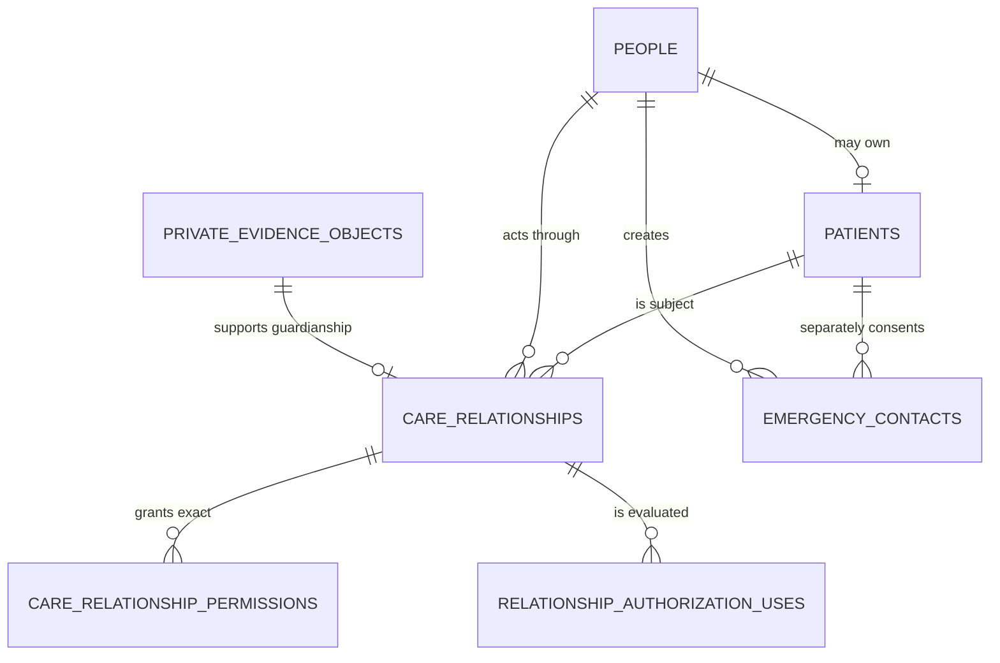

# Data Model: Family Care Relationships

**Feature:** `004-family-care-relationships` · **Date:** 2026-08-11
All examples and fixed identifiers are deterministic seeded-synthetic data.

## 1. Aggregate boundaries

`identity.care_relationships` remains the only authority aggregate. `identity.emergency_contacts` is intentionally separate and can never receive a relationship permission.

## 2. Existing table expansion — `identity.care_relationships`

| Column                                    | Type / rule                            | Purpose and exposure                                               |
| ----------------------------------------- | -------------------------------------- | ------------------------------------------------------------------ | ---------------------- | --------------------------- | ------- | -------- | ------------------------------------------------------------------------- |
| `id`                                      | UUID PK                                | opaque relationship identifier                                     |
| `subject_patient_id`                      | UUID FK, immutable                     | the one managed patient                                            |
| `actor_person_id`                         | UUID FK, immutable                     | self/guardian/delegate person; not a login alias                   |
| `relationship_type`                       | closed `self                           | guardianship                                                       | delegation`, immutable | canonical relationship type |
| `status`                                  | `pending                               | active                                                             | suspended              | rejected                    | revoked | expired` | current authorization state; `suspended` is pre-existing deny-only in 004 |
| `purpose_code`                            | text, required for guardian/delegation | machine purpose; no free-text PHI                                  |
| `valid_from`, `valid_until`               | timestamptz; ordered window            | current validity; active use also checks database time             |
| `created_by_person_id`                    | UUID FK                                | immutable proposer/delegator attribution; self backfilled to actor |
| `evidence_object_id`                      | nullable UUID FK                       | mandatory only for guardianship; private released metadata only    |
| `invite_token_digest`                     | nullable bytea(32)                     | mandatory only while delegation invite is pending; never projected |
| `invite_key_version`                      | nullable positive integer              | HMAC rotation metadata                                             |
| `invite_expires_at`, `invite_consumed_at` | nullable timestamptz                   | single-use invitation lifecycle                                    |
| `reviewed_by_person_id`, `reviewed_at`    | nullable UUID/timestamp                | guardianship decision attribution                                  |
| `decision_reason_code`                    | nullable closed/machine text           | required for approve/reject/revoke; localized by UI                |
| `revoked_by_person_id`, `revoked_at`      | nullable UUID/timestamp                | immutable revocation attribution                                   |
| `created_at`, `updated_at`                | timestamptz                            | lifecycle metadata                                                 |
| `version`                                 | positive integer                       | optimistic concurrency and observed authorization version          |

### Relationship invariants

1. `self`: `actor_person_id = patient.person_id`, active, no purpose/evidence/invite/reviewer/revoker, no permissions rows, and unique active row per patient.
2. `guardianship`: creation is pending, evidence is mandatory and bound/released, no invite digest, approval/rejection requires independent `reviewed_by_person_id`, reason, and decision time. Approval requires `valid_until` and approved permissions.
3. `delegation`: created by the subject patient's self person, actor is a different named adult person, pending invite digest/expiry is mandatory, acceptance consumes it once and activates. No `consent.manage` row is allowed.
4. Active authorization requires `status='active'`, `valid_from <= clock`, `valid_until IS NULL OR valid_until > clock`, exact permission, exact patient, and request purpose.
5. `rejected|revoked|expired` are terminal. 004 never changes type or subject/actor and never transitions a dependent because of age/capacity.
6. Equivalent pending/active guardian or delegation rows for the same subject/actor/type/purpose are unique. A new legal/invite attempt after a terminal row creates a new row.

## 3. New table — `identity.care_relationship_permissions`

| Column                 | Type / rule           | Purpose                        |
| ---------------------- | --------------------- | ------------------------------ |
| `relationship_id`      | UUID FK, part PK      | authority aggregate            |
| `permission_code`      | closed check, part PK | one exact action family        |
| `created_at`           | timestamptz           | immutable grant evidence       |
| `created_by_person_id` | UUID FK               | reviewer/delegator attribution |

Closed values: `profile.view`, `appointment.manage`, `record.view`, `medication.manage`, `sos.activate`, `sos.share`, `complaint.create`, `symptom_routing.use`, `consent.manage`.

- Database trigger rejects any permission on `self`.
- Database trigger rejects `consent.manage` on delegation.
- Permission rows are replaced only within a version-checked relationship transaction; no direct API CRUD is exposed.

## 4. Existing private evidence expansion

`identity.private_evidence_objects.bucket_code` gains `guardianship-evidence`. The existing row also gains nullable `resource_patient_id` so a released object cannot be substituted across patients. The 004 predicate requires:

- owner equals proposed guardian/current authenticated person;
- bucket is `guardianship-evidence`;
- `resource_patient_id` equals `subject_patient_id`;
- `scan_status='released'`;
- object path is private and never returned to patient/admin projections.

Supabase creates a private `guardianship-evidence` bucket if the Storage schema exists. No public policy or signed URL is introduced.

## 5. New table — `identity.emergency_contacts`

| Column                                                                             | Type / rule        | Purpose and exposure                                   |
| ---------------------------------------------------------------------------------- | ------------------ | ------------------------------------------------------ | ---------------------------- | ----------------------------------------- | -------- | ---------------------------------- |
| `id`                                                                               | UUID PK            | opaque contact identifier                              |
| `subject_patient_id`                                                               | UUID FK, immutable | consent owner/patient                                  |
| `created_by_person_id`                                                             | UUID FK, immutable | patient or active guardian                             |
| `display_name_ciphertext`, `nonce`, `authentication_tag`, `key_version`            | encrypted envelope | contact name; never logged/evented                     |
| `phone_ciphertext`, `phone_nonce`, `phone_authentication_tag`, `phone_key_version` | encrypted envelope | phone; never logged/evented                            |
| `masked_phone`                                                                     | text               | owner projection only                                  |
| `phone_blind_index`                                                                | bytea(32)          | equivalent-active-contact uniqueness without plaintext |
| `preferred_locale`                                                                 | `ar-EG             | en-EG`                                                 | invite/future alert language |
| `location_precision`                                                               | `none              | coarse                                                 | exact`                       | separately selected future SOS disclosure |
| `status`                                                                           | `pending           | confirmed                                              | declined                     | revoked                                   | expired` | separate affirmative consent state |
| `invite_token_digest`                                                              | bytea(32)          | HMAC-only lookup, never projected                      |
| `invite_key_version`                                                               | positive integer   | rotation metadata                                      |
| `invite_expires_at`, `responded_at`                                                | timestamps         | terminal token lifecycle                               |
| `revoked_by_person_id`, `revoked_at`, `decision_reason_code`                       | attribution        | current-version revoke/terminal evidence               |
| `created_at`, `updated_at`, `version`                                              | metadata           | concurrency and audit                                  |

### Emergency Contact transitions

| From              | Action            | To        | Guards                                                                                                                      |
| ----------------- | ----------------- | --------- | --------------------------------------------------------------------------------------------------------------------------- |
| —                 | create            | pending   | current patient/active guardian, explicit patient context, unique nonterminal phone/patient, token digest and future expiry |
| pending           | confirm token     | confirmed | correct unexpired token, single locked row                                                                                  |
| pending           | decline token     | declined  | correct unexpired token, single locked row                                                                                  |
| pending           | expiry evaluation | expired   | database clock ≥ invite expiry                                                                                              |
| pending/confirmed | owner revoke      | revoked   | current patient/active guardian, current version, reason                                                                    |

`declined`, `revoked`, and `expired` have no outgoing transition. A re-invite creates a fresh identifier/digest.

## 6. New table — `identity.relationship_authorization_uses`

| Column                 | Type / rule          | Purpose                       |
| ---------------------- | -------------------- | ----------------------------- | ------------------------------------------------ |
| `id`                   | UUID PK              | immutable use event           |
| `relationship_id`      | UUID FK              | exact authority used          |
| `subject_patient_id`   | UUID FK              | patient context               |
| `actor_person_id`      | UUID FK              | authenticated person          |
| `permission_code`      | closed permission    | exact decision requested      |
| `purpose_code`         | machine text         | exact policy purpose          |
| `outcome`              | `allowed             | denied`                       | attributed result; denial category stays minimum |
| `denial_code`          | nullable closed code | no existence/clinical details |
| `relationship_version` | positive integer     | state version evaluated       |
| `request_id`           | text                 | correlation without payload   |
| `occurred_at`          | timestamptz          | immutable chronology          |

No update/delete grant exists; an append-only trigger rejects mutation. RLS allows the API to insert only for its current actor/request context and allows minimum owner/support reads only where explicitly needed. 004 exposes no generic use-history endpoint.

## 7. Audit, idempotency, and outbox

Existing platform tables are reused atomically. New closed event/audit actions include:

- `relationship.guardianship.created|approved|rejected|revoked|expired|used`
- `relationship.delegation.created|accepted|updated|revoked|expired|used`
- `emergency_contact.created|confirmed|declined|revoked|expired`
- `sos.emergency_contact.requested|denied` (policy boundary only)

Allowed event fields: aggregate ID, subject patient ID, relationship/contact type, state, validity, permission codes, actor/recipient internal ID, locale/template code, next-action code, correlation ID. Forbidden recursively: token/digest, phone/name ciphertext or plaintext, evidence path/content, identity values, diagnosis, medication, lab, admission, record link, arbitrary location, request body, free-text reason.

## 8. RLS action matrix

| Actor/current context                      | Relationship rows                                                                   | Permission rows                          | Evidence metadata                   | Contacts                                    | Use rows                                           |
| ------------------------------------------ | ----------------------------------------------------------------------------------- | ---------------------------------------- | ----------------------------------- | ------------------------------------------- | -------------------------------------------------- |
| patient self person                        | own subject/created delegation rows; create/update/revoke through current predicate | exact rows for visible own relationships | own synthetic object only           | own patient create/list/revoke              | insert through trusted use function; no broad list |
| active guardian                            | their one active subject relationship and subject-scoped list                       | exact guardian permissions               | own related released object minimum | same subject if policy allows               | same current relationship use only                 |
| active delegate                            | their one active subject relationship and exact permission projection               | their exact current permissions          | none                                | none                                        | same current relationship use only                 |
| proposed guardian                          | own pending/rejected case minimum                                                   | requested scope minimum                  | own correctly bound object          | none                                        | none                                               |
| `ADM-SUPPORT`, AAL2, `guardianship_review` | pending/decided guardianship worklist minimum and decision update                   | guardian requested/approved scope        | released related minimum metadata   | none                                        | no generic relationship use                        |
| invite token principal                     | one locked pending delegation/contact response through security-definer function    | none                                     | none                                | one contact response if digest/expiry match | none                                               |
| wrong role/purpose/AAL/person/patient      | none                                                                                | none                                     | none                                | none                                        | none                                               |

All tables set `ENABLE ROW LEVEL SECURITY` and `FORCE ROW LEVEL SECURITY`; helpers are stable/security-definer only where needed, have fixed `search_path`, and revoke execution from `PUBLIC` unless explicitly granted to `shifaa_api`.

## 9. Indexes and performance

- relationship actor list: `(actor_person_id, status, valid_until, created_at desc, id)`;
- patient list/worklist: `(subject_patient_id, status, relationship_type, created_at desc, id)` and partial guardianship pending index;
- permissions: PK plus `(permission_code, relationship_id)`;
- invite lookup: unique digest partial while pending;
- contacts owner list: `(subject_patient_id, status, created_at desc, id)`;
- active equivalent contact: unique `(subject_patient_id, phone_blind_index)` for pending/confirmed;
- contact invite digest: unique while pending;
- authorization uses: `(relationship_id, occurred_at desc, id)` and `(request_id)`.

Cursor encodes stable `(created_at,id)` or worklist `(status,created_at,id)` tuple; OFFSET is not used.

## 10. Seed fixtures

Fixed impossible UUID namespaces provide:

- self patient `SYN-FAM-PAT-001`, dependent `SYN-FAM-DEP-001`, unrelated patient `SYN-FAM-OTHER-001`;
- proposed/active/wrong guardian, invited/wrong delegate, independent/self/wrong Support Admin;
- released/quarantined/wrong-owner/wrong-patient guardianship evidence;
- one row for each relationship/contact state and each permission;
- deterministic token _inputs_ known only to tests; database stores expected HMAC digests;
- cross-patient, wrong role/purpose/AAL, replay, changed-payload, stale-version, concurrent response, non-SOS event, forbidden alert field, redaction sentinel vectors.

No fixture resembles a real NID, phone, email, legal document, authentication token, or patient record.

## 11. Retention and deletion

Comments attach `relationship-authority`, `guardianship-evidence`, `emergency-contact-consent`, and `audit-evidence` retention classes. Exact duration/action stays `OPEN-LEGAL-002`; no purge job is added. API exposes revocation, not hard delete. Database roles receive no delete on authority/evidence/contact/use/audit rows.
