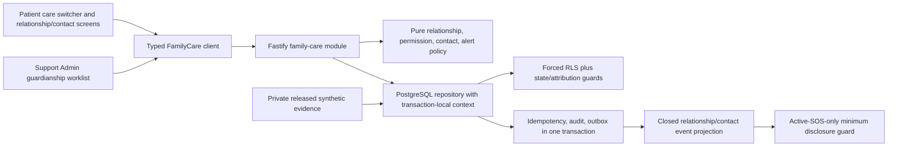

# Implementation Plan: Family Care Relationships

> **Feature:** `004-family-care-relationships` · **Spec version/status:** `0.1.0 / SPEC_REVIEW + production/formal BLOCKED overlay`
> **Target FR/NFR:** `FR-FAM-001`, `FR-FAM-002`, `FR-FAM-004`, `FR-FAM-005`, `FR-FAM-006`, `FR-FAM-007`, `FR-FAM-008` and the applicable NFRs enumerated in `spec.md` · **Owner:** Yousef Osama / Product Owner · **Updated:** `2026-08-11`

## 1. Approved inputs

| Input                           | Version/digest                                                                                                          | Approval/gate                                                                                                    |
| ------------------------------- | ----------------------------------------------------------------------------------------------------------------------- | ---------------------------------------------------------------------------------------------------------------- |
| `spec.md`                       | `0.1.0`                                                                                                                 | Product-directed seeded-synthetic scope; specification checklist passes; formal reviewers remain `OPEN-TEAM-001` |
| Active-scope eligibility        | PRD v2.1.0 active rows `FR-FAM-001`, `FR-FAM-002`, `FR-FAM-004`, `FR-FAM-005`, `FR-FAM-006`, `FR-FAM-007`, `FR-FAM-008` | PASS; `FR-FAM-003` is excluded and blocked by `OPEN-LEGAL-006`                                                   |
| Constitution                    | v2.1.0, ratified 2026-08-09                                                                                             | checked below                                                                                                    |
| PRD/Master/supporting contracts | PRD/Master 2.1.0; Architecture/API/Data/Trace 1.1.0; UI 0.9.1                                                           | normative repository baseline                                                                                    |
| Runtime dependency              | merged 001/002/003 at `87074382ba65293e4edd7a90859b2d4742e7a6b5`                                                        | Phase 0 `pnpm install --frozen-lockfile` and isolated `pnpm verify` PASS 2026-08-11                              |
| Clarification result            | `clarification-log.md`                                                                                                  | no unresolved ambiguity; canonical gaps remain explicit open gates                                               |
| Legal/session/design evidence   | canonical open register                                                                                                 | production/formal overlay only; real data and release stay disabled                                              |

## 2. Constitution check

| Article                                | Result and evidence                                                                                                                              |
| -------------------------------------- | ------------------------------------------------------------------------------------------------------------------------------------------------ |
| I Least privilege/default deny         | PASS — closed relationship permissions, current-state API policy, forced RLS, explicit patient context, and no implicit permission inheritance   |
| II Internal typed identity             | PASS — all patient/actor/reviewer/contact ownership uses internal UUIDs; tokens are HMAC-only and phone is encrypted/masked                      |
| III Canonical care relationships       | PASS — preserves only `self`, `guardianship`, `delegation`; Emergency Contact remains separate; `FR-FAM-003` is absent                           |
| IV Facility membership/attribution     | N/A — no facility-scoped action is introduced; Support Admin is global governance with person attribution                                        |
| V Patient-centric purpose-limited data | PASS — every authority row is bound to one patient, purpose, current state, validity, and exact permission                                       |
| VI Dual clinical governance            | N/A — no clinical content or treatment decision is introduced                                                                                    |
| VII Regulated evidence gate            | PASS — guardianship requires a released private synthetic evidence object and independent human review; production evidence intake remains gated |
| VIII Separation of duties              | PASS — a proposed guardian cannot approve themself; reviewer attribution and DB guards enforce independence                                      |
| IX MFA/purpose                         | PASS for deterministic AAL2 and `guardianship_review`; production auth/session assurance remains blocked by `OPEN-SEC-001`                       |
| X Portable domain logic                | PASS — state machines, permission checks, minimum-alert schema, and projections live in pure TypeScript; DB/Auth/clock/notification are adapters |
| XI One app per surface                 | PASS — patient Expo and admin Next.js remain independent and share only packages/contracts                                                       |
| XII Arabic-first consent/privacy       | PASS — Arabic-authored relationship/contact consequences and exact future SOS disclosure preview ship with English parity                        |
| XIII Accessibility/localization        | PASS at engineering/acceptance level; formal visual baseline remains `OPEN-UX-001/002`                                                           |
| XIV Safety UI clarity                  | PASS — selected patient and authority stay visible before mutations; review/revoke/terminal states use stable zero-motion decision areas         |
| XV Human authority over AI             | N/A — no AI or automated capacity/legal decision exists                                                                                          |

**Plan state:** executable for seeded-synthetic engineering under Master §11.4 step 6. It is not a production, legal, formal-design, or `FR-FAM-003` approval.

## 3. Technical context

- Targets: `apps/patient`, `apps/admin`, `services/api`, `services/worker`, `packages/contracts`, `packages/api-client`, `packages/core`, `packages/i18n`, `packages/design-system`, `packages/observability`, `packages/test-kit`, `infra/db`, `infra/runbooks`, `supabase`, `tests`, `tools`, and the canonical docs affected by traceability/operation availability.
- Runtime/toolchain: checked-in Node `24.18.0`, pnpm `11.13.0`, TypeScript `7.0.2`, Fastify `5.11.3`, Expo `57.0.12`, React/React Native as locked, Next.js `16.3.0`, Supabase CLI `2.113.0`, PostgreSQL 17.
- Capacity profile: deterministic 5,000 relationships, 20,000 permission rows, 5,000 contacts, 100 concurrent synthetic sessions; read p95 ≤400ms and mutation p95 ≤800ms.
- Reuse: canonical `identity.care_relationships`, current request context functions, private evidence registry, `platform.idempotency_records`, `platform.outbox_events`, immutable `audit.events`, Fastify route/module pattern, generated contract/client pattern, patient locale context, admin governance shell, and sentinel redaction tests.
- Exact operations: `listRelationships`, `createGuardianship`, `listGuardianshipCases`, `reviewGuardianship`, `createDelegation`, `acceptDelegation`, `updateDelegation`, `revokeRelationship`, `createEmergencyContact`, `listEmergencyContacts`, `respondEmergencyContact`, `revokeEmergencyContact`.
- External seams: `FamilyCareRepository`, `EvidenceStore`, `CurrentAuthorization`, `Clock`, `TokenHasher`, `EventPublisher`, `EmergencyAlertPolicy`. Test/local adapters are deterministic. Actual SOS creation/provider delivery and production evidence intake do not exist in this slice.

## 4. Proposed design and dependency flow

The API resolves current person, patient, relationship state, permissions, validity, AAL, purpose, and selected-context confirmation for every request. A client-supplied relationship or JWT claim is never authoritative. PostgreSQL repeats the current-state predicate under `FORCE ROW LEVEL SECURITY`. Public invite response is a narrowly scoped token-principal transaction that exposes no patient/contact oracle.

## 5. Work products

### Data and migration

- Additive migration expands the existing relationship status constraint to `pending|active|suspended|rejected|revoked|expired` and adds purpose, creator/reviewer/decision/evidence/token/version metadata without changing the closed relationship-type constraint.
- New tables: `identity.care_relationship_permissions`, `identity.emergency_contacts`, and `identity.relationship_authorization_uses`; extend private evidence bucket registry with `guardianship-evidence` and add the bucket only when Supabase Storage exists.
- Constraints/functions enforce self invariants, guardian evidence/review attribution, no self-review, closed delegation permissions, valid windows, terminal states, optimistic versions, one active equivalent grant/contact, HMAC-only invite values, and immutable attribution.
- Force RLS on every new table. `shifaa_api` receives only explicit verbs and no delete. Owner/current-authority/support-review policies call fixed-search-path helpers; `PUBLIC`, `anon`, `authenticated`, owner bypass for user traffic, and cross-patient access remain denied.
- Migration is expand-only. Before shared production use, rollback is feature-disable plus forward correction; local synthetic reset may remove only the named project volume.

### API and generated clients

- Add the 12 exact API Catalog operations to `specs/004-family-care-relationships/contracts/openapi.yaml`, source contracts, Fastify routes, integration tests, and typed client. `transitionDependent` and guardianship upload are forbidden by drift tests.
- Mutations require `Idempotency-Key`; versioned review/update/revoke requires `If-Match`. Same canonical body replays stored result; changed body yields RFC 9457 `409 idempotency-key-reused`; stale versions yield `409 version-conflict`.
- Collections use opaque cursor with default 25/max 100. Problems remain localized, minimum, and non-oracular. Rate classes are represented as policy metadata and deterministic limit tests.
- Every successful mutation writes domain state, attributed audit, and closed outbox payload atomically. Authorization use writes a separate minimal immutable record and audit event.

### UI, localization, and accessibility

- Add patient Expo routes `/care-switcher`, `/relationships`, `/emergency-contacts` and admin Next.js `/relationships`.
- A shared `FamilyContextBanner` exposes the full selected synthetic patient name, relationship label, validity, and explicit switch action. Managed-patient mutations require a fresh explicit context confirmation.
- Implement loading, empty, offline, evidence-blocked, permission, AAL, purpose, conflict, error, pending, rejected, declined, revoked, expired, and success states. Offline writes are never queued.
- Arabic is authored first with English parity, RTL logical layout and bidi isolation; keyboard/focus restoration, live announcements, 44×44 controls, reduced motion, high contrast, 200% text, and compact/wide layouts are verified.

### Events, notifications, and adapters

- Relationship/contact events contain only IDs, state, validity, permission codes, template/locale, and next-action code. They exclude raw tokens, phones, evidence, identity values, purposes in free text, and clinical data.
- The worker validates one closed SOS contact request: active qualifying incident supplied by a test port, confirmed current contact, separately consented location precision, and exact allow-listed template fields. It cannot create an SOS or contact a provider in 004.
- Dedup key is source event + recipient + template; bounded retry/DLQ semantics reuse platform receipts. Token delivery remains a protected invitation-channel port and returns the one-time raw token only at creation in seeded test/UI state.

### Security, privacy, and abuse controls

- Threat model covers BOLA/cross-family access, authority inflation, stale cache, evidence substitution, reviewer self-decision, invite theft/replay/oracle, terminal races, alert-field expansion, log/event leakage, and compromised worker input.
- Invite tokens use ≥256-bit randomness and HMAC digest only; phone uses encrypted fields plus owner-masked projection. No token/evidence/contact/clinical value enters logs or analytics.
- Support review requires `ADM-SUPPORT`, AAL2, exact purpose, released correctly bound evidence, current version, and different reviewer/proposed guardian.

## 6. Test and evidence plan

| Requirement/test family                                   | Level                                                              | Fixture/vector                                                                                             | Expected evidence/path                               |
| --------------------------------------------------------- | ------------------------------------------------------------------ | ---------------------------------------------------------------------------------------------------------- | ---------------------------------------------------- |
| `FR-FAM-001`, `FR-FAM-007` types/context                  | core, contract, API, UI/E2E                                        | self/guardian/delegate, absent/stale/mismatched selection                                                  | core/API suites and bilingual context screenshots    |
| `FR-FAM-002`, `FR-FAM-008` guardianship                   | migration, RLS, API, admin E2E                                     | released/wrong/quarantined evidence; independent/self/wrong role/AAL/purpose; approve/reject/revoke/expire | SQL matrices, integration tests, admin live evidence |
| `FR-FAM-004`, `NFR-SEC-001`, `NFR-SEC-005` delegation     | property, API, RLS, E2E                                            | each closed permission; excess `consent.manage`; accept/update/revoke/expiry; replay/race                  | unit/integration/SQL/live evidence                   |
| `FR-FAM-005` contact consent                              | core, API, RLS, E2E                                                | pending/confirmed/declined/revoked/expired; wrong token; concurrent response; re-invite                    | state tests, SQL, patient live evidence              |
| `FR-FAM-006`, `NFR-PRIV-001`, `NFR-PRIV-002` alert policy | worker/property/security                                           | non-SOS sources; inactive incident/contact; location choices; every forbidden field                        | worker tests and sentinel report                     |
| `NFR-I18N-001`, `NFR-A11Y-001`                            | parity, component, live browser                                    | Arabic/English, 360×800/768×1024/1440×900, keyboard, zoom, contrast, reduced motion                        | `evidence/live-qa.md` and inspected screenshots      |
| `NFR-API-001`, `NFR-API-002`, `NFR-PERF-002`              | drift, integration, load                                           | 12 operations, forbidden operation absence, 100-session profile                                            | contract gate and `evidence/performance.json`        |
| `NFR-SEC-006`, `NFR-SEC-007`, `NFR-OBS-001`               | forced-RLS, ASVS/API abuse, secret/dependency/SAST/SBOM, redaction | cross-patient/role/purpose/AAL/direct SQL/sentinels                                                        | security evidence and repository gates               |

Every acceptance criterion `AC-01`–`AC-24` receives at least one automated assertion and is mapped in the final manifest. Direct SQL tests run as `shifaa_api` under transaction-local context and prove `relforcerowsecurity=true`.

## 7. Delivery sequence

1. Freeze spec/plan/research/data/OpenAPI/quickstart/tasks and pre-implementation analysis.
2. Push immutable baseline, publish enriched Issues, and verify their bodies/dependencies/evidence.
3. Add deterministic fixture vectors, contracts, and failing tests before production logic.
4. Add expand migration, Storage addition, state guards, indexes, and complete forced-RLS matrix.
5. Implement pure policy/state/token/event projection and property/unit tests.
6. Implement repository/use cases/routes with current authorization, transaction, idempotency, audit, outbox, and client.
7. Implement worker event/alert guards and negative disclosure tests.
8. Implement patient and admin routes, bilingual copy, accessibility, and all edge states.
9. Run integration, performance, threat/security, live bilingual browser, final SpecKit analysis, and full verification.
10. Open ready PR, wait for six checks, merge only when every current check is green, verify merged main, then close Issues and clean safely.

Contract/i18n/fixture tasks are parallel-safe only when they touch disjoint files after this plan. Migration/RLS precede PostgreSQL repository integration. Core state precedes service policy. Client follows contract validation. Live evidence follows real running API/patient/admin services.

## 8. Rollout, rollback, and operations

- Flags: `FAMILY_CARE_ENABLED=false` and `SYNTHETIC_GUARDIANSHIP_EVIDENCE_ENABLED=false` by default outside local/test. `FAMILY_CONTACT_ALERT_POLICY_ENABLED` enables validation only, never provider delivery.
- Order: migration and RLS → API dark → worker policy dark → seeded staff reviewer → seeded patient cohort → engineering evidence. No real-data cohort is authorized.
- Kill switch denies new review/use/mutations and alert requests while preserving safe read-only owner status. Dependency failure fails closed and never queues a UI mutation.
- Migration is expand-only; irreversible boundary is actual shared-row use, after which rollback is forward correction. Named local test data may be reset through the repository script only.
- Metrics/alerts: pending-review age, version conflicts, terminal transition attempts, authorization denials, forbidden alert attempts, outbox lag/DLQ, redaction sentinel. Owner remains `OPEN-TEAM-001`.
- Runbook: `infra/runbooks/family-care-relationships.md`; evidence manifest: `specs/004-family-care-relationships/evidence/manifest.md`.

## 9. Plan approval

| Gate                   | Reviewer                     | Decision/date                                                | Evidence/blocker                                              |
| ---------------------- | ---------------------------- | ------------------------------------------------------------ | ------------------------------------------------------------- |
| Architecture/data      | unassigned                   | engineering plan complete 2026-08-11; formal pending         | `OPEN-TEAM-001`; pre/final analysis required                  |
| Security/privacy/legal | unassigned                   | seeded-synthetic engineering only; production blocked        | `OPEN-TEAM-001`, `OPEN-LEGAL-001/002/006/007`, `OPEN-SEC-001` |
| Clinical               | N/A                          | no clinical decision/content                                 | no clinical sign-off required                                 |
| Design/accessibility   | unassigned                   | engineering contract planned; formal visual approval blocked | `OPEN-TEAM-001`, `OPEN-UX-001/002`                            |
| QA/Product             | Yousef Osama / QA unassigned | implementation directed; acceptance pending                  | Product directive; `OPEN-TEAM-001`                            |
