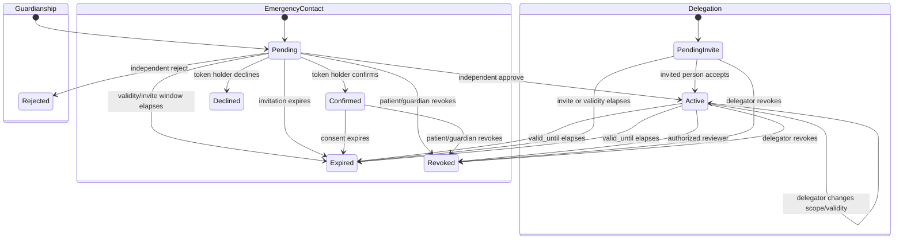

# Feature Specification: Family Care Relationships

## 0. Metadata and traceability

| Field                      | Value                                                                                                                                                                                                                                                                                                    |
| -------------------------- | -------------------------------------------------------------------------------------------------------------------------------------------------------------------------------------------------------------------------------------------------------------------------------------------------------- |
| SpecKit feature ID         | `004-family-care-relationships`                                                                                                                                                                                                                                                                          |
| Status                     | `SPEC_REVIEW` with production/formal `BLOCKED` overlay: `OPEN-TEAM-001`, `OPEN-LEGAL-001`, `OPEN-LEGAL-002`, `OPEN-LEGAL-006`, `OPEN-LEGAL-007`, `OPEN-UX-001`, `OPEN-UX-002`                                                                                                                            |
| Target FR IDs              | `FR-FAM-001`, `FR-FAM-002`, `FR-FAM-004`, `FR-FAM-005`, `FR-FAM-006`, `FR-FAM-007`, `FR-FAM-008`                                                                                                                                                                                                         |
| Target NFR IDs             | `NFR-SEC-001`, `NFR-SEC-002`, `NFR-SEC-004`, `NFR-SEC-005`, `NFR-SEC-006`, `NFR-SEC-007`, `NFR-PRIV-001`, `NFR-PRIV-002`, `NFR-PRIV-004`, `NFR-I18N-001`, `NFR-A11Y-001`, `NFR-PERF-002`, `NFR-DATA-001`, `NFR-DATA-002`, `NFR-API-001`, `NFR-API-002`, `NFR-OBS-001`, `NFR-QUALITY-001`, `NFR-PORT-001` |
| Scope eligibility          | `ACTIVE — SHIFAA PRD v2.1.0 §§4.2 and 5; Product Owner directive 2026-08-11`                                                                                                                                                                                                                             |
| Target app/service/package | `apps/patient`, `apps/admin`, `services/api`, `services/worker`, `packages/contracts`, `packages/api-client`, `packages/core`, `packages/auth`, `packages/i18n`, `packages/design-system`, `packages/observability`, `packages/test-kit`, `supabase/`, `infra/db/`, `infra/runbooks/`                    |
| Owner                      | Yousef Osama, Product Owner; engineering/reviewer assignment remains `OPEN-TEAM-001`                                                                                                                                                                                                                     |
| Reviewers                  | Product `Yousef Osama`; QA `[unassigned]`; Architecture `[unassigned]`; Security `[unassigned]`; DPO/Legal `[unassigned]`; Clinical `N/A`; Design/A11y `[unassigned]`                                                                                                                                    |
| Risk class                 | `sensitive-data` and child/dependent authority                                                                                                                                                                                                                                                           |
| Regulatory domains         | Egyptian PDPL; child/dependent authority evidence; production legal authorization remains open                                                                                                                                                                                                           |
| Clinical sign-off required | No — this slice controls authority and minimum notification disclosure but makes no clinical decision                                                                                                                                                                                                    |
| Dependencies               | merged `001-identity-onboarding`, `002-supabase-runtime-foundation`, and `003-facility-onboarding-rbac`; PRD/Master/Constitution v2.1.0; Architecture/API/Data/Trace v1.1.0; UI v0.9.1                                                                                                                   |
| Parent roadmap entry       | `SHIFAA-Implementation-Plan-MASTER.md §10 Phase 1 — Foundation`                                                                                                                                                                                                                                          |
| Created / updated          | `2026-08-11 / 2026-08-11`                                                                                                                                                                                                                                                                                |

This specification authorizes seeded-synthetic engineering only. It does not authorize real patient/family data, real guardianship documents, production auth/session values, Egyptian legal approval, or production release. `FR-FAM-003` is deliberately excluded: `OPEN-LEGAL-006` blocks its specification, and this feature creates no age/capacity trigger or automatic relationship transition.

## 1. Problem and scope

### Problem statement

A SHIFAA patient needs to manage care for themself, prove a guardianship relationship for a dependent, delegate only named actions to another adult, and maintain a separately consented Emergency Contact without impersonation or excessive disclosure. Every managed-patient mutation must make the active patient context unmistakable, and every relationship decision or use must be attributable, revocable, and independently denied when scope, state, purpose, assurance, or actor is wrong.

### Actors and authorization context

| Actor                                | Facility/patient relationship           | Permitted outcome                                                                                                           | Explicitly prohibited                                                                              |
| ------------------------------------ | --------------------------------------- | --------------------------------------------------------------------------------------------------------------------------- | -------------------------------------------------------------------------------------------------- |
| `PAT` self-managed patient/delegator | active `self` relationship              | list own relationships, create/update/revoke delegation, create/revoke Emergency Contact, explicitly choose patient context | impersonation, delegation of `consent.manage`, acting on another patient without current authority |
| Proposed guardian                    | pending evidence-backed relationship    | submit a seeded-synthetic evidence reference and see their case                                                             | activate themself, infer dependent login, use authority before review                              |
| Active guardian                      | approved current guardianship           | manage only the approved dependent and permissions, select context before mutation                                          | automatic age/capacity continuation, unrelated patient access, evidence/identity plaintext         |
| Invited adult delegate               | named pending delegation                | accept once and use only current listed permissions                                                                         | expand their own scope, receive implicit consent/payment authority, use revoked/expired grants     |
| `ADM-SUPPORT` reviewer at AAL2       | exact guardianship review purpose       | minimum worklist and approve/reject with reason and validity                                                                | self-review, arbitrary family/clinical access, inventing age/capacity transition                   |
| Emergency Contact token holder       | one opaque unexpired contact invitation | confirm or decline once                                                                                                     | clinical subscription, record access, receiving non-life-safety alerts                             |
| Core API/PostgreSQL/worker           | verified request/event context          | enforce policy twice, persist atomic audit/outbox/idempotency, enforce minimum alert template                               | trust client claims, use owner/service role for user traffic, deliver from non-SOS events          |

### In scope

- Preserve the exact closed relationship types `self`, `guardianship`, and `delegation`; keep Emergency Contact separate (`FR-FAM-001`).
- Create and review evidence-backed guardianship with validity, independent AAL2/purpose review, immutable attribution, and no implied dependent login (`FR-FAM-002`).
- Create, accept, update, use, revoke, and expire purpose/permission-scoped adult delegation; invalidate cached/current authorization at the next check (`FR-FAM-004`).
- Create, confirm, decline, revoke, and expire Emergency Contacts with terminal-state enforcement and new-row re-invitation (`FR-FAM-005`).
- Establish and test the minimum-disclosure Emergency Contact alert policy: only an active qualifying SOS may request delivery and only the canonical fields are allowed; this feature does not implement SOS initiation (`FR-FAM-006`).
- Add an explicit patient context switcher/banner and require context confirmation before every managed-patient mutation (`FR-FAM-007`).
- Audit relationship creation, review, scope/validity change, acceptance, revocation, expiry, and authorization use without logging tokens/evidence/clinical payloads (`FR-FAM-008`).
- Implement the 12 catalogued operations listed in §7 and no others.

### Non-goals

- `FR-FAM-003`, `transitionDependent`, any configured-age/capacity trigger, automatic access transfer, record transition, or adult-capacity determination.
- SOS incident creation, hospital matching, ER share, ambulance behavior, or actual Emergency Contact delivery. This slice supplies the consent/privacy policy and worker guard consumed by the later SOS feature.
- Family access to identity documents, unrestricted consent/DSR, payment authority, clinical notes, staff/facility functions, or generic “manage everything” permission.
- A new guardianship upload endpoint. Seeded-synthetic creation references a pre-provisioned released private evidence object; inline document upload and public URLs are forbidden. A future production evidence-intake contract requires canonical API-catalog change under `OPEN-TECH-002`.
- Real documents, real persons, legal conclusions, production credentials, production PHI, or closure of any canonical `OPEN-*` item.

### Dependencies and assumptions

| Item                                                                                         | Type (`verified fact`, `SHIFAA policy`, `assumption`, `OPEN`) | Evidence / open ID                                                         |
| -------------------------------------------------------------------------------------------- | ------------------------------------------------------------- | -------------------------------------------------------------------------- |
| Core-API-only Supabase runtime, forced RLS, private Storage, atomic idempotency/audit/outbox | verified fact                                                 | merged 001/002/003                                                         |
| Family types, permissions, states, actors, routes, and test-vector families                  | SHIFAA policy                                                 | PRD, API Catalog, Data/RLS, UI, Traceability v1.1.0/0.9.1                  |
| Guardianship synthetic evidence is pre-provisioned and scanner-released                      | implementation decision                                       | no canonical upload operation; production contract remains `OPEN-TECH-002` |
| Guardianship validity comes from an independent reviewer decision                            | SHIFAA policy                                                 | `reviewGuardianship`; `FR-FAM-002`                                         |
| Age/capacity transition law and matrix                                                       | OPEN                                                          | `OPEN-LEGAL-006`; excluded and blocked                                     |
| Retention durations/actions                                                                  | OPEN                                                          | `OPEN-LEGAL-002`                                                           |
| Screen compositions/tolerances                                                               | OPEN                                                          | `OPEN-UX-001/002`; no pixel-identical claim                                |

## 2. Egyptian regulatory and legal validation

- [x] Processing inventory covers guardianship evidence, delegated authority, relationship use, Emergency Contact consent, and minimum SOS notification fields before collection.
- [x] Child/dependent authority, contact data, and health-platform relationships are sensitive; fixtures are deliberately impossible seeded-synthetic data.
- [x] Emergency Contact confirmation is separate and affirmative; guardian/delegate authority is a reviewed/legal or explicit authorization basis, not bundled marketing consent.
- [x] Projections/events/logs exclude raw evidence, invite tokens, contact phone except masked owner view, identity values, diagnoses, medications, labs, admissions, and record links.
- [ ] Retention classes are assigned, but duration/action remains `OPEN-LEGAL-002`.
- [ ] Production country/processor/PDPC/DPO/primary-Arabic evidence remains `OPEN-LEGAL-001/007`.
- [x] Guardianship validity requires human review and documented evidence; no automated age/capacity legal conclusion exists.
- [x] `OPEN-LEGAL-006` blocks `FR-FAM-003` and every automatic transition; no feature prompt or fixture closes it.
- [x] Facility/professional/EDA/MoHP/MOSS/UHI/CBE, controlled-drug, payment, donation, and AI gates are not triggered by this slice.
- [x] Breach/DSR impact includes contact/evidence disclosure and relationship misuse; full DSR execution remains outside this feature.

**Blocking open items:** `OPEN-LEGAL-001`, `OPEN-LEGAL-002`, `OPEN-LEGAL-006`, `OPEN-LEGAL-007`, `OPEN-TEAM-001`, `OPEN-UX-001`, `OPEN-UX-002`. They block their canonical formal/production gates, not the approved seeded-synthetic implementation.

## 3. User Scenarios & Testing

### Journey J-01 — Review and use guardianship

1. Given a proposed guardian, a seeded dependent patient, and a pre-provisioned released synthetic evidence object.
2. When the guardian submits the relationship and an independent AAL2/purpose-bound Support Admin approves the current version with validity.
3. The relationship becomes active once, no dependent login is created, and the guardian explicitly selects the dependent before any mutation.
4. Audit/notification/next state: create/review/use are attributable; expiry/revocation removes access on the next check.

### Journey J-02 — Delegate exact adult actions

1. Given a self-managed adult patient selects a named synthetic delegate, permissions, purpose, and optional expiry.
2. When the invited person accepts the unexpired token and the delegator later changes or revokes scope using the current version.
3. The delegate receives only the closed listed actions; cached/stale scope never authorizes after change/revocation.
4. Audit/notification/next state: acceptance, every scope change, use, expiry, and revocation are immutable attributed events.

### Journey J-03 — Confirm a separate Emergency Contact

1. Given a patient or active guardian creates one contact with independently selected location precision.
2. When the token holder confirms or declines, or the owner revokes, or the invitation expires.
3. The terminal state is enforced; decline/revoke/expiry cannot resend or transition, and re-invitation creates a new row/token.
4. Audit/notification/next state: no clinical event sends the contact anything; only a future active qualifying SOS can request the allow-listed life-safety template.

### Alternate, failure, and degraded paths

| Case                        | Trigger                                                                 | UI/API result                                             | State/audit effect                                        | Recovery                                                   |
| --------------------------- | ----------------------------------------------------------------------- | --------------------------------------------------------- | --------------------------------------------------------- | ---------------------------------------------------------- |
| Permission denied           | cross-patient, wrong actor/role/purpose/AAL, missing permission/context | localized `403` without existence oracle                  | no domain effect; minimum denial audit                    | select an authorized context or obtain valid authority     |
| Offline/disconnected        | any relationship/contact/review mutation                                | persistent banner; write is not queued                    | no effect                                                 | reconnect and deliberately retry                           |
| Evidence unavailable        | missing, wrong owner/resource, quarantined/rejected synthetic object    | `409 evidence-not-released`                               | relationship not created/approved                         | use the committed released fixture; production stays gated |
| Duplicate/replay            | same principal/route/key/body                                           | stored result                                             | exactly one domain/audit/outbox effect                    | none                                                       |
| Changed replay              | same scope/key with changed canonical body                              | `409 idempotency-key-reused`                              | no second effect                                          | new key                                                    |
| Concurrent change           | stale `If-Match`                                                        | `409 version-conflict`                                    | no partial effect                                         | refresh and retry intentionally                            |
| Invalid transition          | terminal relationship/contact or already-consumed invite                | `409 relationship-terminal` or `state-transition-invalid` | no effect                                                 | create a new allowed record/action                         |
| Expired authority           | relationship validity or invite/contact expiry reached                  | localized expired state and `403/409`                     | current authorization denies; expiry audit/job idempotent | owner creates new relationship/contact where lawful        |
| Later SOS dependency absent | alert guard invoked without active qualifying incident                  | fail closed; no notification row/provider call            | denial/operational metric only                            | later SOS feature supplies qualifying incident             |

## 4. Requirements

### Functional Requirements

| Target PRD requirement | Required feature behavior                                                                            | Acceptance coverage |
| ---------------------- | ---------------------------------------------------------------------------------------------------- | ------------------- |
| `FR-FAM-001`           | closed care-relationship type set and separate Emergency Contact resource                            | `AC-01`, `AC-16`    |
| `FR-FAM-002`           | evidence-backed, independently reviewed, valid guardianship; no implied login                        | `AC-02..05`         |
| `FR-FAM-004`           | explicit closed delegation permissions/purpose/validity, acceptance, update, immediate revoke/expiry | `AC-06..10`         |
| `FR-FAM-005`           | five contact states, terminal enforcement, fresh-row re-invitation                                   | `AC-11..13`         |
| `FR-FAM-006`           | active-SOS-only allow-listed notification projection and zero delivery from all other events         | `AC-14..16`         |
| `FR-FAM-007`           | visible named patient context and explicit selection before mutation                                 | `AC-17`             |
| `FR-FAM-008`           | immutable attribution for create/review/change/revoke/expire/use                                     | `AC-18..20`         |

## 5. Domain model and invariants

### Entities and ownership

| Entity                                | Owning domain             | Authoritative source                                | Lifecycle owner                                                       |
| ------------------------------------- | ------------------------- | --------------------------------------------------- | --------------------------------------------------------------------- |
| Care relationship                     | family/identity           | PostgreSQL `identity.care_relationships`            | patient/proposed guardian, then reviewer/delegator                    |
| Relationship permission               | family/identity           | PostgreSQL `identity.care_relationship_permissions` | delegator or approved guardianship policy                             |
| Emergency Contact                     | family/identity           | PostgreSQL `identity.emergency_contacts`            | patient/guardian and token holder                                     |
| Private guardianship evidence         | identity evidence Storage | private object metadata                             | pre-provisioned synthetic scanner; reviewer consumes minimum evidence |
| Relationship use event                | audit                     | append-only `audit.events`                          | Core API authorization/use case                                       |
| Idempotency/outbox notification guard | platform                  | PostgreSQL                                          | Core API/worker                                                       |

### State machines

All other transitions deny. `declined`, `revoked`, and `expired` contacts are terminal. Re-invitation creates a new row. There is no `FR-FAM-003` state, trigger, event, or transition.

### Invariants and concurrency

- Exactly the canonical relationship types are accepted; Emergency Contact has no care permission row.
- Active self remains unique and immutable by this feature.
- Guardianship activation requires released evidence, reviewer AAL2/purpose, current version, validity, and reviewer different from proposed guardian/subject.
- Delegation permissions are a subset of `profile.view`, `appointment.manage`, `record.view`, `medication.manage`, `sos.activate`, `sos.share`, `complaint.create`, `symptom_routing.use`; `consent.manage` is never delegable.
- `sos.activate` and `sos.share` are independent and never implied by `record.view`.
- Authorization reads current relationship/permission state from PostgreSQL on every check; versioned cache entries are invalidated by update/revoke/expiry events.
- Every mutation atomically commits idempotency result, domain change, audit, and outbox. Tokens are prepared outside the transaction and only hashes are stored.
- Expiry processing is idempotent and cannot reopen or rewrite terminal evidence.

## 6. Exact data and RLS contract

### Tables and fields

| Table.column group                       | Type / null/default                                                                                    | Key/check/index                                                                          | Classification       | Encryption                                                    | Retention class                                                  |
| ---------------------------------------- | ------------------------------------------------------------------------------------------------------ | ---------------------------------------------------------------------------------------- | -------------------- | ------------------------------------------------------------- | ---------------------------------------------------------------- |
| `identity.care_relationships`            | canonical IDs/type/status/validity/evidence/reviewer/token/acceptance/timestamps/version               | type/status checks; active subject/actor/type and invite-expiry indexes; one active self | child/care authority | token hash only; evidence private                             | `CONSENT_EVIDENCE`                                               |
| `identity.care_relationship_permissions` | relationship UUID + closed permission code + created/revoked attribution                               | one current permission row; closed-code check; relationship/current-state indexes        | authority scope      | N/A                                                           | `CONSENT_EVIDENCE`                                               |
| `identity.emergency_contacts`            | patient/name/phone/location precision/status/token hash/expiry/responded/created-by/timestamps/version | status/precision checks; patient/status and token-hash indexes                           | contact/safety       | token HMAC; phone protected at rest per platform field policy | `CONSENT_EVIDENCE` / `SOS_LOCATION` for delivered precision only |
| `platform.idempotency_records`           | existing canonical record                                                                              | existing unique principal/method/route/key                                               | technical security   | response protected as needed                                  | `TRANSIENT_TECHNICAL`                                            |
| `platform.outbox_events`                 | minimum IDs/status/event version                                                                       | aggregate ordering/readiness indexes                                                     | operational          | no evidence/token/contact/PHI                                 | `TRANSIENT_TECHNICAL`                                            |
| `audit.events`                           | existing actor/patient/purpose/action/resource/outcome/hash contract                                   | append-only/hash chain/time partition                                                    | security audit       | prohibited payload omitted                                    | `SECURITY_AUDIT`                                                 |

### Migration

- Forward order: processing inventory/private synthetic evidence metadata → relationship attribution/permission/contact columns and checks → indexes → transition/security-definer helpers → least grants and forced RLS → admin action availability → deterministic synthetic fixtures.
- Existing-data validation/backfill: preserve 001 self rows; reject unexpected types/statuses; backfill only non-sensitive attribution that is provable from existing rows; never invent guardian evidence or contact consent.
- Roll-forward is canonical after shared use. Only the named local/CI seeded-synthetic database may reset; relationship/audit/consent evidence is never deleted as rollback.
- Production backup/retention remains blocked by the canonical legal/operations gates.

### RLS/action matrix

| Actor/context                       | SELECT                                                    | INSERT                               | UPDATE                                                            | DELETE/state action                           | Negative test ID           |
| ----------------------------------- | --------------------------------------------------------- | ------------------------------------ | ----------------------------------------------------------------- | --------------------------------------------- | -------------------------- |
| self patient                        | own and managed-context list projection                   | own delegation/contact               | own delegation/contact guarded actions                            | no delete; revoke functions only              | `TV-RLS-FAM-SELF`          |
| active guardian                     | own active relationship and approved dependent projection | contact for subject if policy allows | subject-scoped permitted actions                                  | no delete; authorized revoke where catalogued | `TV-RLS-FAM-GUARDIAN`      |
| active delegate                     | own delegation and permission projection                  | denied                               | only accept invite through guarded function; no self-scope change | denied                                        | `TV-RLS-FAM-DELEGATE`      |
| eligible Support Admin AAL2/purpose | minimum pending guardianship worklist                     | denied                               | guarded review/revoke only                                        | denied                                        | `TV-RLS-FAM-REVIEWER`      |
| Emergency Contact token holder      | no authenticated row read                                 | denied                               | token response through guarded function only                      | denied                                        | `TV-RLS-FAM-CONTACT-TOKEN` |
| other/missing/cross-patient         | none                                                      | denied                               | denied                                                            | denied                                        | `TV-RLS-FAM-DEFAULT-DENY`  |

All feature tables use `ENABLE` and `FORCE ROW LEVEL SECURITY`. Online queries execute as non-owner, non-`BYPASSRLS` `shifaa_api`. Fixed-search-path boolean helpers use transaction-local verified actor/patient/purpose/AAL and current relationship rows, not JWT/app metadata.

## 7. API endpoint specifications

The machine-readable feature contract contains exactly these catalogued operations. All authenticated mutations require `Idempotency-Key`; catalogued versioned mutations require `If-Match`. Responses use RFC 9457, `X-Request-Id`, selected language, and `private, no-store`.

| Operation IDs                                                                                          | Method/path family         | Actors/controls                                                                                 | Success/primary problems                                                                              | Audit/events                                                                      |
| ------------------------------------------------------------------------------------------------------ | -------------------------- | ----------------------------------------------------------------------------------------------- | ----------------------------------------------------------------------------------------------------- | --------------------------------------------------------------------------------- |
| `listRelationships`, `createGuardianship`, `listGuardianshipCases`, `reviewGuardianship`               | exact API Catalog §2 paths | patient/proposed guardian or Support Admin AAL2/purpose; current version on review              | scoped page, pending, active/rejected; evidence, self-review, version, permission problems            | `relationship.guardianship.*`; IDs/status/validity only                           |
| `createDelegation`, `acceptDelegation`, `updateDelegation`, `revokeRelationship`                       | exact API Catalog §2 paths | delegator/invited person; closed permissions/purpose/validity; current version on update/revoke | pending invite/active/updated/revoked; token, terminal, scope/version problems                        | `relationship.delegation.*`; no token/contact/clinical field                      |
| `createEmergencyContact`, `listEmergencyContacts`, `respondEmergencyContact`, `revokeEmergencyContact` | exact API Catalog §2 paths | patient/active guardian or one-time token holder; current version on revoke                     | masked pending/confirmed/declined/revoked/expired; one-time token returned only by protected creation | `emergency_contact.*`; token never persists in plaintext or appears in a path/log |

`transitionDependent` is absent from the feature OpenAPI, contracts, routes, clients, permissions, UI, tasks, migrations, and tests. `revokeRelationship` handles only guardianship/delegation revocation authorized by `FR-FAM-002`, `FR-FAM-004`, and `FR-FAM-008`; it performs no age/capacity transition.

Collections use opaque cursor (default 25/max 100). Seeded limits are 30 relationship/contact mutations per actor per minute, 60 review reads per minute, and 120 subject reads per minute. Idempotency uses the canonical authenticated actor or token-hash principal; exact TTL remains environment technical configuration, not a statutory retention claim.

## 8. UI/UX and edge-state matrix

| App/route/viewport                          | Required states                                                                                                 | Arabic/English content                                      | Controls/focus                                                      | Permission/offline behavior                              | Design baseline ID |
| ------------------------------------------- | --------------------------------------------------------------------------------------------------------------- | ----------------------------------------------------------- | ------------------------------------------------------------------- | -------------------------------------------------------- | ------------------ |
| patient `/care-switcher` compact/medium/web | self, guardian, delegate contexts; loading/empty/error                                                          | full patient name + relationship label + switch action      | selected context announced; focus returns to heading                | mutation disabled until explicit context selection       | `OPEN-UX-001`      |
| patient `/relationships`                    | guardianship/delegation pending/active/rejected/revoked/expired, invite, conflict, permission, offline, success | Arabic-authored exact scope/validity/consequence            | persistent labels, permission checklist, stable revoke confirmation | no offline queue; revoked/expired actions explain denial | `OPEN-UX-001`      |
| patient `/emergency-contacts`               | empty/pending/confirmed/declined/revoked/expired, token error, conflict, offline, success                       | preview exact minimum future SOS message and forbidden data | precision is separate control; terminal states textual              | no resend from terminal row; new record action explicit  | `OPEN-UX-001`      |
| admin `/relationships` wide/medium/compact  | AAL2/purpose, empty/loading, pending, evidence blocked, approve/reject, conflict, success                       | minimum projection, validity/reason                         | zero decorative motion; keyboard table/stacked row; reason required | self/wrong role/purpose denied without details           | `OPEN-UX-001`      |

Arabic uses `dir=rtl` and logical properties; UUIDs, masked phones, codes, timestamps, and tokens remain isolated LTR. Required checks cover 360×800, 768×1024, and 1440×900; Arabic/English; keyboard-only; screen-reader announcements; 200% text/400% web zoom; 44×44 targets; high contrast; reduced motion; loading/empty/offline/permission/conflict/error/revoked/expired/success. Authority and revocation decisions use zero decorative motion.

## 9. Notifications and asynchronous events

| Source event                              | Recipient policy                                                  | Template/channel                                                            | Allowed data fields                                                                                                   | Dedup key                         | Retry/DLQ                                       | Acknowledgement/escalation     |
| ----------------------------------------- | ----------------------------------------------------------------- | --------------------------------------------------------------------------- | --------------------------------------------------------------------------------------------------------------------- | --------------------------------- | ----------------------------------------------- | ------------------------------ |
| `relationship.guardianship.changed`       | proposed/active guardian and subject patient channel as permitted | bilingual in-app                                                            | relationship ID/type/status/validity/next action                                                                      | source+recipient+template         | bounded retry/DLQ                               | none                           |
| `relationship.delegation.invited/changed` | named delegate/delegator                                          | bilingual in-app; token delivered only through protected invitation channel | relationship ID/status/permission codes/validity                                                                      | source+recipient+template         | bounded retry/DLQ                               | acceptance recorded            |
| `emergency_contact.invited/changed`       | named contact/patient owner                                       | bilingual invite/in-app                                                     | contact ID/status/locale/expiry; invitation delivery receives one-time token separately                               | source+recipient+template         | bounded retry/DLQ                               | confirm/decline token response |
| `sos.emergency_contact.requested`         | confirmed contact for the same active qualifying incident only    | approved bilingual life-safety template                                     | patient display name, `needs urgent help`, separately consented coarse/exact location, incident time, callback number | incident+contact+template+channel | bounded retry/DLQ; no duplicate visible message | provider receipt only          |

Emergency Contacts receive **no** relationship, guardian, delegate, lab, medication, interaction, admission, appointment, record, or routine notification. The worker rejects the SOS template unless incident/contact/current consent predicates pass and rejects every field outside the allow-list.

## 10. Security, privacy, and abuse cases

| Threat/misuse                                    | Control                                                                                    | Verification                                                 |
| ------------------------------------------------ | ------------------------------------------------------------------------------------------ | ------------------------------------------------------------ |
| Broken cross-patient/relationship authorization  | server current-state policy plus forced RLS and explicit context                           | cross-family/patient/type/permission matrix                  |
| Forged guardian/delegate identity or stale cache | released evidence + independent review; DB current-state lookup/versioned invalidation     | forged metadata, revoke/expiry-next-check tests              |
| Invite/token theft/replay                        | high-entropy token, HMAC-only storage, named actor/contact, expiry, terminal replay        | wrong-person/token/expiry/concurrent consume tests           |
| Excessive delegation                             | closed permissions, explicit purpose, `consent.manage` denial, independent SOS permissions | property and API/RLS tests                                   |
| Emergency disclosure expansion                   | active-SOS/current-confirmed-contact predicate plus closed template schema                 | non-SOS zero-delivery and forbidden-field tests              |
| Replay/race/duplicate                            | atomic idempotency, canonical hash, versions/locks, unique active constraints              | same/different/concurrent tests                              |
| Insider/excessive reviewer access                | Support Admin role, AAL2, purpose, minimum fields, immutable access audit                  | role/AAL/purpose/projection negatives                        |
| PHI/secret in logs/analytics/events              | recursive redaction and closed allow-lists                                                 | sentinel scanner with token/evidence/contact/clinical values |

## 11. Success Criteria

### Measurable Outcomes

| ID       | Outcome                                                                                                             | Measurement method            | Required threshold                                               |
| -------- | ------------------------------------------------------------------------------------------------------------------- | ----------------------------- | ---------------------------------------------------------------- |
| `SC-001` | A synthetic guardianship can be submitted, independently decided, selected, and revoked/expired without a new login | API/DB/live E2E               | 100% deterministic journey; zero implicit login                  |
| `SC-002` | Adult delegation exposes only current named actions                                                                 | policy/API/RLS matrix         | 100% allowed cases succeed; 100% excess/cross-patient cases deny |
| `SC-003` | Emergency Contact terminal consent and minimum disclosure are enforced                                              | state/worker/API suite        | zero terminal resend/transition; zero forbidden/non-SOS message  |
| `SC-004` | Every relationship lifecycle/use is attributable and replay-safe                                                    | audit/idempotency suite       | one effect per mutation/use; no missing actor/patient/purpose    |
| `SC-005` | Managed-patient journeys are bilingual and accessible                                                               | live/automated matrix         | Arabic/English parity, WCAG 2.2 AA, no clipped core action       |
| `SC-006` | Core Family Care operations remain within the API target                                                            | 100-session synthetic profile | read p95 ≤400ms; mutation p95 ≤800ms                             |
| `SC-007` | No token/evidence/contact/clinical sentinel reaches prohibited telemetry/event fields                               | sentinel scan                 | zero matches                                                     |

### Acceptance Criteria and Test Vectors

- `AC-01`: only `self|guardianship|delegation` rows are accepted; Emergency Contact cannot receive relationship permissions.
- `AC-02`: guardianship creation requires a released, correctly bound synthetic evidence object.
- `AC-03`: only an independent Support Admin at AAL2 with exact purpose sees the minimum case and decides the current version.
- `AC-04`: guardianship approval records validity and creates no dependent auth subject/session.
- `AC-05`: rejected/revoked/expired guardianship denies use and cannot enter an automatic transition.
- `AC-06`: delegation create accepts only the closed permission set and explicit purpose/validity.
- `AC-07`: invited person alone accepts an unexpired token once; replay is terminal/idempotent.
- `AC-08`: `record.view` never implies `sos.activate`, `sos.share`, `consent.manage`, payment, or another permission.
- `AC-09`: scope/validity update changes authorization on the next check and stale cache/JWT metadata cannot preserve access.
- `AC-10`: delegator revocation immediately denies current authorization and records immutable attribution.
- `AC-11`: Emergency Contact follows pending→confirmed/declined/revoked/expired allowed matrix.
- `AC-12`: declined/revoked/expired cannot resend or transition; new invitation has a new row/token.
- `AC-13`: wrong/expired/contact token and concurrent responses produce one terminal outcome without oracle.
- `AC-14`: lab, interaction, medication, admission, appointment, relationship, and routine events produce zero contact notifications.
- `AC-15`: only active qualifying SOS + confirmed current contact can produce one allowed template.
- `AC-16`: alert payload rejects diagnosis, medication, lab, admission, record link, unconsented location, and any unknown field.
- `AC-17`: every managed-patient mutation requires explicit selected context and visibly names patient plus relationship in Arabic/English.
- `AC-18`: every create/review/change/accept/revoke/expire/use audit contains authenticated actor, patient, purpose, action, outcome, request ID, and no secret payload.
- `AC-19`: direct `shifaa_api` SQL denies cross-family/cross-patient/wrong-role/wrong-purpose/AAL1 and direct terminal updates under forced RLS.
- `AC-20`: identical replay returns stored result; changed body returns `409`; concurrent requests leave one domain/audit/outbox result.
- `AC-21`: offline/dependency failure creates no queued or partial mutation; UI preserves safe retry state.
- `AC-22`: Arabic RTL/English LTR desktop/compact, keyboard, screen-reader, 200% text, high contrast, and reduced motion pass.
- `AC-23`: 100-session read/mutation profile meets targets and scans contain no prohibited sentinel.
- `AC-24`: migration/RLS/contract/architecture/dependency/secret/SAST/SBOM/full `pnpm verify` gates pass.

## 12. Observability, rollout, rollback, and incidents

- SLO/SLI and capacity assumption: 100 concurrent seeded-synthetic family sessions, 5,000 relationships, 20,000 permission rows, 5,000 contacts; read p95 ≤400ms, mutation p95 ≤800ms.
- Metrics/traces/logs and redaction: operation/status/duration/type/state/permission-count band/denial category/idempotency result/outbox lag only; no person/contact/evidence/token/purpose detail or clinical payload.
- Dashboard/alerts and owner: pending-review age, expiring relationships, terminal-transition attempts, forbidden contact-event attempts, dead letters; owner remains `OPEN-TEAM-001`.
- Feature flag and cohort: `FAMILY_CARE_ENABLED=false` and `SYNTHETIC_GUARDIANSHIP_EVIDENCE_ENABLED=false` outside local/test.
- Data migration/rollback: expand-only; route/worker kill switch first; forward corrective migration after shared use; named synthetic database reset only.
- Kill switch/degraded behavior: review, relationship use, and contact delivery fail closed when DB/evidence/audit/outbox/current-policy dependencies are unavailable.
- Incident/runbook link: `infra/runbooks/family-care-relationships.md`.

## 13. Evidence and approvals

| Gate                  | Reviewer(s)                           | Artifact/version/digest      | Decision/date                                       | Blocking findings                             |
| --------------------- | ------------------------------------- | ---------------------------- | --------------------------------------------------- | --------------------------------------------- |
| Product/QA            | Product `Yousef Osama`; QA unassigned | directive + this spec        | implementation directed 2026-08-11 / formal pending | `OPEN-TEAM-001`                               |
| Legal/DPO             | unassigned                            | compliance checklist         | production blocked                                  | `OPEN-LEGAL-001/002/006/007`, `OPEN-TEAM-001` |
| Clinical              | N/A                                   | no clinical decision/content | N/A                                                 | none                                          |
| Architecture/Security | unassigned                            | plan/data/threat/contracts   | pending                                             | `OPEN-TEAM-001`                               |
| Design/Accessibility  | unassigned                            | UI contract/live evidence    | formal visual gate blocked                          | `OPEN-UX-001/002`, `OPEN-TEAM-001`            |
| Release               | unassigned                            | final evidence manifest      | not requested                                       | all applicable canonical blockers             |

## 14. Open items and change log

| Open ID                  | Owner                       | Next action/evidence                                                                          | Blocks gate                               |
| ------------------------ | --------------------------- | --------------------------------------------------------------------------------------------- | ----------------------------------------- |
| `OPEN-TEAM-001`          | Product Owner               | assign named lifecycle reviewers and incident owner                                           | formal approvals/release                  |
| `OPEN-LEGAL-001/002/007` | Legal + DPO                 | approve production processing, retention, and controlling Arabic mapping                      | production real data/evidence             |
| `OPEN-LEGAL-006`         | Legal + DPO + Product Owner | approve age/capacity transition law/state/event matrix                                        | `FR-FAM-003` specification; excluded here |
| `OPEN-UX-001/002`        | Product + Design + QA       | approve compositions, baselines, renderer/tolerance                                           | pixel-identical/automated visual claim    |
| `OPEN-TECH-002`          | API + Data + QA             | approve full active payload schemas, including future production guardianship evidence intake | production/codegen completeness claim     |

| Date       | Version | Change and affected FR/NFR/contracts                                                                                                                                                                              |
| ---------- | ------- | ----------------------------------------------------------------------------------------------------------------------------------------------------------------------------------------------------------------- |
| 2026-08-11 | `0.1.0` | Initial active 004 specification; explicitly excludes `FR-FAM-003`/`transitionDependent`, defines 12 Family Care operations, forced-RLS scope, context confirmation, and active-SOS-only Emergency Contact policy |
