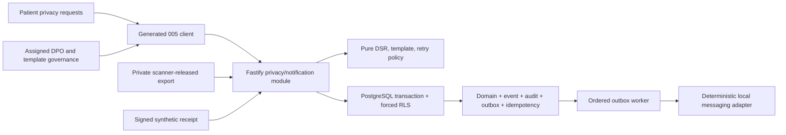

# Implementation Plan: Privacy DSR and Notifications

> **Feature:** `005-privacy-dsr-notifications` · **Spec:** `0.1.0 / SPEC_APPROVED engineering scope`
> **Target:** `FR-AUTH-007`, `FR-AUTH-008`, `FR-ADMIN-002`, `FR-ADMIN-004`, `FR-NOTIF-001`, `FR-NOTIF-002` plus applicable NFRs · **Updated:** `2026-08-13`

Applicable NFRs: `NFR-PRIV-001`, `NFR-PRIV-002`, `NFR-PRIV-003`, `NFR-PRIV-004`, `NFR-SEC-001`, `NFR-SEC-003`, `NFR-SEC-004`, `NFR-SEC-005`, `NFR-SEC-006`, `NFR-I18N-001`, `NFR-A11Y-001`, `NFR-OBS-001`, `NFR-PERF-001`, `NFR-PERF-002`, `NFR-API-001`, `NFR-API-002`, `NFR-DATA-001`, `NFR-QUALITY-001`, `NFR-PORT-001`.

## 1. Approved inputs

| Input               | Version/digest                                                           | Approval/gate                                                  |
| ------------------- | ------------------------------------------------------------------------ | -------------------------------------------------------------- |
| `spec.md`           | `0.1.0`                                                                  | checklist passes; formal release gates remain open             |
| Active scope        | PRD v2.1.0 active rows listed above                                      | PASS 2026-08-13                                                |
| Constitution        | v2.1.0                                                                   | checked below                                                  |
| Canonical contracts | PRD/Master 2.1.0; Architecture/API/Trace 1.1.0; Data/RLS 1.2.0; UI 0.9.1 | normative repository baseline                                  |
| Runtime baseline    | `origin/main` `6bc7a6e5...`; 003/004 merged ancestors                    | frozen install + clean synthetic `pnpm verify` PASS 2026-08-13 |
| Clarification       | `clarification-log.md`                                                   | no engineering ambiguity                                       |
| Research            | `research.md`                                                            | official Supabase docs checked; repository decisions prevail   |
| Formal evidence     | canonical open register                                                  | production/release disabled under named OPEN items             |

## 2. Constitution check

| Article                                | Result and evidence                                                                                                  |
| -------------------------------------- | -------------------------------------------------------------------------------------------------------------------- |
| I Least privilege/default deny         | PASS — subject/current guardian and assigned DPO policies are closed; forced RLS denies every other actor            |
| II Internal typed identity             | PASS — UUID person/request/template/event identifiers; tokens/contacts never authoritative or stored raw in payloads |
| III Canonical care relationships       | PASS — only approved guardianship with `consent.manage`; delegation and Emergency Contact excluded                   |
| IV Facility membership/attribution     | PASS — facility membership grants no DSR access; admin/DPO actions are person-attributed                             |
| V Patient-centric purpose-limited data | PASS — subject ownership, active inventory, declared purpose, assignment, and minimum projection                     |
| VI Dual clinical governance            | N/A — no clinical content or care decision                                                                           |
| VII Regulated evidence gate            | PASS — released private export/evidence and required decision reasons; production approvals remain blocked           |
| VIII Separation of duties              | PASS — template author cannot publish; replay/operator and DPO actions are independently authorized                  |
| IX MFA/purpose                         | PASS — DPO/publisher/operator require AAL2 and explicit purpose                                                      |
| X Portable domain logic                | PASS — pure DSR/template/retry policies behind repository/storage/messaging/clock/signature ports                    |
| XI One app per surface                 | PASS — patient Expo and admin Next.js use shared packages/generated client only                                      |
| XII Arabic-first consent/privacy       | PASS — existing 001 privacy plus Arabic-first DSR/templates with English parity                                      |
| XIII Accessibility/localization        | PASS at engineering level; formal baseline remains `OPEN-UX-001/002`                                                 |
| XIV Safety UI clarity                  | PASS — identity/export/erasure consequences and disabled automation are explicit, stable, and non-animated           |
| XV Human authority over AI             | N/A — no AI                                                                                                          |

**Plan state:** `PLAN_APPROVED` for seeded-synthetic engineering. Production PHI, statutory retention/deletion automation, production SMS, and formal release remain blocked.

## 3. Technical context

- Targets: `apps/patient`, `apps/admin`, `services/api`, `services/worker`, `packages/core`, `packages/contracts`, `packages/api-client`, `packages/auth`, `packages/i18n`, `packages/design-system`, `packages/observability`, `packages/test-kit`, `supabase`, `infra/db`, `infra/runbooks`, `tests`, `tools`, and synchronized canonical docs.
- Toolchain: Node `24.18.0`, pnpm `11.13.0`, TypeScript `7.0.2`, Fastify `5.11.3`, Expo `57.0.12`, Next.js `16.3.0`, Supabase CLI `2.113.0`, PostgreSQL 17, locked workspace dependencies.
- Capacity: 10,000 DSR rows, 50,000 events, 1,000 template releases, 100,000 notification/attempt rows, 100 concurrent synthetic sessions; read p95 ≤400ms and mutation p95 ≤800ms excluding adapter latency.
- Reuse: 001 consent/inventory, 002 Auth/Postgres/private Storage, 003 AAL2/purpose/admin permission, 004 guardian `consent.manage`, platform idempotency/outbox/audit, Fastify routes/modules, generated contracts/client, locale contexts, admin governance layout, redaction scanners.
- Exact operations: `createDsr`, `listMyDsrs`, `getDsr`, `downloadDsrExport`, `listAdminDsrs`, `decideDsr`, `fulfilDsr`, `listNotificationTemplates`, `createNotificationTemplateRelease`, `publishNotificationTemplateRelease`, `smsProviderCallback`, `replayDeadLetter`.
- External seams: `PrivacyRepository`, `PrivateExportStore`, `MessagingAdapter`, `SignatureVerifier`, `Clock`, `ProcessingInventory`, `CurrentAuthorization`. All local adapters are deterministic; production messaging is disabled.

## 4. Proposed design and dependency flow

The API authenticates and resolves current subject/relationship/designation/assignment/AAL/purpose, sets transaction-local context, and performs all online SQL through `shifaa_api`. Storage download is mediated by a one-time API capability; the user never receives a reusable raw Storage URL. Worker delivery begins only after the atomic source transaction commits.

## 5. Work products

### Data and migration

- Expand `consent.data_subject_requests/events`; add assignment, export capability, template release, notification, delivery-attempt, callback-replay, and feature-flag/seed rows detailed in `data-model.md`.
- Add closed checks, versions, immutable guards, transition functions, active-assignment uniqueness, query/dedup/order indexes, and HMAC-only capability/receipt/nonce persistence.
- Force RLS and least grants. Fixed-search-path helpers recheck current subject/legal guardian or assigned DPO context. Worker/operator access is function-scoped; users never query outbox/delivery internals.
- Add private `dsr-exports` bucket/registry only when Storage schema exists, with no public policy and no direct browser list/read. Scanner release metadata is required.
- Expand-only deploy. Durable history prevents down migration after use; disable features and roll forward. No automated deletion/pseudonymization SQL.

### API and generated clients

- Define the 12 exact operations in feature OpenAPI, TypeScript source contracts, Fastify routes, integration tests, and generated-style client. Update the canonical generated operation registry without manual drift.
- Mutations use idempotency; DPO/template/replay transitions also use `If-Match`. Collection cursors default 25/max 100. RFC 9457 problem codes are stable and non-oracular.
- Role-specific projections exclude evidence bodies, contact values, export paths/tokens, message bodies, and provider secrets.
- Export issue/consume uses the same catalogued operation in two modes: issue returns a patient-app route containing the opaque capability; that app route invokes consume mode on the same POST and receives the binary once. Both are private/no-store and audited without capability logging; no extra API operation is registered.

### UI, localization, and accessibility

- Preserve `/privacy` and `/privacy/consents`; add patient `/privacy/requests`, admin `/privacy-requests`, and `/notification-templates`.
- Use generated API calls only, no persistent sensitive cache, no offline mutation queue, authoritative reconnect, visible last-updated/stale/conflict state.
- Implement all contracted loading/empty/permission/offline/identity-required/decision/export-ready/expired/failure/success states.
- Arabic-first catalog with English parity, RTL logical layout/bidi isolation, keyboard/focus/error summary/live announcements, 44px targets, 200%/400% reflow, high contrast, reduced motion, compact/tablet/desktop layouts.

### Events, notifications, and vendors

- Source events and allowed fields are the closed sets in `spec.md`; Emergency Contacts are categorically excluded.
- Template render validates published/effective release, locale, recipient type, exact field names/types, placeholder equality, digest, and active process code before creating a notification.
- Worker uses canonical leases, ordering, receipts, delays, dead-letter, alerts, and immutable replay. A unique delivery key plus provider idempotency prevents duplicate visible messages.
- Synthetic callback HMAC/timestamp/nonce/receipt validation precedes persistence. Production adapter configuration fails closed under `OPEN-VENDOR-002`.

### Security, privacy, and abuse controls

- Closed actor/action matrix, current-state RLS, AAL/purpose/assignment, anti-enumeration, exact schemas, canonical hashing, optimistic versions, separation of duties, private Storage, and one-time export capability. Preserve the 001/002 short-lived access, secure web/mobile refresh storage, Origin/CSRF, rotation/reuse-detection, and AAL2 step-up contract without copying tokens into feature state.
- Prohibit raw DSR scope/text, export contents/paths/tokens, identity/contact values, template bodies/rendered bodies, callback body/signature/nonce, and secrets from telemetry/outbox/provider receipts.
- Gate collection/export/render/callback receipt processing on active inventory rows.
- Erasure automation and production provider stay disabled; breach evidence is explicitly synthetic.

## 6. Test and evidence plan

| Requirement/test family        | Level and vector                                                                        | Evidence                                 |
| ------------------------------ | --------------------------------------------------------------------------------------- | ---------------------------------------- |
| DSR type/state policy          | unit/property; every type/transition/missing reason/evidence                            | core tests                               |
| Atomic API/idempotency/version | integration/Postgres; same/different/concurrent/stale                                   | API and adapter tests                    |
| Authorization/RLS              | forced-RLS matrix; self/guardian/delegate/facility/admin/DPO guard permutations         | SQL tests                                |
| Export                         | integration/Storage; private/released/once/expiry/replay/no-store/foreign               | storage/API tests                        |
| Inventory                      | integration; missing/inactive at intake/export/render/callback                          | API/worker tests                         |
| Templates                      | contract/domain/integration; locales/schema/digest/self-publish/stale                   | package/API tests                        |
| Worker/provider                | unit/Postgres; ordering/lease/retry/jitter/DLQ/dedup/callback/replay                    | worker tests                             |
| Redaction/security             | sentinel scans and abuse tests                                                          | observability/security evidence          |
| UI/I18N/A11y                   | component/E2E/live; all states/viewports/locales/input modes                            | tests and `evidence/live-qa.md`          |
| Performance                    | deterministic dataset/topology                                                          | `evidence/performance.json`              |
| Session/security regression    | existing 001/002 storage, Origin/CSRF, refresh rotation/reuse, AAL2, no-token telemetry | auth/API/app tests and security evidence |
| Breach tabletop                | deterministic working-day/timestamp vectors                                             | `evidence/breach-tabletop.json`          |
| Full regression                | clean synthetic DB plus `pnpm verify`                                                   | `evidence/verification.md`               |

## 7. Delivery sequence

1. Freeze feature OpenAPI, deterministic fixtures, and translation keys/tests.
2. Add expand migration, Storage policy, schema/state/forced-RLS tests.
3. Add pure DSR/template/notification policy and tests.
4. Add API repository/use cases with atomic idempotency/audit/outbox and contract tests.
5. Regenerate/synchronize contract registry and typed client; prove zero drift.
6. Add worker adapter, retry/DLQ/dedup/callback/replay and failure tests.
7. Add patient/admin surfaces and every bilingual/accessibility/degraded state.
8. Run integrated acceptance, performance, security, redaction, migration, and breach tabletop.
9. Update runbooks, canonical docs, trace matrix, evidence, and checkboxes only from proof.
10. Converge, final analyze/guards, clean synthetic full verify, feature push/PR/checks.

Contract/fixture/i18n work can be parallel only when files do not overlap. Migration precedes repository integration; contract source precedes client generation; worker delivery follows atomic outbox; live UI follows running API/worker.

## 8. Rollout, rollback, and operations

- Flags: `privacy_dsr_enabled`, `privacy_dpo_enabled`, `notification_governance_enabled`, `local_notification_delivery_enabled`, `synthetic_provider_callback_enabled`, `dead_letter_replay_enabled`; all production provider/deletion automation flags absent or false.
- Deploy: expand → validate schema/RLS/storage → seed synthetic inventory/templates → deploy API/worker disabled → enable local cohort → UI.
- Rollback: disable entry points/claims/callback/replay, preserve events/attempts/evidence, and roll forward; never delete durable history.
- Metrics/alerts: API latency/error, authorization denials, DSR overdue-by-config, export issue/use/expiry, outbox lag, retries, dead letters, callback rejects, dedup suppression. Dimensions remain low-cardinality/pseudonymous.
- Runbooks: `infra/runbooks/privacy-dsr.md`, `infra/runbooks/notification-delivery.md`, `infra/runbooks/privacy-breach-tabletop.md`.
- Named owners/approvers remain `OPEN-TEAM-001`; local engineering evidence does not satisfy production incident response or release approval.

## 9. Plan approval

| Gate                   | Reviewer      | Decision/date                                     | Evidence/blocker                             |
| ---------------------- | ------------- | ------------------------------------------------- | -------------------------------------------- |
| Architecture/data      | name pending  | engineering plan complete / 2026-08-13            | exact artifacts; formal name `OPEN-TEAM-001` |
| Security/privacy/legal | names pending | synthetic implementation allowed; release blocked | `OPEN-LEGAL-001/002/007`, `OPEN-TEAM-001`    |
| Clinical               | N/A           | no clinical behavior                              | none                                         |
| Design/accessibility   | names pending | implement UI Contract; formal visual gate blocked | `OPEN-UX-001/002`, `OPEN-TEAM-001`           |
| QA/Product             | names pending | deterministic plan complete; formal approval open | `OPEN-TEAM-001`                              |
