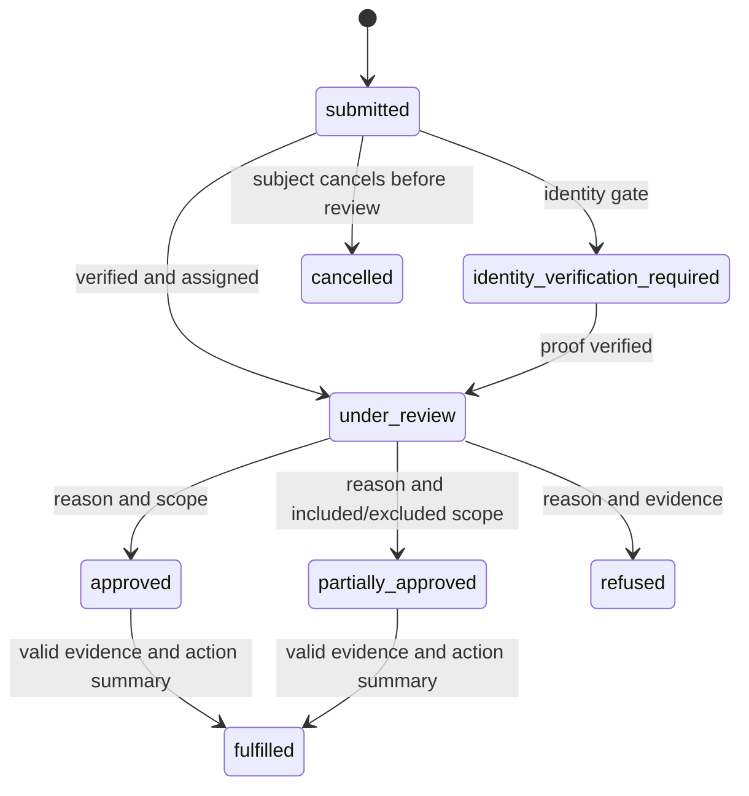
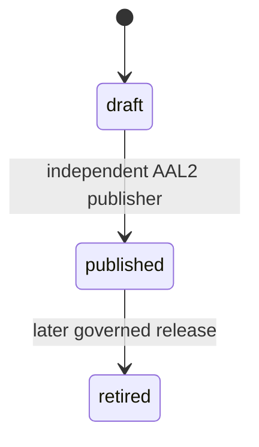

# Feature Specification: Privacy DSR and Notifications

> This specification completes the Foundation privacy-request and notification slice with seeded-synthetic evidence only. It does not claim production, legal, DPO, regulator, vendor, or design approval.

## 0. Metadata and traceability

| Field                      | Value                                                                                                                                                                                                                                                                                                     |
| -------------------------- | --------------------------------------------------------------------------------------------------------------------------------------------------------------------------------------------------------------------------------------------------------------------------------------------------------- |
| SpecKit feature ID         | `005-privacy-dsr-notifications`                                                                                                                                                                                                                                                                           |
| Status                     | `SPEC_APPROVED — engineering scope; formal release gates remain open`                                                                                                                                                                                                                                     |
| Target FR IDs              | `FR-AUTH-007`, `FR-AUTH-008`, `FR-ADMIN-002`, `FR-ADMIN-004`, `FR-NOTIF-001`, `FR-NOTIF-002`                                                                                                                                                                                                              |
| Target NFR IDs             | `NFR-PRIV-001`, `NFR-PRIV-002`, `NFR-PRIV-003`, `NFR-PRIV-004`, `NFR-SEC-001`, `NFR-SEC-003`, `NFR-SEC-004`, `NFR-SEC-005`, `NFR-SEC-006`, `NFR-I18N-001`, `NFR-A11Y-001`, `NFR-OBS-001`, `NFR-PERF-001`, `NFR-PERF-002`, `NFR-API-001`, `NFR-API-002`, `NFR-DATA-001`, `NFR-QUALITY-001`, `NFR-PORT-001` |
| Scope eligibility          | `ACTIVE — PRD v2.1.0, Foundation phase; verified 2026-08-13`                                                                                                                                                                                                                                              |
| Target app/service/package | `apps/patient`, `apps/admin`, `services/api`, `services/worker`, `packages/core`, `packages/contracts`, `packages/api-client`, `packages/auth`, `packages/i18n`, `packages/design-system`, `packages/observability`, `supabase/migrations`, `infra/db`, `tests`                                           |
| Owner                      | `SHIFAA engineering; names pending OPEN-TEAM-001`                                                                                                                                                                                                                                                         |
| Reviewers                  | Product `[open]`; QA `[open]`; Architecture `[open]`; Security `[open]`; DPO/Legal `[open]`; Clinical `N/A — no clinical decision`; Design/A11y `[open]`                                                                                                                                                  |
| Risk class                 | `sensitive-data`                                                                                                                                                                                                                                                                                          |
| Regulatory domains         | `PDPL; formal article mapping remains OPEN-LEGAL-001/007`                                                                                                                                                                                                                                                 |
| Clinical sign-off required | `no — no diagnosis, treatment, medicine, laboratory, or emergency decision`                                                                                                                                                                                                                               |
| Dependencies               | `001 identity notice/consent v1; 002 Supabase runtime; 003 facility/RBAC; 004 Family Care; API Catalog v1.1.0; Data/RLS v1.2.0; UI Contract v0.9.1`                                                                                                                                                       |
| Parent roadmap entry       | `SHIFAA-Implementation-Plan-MASTER.md §9 Foundation`                                                                                                                                                                                                                                                      |
| Created / updated          | `2026-08-13 / 2026-08-13`                                                                                                                                                                                                                                                                                 |

## 1. Problem and scope

### Problem statement

Patients and legally authorized guardians can record notice/consent decisions, but cannot yet submit, track, or receive a governed response to access/export, correction, restriction, and erasure/pseudonymization requests. Assigned DPO reviewers lack a least-privilege worklist. SHIFAA also lacks governed bilingual notification releases and durable, deduplicated local delivery evidence. This slice completes those Foundation responsibilities without enabling unknown production retention automation or production SMS.

### Actors and authorization context

| Actor                         | Facility/patient relationship                                    | Permitted outcome                                                     | Explicitly prohibited                                           |
| ----------------------------- | ---------------------------------------------------------------- | --------------------------------------------------------------------- | --------------------------------------------------------------- |
| Patient                       | authenticated subject                                            | create/list/read own DSR; download own released export at AAL2        | other subjects, admin decisions, unreleased evidence            |
| Guardian                      | active approved guardianship for subject with `consent.manage`   | same subject actions allowed by legal scope                           | delegation-derived authority or inactive relationship           |
| Delegate                      | any delegation                                                   | none                                                                  | consent or DSR authority                                        |
| Facility workforce            | any membership                                                   | none                                                                  | DSR list/read/decision/export                                   |
| Assigned DPO                  | active DPO designation, AAL2, declared purpose, assigned request | minimum worklist/read projection; decide and fulfil valid transitions | general admin/audit access or unassigned requests               |
| Support template author       | active `support_admin` permission and purpose                    | list and draft template releases                                      | publish own release or DSR access                               |
| Independent support publisher | different active `support_admin`, AAL2, purpose                  | publish valid draft                                                   | self-publish or change draft content during publish             |
| Platform operator             | explicit internal replay action, AAL2, purpose                   | append a replay attempt for dead letter                               | alter original event or access DSR bodies                       |
| Signed local provider fixture | valid configured signature and replay token                      | record minimum delivery receipt                                       | user/admin access, body/contact echo, unsigned/replayed receipt |

### In scope

- Complete `FR-AUTH-007` for access/export, correction, restriction, and erasure/pseudonymization review requests while reusing 001 notice/consent/withdrawal.
- Enforce `FR-AUTH-008` through active processing-inventory gates before DSR collection, export assembly, notification rendering, and provider receipt processing.
- Provide the `FR-ADMIN-002` assigned DPO worklist and actions with AAL2, purpose, current designation, minimum projection, and audit.
- Provide `FR-NOTIF-001` draft/publish governance for versioned Arabic and English SMS templates, exact recipient types, exact allowed fields, content digest, and independent publication.
- Provide `FR-NOTIF-002` transactional outbox consumption, aggregate ordering, bounded retry/backoff, dead letter, authorized replay, provider receipt deduplication, signed callbacks, and no duplicate visible delivery.
- Provide private export evidence, synthetic breach/tabletop timing evidence, bilingual accessible UI, telemetry redaction, performance evidence, runbooks, and full automated authorization/RLS coverage.

### Non-goals

- No 006 discovery, capacity, SOS, ER share, SOS matching, or Emergency Contact delivery.
- No laboratory, pharmacy, clinic, hospital, payment, donation, or AI notification trigger.
- No production SMS, provider credential, sender registration, failover claim, or vendor approval; `OPEN-VENDOR-002` remains blocking.
- No guessed statutory retention period, hard deletion, or automatic production erasure/pseudonymization; `OPEN-LEGAL-002` remains blocking.
- No replacement or fork of 001 privacy notice, consent, or withdrawal behavior.
- No general admin power for DPO users and no direct client/Supabase domain access.

### Dependencies and assumptions

| Item                                                                                          | Type          | Evidence / open ID                                                                |
| --------------------------------------------------------------------------------------------- | ------------- | --------------------------------------------------------------------------------- |
| Current operation names and routes are frozen                                                 | verified fact | API Catalog v1.1.0 rows 59–65, 288–290, 324, 327                                  |
| Existing notice/consent remains authoritative                                                 | verified fact | `specs/001-identity-onboarding` and active 001 contracts                          |
| Guardian authority requires approved `consent.manage`                                         | SHIFAA policy | Data/RLS v1.2.0 privacy matrix and 004                                            |
| Seeded due date uses `synthetic_dsr_due_v1 = 17 calendar days`, visibly labeled non-statutory | assumption    | deterministic test configuration only; production value blocked by legal approval |
| Production retention/deletion automation is disabled                                          | OPEN          | `OPEN-LEGAL-002`                                                                  |
| Production PHI, DPO registration, residency/transfer basis                                    | OPEN          | `OPEN-LEGAL-001`, `OPEN-LEGAL-007`                                                |
| Production SMS selection and contracts                                                        | OPEN          | `OPEN-VENDOR-002`                                                                 |
| Named reviewers and incident owner                                                            | OPEN          | `OPEN-TEAM-001`                                                                   |
| Approved compositions and visual tolerances                                                   | OPEN          | `OPEN-UX-001`, `OPEN-UX-002`                                                      |

## 2. Egyptian regulatory and legal validation

- [x] Processing-inventory process codes and controller/processor roles are required before collection/export/delivery.
- [x] DSR contents, exports, evidence, contact routing, and receipts are classified sensitive; telemetry prohibits their raw values.
- [x] Arabic-first 001 notice/consent behavior is reused and lawful basis remains separately recorded.
- [x] Data minimization, recipients, synthetic processor, and prohibited payload/log fields are explicit.
- [x] Retention classes are assigned; durations and automated actions remain disabled under `OPEN-LEGAL-002`.
- [x] Production countries, permits, transfer evidence, and processor approval remain blocked under `OPEN-LEGAL-001/007`.
- [x] DPO actions require current designation, assignment, AAL2, purpose, and immutable evidence.
- [x] Facility/professional/EDA/MoHP/MOSS/UHI/CBE obligations are `N/A — this slice makes no facility, clinical, entitlement, or payment decision`.
- [x] Controlled drug, e-prescription, EPTTS, donation, payment, and AI gates are `N/A — excluded domains`.
- [x] DSR and synthetic breach/tabletop impacts are specified.
- [x] Legal propositions remain SHIFAA policy/open items; no unofficial translation is presented as controlling law.

**Blocking open items:** `OPEN-LEGAL-001`, `OPEN-LEGAL-002`, `OPEN-LEGAL-007`, `OPEN-VENDOR-002`, `OPEN-UX-001`, `OPEN-UX-002`, `OPEN-TEAM-001` block formal production/release approval, not seeded-synthetic implementation.

## 3. User Scenarios & Testing

### Journey J-01 — Submit and track a privacy request

1. Given a patient, or active guardian with `consent.manage`, and an active processing-inventory record.
2. When the actor submits one of `access_export`, `correction`, `restriction`, or `erasure_pseudonymization` with bounded structured scope and contact preference.
3. The system creates exactly one request, shows its status, event history, submitted time, and labeled due date, and emits minimum audit/outbox records atomically.
4. If policy requires stronger identity evidence, status is `identity_verification_required` and DPO processing actions are blocked until verified.

### Journey J-02 — Assigned DPO review and fulfilment

1. Given an active DPO at AAL2 with purpose `privacy.dsr.review` and explicit request assignment.
2. When the DPO lists, opens, decides, or fulfils a request using the current version.
3. The API returns only the assigned minimum projection, validates the state transition and reason/evidence, and commits state, event, audit, notification outbox, canonical response, and idempotency completion atomically.
4. An unassigned DPO, ordinary admin, facility member, delegate, or stale designation receives default-deny at API and forced RLS.

### Journey J-03 — Release and consume an export

1. Given an approved access/export request whose private evidence object is scanner-released and whose fulfilment is released to the subject.
2. When the patient or authorized guardian at AAL2 requests a download link and uses it once before expiry.
3. The response is private and `Cache-Control: private, no-store`; the object is delivered without public access and the capability becomes unusable after use or expiry.
4. Replay, another subject, delegate, facility staff, DPO without subject context, and raw storage access are denied.

### Journey J-04 — Govern a bilingual notification template

1. Given an authorized support author and an active processing-inventory entry for the template purpose.
2. When the author creates a release with Arabic and English content, exact recipient types, exact field schema, channel, and digest.
3. The release remains draft until a different authorized publisher at AAL2 approves it with an effective time.
4. Schema drift, prohibited fields, self-publication, missing locale, or changed digest is rejected without partial state.

### Journey J-05 — Deliver once through the local adapter

1. Given a committed notification outbox event and a published effective template.
2. When the worker claims it, validates ordering/schema/recipient policy, renders a minimum message, and invokes the deterministic local adapter.
3. Transient failures retry at `1m, 5m, 30m, 2h, 12h` plus deterministic test jitter; permanent or exhausted failures dead-letter; unique notification and receipt keys prevent duplicate visible delivery.
4. Valid signed synthetic callbacks record a minimum receipt once; bad signatures and callback replays are safely rejected; replay appends a new attempt without mutating the original event.

### Alternate, failure, and degraded paths

| Case                       | Trigger                                                                | UI/API result                                | State/audit effect                                     | Recovery                            |
| -------------------------- | ---------------------------------------------------------------------- | -------------------------------------------- | ------------------------------------------------------ | ----------------------------------- |
| Permission denied          | actor lacks subject relation, assignment, permission, AAL2, or purpose | `403` stable problem; permission state       | no domain mutation; minimum denial audit where allowed | correct context/auth only           |
| Offline/disconnected       | UI cannot reach Core API                                               | explicit offline state; mutations not queued | none                                                   | reconnect and authoritative refresh |
| Provider timeout           | local adapter transient fixture                                        | delivery delayed; no success claim           | attempt + scheduled retry                              | bounded retry                       |
| Permanent provider failure | schema/auth fixture or exhausted retry                                 | dead-letter state                            | immutable attempts/alert metric                        | authorized replay after reason      |
| Duplicate/replay           | same idempotency key/body, receipt, or delivery key                    | stored response/receipt                      | one visible effect                                     | inspect existing result             |
| Concurrent change          | stale resource version                                                 | `409 version-conflict`                       | no partial effect                                      | refresh then deliberate retry       |
| Invalid transition         | wrong source/target or missing evidence                                | `409 dsr-transition-invalid`                 | no partial effect                                      | choose allowed action               |
| Stale data                 | list/read older than UI freshness marker                               | last-updated + stale banner                  | no mutation                                            | refresh                             |
| Export expired/used        | capability used once or more than 5 minutes after issue                | `410 dsr-export-expired`                     | access attempt only                                    | request a new link if eligible      |
| Erasure blocked            | approved retention/hold policy absent                                  | `409 retention-policy-unapproved`            | request remains reviewable; no deletion                | formal legal policy/manual evidence |

## 4. Requirements

### Functional Requirements

| Target PRD requirement | Required feature behavior                                                                                                                   | Acceptance coverage |
| ---------------------- | ------------------------------------------------------------------------------------------------------------------------------------------- | ------------------- |
| `FR-AUTH-007`          | Own/authorized DSR create, history, decisions, fulfilment, private export, correction/restriction review, safely blocked erasure automation | `AC-01`–`AC-08`     |
| `FR-AUTH-008`          | Active process-code gate precedes collection, export, rendering, and callback receipt processing                                            | `AC-09`             |
| `FR-ADMIN-002`         | DPO worklist/actions require designation, assignment, AAL2, purpose, and minimum projection                                                 | `AC-04`, `AC-10`    |
| `FR-ADMIN-004`         | Notification-template publication requires an independent current publisher, unchanged digest, current version, AAL2, and purpose           | `AC-11`, `AC-12`    |
| `FR-NOTIF-001`         | Bilingual versioned draft/publish with exact recipient and field schemas and independent publisher                                          | `AC-11`, `AC-12`    |
| `FR-NOTIF-002`         | Transactional outbox, ordered delivery, dedup, bounded retry, DLQ, signed receipts, authorized replay                                       | `AC-13`–`AC-16`     |

## 5. Domain model and invariants

### Entities and ownership

| Entity                             | Owning domain    | Authoritative source                                                         | Lifecycle owner                            |
| ---------------------------------- | ---------------- | ---------------------------------------------------------------------------- | ------------------------------------------ |
| Data subject request/event         | Consent          | `consent.data_subject_requests`, `consent.data_subject_request_events`       | subject submission; assigned DPO review    |
| DPO designation/assignment         | Identity/Consent | existing designation plus `consent.dsr_assignments`                          | governed platform administration           |
| Export object/capability           | Consent/Storage  | private bucket metadata plus hashed one-time capability                      | assigned DPO/API                           |
| Processing inventory               | Consent          | existing `consent.processing_inventory`                                      | DPO governance                             |
| Template release                   | Platform         | `platform.notification_templates`, `platform.notification_template_releases` | support author/independent publisher       |
| Notification/delivery attempt      | Platform         | `platform.notifications`, outbox and receipt tables                          | worker/operator                            |
| Synthetic breach/tabletop evidence | Audit/operations | immutable evidence file and timestamp fixture                                | named incident owner pending OPEN-TEAM-001 |

### State machines

All unlisted transitions fail. Decision and fulfilment require `If-Match`; creator cannot publish their template release. An erasure/pseudonymization fulfilment that asserts deletion or automated pseudonymization fails while `OPEN-LEGAL-002` is unresolved.

### Invariants and concurrency

- Request type is the closed set `access_export`, `correction`, `restriction`, `erasure_pseudonymization`; status is the canonical closed set from Data/RLS.
- DSR subject access derives from current database relationships, never JWT role/facility claims; delegation and facility membership confer no DSR authority.
- Every admin row action rechecks current DPO designation, purpose, AAL2, and active assignment in the transaction and at forced RLS.
- Each mutation atomically commits domain state, append-only audit/event, minimum outbox, canonical response, and completed idempotency record.
- Mutable DSR/template/notification resources carry monotonically increasing integer versions; stale `If-Match` fails.
- Published release content/digest/schema is immutable; a new version is required for change.
- Unique `(template_release, source_event, recipient_type, recipient_id, channel)` and provider receipt keys allow at most one visible delivery. Retry jitter is bounded to ±10% of each canonical delay and deterministic in tests.
- External/provider calls occur only after commit and never inside user transactions.

## 6. Exact data and RLS contract

The plan/data model may add operational columns but may not weaken these minimums.

| Table.column group                               | Type/rule                                                                                                                      | Key/check/index                                              | Classification                      | Retention                                             |
| ------------------------------------------------ | ------------------------------------------------------------------------------------------------------------------------------ | ------------------------------------------------------------ | ----------------------------------- | ----------------------------------------------------- |
| `consent.data_subject_requests` identity/scope   | UUID subject/actor, request type, bounded JSON scope, contact preference, status, timestamps, version                          | PK; type/status checks; subject/status/due indexes           | sensitive                           | `privacy_dsr` duration OPEN-LEGAL-002                 |
| request decision/fulfilment                      | structured decision, reason code/text, included/excluded scope, evidence object, action summary, released time                 | evidence required by transition; no raw export               | sensitive                           | `privacy_dsr`                                         |
| `consent.data_subject_request_events`            | request, actor, event, from/to, reason, evidence, occurred                                                                     | append-only; request/time index                              | sensitive audit                     | `privacy_dsr_event` duration open                     |
| `consent.dsr_assignments`                        | request, DPO person, assigned/revoked times, assigner, reason                                                                  | one active assignment per request; indexes on DPO/status     | restricted                          | `privacy_governance` duration open                    |
| `consent.dsr_export_capabilities`                | request/evidence object, token HMAC only, expires/used/revoked, version                                                        | token unique; eligible request unique active capability      | secret-derived metadata             | short-lived configured bound; evidence retention open |
| `platform.notification_template_releases`        | code/version/channel, bilingual bodies, recipient types, JSON field schema, digest, creator/publisher/effective/status/version | code/version unique; exact locale pair; creator != publisher | internal governance                 | `notification_governance` open                        |
| `platform.notifications`                         | source event, release, recipient type/id, channel, rendered digest, status, provider opaque ref, timestamps/version            | visible-delivery dedup unique                                | sensitive metadata; no body/contact | `notification_delivery` open                          |
| `platform.notification_delivery_attempts`        | notification/event, attempt, outcome, available/started/finished, provider receipt hash, safe error code                       | attempt unique; receipt hash unique when set                 | internal operational                | `notification_delivery` open                          |
| existing `platform.outbox_events/event_receipts` | canonical architecture fields                                                                                                  | aggregate ordering and unique receipt                        | internal minimum                    | open                                                  |

Migrations are forward-only expand migrations with deterministic seed inserts for active process codes and synthetic templates. Rollback before use may remove empty additions; after durable events exist, roll forward and disable via feature flags. No migration deletes/pseudonymizes user data.

All feature tables use `ENABLE ROW LEVEL SECURITY` and `FORCE ROW LEVEL SECURITY`. Online SQL executes as the existing non-owner, non-`BYPASSRLS` role. Security-definer helpers set a fixed `search_path`, derive actor/purpose/AAL from transaction context, and query current designations/relationships/assignments rather than stale JWT authorization.

| Actor/context             | SELECT                                                | INSERT                                  | UPDATE/action                             | DELETE | Negative test      |
| ------------------------- | ----------------------------------------------------- | --------------------------------------- | ----------------------------------------- | ------ | ------------------ |
| patient                   | own DSR/events and released fulfilment                | own request through use case            | no direct row update                      | none   | cross-subject      |
| authorized guardian       | managed subject with active approved `consent.manage` | same                                    | no direct update                          | none   | inactive/no scope  |
| delegate/facility         | none                                                  | none                                    | none                                      | none   | explicit matrix    |
| assigned DPO AAL2/purpose | assigned minimum DSR/events                           | assignment only via governed admin path | transition function only                  | none   | missing each guard |
| support author/publisher  | minimum template releases                             | draft via use case                      | publisher transition only and independent | none   | self-publish       |
| worker/operator           | claimed minimum outbox/notification rows              | attempts/receipts via worker functions  | lease/status/replay functions             | none   | user role denial   |

## 7. API endpoint specifications

All success/error bodies use the repository JSON/RFC 9457 conventions; UUIDs are canonical; cursor pages are bounded to `1..100`, default `25`; locale is `ar-EG` or `en-EG`; mutations require `Idempotency-Key`; versioned transitions require `If-Match`. Same key/body returns the stored response and same key/different body returns `409 idempotency-key-reused`.

| operationId and route                                                                                  | Actor/guards                                               | Request                                                                                            | Success                                                                                             | Stable domain errors; audit/event                                                                     |
| ------------------------------------------------------------------------------------------------------ | ---------------------------------------------------------- | -------------------------------------------------------------------------------------------------- | --------------------------------------------------------------------------------------------------- | ----------------------------------------------------------------------------------------------------- |
| `createDsr` `POST /privacy/requests`                                                                   | PAT/GUA legal scope; active `privacy.dsr.intake` inventory | subject ID only for guardian, type, bounded scope codes, contact preference                        | `201` request summary/history/due label                                                             | `403 relationship-scope-denied`, `409 processing-inventory-inactive`; audit + `privacy.dsr.submitted` |
| `listMyDsrs` `GET /privacy/requests`                                                                   | PAT/GUA legal scope                                        | subject/status/type/cursor/limit                                                                   | `200` minimum page                                                                                  | no decision evidence body; read audit only where policy requires                                      |
| `getDsr` `GET /privacy/requests/{requestId}`                                                           | subject/legal guardian or assigned DPO with full guards    | path                                                                                               | `200` role-specific request/events/decision projection                                              | `404` anti-enumeration; `403` guard failure; purpose audit                                            |
| `downloadDsrExport` `POST /privacy/requests/{requestId}/download-link`                                 | subject/legal guardian AAL2; fulfilled released export     | issue mode has no body; consume mode carries the opaque token reached through the patient-app link | `200` one-time app link/expiry or one-time binary download; both `Cache-Control: private, no-store` | `409 dsr-export-not-ready`, `410 dsr-export-expired`; audit; no URL/token logged                      |
| `listAdminDsrs` `GET /admin/privacy/requests`                                                          | active assigned DPO AAL2/purpose                           | type/status/due/cursor/limit                                                                       | `200` assigned minimum page                                                                         | `403`; purpose audit                                                                                  |
| `decideDsr` `POST /admin/privacy/requests/{requestId}/decision`                                        | assigned DPO AAL2/purpose                                  | approve/partial/refuse, reason, included/excluded scope, evidence                                  | `200` new version/event                                                                             | `409 dsr-transition-invalid/version-conflict/retention-policy-unapproved`; audit + status event       |
| `fulfilDsr` `POST /admin/privacy/requests/{requestId}/fulfilment`                                      | assigned DPO AAL2/purpose                                  | action codes/summary, evidence object, subject notice code                                         | `200` fulfilled version/event                                                                       | same plus evidence/scanner/retention problems; audit + fulfilment/notification event                  |
| `listNotificationTemplates` `GET /admin/notification-templates`                                        | support action + purpose                                   | code/locale/channel/status/cursor                                                                  | `200` minimum releases/schema page                                                                  | `403`; purpose audit                                                                                  |
| `createNotificationTemplateRelease` `POST /admin/notification-templates/{templateCode}/releases`       | support author + active inventory                          | channel, `ar-EG`/`en-EG` bodies, recipients, exact field schema, digest                            | `201` draft                                                                                         | `422 notification-template-schema-invalid`, `409 processing-inventory-inactive`; audit                |
| `publishNotificationTemplateRelease` `POST /admin/notification-templates/releases/{releaseId}/publish` | independent support publisher AAL2/purpose                 | approval digest/effective time                                                                     | `200` published version                                                                             | `409 separation-of-duties/version-conflict`; audit + release event                                    |
| `smsProviderCallback` `POST /internal/callbacks/messages/{provider}`                                   | configured signed synthetic provider                       | event ID, opaque receipt ID, delivery state, occurred time, nonce; signature headers               | `200` new receipt acknowledgment                                                                    | `401 callback-signature-invalid`, `409 callback-replay`; minimum receipt only                         |
| `replayDeadLetter` `POST /internal/outbox/dead-letters/{eventId}/replay`                               | platform operator AAL2/purpose                             | reason                                                                                             | `202` appended replay attempt                                                                       | `409 outbox-not-dead-letter/version-conflict`; original immutable; audit                              |

Rate limits are repository policy keyed by pseudonymous principal/route. Export link creation is additionally low-rate and never cached. DPO lists sort deterministically by due date then ID. No active operation is added, renamed, or removed.

## 8. UI/UX and edge-state matrix

| App/route                       | Required states                                                                                                                      | Controls/focus and locale                                          | Permission/offline behavior                                         | Baseline                               |
| ------------------------------- | ------------------------------------------------------------------------------------------------------------------------------------ | ------------------------------------------------------------------ | ------------------------------------------------------------------- | -------------------------------------- |
| patient `/privacy`              | overview with consent and request entry points                                                                                       | Arabic-first heading/order; logical properties; keyboard landmarks | no cached sensitive body                                            | UI Contract privacy overview           |
| patient `/privacy/consents`     | existing 001 loading/current/history/error/offline/success                                                                           | preserve existing behavior                                         | unchanged                                                           | 001 baseline                           |
| patient `/privacy/requests`     | loading, empty, form, verification-required, submitted, review, partial/refused, export-ready/expired, stale/conflict, error/success | type help, status history, due label, confirmation, focus summary  | permission/relationship/offline explicit; no offline mutation queue | `OPEN-UX-001/002` informative evidence |
| admin `/privacy-requests`       | permission, empty, assigned list, detail, identity block, decision/partial/refusal/fulfilment, stale/conflict/error/success          | AAL2/purpose prompt; minimum fields; reason/evidence required      | no general admin fallback; offline read-only message                | `OPEN-UX-001/002`                      |
| admin `/notification-templates` | permission, empty/list, draft validation, publish confirmation, separation failure, stale/error/success                              | locale-paired editor, schema summary, different-publisher notice   | production SMS disabled banner; offline no submit                   | `OPEN-UX-001/002`                      |

All surfaces support `ar-EG` RTL and `en-EG` LTR, bidi isolation for IDs/timestamps, compact `360/412`, tablet `768`, and desktop `1440`, keyboard-only operation, visible focus, programmatic labels/errors/status announcements, 44px-equivalent targets, 200% text and 400% reflow without two-axis scrolling, high contrast, and reduced motion. Motion is non-essential and disabled when requested. Destructive language never promises deletion while retention policy is unresolved.

## 9. Notifications and asynchronous events

| Source event                    | Recipient policy | Template/channel                               | Allowed fields                                                                                | Dedup/retry/DLQ                               | Acknowledgement                        |
| ------------------------------- | ---------------- | ---------------------------------------------- | --------------------------------------------------------------------------------------------- | --------------------------------------------- | -------------------------------------- |
| `privacy.dsr.submitted`         | subject only     | published bilingual `DSR_SUBMITTED`, local SMS | `request_reference`, `request_type_label`, `submitted_date`, `due_date_label`, `support_path` | canonical notification key; bounded retry/DLQ | provider receipt                       |
| `privacy.dsr.status_changed`    | subject only     | `DSR_STATUS_CHANGED`                           | `request_reference`, `status_label`, `updated_date`, `support_path`                           | same                                          | receipt                                |
| `privacy.dsr.export_ready`      | subject only     | `DSR_EXPORT_READY`                             | `request_reference`, `ready_until_label`, `privacy_requests_path`; no URL/token               | same                                          | receipt; user authenticates separately |
| `privacy.dsr.identity_required` | subject only     | `DSR_IDENTITY_REQUIRED`                        | `request_reference`, `verification_path`, `support_path`                                      | same                                          | receipt                                |

Emergency Contacts, delegates, facility staff, unrelated admins, and unassigned DPOs are never recipients. Full request text, decision reason, export body/link/token, health data, identity data, raw contact, secrets, and full message bodies are prohibited in outbox payloads, provider callbacks, logs, traces, metrics, and receipt rows.

## 10. Security, privacy, and abuse cases

| Threat/misuse                      | Control                                                                                                                                     | Verification                                                                   |
| ---------------------------------- | ------------------------------------------------------------------------------------------------------------------------------------------- | ------------------------------------------------------------------------------ |
| Broken subject/admin authorization | API guard plus forced RLS current relationship/designation/assignment                                                                       | actor/resource/action negative matrices                                        |
| Stale AAL/designation/purpose      | transaction-local context and database recheck                                                                                              | remove each guard independently                                                |
| Session/token downgrade or leakage | reuse 001/002 short-lived access, rotation/reuse detection, secure web/mobile storage, and step-up; never log/store tokens in feature state | auth regression, CSRF/origin, secure-storage, token-reuse, and telemetry tests |
| Export theft/replay/cache          | private bucket, HMAC token only, short expiry, one-time use, no-store                                                                       | valid/expired/used/cross-user/storage tests                                    |
| Idempotency/race/duplicate         | canonical request hash, row lock, version, unique delivery/receipt keys                                                                     | replay/different-body/concurrent tests                                         |
| Template injection/schema drift    | bounded placeholders, exact JSON schema, digest, locale pair, independent publisher                                                         | invalid fields/content/self-publish tests                                      |
| Callback forgery/replay            | constant-time local HMAC-SHA-256 verification, ±5-minute signed-timestamp window, nonce/receipt uniqueness                                  | bad signature/stale timestamp/nonce/replay tests                               |
| Insider/excessive access           | assigned DPO minimum projection and purpose audit; no general audit role                                                                    | contract/RLS/redaction tests                                                   |
| PHI/secret leakage                 | allow-list payload builders, structured safe error codes, scanners                                                                          | logs/outbox/provider snapshot tests                                            |
| Premature erasure                  | explicit legal-policy feature gate and no deletion SQL                                                                                      | migration and fulfilment negative tests                                        |

## 11. Success Criteria

### Measurable Outcomes

| ID       | Outcome                                                            | Measurement                          | Threshold                                                                 |
| -------- | ------------------------------------------------------------------ | ------------------------------------ | ------------------------------------------------------------------------- |
| `SC-001` | Authorized subjects complete each supported request journey        | seeded browser/API acceptance        | 4/4 types create and track                                                |
| `SC-002` | Unauthorized actors cannot access DSR data                         | API plus forced-RLS matrix           | 100% denied, zero leaked fields                                           |
| `SC-003` | DPO access is purpose-limited                                      | guard permutation suite              | every missing guard denied                                                |
| `SC-004` | Export capability is bounded                                       | storage/download suite               | valid once; expired/replayed/foreign denied; no-store                     |
| `SC-005` | Governed templates cannot self-publish or drift                    | contract/integration suite           | all invalid vectors rejected                                              |
| `SC-006` | Delivery never produces a duplicate visible message                | worker/provider replay suite         | one visible delivery per dedup key                                        |
| `SC-007` | Performance meets canonical API thresholds                         | seeded load run                      | read p95 ≤400ms; mutation p95 ≤800ms excluding adapter                    |
| `SC-008` | Bilingual accessible surfaces meet contract                        | live browser/a11y evidence           | required routes/states at contracted viewports with no serious violations |
| `SC-009` | Privacy additions do not regress the reference patient-home budget | cold-start/input performance profile | home LCP p95 ≤3.0s and input response p95 ≤200ms on the canonical profile |

### Acceptance Criteria and Test Vectors

- **AC-01:** each closed-set DSR type creates one request with history/status/due label; unknown type creates none and returns `422`.
- **AC-02:** an identity-required request cannot enter review/decision until verified; no notification claims processing began.
- **AC-03:** patient and valid guardian can list/read only the subject; delegate, unrelated patient, facility staff, and unauthorized admin fail at API and forced RLS.
- **AC-04:** active assigned DPO at AAL2 with purpose receives the minimum projection; independently removing designation, assignment, AAL2, or purpose denies access.
- **AC-05:** approve, partial approval, and refusal require allowed source state, current version, structured scope where applicable, reason, and evidence.
- **AC-06:** fulfilment requires approved/partial status, evidence, action summary, valid notice code, and current version; replay has one effect.
- **AC-07:** export release/download proves private storage, scanner release, expiry, one-time behavior, no-store, and unauthorized denial.
- **AC-08:** erasure/pseudonymization automation remains disabled and returns `retention-policy-unapproved` without changing subject data.
- **AC-09:** inactive/missing processing-inventory process code blocks collection/export/rendering/callback persistence before sensitive fields are accepted.
- **AC-10:** DPO designation grants no general admin routes or raw audit reader access.
- **AC-11:** draft creation requires Arabic and English, exact recipient types/field schema, bounded placeholders, digest, and active inventory.
- **AC-12:** a different AAL2 publisher is required; self-publish, stale version, changed digest, missing locale, and prohibited field fail atomically.
- **AC-13:** transient adapter fixtures follow the five canonical retry delays plus bounded test jitter; permanent/exhausted failures dead-letter.
- **AC-14:** receipt, notification, and idempotency replay produce one stored canonical result and no duplicate visible message.
- **AC-15:** a valid `sha256=<hex>` synthetic callback signed over the canonical minimum body and provider timestamp is accepted once; invalid signature, signed timestamp outside ±5 minutes, duplicate nonce, and changed replay are rejected without raw payload logs.
- **AC-16:** authorized dead-letter replay appends an attempt, preserves the original event, rechecks current schema/template, and requires reason/version.
- **AC-17:** a synthetic breach tabletop records awareness, planned regulator deadline at +72h, regulator-notified fixture time, planned subject deadline at +3 working days, decision/evidence timestamps, and explicitly says no real incident/submission occurred.
- **AC-18:** Arabic RTL and English LTR live tests cover compact/desktop, keyboard, reflow/200%, high contrast, reduced motion, offline, loading, empty, permission, stale/conflict, export-ready/expired, failure, and success.
- **AC-19:** the existing 001/002 session contract remains intact: secure storage/cookie attributes, Origin/CSRF checks, short-lived access, refresh rotation/reuse detection, AAL2 step-up, and no token telemetry regressions pass.

Automated paths are frozen in `plan.md`/`tasks.md`; all tests use deterministic synthetic identifiers and never production data.

## 12. Observability, rollout, rollback, and incidents

- SLI/SLO: canonical read p95 ≤400ms, mutation p95 ≤800ms; track DSR transition errors, export issuance/use/expiry, outbox pending age, retry count, dead-letter count, callback reject count, and dedup suppression.
- Logs/traces contain correlation IDs, operation IDs, safe problem codes, pseudonymous low-cardinality dimensions, and durations only; prohibited fields are scanner-tested.
- Local dashboards/evidence have an engineering owner; named operational/on-call owner remains `OPEN-TEAM-001`.
- Feature flags independently control DSR UI, DPO UI, template governance, local delivery, callback, and replay; production provider mode remains hard disabled.
- Database deploy is expand/validate/enable. Rollback disables entry points/worker and rolls forward; durable history is not deleted.
- Kill switches stop new export capability issuance and delivery claims without discarding committed requests/events.
- Runbooks: `infra/runbooks/privacy-dsr.md`, `infra/runbooks/notification-delivery.md`, `infra/runbooks/privacy-breach-tabletop.md`.

## 13. Evidence and approvals

| Gate                  | Reviewer(s)   | Artifact                                     | Decision/date                       | Blocking findings                  |
| --------------------- | ------------- | -------------------------------------------- | ----------------------------------- | ---------------------------------- |
| Product/QA            | names pending | spec/checklist/tests                         | engineering scope only / 2026-08-13 | `OPEN-TEAM-001`                    |
| Legal/DPO             | names pending | processing inventory/tabletop/retention gate | not approved                        | `OPEN-LEGAL-001/002/007`           |
| Clinical              | N/A           | no clinical behavior                         | N/A                                 | none                               |
| Architecture/Security | names pending | plan/contracts/RLS/threat evidence           | engineering review pending          | `OPEN-TEAM-001`                    |
| Design/Accessibility  | names pending | UI Contract/live evidence                    | informative only                    | `OPEN-UX-001/002`, `OPEN-TEAM-001` |
| Release               | names pending | evidence manifest/PR checks                  | not approved                        | all applicable open gates          |

## 14. Open items and change log

| Open ID           | Owner                          | Next action/evidence                              | Blocks gate                                    |
| ----------------- | ------------------------------ | ------------------------------------------------- | ---------------------------------------------- |
| `OPEN-LEGAL-001`  | Legal + registered DPO         | permits/designation/residency/processor evidence  | production PHI/release                         |
| `OPEN-LEGAL-002`  | Legal + DPO + Medical Director | signed retention/action schedule                  | automated production deletion/pseudonymization |
| `OPEN-LEGAL-007`  | Legal + registered DPO         | official Arabic instruments and article memo      | production legal claim                         |
| `OPEN-VENDOR-002` | Procurement + Platform + DPO   | provider/DPA/SLA/sender/receipt/failover approval | production SMS                                 |
| `OPEN-UX-001/002` | Product + Design + A11y        | compositions and tolerance approvals              | formal visual gate                             |
| `OPEN-TEAM-001`   | Product Owner                  | named accountable reviewers/owners                | formal approvals/release                       |

| Date       | Version | Change                                                            |
| ---------- | ------- | ----------------------------------------------------------------- |
| 2026-08-13 | 0.1.0   | Initial 005 engineering specification; no active operation change |
