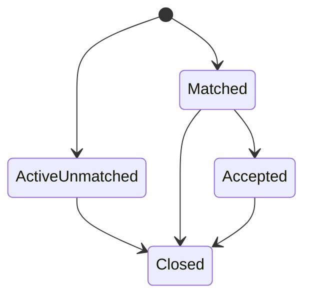

# Data Model: Discovery and SOS Foundation

**Feature:** `006-discovery-sos-foundation`  
**Date:** 2026-08-20  
**Boundary:** seeded-synthetic Phase 2 engineering; no production capacity publisher, maps/SMS, ambulance, bed, or shadow clinical source

## 1. Design rules

- PostgreSQL remains authoritative. PostGIS owns radius/distance queries; application code does not approximate geospatial eligibility.
- Every new domain table uses UUID v4 keys, UTC `timestamptz`, constrained text states, explicit versions, `ENABLE ROW LEVEL SECURITY`, and `FORCE ROW LEVEL SECURITY`.
- Online SQL runs as `shifaa_api`, a non-owner/non-`BYPASSRLS` role. Public responses are exact API projections, never direct Data API table access.
- Search coordinates are request-transient. Only an explicitly created SOS persists coordinates under `SOS_LOCATION`; no exact coordinate enters logs, analytics, audit metadata, or outbox payloads.
- Mutations atomically commit domain state, minimum audit/outbox effects, canonical response, and completed idempotency state.
- The ER-share profile reads only canonical sources that exist at request time. Missing allergies, medicines, chronic conditions, or emergency-note sources are returned in `unavailable_fields`; no 006 table fabricates those records.
- Retention duration/action stays unset under `OPEN-LEGAL-002`.

## 2. Runtime and extension

Local/CI Compose uses the reviewed multi-architecture image `postgis/postgis:17-3.5-alpine@sha256:fae81f3e8da88b8e684c58c8a8616aadda72e6fc1affcb050b490891ecb3db1c`. The migration uses bare `CREATE EXTENSION IF NOT EXISTS postgis`; it does not request an extension version because current Supabase behavior ignores/deprecates version clauses. Runtime provenance remains an `OPEN-TECH-001` formal-evidence item.

## 3. Existing table expansion — `identity.facilities`

| Column                 | Type                    | Null/default | Constraint/use                                                                                               |
| ---------------------- | ----------------------- | ------------ | ------------------------------------------------------------------------------------------------------------ |
| `location`             | `geography(Point,4326)` | nullable     | valid longitude/latitude supplied only by approved facility data path; required for location-based discovery |
| `location_verified_at` | `timestamptz`           | nullable     | non-null for a discoverable coordinate; does not by itself replace active facility/license checks            |

Indexes:

- GiST `facilities_location_gist` on `location` where `location is not null`.
- Existing facility status/type and license indexes remain authoritative; add a composite/partial index only if `EXPLAIN (ANALYZE, BUFFERS)` proves it necessary.

Public discovery derives services from current verified, unexpired `identity.facility_licenses.licensed_activities`. Until the Trust/review phase exists, `rating_summary` is honestly `{count: 0, average: null, state: 'unavailable'}`.

### Existing `identity.patients` expansion

Add nullable `blood_group text` constrained to `A+|A-|B+|B-|AB+|AB-|O+|O-|unknown`, realizing the existing canonical logical field. Only deterministic synthetic patients are seeded. This does not add allergy, medicine, condition, or emergency-note source tables.

## 4. New table — `hospital.capacity_projections`

| Column                      | Type          | Rule                                                                  |
| --------------------------- | ------------- | --------------------------------------------------------------------- | ------- | ----------- | -------- |
| `id`                        | `uuid`        | PK, generated                                                         |
| `facility_id`               | `uuid`        | FK `identity.facilities(id)`, unique; facility must be a hospital     |
| `emergency_available_count` | `integer`     | `>= 0`; aggregate only                                                |
| `emergency_held_count`      | `integer`     | `>= 0`; aggregate only                                                |
| `signal`                    | `text`        | `available                                                            | limited | unavailable | unknown` |
| `observed_at`               | `timestamptz` | source observation time, not future                                   |
| `fresh_until`               | `timestamptz` | `>= observed_at`; comparison to transaction time determines freshness |
| `source_code`               | `text`        | `synthetic_seed` in 006; later approved hospital projection code only |
| `created_at`, `updated_at`  | `timestamptz` | UTC                                                                   |
| `version`                   | `integer`     | positive, default 1                                                   |

Invariants:

- No patient, ward, bed, admission, staff, or free-text columns.
- `available` requires `emergency_available_count > 0`; `unavailable` requires zero; `unknown` never qualifies.
- A row is qualifying only while `statement_timestamp() <= fresh_until`, the hospital/facility/license/geodata remain eligible, and the signal is `available|limited` with a positive available count.
- 006 seeds deterministic projections through migrations/test fixtures only. No production write operation or public policy is added.

Indexes: unique B-tree on `facility_id`; B-tree on `(fresh_until, facility_id)` for freshness joins.

## 5. New table — `platform.sos_incidents`

| Column                                     | Type                    | Rule                                               |
| ------------------------------------------ | ----------------------- | -------------------------------------------------- | ------------------------------------------------------------------ | --------------------------------------------------- | ----------------- |
| `id`                                       | `uuid`                  | PK, generated                                      |
| `patient_id`                               | `uuid`                  | FK `identity.patients(id)`                         |
| `initiated_by_user_id`                     | `uuid`                  | authenticated internal user/actor attribution      |
| `coordinates`                              | `geography(Point,4326)` | explicit activation point only                     |
| `coordinate_precision`                     | `text`                  | `exact`; contact delivery derives `none            | coarse                                                             | exact` separately                                   |
| `qualifying_reason_code`                   | `text`                  | `medical_emergency                                 | accident_or_injury                                                 | other_life_safety`; user attestation, not diagnosis |
| `contact_preference`                       | `text`                  | `none                                              | all_confirmed`; no arbitrary contact or destination input          |
| `callback_source`                          | `text`                  | `patient_verified_contact                          | initiator_verified_contact`; worker resolves current server record |
| `status`                                   | `text`                  | `active_unmatched                                  | matched                                                            | accepted                                            | closed`           |
| `matched_facility_id`                      | `uuid`                  | nullable FK `identity.facilities(id)`              |
| `accepted_by_user_id`                      | `uuid`                  | nullable; current matched-facility HSP actor       |
| `acceptance_note_code`                     | `text`                  | nullable; `capacity_acknowledged                   | manual_coordination_required`                                      |
| `initiated_at`, `accepted_at`, `closed_at` | `timestamptz`           | state-shape checks                                 |
| `closed_by_user_id`                        | `uuid`                  | nullable                                           |
| `close_outcome_code`                       | `text`                  | nullable; `help_received                           | no_longer_needed                                                   | hospital_follow_up                                  | created_in_error` |
| `retention_class`                          | `text`                  | exactly `SOS_LOCATION`                             |
| `created_at`, `updated_at`                 | `timestamptz`           | UTC                                                |
| `version`                                  | `integer`               | positive, increments on accepted/closed transition |

State shapes:

- `active_unmatched`: no matched/accepted fields.
- `matched`: matched facility required; no acceptance/closure fields.
- `accepted`: matched facility, accepting actor/note, and `accepted_at` required.
- `closed`: `closed_at`, closing actor, and outcome required; prior match/acceptance facts remain immutable.
- No reopen or rematch in 006.
- Partial unique index on `patient_id` where status is not `closed` prevents overlapping active incidents for one patient.
- Worklist index `(matched_facility_id, status, initiated_at desc, id)` supports stable cursor paging.
- GiST index on `coordinates` is not exposed publicly and is added only if an authorized incident-distance query needs it.

## 6. New table — `platform.emergency_share_links`

| Column                             | Type           | Rule                                                                 |
| ---------------------------------- | -------------- | -------------------------------------------------------------------- | ------------------- | -------------------------- | ------------------ | ------------------------------- |
| `id`                               | `uuid`         | PK, generated                                                        |
| `incident_id`                      | `uuid`         | FK `platform.sos_incidents(id)`                                      |
| `created_by_user_id`               | `uuid`         | attributable actor with current `sos.share`                          |
| `token_digest`                     | `bytea`        | unique SHA-256/HMAC digest; exactly 32 bytes; plaintext never stored |
| `scope_fields`                     | `text[]`       | nonempty subset of `blood_group                                      | confirmed_allergies | active_dispensed_medicines | chronic_conditions | emergency_notes`, no duplicates |
| `expires_at`                       | `timestamptz`  | after creation and no later than 30 minutes                          |
| `access_limit`                     | `smallint`     | exactly 1                                                            |
| `access_count`                     | `smallint`     | 0 or 1, default 0                                                    |
| `used_at`                          | `timestamptz`  | nullable terminal use time                                           |
| `revoked_at`, `revoked_by_user_id` | timestamp/uuid | nullable terminal revocation                                         |
| `created_at`, `updated_at`         | `timestamptz`  | UTC                                                                  |
| `version`                          | `integer`      | positive; revoke increments                                          |

Derived state is `active`, `used`, `revoked`, or `expired`. The first valid view locks the row, checks digest/expiry/revocation/access count, resolves the scope intersection from canonical sources, increments access count, sets `used_at`, and appends safe audit evidence in one transaction. Revoke/view races have one winner. Unknown tokens receive the same `410` problem without an oracle.

Idempotent link creation stores the canonical response encrypted under the platform idempotency-response mechanism so a network retry can reproduce the token without plaintext-at-rest. Audit, outbox, logs, traces, metrics, screenshots, and provider data never receive the token or digest.

Indexes: unique B-tree on `token_digest`; B-tree on `(incident_id, created_at desc)`; partial B-tree on `expires_at` where `used_at is null and revoked_at is null`.

## 7. Canonical emergency-profile resolution

The share resolver intersects the requested scope with available canonical sources:

| Share field                  | Canonical source in 006                                          | Result when absent                                                         |
| ---------------------------- | ---------------------------------------------------------------- | -------------------------------------------------------------------------- | ----------- |
| `blood_group`                | `identity.patients.blood_group` when present                     | listed in `unavailable_fields`                                             |
| `confirmed_allergies`        | future `clinical.allergies` rows with `clinician_confirmed` only | unavailable; empty data is not represented as clinically confirmed absence |
| `active_dispensed_medicines` | future `clinical.medication_statements` in `active               | dispensed`                                                                 | unavailable |
| `chronic_conditions`         | future active/confirmed `clinical.conditions`                    | unavailable                                                                |
| `emergency_notes`            | no approved source yet                                           | unavailable until a later canonical contract defines it                    |

No `emergency_profile`, JSON snapshot, clinical seed, or free-text note table is created by 006. Tests use repository-boundary synthetic fixtures for allow-list behavior and physical PostgreSQL evidence for currently available `blood_group` plus unavailable fields.

## 8. Existing platform tables and events

- `platform.idempotency_records`: exact mutation principal/method/route/key/request hash; encrypted canonical response when it contains the share token.
- `platform.outbox_events`: add the existing policy-boundary event `sos.emergency_contact.requested` with only stable incident/contact IDs, template code, locale, precision code, and correlation metadata. No coordinates, phone, callback value, clinical fields, or rendered body.
- `platform.notifications` and delivery attempts: recipient type `emergency_contact`, unique incident+contact+template+channel dedup key. Existing privacy processor must continue to claim patient-only notification types.
- `audit.events`: append safe actor/patient/facility/purpose/action/outcome/request/time metadata. Share-token attempts contain no raw/digest token; unmatched token attempts have no fabricated resource ID.
- Existing `identity.emergency_contacts`: worker rechecks `confirmed`, selected patient, current consent, and `location_precision` immediately before delivery.

## 9. RLS and privilege matrix

| Resource/action               | Patient                     | Guardian                                             | Delegate                                         | HSP                                                                  | Public token                   | Worker                       |
| ----------------------------- | --------------------------- | ---------------------------------------------------- | ------------------------------------------------ | -------------------------------------------------------------------- | ------------------------------ | ---------------------------- |
| discovery/capacity projection | exact public API projection | same                                                 | same                                             | same plus existing staff context                                     | same                           | no direct need               |
| create/read/close SOS         | self                        | current approved relationship + exact `sos.activate` | current active delegation + exact `sos.activate` | matched-facility minimum read; close only by defined policy          | deny                           | minimum event predicate only |
| create/revoke share           | self                        | current approved relationship + exact `sos.share`    | current active delegation + exact `sos.share`    | deny                                                                 | deny                           | deny                         |
| view share                    | N/A through token path      | N/A                                                  | N/A                                              | N/A                                                                  | fixed projection function only | deny                         |
| list/accept pre-arrival       | deny                        | deny                                                 | deny                                             | current membership at path/matched facility; mutation AAL2 + purpose | deny                           | deny                         |

Policies use current database facts and fixed-`search_path` boolean helpers. Client JWT role/facility/patient metadata is never authoritative. `PUBLIC`, `anon`, `authenticated`, and service-role style online access receive no domain-table grants. Function execution is revoked from `PUBLIC` and granted only to the exact API/worker role.

## 10. Transaction and lock order

1. Lock/create the idempotency record.
2. Lock the SOS incident by ID when present.
3. Lock the matched facility capacity row when acceptance must recheck freshness.
4. Lock the share/contact row in ascending UUID order when required.
5. Apply guarded state mutation and append audit/outbox/canonical response.
6. Complete idempotency and commit before any worker/vendor action.

This stable order applies to accept/close/revoke/view races and prevents circular locking. Statements use bounded timeouts; external calls never occur inside the transaction.

## 11. Migration and restore validation

- Forward: switch the local/CI image on an empty repository-scoped volume, create PostGIS, expand facility columns, add new tables/functions/indexes/policies/grants, seed synthetic locations/capacity/template/config, and run `ANALYZE` for plan evidence.
- Validation: SRID/range, extension version report, GiST usage, FK indexes, state/check constraints, exact grants, forced RLS, no patient/ward fields in capacity, no token plaintext column, and synthetic-only source codes.
- Existing data: new facility coordinates remain nullable; no guessed backfill. Only deterministic test facilities receive synthetic points.
- Rollback: before use, development may remove empty new structures. After incident/share/audit use, disable feature flags/routes and roll forward; never delete durable history.
- Restore: apply all migrations to a clean volume, restore synthetic dump/evidence if used, confirm extension/index/policies and token digests, then rerun schema/RLS/performance tests.
