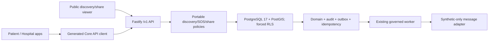

# Implementation Plan: Discovery and SOS Foundation

> **Feature:** `006-discovery-sos-foundation` · **Spec:** `0.2.0 / SPEC_APPROVED engineering scope`
> **Target:** staged `FR-DISC-001`; `FR-HOSP-007`; `FR-SOS-001`; `FR-SOS-002`; `FR-SOS-003`; `FR-SOS-004`; `FR-FAM-006` plus applicable NFRs · **Updated:** `2026-08-20`

Applicable NFRs: `NFR-SEC-001`, `NFR-SEC-002`, `NFR-SEC-003`, `NFR-SEC-004`, `NFR-SEC-005`, `NFR-SEC-006`, `NFR-SEC-007`, `NFR-PRIV-001`, `NFR-PRIV-002`, `NFR-PRIV-004`, `NFR-I18N-001`, `NFR-A11Y-001`, `NFR-PERF-001`, `NFR-PERF-002`, `NFR-AVAIL-002`, `NFR-DATA-001`, `NFR-DATA-002`, `NFR-API-001`, `NFR-API-002`, `NFR-OBS-001`, `NFR-QUALITY-001`, and `NFR-PORT-001`.

## 1. Approved inputs

| Input                  | Version/digest                                                                                                                                               | Approval or boundary                                                                                                                                                               |
| ---------------------- | ------------------------------------------------------------------------------------------------------------------------------------------------------------ | ---------------------------------------------------------------------------------------------------------------------------------------------------------------------------------- |
| `spec.md`              | `0.2.0`                                                                                                                                                      | engineering scope approved; formal production/release gates remain open                                                                                                            |
| Active scope           | PRD v2.1.0 Phase 2 rows listed above                                                                                                                         | eligible from exact base `090efaa8c7ff3ea86e2b01efa2f77f874c0aa800`                                                                                                                |
| Constitution           | v2.1.0                                                                                                                                                       | checked below; no exception                                                                                                                                                        |
| Canonical contracts    | Master/PRD 2.1.0; API 1.1.0; Data/RLS 1.2.0; UI 0.9.1; trace matrix                                                                                          | repository authority                                                                                                                                                               |
| Clarification          | `clarification-log.md`                                                                                                                                       | exact slice and operation inventory reconciled; no critical ambiguity                                                                                                              |
| Runtime                | Node `24.18.0`, pnpm `11.13.0`, PostgreSQL 17 family                                                                                                         | locked repository baseline                                                                                                                                                         |
| PostGIS local/CI image | repository-owned `infra/db/Dockerfile.postgis`, from `postgis/postgis:17-3.5-alpine@sha256:fae81f3e8da88b8e684c58c8a8616aadda72e6fc1affcb050b490891ecb3db1c` | reviewed vector/geography-only derivative; upstream linux/amd64 manifest `sha256:966243672c7d98cb996f26854a790b3b76e3cb77455d6eeb19d72ff82d20e7af`; does not close `OPEN-TECH-001` |
| Formal evidence        | canonical `OPEN-*` register                                                                                                                                  | production integrations, emergency guarantees, and formal release remain disabled                                                                                                  |

## 2. Constitution check

| Article                          | Result and plan evidence                                                                                                   |
| -------------------------------- | -------------------------------------------------------------------------------------------------------------------------- |
| I Least privilege/default deny   | PASS — public minimum discovery; exact self/current-caregiver permissions; matched-facility purpose/AAL; forced RLS        |
| II Internal typed identity       | PASS — UUID subjects/resources; phone, coordinate, and bearer token are never identity keys                                |
| III Canonical care relationships | PASS — current guardianship/delegation permissions are reused; Emergency Contact remains separate                          |
| IV Facility memberships          | PASS — every hospital action rechecks a named current membership at the exact matched facility                             |
| V Purpose-limited patient data   | PASS — hospital, contact, and bearer projections are distinct closed minimums                                              |
| VI Clinical governance           | PASS — no diagnosis, treatment, or severity rule; emergency wording/qualification evidence still needs named safety review |
| VII Regulated evidence gate      | PASS — local synthetic capacity/map/SMS only; legal, vendor, retention, and release gates stay open                        |
| VIII Separation of duties        | PASS — subject/caregiver activation and matched-hospital acceptance are separate acts                                      |
| IX MFA and purpose               | PASS — hospital pre-arrival access is purpose-scoped; acceptance requires AAL2                                             |
| X Portable domain logic          | PASS — geospatial matching, state, share, and notification rules sit behind repository/clock/randomness/adapters           |
| XI One app per surface           | PASS — existing patient Expo and hospital Next.js surfaces only                                                            |
| XII Arabic-first consent/privacy | PASS — explicit activation, share-field choice, and location consent have `ar-EG` first with `en-EG` parity                |
| XIII Accessibility/localization  | PASS at engineering level; formal design evidence remains `OPEN-UX-001/002`                                                |
| XIV Safety-critical clarity      | PASS — stable action, call-`123` fallback, no decorative motion, no dispatch/reservation promise                           |
| XV Human authority over AI       | PASS — no AI is introduced and no inferred emergency qualification occurs                                                  |

**Pre-design gate:** PASS for seeded-synthetic engineering. There are no `NEEDS CLARIFICATION` items. `OPEN-LEGAL-001/002/007`, `OPEN-VENDOR-002`, `OPEN-UX-001/002`, `OPEN-PRODUCT-001`, `OPEN-TEAM-001`, `OPEN-TECH-001/002/003` remain open with their canonical blocking effects.

## 3. Technical context

- Targets: `apps/patient`, `apps/hospital`, `services/api`, `services/worker`, `packages/core`, `packages/contracts`, `packages/api-client`, `packages/i18n`, `packages/design-system`, `packages/observability`, `packages/test-kit`, `supabase/migrations`, `infra/db`, `infra/runbooks`, `tests`, `tools`, and synchronized canonical documents.
- Stack: TypeScript strict mode, Fastify `5.11.3`, Expo `57.0.14`, Next.js `16.3.0`, React/React Native repository versions, PostgreSQL 17 with PostGIS 3.5.7, TypeBox source contracts, OpenAPI 3.1.1, Vitest/Node tests, and Playwright-style live browser evidence.
- Local/CI database: replace the plain PostgreSQL container with the digest-pinned PostGIS image above while preserving PostgreSQL 17 data-path semantics. The migration explicitly enables `postgis`; CI records `version()` and `PostGIS_Full_Version()`.
- Deterministic synthetic configuration: named discovery radius, SOS match radius, allowed capacity source, and freshness boundary are required in local/CI fixtures. Production absence fails closed to stale/no match. Test values are not operational or legal claims.
- Public geospatial search: WGS84/SRID 4326 point, GiST prefilter, exact distance, stable `(distance_m, facility_id)` ordering, and an opaque cursor bound to normalized filters. Search coordinates never enter tables, logs, traces, analytics, or vendors.
- Exact operation inventory: `searchFacilities`, `getFacilityCapacity`, `createSosIncident`, `getSosIncident`, `listSosPrearrivals`, `acceptSosPrearrival`, `closeSosIncident`, `createEmergencyShare`, `revokeEmergencyShare`, `viewEmergencyShare`. No eleventh operation and no capacity-write endpoint.
- Reuse: current person/session/AAL/purpose context, 003 facility/license/membership and forced-RLS patterns, 004 `sos.activate`/`sos.share` and Emergency Contact consent, 005 idempotency/audit/outbox/template/retry/dedup/DLQ/local messaging, shared contracts/client/i18n/design/observability.
- Absent dependencies: there is no production map/geocoder, SMS provider, capacity publisher, doctor/stock/review slice, hospital arrival/triage/bed workflow, or complete clinical profile source. Those absences remain explicit.

## 4. Proposed design and dependency flow

The API derives authorization from current database facts, sets transaction-local context, and uses the non-owner `shifaa_api` role. Discovery reads a fixed public projection. SOS activation locks/validates subject authority, stores the one explicit point, selects at most one eligible hospital using fresh aggregate capacity, and commits incident, idempotency result, audit, and minimum contact outbox atomically. Hospital acceptance and close use optimistic version checks so one concurrent transition wins.

Emergency-share plaintext contains at least 256 random bits, is returned once, and is immediately reduced to a unique SHA-256 digest for persistence. `viewEmergencyShare` locks and consumes one valid link in the same transaction as its safe access audit. It resolves only canonical sources that actually exist at implementation time. Selected fields without a source are listed in `unavailable_fields`; no emergency-profile table, shadow clinical table, or fabricated value is permitted.

## 5. Work products

### Data and migrations

- Add verified PostGIS `geography(Point,4326)` location and verification timestamp to existing facilities plus GiST and active/verified lookup indexes. Expand the already-canonical logical `identity.patients.blood_group` field for deterministic synthetic share evidence. Licensed services derive from current verified, unexpired license activities; add no parallel service authority unless implementation research demonstrates an unavoidable normalized projection.
- Add `hospital.capacity_projections` with exact internal aggregate counts, closed signal/source/freshness/version constraints, and no patient, ward, bed, or clinical columns. Public output exposes only band/signal/freshness.
- Add `platform.sos_incidents` and `platform.emergency_share_links` with closed states/reasons/field codes, timestamp-shape constraints, optimistic versions, unique token digest, maximum 30-minute expiry, and access limit one. Exact share codes are `blood_group`, `confirmed_allergies`, `active_dispensed_medicines`, `chronic_conditions`, and `emergency_notes`; only canonical synthetic `blood_group` can be available in 006 and all other codes return `unavailable_fields`.
- Extend existing outbox/template inventory only for the closed `sos.emergency_contact.requested` projection and published paired `SOS_LIFE_SAFETY` local template. Fan out only when the incident preference is `all_confirmed`; recheck each current confirmed consent, precision, callback source, inventory, and synthetic provider immediately before delivery.
- Use explicit grants, `ENABLE ROW LEVEL SECURITY`, `FORCE ROW LEVEL SECURITY`, fixed-search-path helpers, current-purpose/AAL context, and non-owner forced-RLS tests. Durable incident/audit history is roll-forward only; no guessed deletion automation.

### API and contracts

- Freeze only the ten operations in `contracts/openapi.yaml`, source TypeBox contracts, registry, generated client, Fastify routes, and contract tests. Runtime prefix is `/v1`; all protected, SOS, PHI, and token responses are `private, no-store` with `X-Request-Id` and localized RFC 9457 problems.
- Public discovery accepts bounded type/service plus either transient coordinates or a manual administrative area. Pagination is opaque and deterministic. Public fields exclude license evidence, membership, hidden counts, exact query coordinates, patients, wards, and beds.
- Mutations use canonical idempotency; accept/close/revoke also require `If-Match`. Changed replay and stale versions are `409`. No-match activation is a successful incident result with nearby verified hospitals and call-`123` guidance, never a dispatch/reservation claim.
- Public share viewing is the catalogued path operation. The public app takes a token from the URL fragment, removes it from browser history before the API call, does not persist it, and never renders it after use.

### UI, localization, and accessibility

- Implement contracted states for patient `/discover`, `/discover/map`, `/sos`, `/sos/:id`, `/sos/:id/share`, public `/sos/share`, and hospital `/capacity` plus `/sos-prearrivals` without adding a second app or later hospital flow.
- Use generated API calls only, no direct database access, no sensitive persistent cache, and no offline mutation queue. Reconnect performs authoritative refresh; call-`123` remains visible in degraded states.
- Ship authored `ar-EG` RTL and `en-EG` LTR parity, bidi isolation, keyboard/focus/error summary/live-region/screen-reader support, 44px targets (48px SOS action), 200% text, 400% web reflow, high contrast, and reduced motion. Emergency routes have zero decorative motion.

### Security, privacy, and observability

- Test forged patient/facility/relationship context, permission independence, revocation/expiry, purpose/AAL, direct-table denial, stale/fake capacity, idempotency replay/races, token enumeration/replay/races, scope expansion, and contact consent failure.
- Prohibit coordinates, phone/callback, raw or hashed token, emergency fields, rendered message, free text, full body, and contact content from logs/traces/analytics/outbox beyond the closed delivery projection. Metrics remain low-cardinality.
- Production map/geocoder, SMS, and capacity publishing are hard-disabled. Contact failure never changes incident truth or implies provider contact.

## 6. Test and evidence plan

| Family               | Deterministic evidence                                                                                                                                                         |
| -------------------- | ------------------------------------------------------------------------------------------------------------------------------------------------------------------------------ |
| Contract/inventory   | OpenAPI 3.1.1 parse; exactly ten operation IDs; catalog/TypeBox/client/path/FR parity; no later-phase operation                                                                |
| Geospatial/discovery | SRID/range, GiST plan, distance/order/cursor, type/service/manual area, location denial, active/verified/license exclusion, coordinate redaction                               |
| Capacity/matching    | exact freshness boundary, missing production config, stale/unknown/source/count negatives, deterministic single match, no-match `123` path                                     |
| SOS atomicity        | same/changed replay, concurrent create/accept/close, canonical response, audit/outbox/idempotency one-effect assertions                                                        |
| Authorization/RLS    | non-owner forced-RLS actor/resource/action/facility/patient/purpose/AAL matrix and current revocation checks                                                                   |
| Share privacy        | >=256-bit token, digest-only persistence, <=30m, scope intersection, unavailable fields, first-use/replay/revoke/expiry and access/revoke race                                 |
| Contact worker       | `all_confirmed` preference plus current confirmed contacts only; precision downgrade; exact fields/template; retry/DLQ/dedup; every prohibited event/contact/provider negative |
| UI/I18N/A11y         | live AR RTL/EN LTR journeys and all states/viewports/input modes from `spec.md` with inspected screenshots                                                                     |
| Performance          | dataset cardinality/config/hardware/query plan plus p50/p95/p99: reads <=400ms, mutations <=800ms, SOS match <=2s; patient-home regression                                     |
| Migration/operations | clean forward, backup/restore/roll-forward, PostGIS version/index/RLS/token checks, flags/kill switches, production-disabled adapters                                          |
| Full regression      | clean repository Compose volume then one isolated `pnpm verify`; no immediate extra `pnpm db:reset`                                                                            |

## 7. Delivery sequence

1. Freeze OpenAPI, deterministic synthetic configuration/fixtures, and bilingual strings.
2. Pin the PostGIS container; add expand migration, constraints, indexes, policies, grants, schema, and forced-RLS tests.
3. Add pure policies, source contracts, and the generated client; prove exact ten-operation and payload drift checks.
4. Add the shared PostgreSQL repository/use-case base, then implement each operation group and its Fastify routes before that story's UI.
5. Deliver discovery, subject SOS, hospital capacity/pre-arrival, and share stories in task-graph order; independently test each API before its patient/public/hospital surface.
6. Connect the closed SOS contact event to the existing worker after committed SOS behavior exists; add delivery status UI only after worker tests pass.
7. Run integrated acceptance, forced-RLS/security/redaction, geospatial/performance, migration/restore, and live AR/EN evidence.
8. Update runbook, traceability/canonical overlays, and evidence only from observed results; run post-implementation analyze and quality guards.
9. Run clean full verification, push the feature branch, open the PR, wait for all required up-to-date checks, and stop at ready-for-merge for explicit squash-merge authorization.

Dependencies are strict: container/migration precede PostGIS repository tests; source contracts precede generated client/routes; committed outbox precedes worker delivery; running API precedes live UI. No 007 work is allowed.

## 8. Rollout, rollback, and gates

- Independent flags: discovery UI, SOS activation, pre-arrivals, share create/view, and local contact delivery. Kill switches block new activation/share/contact while preserving call-`123`, incident read/close, share revocation, and committed audit truth.
- Deploy: pin/scan image -> expand/validate PostGIS and forced RLS -> seed synthetic facilities/capacity/template -> deploy API/worker disabled -> enable local cohort -> enable UI.
- Rollback: disable affected flags/routes and roll forward durable structures. Do not delete incidents, links, audit, outbox, notification attempts, or consent history.
- `OPEN-TECH-001` remains open because a digest choice is not an SBOM, clean reproducible-build log, signature/checksum policy, multi-platform decision, or named Architecture/Platform acceptance. `OPEN-TECH-002/003` remain open until implementation/client/DDL and formal harness evidence exist.
- `OPEN-LEGAL-001/002/007`, `OPEN-VENDOR-002`, `OPEN-UX-001/002`, `OPEN-PRODUCT-001`, and `OPEN-TEAM-001` continue to block their catalogued production/formal approvals. This plan provides no production emergency guarantee.

## 9. Post-design constitution recheck

PASS for seeded-synthetic implementation with no exception. The design keeps current authorization plus forced RLS, minimum projections, no invented clinical source, explicit user/hospital actions, portable adapters, Arabic-first accessible emergency UI, and honest degraded copy. Formal approval and production claims remain blocked by every applicable open gate above.
