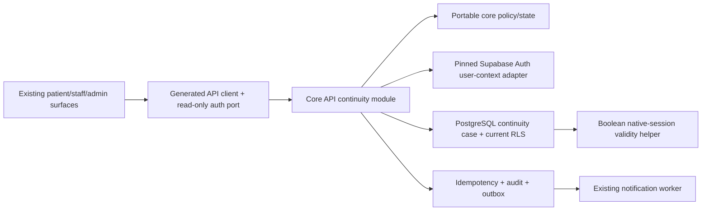

# Implementation Plan: Identity Continuity, Sessions, MFA, and Recovery

> **Feature:** `007-identity-continuity-sessions-mfa-recovery` · **Spec version/status:** `1.0.0 / SPEC_APPROVED`
> **Target FR/NFR:** four FRs; PATIENT plus `NFR-PRIV-003` · **Owner:** Yousef Osama · **Updated:** `2026-08-25`

## 1. Approved inputs

| Input               | Version/digest                                                              | Approval/gate                                               |
| ------------------- | --------------------------------------------------------------------------- | ----------------------------------------------------------- |
| `spec.md`           | v1.0.0 / `47fc4226eb2d89271f14e70a09a1296ceb3744b4e9bcc2dc6ccb82009675af0c` | Product/Architecture `SPEC_APPROVED` 2026-08-25             |
| Active scope        | PRD/Master v2.1.2; Roadmap 007                                              | four ACTIVE FRs; eight exact operations                     |
| Constitution        | v2.1.0 / `25419aa07eca0c7846a80acb9720e3f4041c0970cd78025fbf1107bae659c30a` | all articles checked below                                  |
| Legal transition    | v2.1.1 amendment                                                            | `OPEN-LEGAL-006` closed for specification/development       |
| Team/security       | v2.1.2 amendment + approved security memo                                   | `OPEN-TEAM-001` and development-stage `OPEN-SEC-001` closed |
| AGY specify/clarify | project `a6ba7a48-887a-455f-af36-283481d34f26`                              | no CRITICAL/HIGH; bounded findings accepted                 |

## 2. Constitution check

| Article                                | Result and evidence                                                                                     |
| -------------------------------------- | ------------------------------------------------------------------------------------------------------- |
| I Least privilege/default deny         | PASS — per-request native session check, deny-only restricted binding, complete API/RLS negative matrix |
| II Internal typed identity             | PASS — JWT `sub` maps existing internal UUID; no document/handle credential or duplicate person         |
| III Canonical care relationships       | PASS — only existing self/guardianship/delegation; transition revokes targeted guardianship only        |
| IV Facility membership/attribution     | PASS — workforce/admin retains named membership, AAL, purpose/reason, audit                             |
| V Patient-centric purpose-limited data | PASS — same patient/record; minimum case/factor/session projections                                     |
| VI Dual clinical governance            | N/A — no clinical code/content/override decision                                                        |
| VII Regulated evidence gate            | PASS — synthetic-only; production legal/vendor/PHI gates remain disabled                                |
| VIII Separation of duties              | PASS — assigned support reviewer distinct from subject/prior guardian; DB-representable checks          |
| IX MFA/purpose                         | PASS — exact v2.1.2 AAL/AMR/session/recovery policy and deterministic tests                             |
| X Portable domain logic                | PASS — pure policy in core; Supabase behind `packages/auth`/API adapter ports                           |
| XI One app per surface                 | PASS — existing patient/staff/admin apps/routes only                                                    |
| XII Arabic-first consent/privacy       | PASS — no consent change; Arabic-first security copy and minimum processing inventory                   |
| XIII Accessibility/localization        | PASS — AR/EN, RTL/LTR, keyboard/screen reader, reflow/touch/contrast/reduced motion first pass          |
| XIV Safety UI clarity                  | PASS — stable high-risk/recovery/transition confirmation and no decorative delay                        |
| XV Human authority over AI             | N/A — no AI                                                                                             |

Post-design check: PASS. No Constitution exception, new role/relationship/operation, or production gate
waiver exists.

## 3. Technical context

- Runtime: Node `24.18.0`, pnpm `11.13.0`, TypeScript `7.0.2`, Fastify `5.11.3`,
  `@supabase/supabase-js 2.112.2`, Supabase CLI `2.113.0`, `jose 6.2.8`, PostgreSQL 17.
- Target paths: `packages/auth`, `packages/core`, `packages/contracts`, `packages/api-client`,
  `services/api`, `services/worker`, `apps/patient`, existing staff/admin shells, `supabase/config.toml`,
  migrations/tests, shared i18n/design-system, E2E/evidence/runbook.
- Dataset/topology: 100 concurrent sessions, 5,000 people/patients, 5,000 native checks, 1,000
  recovery cases, 1,000 transition cases, 20 warmed API DB connections.
- SLO: reads p95 ≤400ms, mutations p95 ≤800ms; patient device targets remain `OPEN-TECH-003` formal
  evidence.
- Reuse: 001 Auth/JWT/identity verification, 003 AAL/purpose/membership, 004 relationships/RLS, 005
  notification/outbox/idempotency, existing API/client/i18n/UI patterns.
- External adapters: native local Supabase Auth; local-synthetic proofing/notification only. Production
  Valify/SMS/passkeys remain disabled.

## 4. Proposed design and dependency flow

Native Auth authenticates and owns sessions/factors. PostgreSQL owns SHIFAA workflow evidence and can
only narrow a valid native session. The Core API coordinates supported Auth calls with a durable
safety-first staged command; it never grants access on partial completion. Pure eligibility, factor-
removal, recovery, transition, and freshness policies stay in `packages/core`.

## 5. Work products

### Data and migration

- Generate one imperative migration with `supabase migration new identity_continuity_sessions_mfa_recovery`;
  expected reviewed path `supabase/migrations/20260825000700_identity_continuity_sessions_mfa_recovery.sql`.
- Add `identity.continuity_cases`, exact checks/unconditional FK indexes/RLS, boolean native-session
  helper, state functions, processing inventory, outbox types/index scope, recreated worker event
  select/lease policies, local paired templates, and synthetic fixtures per `data-model.md`.
- No Auth-schema object/mutation, person/patient/self-record insertion, shadow session/factor table,
  legal-status table, hard delete, or statutory duration.
- Add fresh/upgrade/compatibility/state/concurrency/forced-RLS tests. Roll forward after durable cases.

### API, auth ports, and generated clients

- Freeze exactly eight operations from `contracts/openapi.yaml`; no catalog operation is added/renamed.
- Extend `packages/auth` verifier with required UUID `session_id`, closed AAL, timestamped AMR extraction,
  and typed native Auth session/factor commands/listing. No user metadata authorization.
- Add Core API module/repository/routes plus Supabase Auth adapter, native validity call, staged command,
  preauth HMAC principal, per-route limits, version/idempotency, audit/outbox, private/no-store, and
  stable localized RFC 9457 problems.
- Register the catalogued required JSON schema for `DELETE /auth/mfa/factors/:factorId` and prove the
  standard Fastify parser plus generated client transmit it with `application/json`; no custom parser
  is added unless an executable integration test proves the pinned Fastify behavior differs.
- Existing `login`/`verifyOtp` remains unchanged and is contract-tested as the step-up prerequisite.
  Any mismatch stops implementation; no new endpoint.
- Regenerate source schemas/clients and require zero drift against API Catalog/OpenAPI/route registry.

### UI, localization, and accessibility

- Implement existing patient `/mfa`, `/recovery`, and `/relationships` transition states; add shared
  step-up/session-expired/Auth-degraded components to existing staff/admin shells.
- Use generated Core API client for every mutation and read-only `packages/auth` factor listing only.
- Author Arabic-first and English-parity keys; bidi-isolate codes/times/factor labels. Cover loading,
  no-factor, pending, expiry, proof/review, human-review, restricted, offline, stale/conflict, failure,
  permission/AAL/purpose, confirmation, and success.
- Verify keyboard, screen reader/live regions, focus restore, 200%/400% reflow, 44×44, contrast,
  reduced motion, compact/desktop/reference Android; formal visual claims remain gated.

### Events, notifications, and vendors

- Reuse 005 outbox/worker with four minimum event types and paired AR/EN local templates.
- Factor/recovery recipients are every currently verified subject address; transition recipient is the
  subject and only a separately authorized minimum recipient. Emergency Contacts never receive them.
- Preserve aggregate/version dedup, bounded retry, DLQ, secret/PHI field allowlists, and no false
  delivery claim. Production SMS/identity adapters remain disabled.

### Security, privacy, and abuse controls

- Exact policy from v2.1.2: 15m JWT, 23h45m/24h, 45m/60m, 10s reuse, current/all revocation,
  foreground-only refresh, native session validation, AAL2, 299/300/301s AMR, TOTP-only, quota/expiry,
  serialized removal, uniform recovery, four-operation restriction, safe storage/redaction.
- Exact v2.1.1 transition matrix and vectors 001–020; no automatic trigger or legal inference.
- Run ASVS L2 plus applicable L3/API Top 10, Auth/RLS/search-path/service-role/direct-SQL, CSRF/cookie/
  native storage, replay/race/rate/oracle, dependency/SAST/secret/sentinel reviews.

## 6. Test and evidence plan

| Requirement/test family     | Level                            | Fixture/vector                                                              | Expected evidence                                                        |
| --------------------------- | -------------------------------- | --------------------------------------------------------------------------- | ------------------------------------------------------------------------ |
| Sessions/reuse/logout       | unit, Auth integration, API, E2E | `AC-01..06`, fake clocks, concurrent parent/ancestor, cross-device          | `tests/e2e/identity-continuity-sessions.spec.ts`, Auth logs/DB assertion |
| MFA/AMR                     | unit, native Auth, API, RLS      | `AC-07..10`, 299/300/301, pending/expiry/replay/race/last factor            | `tests/e2e/identity-continuity-mfa.spec.ts`                              |
| Recovery                    | core/API/Auth/E2E/security       | `AC-11..18`, 200 attempt oracle sample, restricted registry matrix          | `tests/e2e/identity-continuity-recovery.spec.ts`                         |
| Transition                  | core/schema/RLS/API/E2E          | `AC-23..30`, legal vectors 001–020, same IDs/links, concurrent decision     | `tests/e2e/identity-continuity-transition.spec.ts`                       |
| Authorization/admin         | API + forced RLS                 | `AC-07/08/20/22/28/29`; every actor/resource/action/AAL/purpose             | SQL reports + API negative matrix                                        |
| Contracts/idempotency       | schema/route/client/integration  | exact eight operations, same/changed/concurrent, encrypted transient replay | contract verifier + generated-client zero diff                           |
| Notifications/redaction     | worker/integration/security      | factor/recovery/transition allowlists, retry/DLQ/dedup, sentinels           | worker tests + prohibited-sentinel report                                |
| AR/EN accessibility/offline | component/E2E/live               | `AC-18/31`, all states/viewports/input modes                                | inspected screenshots and live QA record                                 |
| Performance                 | load/reference device            | R-10 dataset/topology                                                       | p95 report; `OPEN-TECH-003` limitation declared                          |
| Full regression             | repository                       | clean synthetic DB                                                          | `corepack pnpm verify` exit 0                                            |

## 7. Delivery sequence

1. Revalidate immutable approvals, pinned Auth schema/config, and exact operation registry.
2. Add deterministic fixtures, frozen OpenAPI, i18n keys, and contract tests before production code.
3. Add migration/RLS/compatibility/state/concurrency tests, then reviewed migration.
4. Add pure policy types/tests and Auth port/verifier tests.
5. Add staged API adapter/repository/routes with native Auth real-stack tests.
6. Regenerate contracts/client; require exact catalog/registry parity.
7. Deliver sessions, MFA, recovery, transition stories independently with checkpoints.
8. Add worker notifications and shared staff/admin step-up states.
9. Run security/performance/redaction, then live AR/EN accessibility evidence.
10. Update canonical realization/trace/runbook/evidence, post-implementation analyze, and clean verify.

Parallel work is limited to non-overlapping fixture/contract/i18n/test files after their dependencies.
Auth adapter, workflow migration, and authorization policy are never parallelized without an approved
interface because their invariants intersect.

## 8. Rollout, rollback, and operations

- Config: add `identityContinuityEnabled`; default true only in test/development after local Auth
  compatibility passes, always false in production. TOTP local config changes do not enable production.
- Deploy: Auth config and expand migration before API/UI routes; synthetic fixtures only; warm 20
  connections before timing.
- Rollback: disable UI/routes/worker first. Before durable cases, validated drop is allowed; afterwards
  roll forward. Never restore revoked native sessions/factors/guardianship.
- Observability: low-cardinality session/factor/recovery/transition outcome/latency counters; request/
  trace IDs; no actor handle, token, proof, patient, session ID, factor ID, or PHI labels.
- Alerts: implementation Security Lead Mostafa reviews replay/recovery/authorization/security findings;
  Amira owns evidence; Yousef remains accountable. Exact alert thresholds are implementation evidence.
- Incident: Auth failure denies protected requests and writes; UI preserves login/retry/logout guidance;
  unrelated public/non-PHI capability follows its existing policy. Production enablement remains off.

## 9. Plan approval

| Gate                   | Reviewer                                          | Decision/date                                              | Evidence/blocker                                                  |
| ---------------------- | ------------------------------------------------- | ---------------------------------------------------------- | ----------------------------------------------------------------- |
| Architecture/data      | Yousef Osama                                      | `PLAN_APPROVED` 2026-08-25                                 | AGY bounded data/API corrections accepted; no fatal contradiction |
| Security/privacy/legal | Yousef pre-implementation; Mostafa implementation | `PLAN_APPROVED` 2026-08-25; legal/security policy approved | production legal/security verification gates remain               |
| Clinical               | N/A                                               | no clinical change                                         | none                                                              |
| Design/accessibility   | Ziad at implementation                            | planned, not formal visual approval                        | `OPEN-UX-001/002`                                                 |
| QA/Product             | Amira implementation; Yousef approval             | `PLAN_APPROVED` 2026-08-25                                 | task/evidence review follows                                      |
