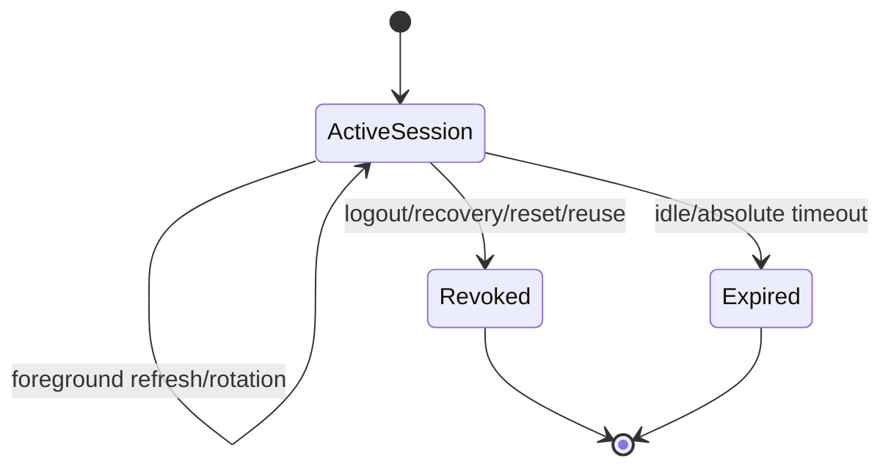
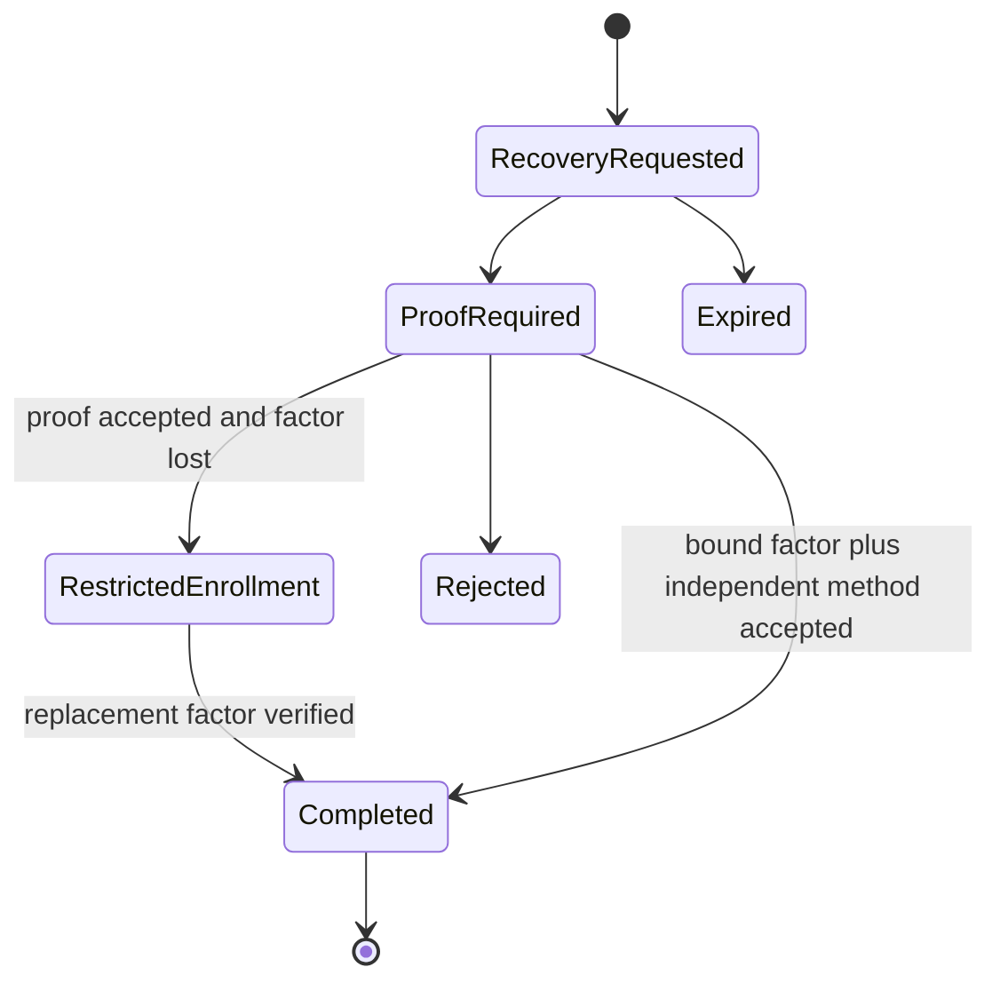
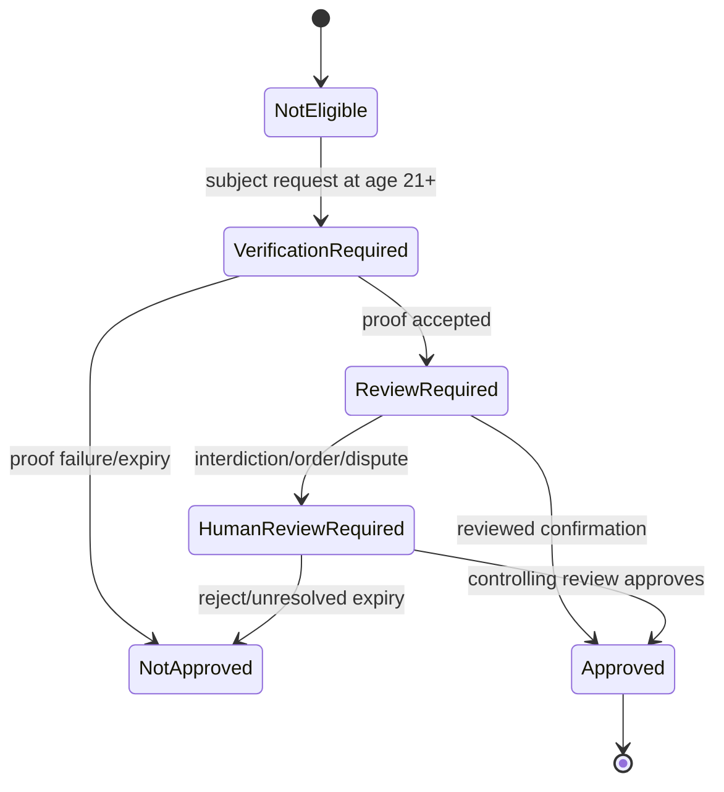

# Feature Specification: Identity Continuity, Sessions, MFA, and Recovery

## 0. Metadata and traceability

| Field                      | Value                                                                                                                                                                                                                                                                                                                                                                    |
| -------------------------- | ------------------------------------------------------------------------------------------------------------------------------------------------------------------------------------------------------------------------------------------------------------------------------------------------------------------------------------------------------------------------ |
| SpecKit feature ID         | `007-identity-continuity-sessions-mfa-recovery`                                                                                                                                                                                                                                                                                                                          |
| Status                     | `SPEC_APPROVED`                                                                                                                                                                                                                                                                                                                                                          |
| Target FR IDs              | `FR-AUTH-002`, `FR-AUTH-005`, `FR-FAM-003`, `FR-ADMIN-002`                                                                                                                                                                                                                                                                                                               |
| Target NFR IDs             | `NFR-SEC-001`, `NFR-SEC-002`, `NFR-SEC-003`, `NFR-SEC-004`, `NFR-SEC-005`, `NFR-SEC-006`, `NFR-SEC-007`, `NFR-PRIV-001`, `NFR-PRIV-002`, `NFR-PRIV-003`, `NFR-PRIV-004`, `NFR-I18N-001`, `NFR-A11Y-001`, `NFR-PERF-001`, `NFR-PERF-002`, `NFR-AVAIL-002`, `NFR-DATA-001`, `NFR-DATA-002`, `NFR-API-001`, `NFR-API-002`, `NFR-OBS-001`, `NFR-QUALITY-001`, `NFR-PORT-001` |
| Scope eligibility          | `ACTIVE — PRD v2.1.2; roadmap row 007; OPEN-LEGAL-006, OPEN-TEAM-001, and OPEN-SEC-001 closed on 2026-08-25`                                                                                                                                                                                                                                                             |
| Target app/service/package | `apps/patient`, existing staff/admin shells, `packages/auth`, `packages/core`, `packages/contracts`, `packages/api-client`, `services/api`, `services/worker`, PostgreSQL/Supabase local stack                                                                                                                                                                           |
| Owner                      | Yousef Osama — Product Owner, Team Lead, Architecture Lead, SpecKit/Governance Owner                                                                                                                                                                                                                                                                                     |
| Reviewers                  | Product `[Yousef]`; QA `[Amira at implementation]`; Architecture `[Yousef]`; Security `[Yousef pre-implementation, Mostafa at implementation]`; DPO/Legal `[production gates remain]`; Clinical `[N/A — no clinical decision]`; Design/A11y `[Ziad at implementation]`                                                                                                   |
| Risk class                 | `sensitive-data / authentication / account recovery / legal authority transition`                                                                                                                                                                                                                                                                                        |
| Regulatory domains         | `PDPL; development legal basis for dependent transition; production evidence remains gated`                                                                                                                                                                                                                                                                              |
| Clinical sign-off required | `No — this feature does not diagnose, prescribe, dispense, or change clinical content`                                                                                                                                                                                                                                                                                   |
| Dependencies               | `001 identity/onboarding`, `002 Supabase runtime`, `003 RBAC/AAL`, `004 Family Care`, `005 notifications`, `006 audit/outbox/runtime evidence`; baseline amendments v2.1.1 and v2.1.2                                                                                                                                                                                    |
| Parent roadmap entry       | `docs/governance/SHIFAA-Remaining-Specs-Roadmap.md`, Feature 007                                                                                                                                                                                                                                                                                                         |
| Created / updated          | `2026-08-25 / 2026-08-25`                                                                                                                                                                                                                                                                                                                                                |

## Clarifications

### Session 2026-08-25

- Q: Does Feature 007 contain any unresolved product, legal, security, actor, or scope choice requiring
  a Product Owner question? → A: No; amendments v2.1.1/v2.1.2 and the canonical roadmap/API/UI/Data
  contracts provide the bounded answers, while physical mechanics remain planning work.
- Q: Which Feature-007 actions use the exact five-minute qualifying-factor freshness rule? → A:
  Removing a factor, binding another factor when one is already verified, and an admin dependent-
  transition decision require it. First required-factor enrollment uses a fresh signed primary-
  reauthentication or approved re-proofing context because AAL2 cannot exist before the first factor.
  Current/all-session logout remains available without step-up so a user can terminate suspected
  compromise; it never grants access.
- Q: May recovery or transition reuse another operation or relationship shape? → A: Only unchanged
  `login`/`verifyOtp` may supply step-up and only the three canonical relationship types may exist;
  all other behavior stays inside the exact eight Feature-007 operations.

## 1. Problem and scope

### Problem statement

SHIFAA currently has patient login foundations and privileged-route AAL checks, but it does not yet
deliver durable session refresh/logout semantics, usable MFA enrollment/removal, safe recovery that
preserves MFA, or the reviewed transition of an eligible dependent to control of the same patient
record. Patients and staff need one coherent identity-continuity boundary that survives token replay,
lost factors, concurrent decisions, cross-device logout, and legal-authority change without creating
shadow credentials, duplicate records, or automatic access transfer.

### Actors and authorization context

| Actor                          | Facility/patient relationship                                                             | Permitted outcome                                                                              | Explicitly prohibited                                                   |
| ------------------------------ | ----------------------------------------------------------------------------------------- | ---------------------------------------------------------------------------------------------- | ----------------------------------------------------------------------- |
| Unauthenticated subject        | Own normalized recovery handle, provider-owned recovery OTP, and case token               | Start and complete a non-oracular recovery flow                                                | Account/factor enumeration, PHI access, arbitrary session creation      |
| PAT self-managed patient       | Own active person/patient/session                                                         | Refresh/logout; enroll/verify/remove optional TOTP; submit eligible dependent-transition proof | Cross-person factors/sessions, silent age transition, reviewer decision |
| Eligible dependent subject     | Existing person/patient under active guardianship                                         | On/after 21, request proofing and reviewed transition                                          | Automatic transfer at 18/21, new patient/clinical record                |
| GUA/DEL                        | Current lawful relationship only                                                          | Existing permissions until a controlling approved transition changes authority                 | Deciding transition; inherited access after approval                    |
| Workforce                      | Current facility membership, AAL2, purpose                                                | Maintain authenticated session and required MFA                                                | AAL1 access/action, shared accounts, SMS-only privileged MFA            |
| ADM-SUPPORT reviewer           | Assigned transition case, AAL2, `guardianship_review` purpose, not subject/prior guardian | Approve/reject/defer reviewed transition under controlling evidence                            | Self-review, unassigned review, guessed capacity outcome                |
| Product/Architecture authority | Governance artifacts only                                                                 | Approve specification/development policy                                                       | Runtime bypass or production authorization by document alone            |

An eligible dependent initiates transition as an authenticated person submitting identity proof
against the existing guardianship and patient record. Authentication does not create a replacement
person, patient, medical-record identity, or clinical-history container.

### In scope

- Exact operations: `refreshSession`, `logout`, `beginMfaEnrollment`, `verifyMfaEnrollment`,
  `removeMfaFactor`, `startRecovery`, `completeRecovery`, and `transitionDependent`.
- Fifteen-minute access tokens; native rotating refresh sessions; current/all-session revocation;
  configured/effective absolute and inactivity bounds; hostile reuse family revocation.
- TOTP enrollment, verification, factor listing projection needed by `/mfa`, and safe removal through
  the catalogued operations; passkey attempts remain disabled and do not create a factor.
- AAL2 and five-minute qualifying factor-event freshness for privileged/high-risk actions; reason and
  purpose capture for sensitive admin access.
- Uniform recovery initiation, factor or repeated identity proofing, restricted enrollment-only
  recovery sessions, replacement-factor verification, all-old-session revocation, and notification.
- Reviewed dependent transition at the approved legal boundary while preserving the same patient,
  person linkage, medical-record identity, and clinical history.
- Arabic RTL/English LTR patient MFA/recovery/relationship-transition states and existing workforce/
  admin step-up states, including keyboard, screen-reader, scalable-text, and reduced-motion evidence.

### Non-goals

- Feature 008 or any audit dashboard/export work.
- New operation IDs, endpoints, relationship types, platform roles, app surfaces, or shadow credential/
  session tables.
- Production Valify, SMS, passkey/WebAuthn, legal-evidence intake, real PHI, statutory retention
  automation, or production release.
- Automatic transition at age 18 or 21; algorithmic capacity/interdiction/court-order adjudication.
- Changing 004 historical artifacts or widening existing Family Care permissions.
- General device fingerprinting, IP/User-Agent authorization, one-click account freeze, or a new
  step-up endpoint.

### Dependencies and assumptions

| Item                                               | Type                                              | Evidence / open ID                                                    |
| -------------------------------------------------- | ------------------------------------------------- | --------------------------------------------------------------------- |
| Feature boundary and sequence                      | verified fact                                     | Roadmap Feature 007                                                   |
| Team ownership                                     | SHIFAA policy                                     | v2.1.2 amendment; `OPEN-TEAM-001` closed                              |
| Session/MFA/recovery values                        | SHIFAA policy                                     | v2.1.2 amendment; `OPEN-SEC-001` closed for specification/development |
| Dependent-transition legal rules                   | SHIFAA policy based on approved external analysis | v2.1.1 amendment; `OPEN-LEGAL-006` remains closed                     |
| Native sessions/factors remain authoritative       | verified architecture constraint                  | API Catalog, Architecture, Data/RLS; no shadow state                  |
| Exact physical compatibility and generated schemas | OPEN implementation evidence                      | `OPEN-TECH-002`                                                       |
| Reference devices/browser/data harness             | OPEN verification evidence                        | `OPEN-TECH-003`                                                       |
| Production PHI/legal/retention                     | OPEN production evidence                          | `OPEN-LEGAL-001`, `OPEN-LEGAL-002`, `OPEN-LEGAL-007`                  |
| Production identity/SMS providers                  | OPEN vendor evidence                              | `OPEN-VENDOR-001`, `OPEN-VENDOR-002`                                  |
| Formal pixel-identical visual approval             | OPEN verification evidence                        | `OPEN-UX-001`, `OPEN-UX-002`                                          |

## 2. Egyptian regulatory and legal validation

- [x] Seeded-synthetic processing purpose and security/audit classes are bounded by existing inventory
      policy; any new field requires inventory insertion before collection.
- [x] Authentication, recovery proof, factor metadata, transition evidence, and child/dependent context
      are classified as sensitive; secrets are excluded from persistent application data and telemetry.
- [x] Arabic-first privacy behavior and existing consent/DSR rights remain unchanged.
- [x] Minimum recipients and prohibited fields are specified; raw tokens, OTP/TOTP secrets, QR secrets,
      recovery handles, identity values, and clinical payloads never enter logs/analytics/audit/outbox.
- [x] Retention classes may be assigned, but duration/action remains `OPEN-LEGAL-002`; no statutory
      duration or deletion automation is invented.
- [x] Storage/processing country, production processors, PDPC permits, and DPO appointment remain
      `OPEN-LEGAL-001`/`OPEN-LEGAL-007` production blockers.
- [x] Dependent-transition rules use only the approved v2.1.1 development basis and preserve the same
      patient/clinical record; no external counsel identity is stored.
- [x] Facility/professional/EDA/MoHP/MOSS/UHI/CBE obligations are not changed by this feature.
- [x] Controlled drug, payment, donation, disability-entitlement, and AI decisions are out of scope.
- [x] Recovery/session/factor events remain attributable and covered by the existing breach/DSR
      foundations; production notification channels remain gated.
- [x] No new article-level legal claim is made; `OPEN-LEGAL-007` remains fully preserved.

**Blocking open items:** None before `SPEC_APPROVED`. Production/release and implementation-evidence
overlays remain `OPEN-LEGAL-001/002/007`, `OPEN-VENDOR-001/002`, `OPEN-UX-001/002`,
`OPEN-TECH-002/003`, and `NFR-SEC-007` evidence.

## 3. User Scenarios & Testing

### Journey J-01 — Continue and end a session safely

1. Given an active PAT, workforce, or admin session with a native `session_id`.
2. When the client refreshes while foreground-engaged or requests current/all-session logout.
3. The system rotates the refresh token exactly once, enforces timeout/reuse rules, or revokes the
   requested session scope; every next Core API request checks current native session validity.
4. Audit/next state: secret-free session action with request ID; revoked sessions fail immediately.

### Journey J-02 — Enroll and manage TOTP

1. Given an authenticated actor allowed to bind a factor and no live pending TOTP enrollment.
2. When the actor begins enrollment, verifies the one-time code, or removes a verified factor with
   required fresh proof.
3. The system exposes the enrollment secret once under no-store controls, makes only verified factors
   usable, serializes removal, and prevents a required last-factor downgrade.
4. Audit/notification: factor-bound/removed event contains metadata only; verified addresses are
   notified where currently permitted.

### Journey J-03 — Recover without bypassing MFA

1. Given an existing or nonexistent normalized recovery handle.
2. Recovery start creates an unbound intake with a uniform `202`; completion redeems a provider-owned
   recovery OTP through Supabase and binds a subject only when the returned subject and normalized-handle
   digest match that intake. The bound subject must then prove a factor plus an independent method or
   complete repeated identity proofing.
3. Lost-factor proof yields only a restricted enrollment session; after replacement verification,
   all old sessions are revoked before ordinary access is issued.
4. Audit/notification: one terminal effect, no oracle/secret leakage, notification to every verified
   address through allowed adapters.

### Journey J-04 — Enforce privileged AAL2 and purpose

1. Given workforce/admin access at AAL1, missing purpose/reason, or stale qualifying MFA.
2. When a protected operation is attempted, the system denies and directs the existing login/
   `verifyOtp` step-up flow; no new operation is introduced.
3. With AAL2 plus required purpose/reason and a qualifying factor event at most 300 seconds old where
   high-risk, the exact authorized operation proceeds.
4. Audit: actor/facility/purpose/reason/action/outcome without credential or PHI payload.

### Journey J-05 — Transition an eligible dependent without changing the record

1. Given the existing dependent patient/person/clinical record and current guardianship.
2. When the subject requests transition on/after 21, completes identity proofing, and an assigned
   independent human reviewer approves with no unresolved controlling blocker.
3. The system preserves the same record identity, ends prior guardian acting authority on the next
   authorization check, and grants no later guardian/delegate access without a separate lawful grant.
4. Audit/notification: attributed versioned decision and minimum notification; no legal outcome is
   inferred from age, dispute, interdiction, or court-order flags.

### Alternate, failure, and degraded paths

| Case                            | Trigger                                                             | UI/API result                                          | State/audit effect                           | Recovery                            |
| ------------------------------- | ------------------------------------------------------------------- | ------------------------------------------------------ | -------------------------------------------- | ----------------------------------- |
| Session expired/revoked         | invalid native session, 24h/60m bound, or logout                    | `401 session-expired`/authentication-required          | no domain mutation; denial correlation       | authenticate again                  |
| Auth dependency unavailable     | native session/factor check errors                                  | fail closed; no stale-JWT access                       | availability/security signal without secrets | retry after service recovery        |
| Refresh replay                  | ancestor token outside benign interval                              | family/session revoked                                 | one security event; no token logged          | full authentication/recovery        |
| Permission/AAL/purpose denied   | wrong actor, AAL1, stale AMR, missing reason/purpose                | localized RFC 9457 denial                              | no success audit/outbox/domain mutation      | correct context or step up          |
| Offline/disconnected            | any security mutation offline                                       | explicit offline state; never queued                   | zero server effect                           | reconnect and re-read current state |
| Enrollment invalid              | duplicate pending, expired, wrong/replayed code, unsupported factor | stable localized problem                               | no verified factor                           | restart after permitted interval    |
| Concurrent factor removal       | two removals race                                                   | one serialized result; loser stable conflict/denial    | required last factor remains                 | refresh factor list                 |
| Recovery oracle attempt         | nonexistent account or factor probe                                 | same `202` response class/timing envelope              | no disclosed account/factor state            | none                                |
| Restricted recovery misuse      | any operation outside four-operation allowlist                      | `403 recovery-mfa-enrollment-required`                 | no PHI/profile/admin effect                  | verify replacement factor or logout |
| Transition before 21            | request before eligibility                                          | deny; no authority mutation                            | attributed denial if authenticated           | request only when eligible          |
| Transition blocker              | active interdiction/order/dispute                                   | human review required; no inferred outcome             | no transition-derived authority change       | controlling review                  |
| Concurrent transition decisions | same case/version approve/reject race                               | one winner; loser `409 version-conflict`               | all-or-nothing record/authority/audit/outbox | refresh case                        |
| Duplicate/replay                | same key/body vs changed body                                       | stored terminal result vs `409 idempotency-key-reused` | exactly one effect                           | use new key after review            |

## 4. Requirements

### Functional Requirements

| Target PRD requirement | Required feature behavior                                                                                                                                                                | Acceptance coverage                                   |
| ---------------------- | ---------------------------------------------------------------------------------------------------------------------------------------------------------------------------------------- | ----------------------------------------------------- |
| `FR-AUTH-002`          | Support verified existing login methods plus TOTP enrollment/verification/removal; workforce/admin require AAL2; passkeys remain disabled until proven.                                  | `AC-04..AC-10`, `AC-19..AC-22`                        |
| `FR-AUTH-005`          | Rotate/revoke bounded sessions and complete non-oracular recovery using a bound factor plus independent method or repeated proofing without MFA downgrade.                               | `AC-01..AC-03`, `AC-11..AC-18`                        |
| `FR-FAM-003`           | On/after approved eligibility, require identity proofing and human reviewed transition while preserving the same patient/clinical record and ending prior authority without inheritance. | `AC-23..AC-30`; `TV-FAM-CAPACITY-TRANSITION-001..020` |
| `FR-ADMIN-002`         | Require workforce/admin AAL2, sensitive-access purpose/reason, current session validation, and immutable secret-free audit.                                                              | `AC-07`, `AC-08`, `AC-19..AC-22`, `AC-28`             |

## 5. Domain model and invariants

### Entities and ownership

| Entity                         | Owning domain                   | Authoritative source                                                            | Lifecycle owner                                              |
| ------------------------------ | ------------------------------- | ------------------------------------------------------------------------------- | ------------------------------------------------------------ |
| Native session/token family    | Supabase Auth                   | native Auth session/refresh primitives                                          | authenticated subject + Auth runtime                         |
| MFA factor/enrollment          | Supabase Auth                   | native factor primitives                                                        | authenticated subject under SHIFAA policy                    |
| Recovery case/proof            | Identity continuity             | SHIFAA workflow evidence referencing native Auth/proofing, never token material | subject; assigned reviewer where re-proofing requires review |
| Dependent transition case      | Family Care/identity continuity | versioned workflow evidence tied to existing guardianship/person/patient        | subject + assigned support reviewer                          |
| Person/patient/clinical record | Identity/clinical               | existing canonical rows and record links                                        | same subject before/after transition                         |
| Audit/outbox/idempotency       | Platform                        | existing shared foundations                                                     | API transaction / worker                                     |

### State machines

All unlisted transitions deny. These workflow states do not alter native Auth schemas or existing
care-relationship enums by implication; the plan must define a physical representation explicitly.

### Invariants and concurrency

- Native Supabase sessions/factors are authoritative; SHIFAA stores no refresh/access token, password,
  OTP/TOTP/QR secret, factor secret, or duplicate session-validity ledger.
- Anonymous recovery intake holds only a normalized-handle HMAC digest and is unbound until the server
  redeems a provider-owned recovery OTP and matches that digest; no Auth/admin lookup occurs at start.
- One pending TOTP enrollment per user/type; verified factor before use; pending expiry is ten minutes.
- Session/factor/recovery/transition effects, audit, outbox, canonical response, and completed
  idempotency record commit atomically where application state changes.
- Factor mutation serializes per user and re-reads native verified factors before removal.
- Transition uses `If-Match`; one concurrent decision wins and no duplicate patient/person/clinical
  record is created.
- Reviewer is assigned, AAL2/purpose-bound, and distinct from subject and prior guardian.
- Revoked relationship/session/factor authority is re-evaluated on the next request; JWT/cache claims
  cannot extend it.

## 6. Exact data and RLS contract

### Logical data contract

The implementation plan must choose the smallest physical workflow representation after inspecting
the pinned Supabase schema. It may add versioned recovery/transition evidence but must not shadow
native credential, factor, token-family, or session validity state.

| Logical field                       | Rule                                                                                     | Classification / retention                                                             |
| ----------------------------------- | ---------------------------------------------------------------------------------------- | -------------------------------------------------------------------------------------- |
| Case identity/type/status/version   | UUID; closed recovery/transition types and approved transitions                          | sensitive / `IDENTITY_PROOF` or `SECURITY_AUDIT`; duration open under `OPEN-LEGAL-002` |
| Subject person/patient/relationship | Internal UUID foreign keys; patient/person continuity immutable for transition           | sensitive health/identity relationship                                                 |
| Proof reference/result              | Existing verification/proof reference and minimum reason code; no raw document or secret | sensitive identity evidence                                                            |
| Reviewer/decision attribution       | Internal actor, assignment, purpose, reason, decided time                                | security/legal audit                                                                   |
| Recovery restriction                | Signed native-session-derived scope, not an application session table                    | transient security metadata                                                            |
| Expiry/version/timestamps           | UTC `TIMESTAMPTZ`; deterministic clock injection in tests                                | security audit                                                                         |

### Migration requirements

- Expand only after the plan reconciles logical Data/RLS with pinned physical DDL and native Supabase.
- Validate existing person/patient/relationship uniqueness before transition support.
- No synthetic backfill may create eligibility, approval, factor, or session state.
- Roll forward is preferred after evidence rows exist; disabling routes must leave existing auth and
  Family Care functionality intact.

### RLS/action matrix

| Actor/context                                                          | SELECT                                                                   | INSERT                                              | UPDATE/state action                        | DELETE         | Negative test family                              |
| ---------------------------------------------------------------------- | ------------------------------------------------------------------------ | --------------------------------------------------- | ------------------------------------------ | -------------- | ------------------------------------------------- |
| Subject acting on own security context (PAT or workforce/admin person) | own minimum case/result                                                  | own recovery/transition submission through API only | proof/submission or own-factor action only | none           | cross-subject, reviewer-action denial             |
| Current GUA/DEL                                                        | no transition case unless separately required minimum notice is approved | none                                                | none                                       | none           | prior-authority and cross-patient denial          |
| Assigned ADM-SUPPORT AAL2/purpose                                      | assigned minimum transition worklist                                     | none                                                | versioned review decision through API      | none           | unassigned/self/prior-guardian/wrong-purpose/AAL1 |
| `shifaa_api` non-owner                                                 | transaction-scoped exact rows                                            | policy-checked                                      | policy-checked                             | no hard delete | owner/service/BYPASSRLS prohibition               |
| anon/authenticated direct SQL                                          | none                                                                     | none                                                | none                                       | none           | forced-RLS/default-deny matrix                    |

Every new application table uses `ENABLE` and `FORCE ROW LEVEL SECURITY`; online execution uses the
non-owner `shifaa_api` role. Security-definer helpers are boolean/minimum, fixed-search-path, revoked
from public/authenticated roles, and tested against search-path/owner/service bypass.

## 7. API endpoint specifications

All eight operations use `/v1`, private/no-store responses, `X-Request-Id`, localized RFC 9457 errors,
exact actor/idempotency scopes, rate limits, secret-safe audit, and canonical JSON schemas in
`contracts/openapi.yaml`. Mutations require `Idempotency-Key`; `transitionDependent` also requires
`If-Match`.

The `/mfa` screen obtains the actor's minimum native factor summaries through a read-only
`packages/auth` port backed by the authenticated Supabase Auth session. That read creates no Core API
operation and exposes no factor secret. Every enrollment, verification, removal, refresh, logout,
recovery, and transition mutation still uses the exact catalogued Core API operation.

| Operation                                                                 | Actors/context                                                                                                                                                                                                   | Request / success                                                                            | Required errors and effects                                                                                                   |
| ------------------------------------------------------------------------- | ---------------------------------------------------------------------------------------------------------------------------------------------------------------------------------------------------------------- | -------------------------------------------------------------------------------------------- | ----------------------------------------------------------------------------------------------------------------------------- |
| `refreshSession` — `POST /auth/session/refresh`                           | web strict cookie + CSRF/Origin/Fetch-Metadata; native secure refresh token; foreground-engaged client                                                                                                           | rotated refresh input → `200` access/session projection and one rotated child                | `401 session-expired/session-revoked`, `409 idempotency-key-reused`; hostile reuse revokes family; no raw token persistence   |
| `logout` — `POST /auth/logout`                                            | authenticated session; current or all-sessions scope                                                                                                                                                             | `{allSessions:boolean}` → `200` revoked timestamp/scope                                      | replay returns stored result; current `session_id` or all pre-existing sessions revoked                                       |
| `beginMfaEnrollment` — `POST /auth/mfa/enroll`                            | authenticated/restricted enrollment session; if a verified factor exists, qualifying factor `amr` ≤300s; first required factor uses fresh signed primary reauthentication/re-proofing                            | `{factorType:'totp'}` → `200` one-time secret/QR-safe projection, enrollment ID, expiry      | pending quota/rate/unsupported factor; `Cache-Control: private, no-store`; no secret audit/log                                |
| `verifyMfaEnrollment` — `POST /auth/mfa/enroll/verify`                    | enrollment owner                                                                                                                                                                                                 | enrollment ID + code → `200` minimum verified factor summary/current AAL                     | wrong/replayed/expired code or case; one verified effect                                                                      |
| `removeMfaFactor` — `DELETE /auth/mfa/factors/{factorId}`                 | PAT optional-last-factor removal: qualifying AAL2 ≤300s plus explicit warning/confirmation, outside recovery; mandatory-MFA account: qualifying AAL2 ≤300s plus another verified factor or completed re-proofing | factor ID + proof reference → `200` removal/new AAL summary                                  | wrong owner, stale proof, last required workforce/admin factor, race, changed replay; immediate reauthorization               |
| `startRecovery` — `POST /auth/recovery`                                   | PUB; HMAC-scoped normalized handle                                                                                                                                                                               | handle/locale → uniform `202` opaque status                                                  | same response class/timing envelope for nonexistent/existing; rate limit without oracle                                       |
| `completeRecovery` — `POST /auth/recovery/{caseId}/complete`              | opaque case holder with approved proof/factor evidence                                                                                                                                                           | evidence + new credential → `200` new ordinary session or restricted enrollment-only session | expired/replayed/wrong proof/race; all old sessions revoked before ordinary access                                            |
| `transitionDependent` — `POST /guardianships/{relationshipId}/transition` | subject submission with verified identity context, or assigned ADM-SUPPORT decision with qualifying factor `amr` ≤300s, distinguished by closed action schema                                                    | submit proof/decision → `200` versioned case/result                                          | before-21, proof, blocker, role/AAL/purpose/assignment/version/idempotency errors; same record, atomic authority/audit/outbox |

The existing `login` and `verifyOtp` operations are unchanged references for step-up. If their existing
challenge/session contract cannot prove the required AAL/AMR behavior, implementation stops for
canonical reconciliation; no ninth operation is added.

For `transitionDependent`, the dependent's authenticated person submits proof against the existing
guardianship/patient record. The operation never creates a replacement person, patient, medical-record
identity, or clinical-history container.

## 8. UI/UX and edge-state matrix

| App/route                   | Required states                                                                                                                                               | Arabic/English and controls                                                                                                         | Permission/offline behavior                                                                        |
| --------------------------- | ------------------------------------------------------------------------------------------------------------------------------------------------------------- | ----------------------------------------------------------------------------------------------------------------------------------- | -------------------------------------------------------------------------------------------------- |
| Patient `/mfa`              | loading, no factor, pending with expiry, QR/secret shown once, verify error, verified list, removal confirm, last-factor denial, unsupported passkey, success | Arabic RTL/English LTR parity; bidi-isolated codes; copy/manual secret alternatives; focus moves to heading/error; live expiry text | no offline queue; re-read on reconnect; destructive removal names factor/consequence               |
| Patient `/recovery`         | request, uniform accepted, proof required/pending/failed, restricted enrollment, completed, expired/rate-limited                                              | same visible response for account existence; secret-safe URL; screen-reader status; 200% reflow                                     | no offline submission/queue; direct API restricted matrix                                          |
| Patient `/relationships`    | not eligible, eligible/verification, review pending, human review required, approved, rejected/version conflict                                               | no legal-capacity inference; same-record continuity; old-authority consequence; confirmation before submission                      | no offline transition queue; current authority shown until server decision; refresh after conflict |
| Existing staff/admin shells | session expired, AAL1 step-up required, stale MFA, missing purpose/reason, authorized, Auth degraded                                                          | existing login/OTP challenge; focus restoration to intended action; no sensitive content before authorization                       | all protected routes server-deny; no cached authorization extension                                |

All surfaces meet Arabic RTL/English LTR parity, 44×44 targets, keyboard-only completion, screen-reader
names/status, visible focus, WCAG AA contrast, 200% text reflow, reduced motion, and no color/icon-only
security state. Codes, timestamps, factor labels, and identifiers use bidi isolation.

## 9. Notifications and asynchronous events

| Source event                 | Recipient policy                                                          | Channel/template                                       | Allowed data                                                              | Dedup/retry                                |
| ---------------------------- | ------------------------------------------------------------------------- | ------------------------------------------------------ | ------------------------------------------------------------------------- | ------------------------------------------ |
| Factor verified/removed      | every verified address for subject                                        | existing permitted local adapter/template version      | display name, factor type, action time, support action; no secret         | aggregate/version dedup; bounded retry/DLQ |
| Recovery completed           | every verified address                                                    | existing permitted local adapter; production SMS gated | display name, recovery time, session-revocation notice                    | one visible delivery/address; retry/DLQ    |
| Transition submitted/decided | subject and only currently lawful minimum recipient as approved by policy | local notification template                            | case status, action time, safe next step; no identity proof/clinical data | case-version dedup; bounded retry          |

Emergency Contacts receive none of these events. No notification contains factor existence before
authentication, credential material, proofing data, relationship evidence, or clinical record links.

## 10. Security, privacy, and abuse cases

| Threat/misuse                         | Control                                                                                   | Verification                                                               |
| ------------------------------------- | ----------------------------------------------------------------------------------------- | -------------------------------------------------------------------------- |
| Stolen/replayed refresh token         | strict storage/cookie controls, rotation, ten-second vendor interval, family revocation   | benign concurrency vs hostile ancestor replay and child denial             |
| Unattended session extension          | foreground-engagement refresh only; configured/effective idle/absolute bounds             | hidden/background/blurred/46m idle fake-clock vectors                      |
| JWT after logout                      | native `session_id` validation every request                                              | current/all/cross-device/logout/Auth-outage tests                          |
| Refresh masquerades as MFA            | timestamped qualifying factor `amr`; exact 300s/301s rule                                 | `t0` MFA plus `t0+10m` refresh remains stale                               |
| MFA enrollment/removal abuse          | pending quota/expiry/rate, verified-only, serialization, last-factor rules                | wrong/replay/race/last-factor/post-removal matrix                          |
| Recovery enumeration/MFA bypass       | uniform 202, HMAC limits, independent proof, restricted server allowlist                  | timing/body class; exhaustive operation denial; all-old-session revocation |
| Cross-person/case/relationship access | API authorization plus forced RLS/current state                                           | actor/resource/action/purpose/AAL and direct-SQL negatives                 |
| Transition authority theft            | identity proof, assigned independent reviewer, version/idempotency, same-record invariant | legal vectors 001–020, concurrent decision, former authority denial        |
| Secret/PHI leakage                    | no-store, field allowlists, redaction, no URL/log/audit token material                    | sentinel scan of responses, logs, traces, audit, outbox, analytics         |

## 11. Success Criteria

### Measurable outcomes

| ID       | Outcome                                                                                                 | Measurement method                                | Required threshold                                                         |
| -------- | ------------------------------------------------------------------------------------------------------- | ------------------------------------------------- | -------------------------------------------------------------------------- |
| `SC-001` | Valid active users continue a foreground session without duplicate effects                              | deterministic refresh/replay journey              | 100% of approved vectors pass; one child/effect                            |
| `SC-002` | Revoked, expired, reused, or invalid sessions cannot access any protected operation                     | registered-operation authorization matrix         | 100% deny on next request                                                  |
| `SC-003` | Workforce/admin access never proceeds at AAL1 or without required purpose/reason                        | all privileged-operation matrix                   | 100% deny; fresh authorized controls pass                                  |
| `SC-004` | MFA enrollment/removal cannot create an unverified usable factor or remove a required last factor       | deterministic state/race suite                    | zero invariant violations                                                  |
| `SC-005` | Recovery discloses no account/factor existence and never downgrades MFA                                 | existing/nonexisting and restricted-session suite | identical status/body class; zero ordinary-route access before replacement |
| `SC-006` | Approved dependent transition preserves identity/record continuity and immediately ends prior authority | row/link/authorization evidence                   | same patient/person/medical-record identity; 100% prior-authority denial   |
| `SC-007` | Security mutations remain usable in both locales and assistive modes                                    | live compact/desktop/mobile AR/EN acceptance      | all journeys keyboard/screen-reader complete with WCAG 2.2 AA evidence     |
| `SC-008` | Core API latency remains within canonical regional targets                                              | reference seeded-synthetic load profile           | read p95 ≤400ms; mutation p95 ≤800ms                                       |
| `SC-009` | Patient security screens meet reference-device interaction targets                                      | approved device/network harness                   | patient LCP p95 ≤3.0s; input response p95 ≤200ms                           |
| `SC-010` | No credential, token, OTP/TOTP, proof, or PHI sentinel escapes approved projections                     | repository/evidence scan                          | zero prohibited sentinel hits                                              |

### Acceptance criteria and deterministic vectors

| AC      | Deterministic acceptance                                                                                                                                                    |
| ------- | --------------------------------------------------------------------------------------------------------------------------------------------------------------------------- |
| `AC-01` | JWT at `exp-1s` permits; at `exp+1s` denies.                                                                                                                                |
| `AC-02` | Configured 23h45m/45m and effective 24h/60m bounds deny beyond limits using injected clocks.                                                                                |
| `AC-03` | Foreground refresh rotates once; hidden/background/blurred/unattended client does not refresh; after 46m next refresh is `401 session-expired`.                             |
| `AC-04` | Same refresh token concurrent inside ten seconds yields one child; ancestor replay outside interval revokes family and child fails.                                         |
| `AC-05` | Current logout revokes only current session; all-session/recovery/reset paths revoke every pre-existing cross-device session.                                               |
| `AC-06` | Missing/malformed/unknown `session_id` and Auth dependency failure deny every protected request.                                                                            |
| `AC-07` | Every workforce/admin operation denies AAL1 and missing purpose/reason; correct AAL2 context permits exact action only.                                                     |
| `AC-08` | Qualifying factor `amr` at 299s/300s permits high-risk action; 301s denies; token refresh at ten minutes does not reset it.                                                 |
| `AC-09` | Only one pending TOTP/type exists; ten-minute expiry, wrong/replayed code, and unsupported passkey create no usable factor.                                                 |
| `AC-10` | Concurrent factor removals serialize; workforce/admin required last factor remains; post-removal AAL/authorization is immediately recomputed.                               |
| `AC-11` | Existing and nonexistent recovery handles return the same `202` status/body class and bounded timing distribution.                                                          |
| `AC-12` | Bound-factor plus independent method, or repeated proofing, is required; every weaker combination fails.                                                                    |
| `AC-13` | Restricted recovery session permits exactly refresh/logout/begin/verify enrollment and denies every other registered operation.                                             |
| `AC-14` | Replacement-factor completion revokes old sessions before ordinary access; notification fans out once per verified address.                                                 |
| `AC-15` | Recovery challenge is single-use/short-lived; wrong, expired, replayed, concurrent, or changed-body attempts yield no second effect.                                        |
| `AC-16` | Web cookie/CSRF/Origin/Fetch-Metadata and native secure-storage negatives fail closed.                                                                                      |
| `AC-17` | Tokens, credentials, OTP/TOTP/QR secrets, recovery handles, raw proof, and clinical payload sentinels are absent from durable outputs.                                      |
| `AC-18` | Offline security mutations are never queued and reconcile from server on reconnect.                                                                                         |
| `AC-19` | Existing login/`verifyOtp` step-up proves AAL/AMR without modifying or adding an operation; otherwise the gate stops.                                                       |
| `AC-20` | API and forced RLS independently deny cross-person, cross-patient, wrong-role, unassigned, self/prior-guardian, AAL1, missing-purpose, owner/service, and direct-SQL paths. |
| `AC-21` | Same idempotency key/body returns stored result; changed body returns `409 idempotency-key-reused`; no duplicate audit/outbox/domain effect.                                |
| `AC-22` | Domain mutation, authorization invalidation, audit, outbox, response, and completed idempotency record commit or roll back together.                                        |
| `AC-23` | Age 18 minus/exact/plus produces zero transition/authority mutation.                                                                                                        |
| `AC-24` | Before 21 denies; at/after 21 enters verification only; reaching 21 without a request performs no background mutation.                                                      |
| `AC-25` | Missing/failed/mismatched/expired/unreleased identity proof and absent reviewed confirmation never transfer authority.                                                      |
| `AC-26` | Active interdiction, controlling order, or dispute stops automatic path and requires human review without inferred outcome.                                                 |
| `AC-27` | Approved transition preserves same patient/person/medical-record identity and all clinical history; no duplicate row/record.                                                |
| `AC-28` | Reviewer decision requires assigned ADM-SUPPORT, AAL2, purpose, separation, `If-Match`, and one concurrent winner.                                                          |
| `AC-29` | Former guardian authority denies on next check; later guardian/delegate access requires a separate current lawful grant and exact scope.                                    |
| `AC-30` | All `TV-FAM-CAPACITY-TRANSITION-001..020` pass with audit/outbox/RLS/atomicity evidence.                                                                                    |
| `AC-31` | Arabic RTL and English LTR journeys pass compact/desktop/mobile, keyboard, screen reader, focus, 200% text, contrast, touch, bidi, and reduced-motion checks.               |
| `AC-32` | Reference load/device profiles satisfy `SC-008` and `SC-009`; formal claims remain blocked until `OPEN-TECH-003` evidence exists.                                           |

## 12. Observability, rollout, rollback, and incidents

- SLO/capacity: canonical API p95 targets; reference session/factor/recovery/transition concurrency and
  device dataset are fixed in the plan under `OPEN-TECH-003` rather than guessed here.
- Signals: low-cardinality outcome counters, refresh-reuse/session-revocation/recovery/factor/transition
  failure rates, latency histograms, request/trace IDs, and no handle/token/proof/PHI labels.
- Alerts/owner: Mostafa owns implementation security alert review when activated; Yousef remains
  accountable. Exact thresholds/runbook paths are plan artifacts.
- Rollout: seeded-synthetic local feature flag disabled by default until implementation tasks complete;
  no production cohort.
- Rollback: disable routes/UI first; roll forward evidence/state migrations after durable records exist;
  never resurrect revoked sessions/factors/authority.
- Kill/degraded: Auth/session-validation dependency fails closed; recovery/transition writes stop;
  existing unrelated 001–006 functionality remains available only under valid sessions.

## 13. Evidence and approvals

| Gate                  | Reviewer(s)                              | Artifact/version                                                                    | Decision/date                                                  | Blocking findings                           |
| --------------------- | ---------------------------------------- | ----------------------------------------------------------------------------------- | -------------------------------------------------------------- | ------------------------------------------- |
| Product/Governance    | Yousef Osama                             | PRD/Master v2.1.2; readiness README                                                 | approved 2026-08-25                                            | none before specification                   |
| Team                  | Yousef Osama                             | v2.1.2 amendment; team record                                                       | `OPEN-TEAM-001` closed 2026-08-25                              | implementation activation later             |
| Legal/DPO             | Yousef Osama development approval        | v2.1.1 amendment                                                                    | `OPEN-LEGAL-006` closed for specification/development          | production `OPEN-LEGAL-001/002/007`         |
| Architecture/Security | Yousef Osama; AGY advisory               | v2.1.2 amendment; security memo; AGY project `57e12fe0-99bb-44ac-8b66-5c403b3465f4` | `OPEN-SEC-001` closed for specification/development 2026-08-25 | implementation/live security evidence later |
| Clinical              | N/A                                      | no clinical decision                                                                | not required                                                   | none                                        |
| Design/Accessibility  | Ziad Wael at implementation              | UI Contract + future live evidence                                                  | not production/formally approved                               | `OPEN-UX-001/002`                           |
| Release               | Yousef plus applicable production owners | future evidence manifest                                                            | not authorized                                                 | all production/release gates                |

## 14. Open items and change log

| Open ID                  | Owner                       | Next action/evidence                                                                                          | Blocks gate                                          |
| ------------------------ | --------------------------- | ------------------------------------------------------------------------------------------------------------- | ---------------------------------------------------- |
| `OPEN-TECH-002`          | Yousef/Diaa/Ibrahim/Amira   | generated eight-operation payloads, pinned native Auth compatibility, approved workflow DDL/RLS/client parity | implementation completion, not current spec approval |
| `OPEN-TECH-003`          | Yousef/Amira                | reproducible device/browser/network/dataset profile                                                           | formal performance/accessibility evidence            |
| `OPEN-LEGAL-001/002/007` | production legal/DPO owners | permits/DPO/retention/official article evidence                                                               | production PHI/release only                          |
| `OPEN-VENDOR-001/002`    | Product/vendor owners       | production identity/SMS contracts and evidence                                                                | production adapters only                             |
| `OPEN-UX-001/002`        | Yousef/Ziad/Amira           | formal design baseline and deterministic visual thresholds                                                    | formal visual acceptance only                        |
| `NFR-SEC-007` evidence   | Mostafa/Amira               | ASVS L2 + applicable L3/API abuse/security evidence                                                           | implementation/release verification                  |

| Date       | Version | Change and affected requirements/contracts                                                                                                                                       |
| ---------- | ------- | -------------------------------------------------------------------------------------------------------------------------------------------------------------------------------- |
| 2026-08-25 | 1.0.0   | `SPEC_APPROVED`: exact four FRs, PATIENT plus `NFR-PRIV-003`, eight operations, approved legal/session/team policies, AGY ambiguity corrections, and preserved production gates. |
