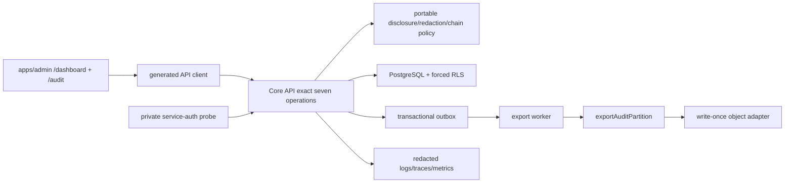

# Implementation Plan: Audit, Admin Aggregates, and Observability

> **Feature:** `008-audit-admin-aggregates-observability` · **Spec version/status:** `1.0.0 / SPEC_APPROVED`
> **Target FR/NFR:** `FR-ADMIN-002` retained audit slice, `FR-ADMIN-003`, `NFR-SEC-006`, availability and observability foundations · **Owner:** Yousef Osama · **Updated:** `2026-09-04`

## 1. Approved inputs

| Input                    | Version/digest                                                                                                     | Approval/gate                                              |
| ------------------------ | ------------------------------------------------------------------------------------------------------------------ | ---------------------------------------------------------- |
| `spec.md`                | `1.0.0 / SPEC_APPROVED`                                                                                            | OPEN-PRIV-001 closed; Product/Architecture approved        |
| Active-scope eligibility | PRD/Master `v2.1.3`; Roadmap row 008; baseline `bde8e51cc1e357656e68a30be02c98a32b2237b8`                          | ACTIVE after merged Feature 007                            |
| Constitution             | `v2.1.0`                                                                                                           | Articles I-XV checked below                                |
| Canonical architecture   | API Catalog `v1.2.0`; current Architecture, Data/RLS, UI Contract, traceability matrix                             | exact seven-operation boundary                             |
| Privacy decision         | OPEN-PRIV-001 package `1.0.0-approved`; SHA-256 `38855c7319b6bcd06b491bf4213a277303a6d6e2c1ebe7499b65fdfa4ae15039` | APPROVED/CLOSED for graduation engineering                 |
| Remaining overlays       | `OPEN-LEGAL-001/002/007`, `OPEN-TECH-001/002/003`, `OPEN-UX-001/002`, `OPEN-PRODUCT-001`                           | retain their later-stage effects; no SPEC_APPROVED blocker |

## 2. Constitution check

| Article                                | Result and evidence                                                                                                                |
| -------------------------------------- | ---------------------------------------------------------------------------------------------------------------------------------- |
| I Least privilege/default deny         | PASS — API authorization plus forced RLS; missing role, AAL, purpose, metric config, or service context denies                     |
| II Internal typed identity             | PASS — actor/person/facility/patient references remain internal UUIDs; no identifier becomes a credential or telemetry label       |
| III Canonical care relationships       | N/A — no relationship type, grant, or care-management authority changes                                                            |
| IV Facility membership/attribution     | PASS — existing named actor/grant context is reused; no shared account or client-supplied role authority                           |
| V Patient-centric purpose-limited data | PASS — audit reads require explicit purpose and return redacted evidence; aggregates never expose patient drill-down               |
| VI Dual clinical governance            | N/A — no clinical rule, prescribing, dispensing, or clinical-content decision                                                      |
| VII Regulated evidence gate            | PASS — graduation work is synthetic-only; production PHI, retention, processor, and WORM claims remain disabled by OPEN gates      |
| VIII Separation of duties              | PASS — export requester and service worker are attributable; immutable evidence cannot be self-rewritten or silently repaired      |
| IX MFA/purpose                         | PASS — Feature 007 current-session AAL2 and purpose enforcement gates every general audit read/export                              |
| X Portable domain logic                | PASS — disclosure, redaction, chain-verification, and readiness policies live in vendor-free packages; storage/telemetry are ports |
| XI One app per surface                 | PASS — only existing `apps/admin` routes `/dashboard` and `/audit` are used                                                        |
| XII Arabic-first consent/privacy       | PASS — privacy-safe states and explanations are authored in `ar-EG` first with complete `en-EG` parity; no consent change          |
| XIII Accessibility/localization        | PASS — keyboard, screen reader, focus, 200% text, 400% reflow, contrast, 44x44 targets, and reduced-motion evidence are planned    |
| XIV Safety UI clarity                  | PASS — stable gated/suppressed/tamper/failure states use text plus semantic cues; no decorative motion or hidden action            |
| XV Human authority over AI             | N/A — no AI input, output, model, or automated clinical authority                                                                  |

Post-design check: PASS. No constitutional exception, new actor, new route, new operation, or production-gate waiver is introduced. OPEN-PRIV-001 closes the policy gate but `metrics: []` intentionally keeps all aggregates inactive until a later approved metric configuration exists.

## 3. Technical context

- Runtime/toolchain: Node `24.18.0`, pnpm `11.13.0`, TypeScript `7.0.2`, Fastify `5.11.3`, Next.js `16.3.0`, React `19.2.8`, PostgreSQL 17, Supabase CLI `2.113.0`, `@supabase/supabase-js 2.112.2`.
- Target paths: `packages/core`, `packages/contracts`, `packages/api-client`, `packages/observability`, `services/api`, `services/worker`, `apps/admin`, `supabase/migrations`, `infra/db/tests`, `tests/e2e`, `tools`, `infra/runbooks`.
- Reuse: existing non-owner `shifaa_api`/`shifaa_worker`, request context and Feature 007 AAL/session step-up, global idempotency/outbox receipts, feature flags, shared design-system/i18n, RFC 9457 problems, and generated-client verification.
- Performance dataset: 250,000 synthetic audit events across three completed UTC month partitions, 100-event default and maximum audit page, 50 configured synthetic aggregate cells when a test-only approved metric fixture is installed, 20 warmed API database connections, and 25 concurrent export requests/workers. Reads must be p95 <=400 ms and mutations p95 <=800 ms inside the local reference region/profile.
- Availability: 99.9% monthly API target, RPO <=15 minutes, RTO <=60 minutes. Restore evidence includes database, audit chain anchors, export bytes/digests, and retention proof.
- External adapters: local encrypted filesystem/object-lock simulator and local telemetry exporter only for graduation evidence. Production object retention, processors, keys, and monitoring destinations remain disabled until their canonical gates close.

## 4. Proposed design and dependency flow

The existing Core API remains the only user-driven boundary. `getAdminSummary` compiles only approved server-side metric definitions; with the approved initial `metrics: []`, it returns `legal-gate-disabled` and no cell. The audit list/detail projections are read through fixed-shape repository methods, never raw JSON metadata. `createAuditExport` atomically records the batch, idempotency result, audit event, and minimum outbox event. The worker claims in order and invokes the service-authenticated `exportAuditPartition`; the object adapter uses a deterministic non-semantic key and create-if-absent semantics, then the API verifies bytes/digest/retention proof before recording `proven`. Export completion is discoverable only through the catalogued audit list/detail operations; no export-status endpoint is added.

## 5. Work products

### Data and migration

- Add one imperative Feature 008 migration that replaces the empty graduation baseline `audit.events` definition with a UTC-month range-partitioned v1 chain, and adds `audit.signature_evidence` and `audit.export_batches`. A non-empty legacy table makes the migration fail closed; it is never silently backfilled or called verified.
- Chain insertion is through a fixed-search-path database function that takes a per-partition transaction advisory lock, assigns a monotonic `chain_sequence`, hashes a canonical versioned representation plus `previous_hash`, and inserts once. Direct API inserts, updates, deletes, hash overrides, and sequence overrides are revoked.
- Add exact state/range/digest/proof checks, UTC partition/index coverage, immutable triggers, and export claim indexes. Reuse existing `platform.feature_flags`, idempotency, outbox, receipts, and non-`BYPASSRLS` roles.
- Force RLS on all audit tables. `super_admin`/AAL2/purpose is rechecked in API context and RLS for redacted list/detail and export requests; the worker sees only claimable minimum export rows. DPO-only and every other actor see zero audit rows.
- Expand/migrate/contract: preflight empty legacy audit storage, create new structures/functions/policies, validate synthetic chain/export fixtures, then enable routes. After first v1 event, rollback is feature disable plus roll-forward only.

### API and generated clients

- Freeze exactly: `getAdminSummary`, `listAuditEvents`, `getAuditEvent`, `createAuditExport`, `exportAuditPartition`, `healthLive`, `healthReady`. No selector, drill-down, export-list/status, replay, backup, or job operation is added.
- `contracts/openapi.yaml` fixes bounded payloads, opaque cursor pagination, RFC 9457 problems, `X-Request-Id`, private/no-store admin responses, service-auth metadata on internal operations, and the fail-closed aggregate policy state.
- Both POST operations use the global non-null-principal `Idempotency-Key` contract. `createAuditExport` uses the authenticated actor principal; `exportAuditPartition` uses the server-derived service principal. Same request replays the stored/in-progress result; changed body returns `409 idempotency-key-reused`.
- Generate contracts and client from the one OpenAPI source and require exact parity with catalog method/path/actor/flags. No existing operation changes and no deprecation is needed.

### UI, localization, and accessibility

- Extend the existing admin `/dashboard` and add/use `/audit`; no new application or route. Reuse Feature 007 step-up shell, shared semantic tokens, tables, problems, live regions, and i18n structure.
- `/dashboard` covers loading, empty, legal-gate-disabled, suppressed, stale, permission, offline, error, and success. It has no patient selector, arbitrary date range, drill-down, or export.
- `/audit` covers AAL2, purpose, loading, empty, permission, offline, stale, error, list/detail, queued/retrying/dead-letter/proven evidence, and digest verification. Export is never queued offline; completion/proof is shown from catalogued audit evidence, not an invented polling endpoint.
- Author `ar-EG` RTL first and complete `en-EG` LTR parity; isolate event IDs, hashes, reason codes, and RFC 3339 times LTR. Verify keyboard-only flow, NVDA names/live regions, focus order/return, 200% text, 400% reflow, forced colors, reduced motion, and 44x44 targets at `768x1024` and `1440x900`. Screenshots remain engineering evidence, not pixel-identity approval.

### Events, notifications, and vendors

- Add only internal outbox event `audit.export.requested`, carrying `exportBatchId` and no event payload, actor secret, PHI, object credential, or signed URL. Existing receipt/lease/dedup/dead-letter infrastructure is reused.
- No SMS, email, push, emergency-contact, patient, or admin notification template/channel is added. Operator alerting is telemetry/runbook behavior, not a new product notification operation.
- Worker preserves per-export order, bounded leases, unique receipts, 1m/5m/30m/2h/12h+jitter retry, permanent schema/service-auth/proof failures to dead letter, and append-only operator replay through the existing governed platform mechanism.
- Object and telemetry adapters have bounded timeouts, create-if-absent idempotency, proof verification, and independent kill switches. Production adapters remain off.

### Security, privacy, and abuse controls

- Apply approved `k=11`, inclusive 0-10 suppression, distinct-subject-only counts, approved completed-month/dimension combinations, deterministic complementary suppression, and linked-release fail closed. Unknown metric/status/dimension/config rejects before query/serialization.
- Suppression precedes DTO/log/cache/ETag construction. Suppressed counts, subject identifiers, free text, National IDs, access tokens, signed links, object credentials, clinical payloads, raw audit metadata, and arbitrary high-cardinality labels are prohibited everywhere.
- Audit list/detail/export require current `super_admin`, AAL2, and allowed purpose. DPO designation grants nothing. Health is private-network and service-authenticated, with generic bounded statuses and no credentials, hostnames, SQL errors, topology, PHI, or raw outbox payloads.
- Run forced-RLS/direct-SQL/search-path/owner/grant negatives, ASVS/API Top 10 checks, idempotency/race/tamper/differencing/redaction sentinel vectors, dependency/SAST/secrets checks, and restore/tabletop verification.

## 6. Test and evidence plan

| Requirement/test family                            | Level                                      | Fixture/vector                                                                                          | Expected evidence/path                                                                     |
| -------------------------------------------------- | ------------------------------------------ | ------------------------------------------------------------------------------------------------------- | ------------------------------------------------------------------------------------------ |
| `FR-ADMIN-003`, `AC-01/02`, `TV-PRIV-001-001..034` | core, contract, API, RLS, E2E              | inactive `metrics: []`; k=10/11/12; approved/prohibited dimensions; complementary and linked releases   | `tests/e2e/audit-admin-summary.spec.ts`, package vector report                             |
| `FR-ADMIN-002`, `AC-03/04`                         | contract, API, forced RLS, E2E             | patient/workforce/all admin roles/DPO/stale/AAL1/stale-AAL2/no-purpose/authorized; >100 sentinel events | `infra/db/tests/audit-admin-observability-rls.sql`, `tests/e2e/audit-admin-events.spec.ts` |
| `NFR-SEC-005/006`, `AC-05/06`                      | migration, DB, API, worker                 | identical/changed/concurrent keys; chain content/link/order/object/digest tamper                        | schema report, `tests/e2e/audit-export.spec.ts`                                            |
| `AC-07` export reliability                         | worker, adapter, integration               | transient/permanent/auth/proof/lease-expiry outcomes and authorized append-only replay                  | worker tests and export tabletop evidence                                                  |
| `NFR-OBS-001`, `SC-004/005`                        | unit, contract, integration, security      | redaction sentinels; bounded reason codes; healthy/DB-down/outbox-unsafe                                | observability tests, health contract report, sentinel scan                                 |
| `NFR-I18N-001/A11Y-001`, `AC-08`                   | component, accessibility, E2E, live review | all route states in AR/EN at 768x1024 and 1440x900; keyboard/NVDA/zoom/contrast/motion                  | `specs/008-audit-admin-aggregates-observability/evidence/ui/`                              |
| `NFR-PERF-002`, `AC-10`                            | load                                       | declared 250k-event/50-cell/20-connection/25-worker profile                                             | `specs/008-audit-admin-aggregates-observability/evidence/performance/`                     |
| `NFR-AVAIL-001/002`, `AC-09/10`                    | integration, DR/tabletop                   | liveness/readiness degradation; RPO/RTO restore with DB/object/proof                                    | `specs/008-audit-admin-aggregates-observability/evidence/operations/`                      |
| `NFR-API-001/002`, `NFR-QUALITY-001`               | schema, client, repository                 | exact seven operations; generated zero-diff; full clean stack                                           | contract verifier plus `corepack pnpm verify`                                              |

Every acceptance criterion is represented above. Tests also cover cursor bounds, UTC boundaries, locale parity, stale/reconnect, private-cache denial, direct-table denial, worker ordering, adapter timeout, and feature-flag kill switches.

## 7. Delivery sequence

1. Freeze the approved privacy config schema, vectors, exact seven-operation OpenAPI, i18n keys, and deterministic fixtures before production code.
2. Add migration/upgrade-fail-closed, partition/chain/export constraints, grants, forced-RLS, and direct-SQL negative tests.
3. Add portable aggregate disclosure, redaction, canonical hash, verification, and readiness policies with unit tests.
4. Add API repository/use cases and contract/idempotency/audit/outbox tests for admin reads and export acceptance.
5. Add worker/object adapter and service-authenticated internal export operation with race/retry/DLQ/tamper tests.
6. Generate contracts/client and require exact API Catalog/route registry parity.
7. Add `/dashboard` and `/audit` states, Arabic/English catalogs, accessibility, offline/reconnect, and visual evidence.
8. Add health endpoints, shared correlation/redaction/low-cardinality signals, dashboards/alerts, and degraded-path tests.
9. Run full integration, privacy, security, performance, restore/tabletop, and `pnpm verify`; record evidence and trace updates.
10. Re-run SpecKit analyze, open the implementation PR only after implementation evidence, and stop for Product Owner squash-merge.

After contracts and fixtures are frozen, UI state tests, observability unit tests, and migration test harnesses are parallel-safe when they touch disjoint files. Migration/RLS, API transaction orchestration, and worker/object proof are ordered because they share integrity boundaries. Metric activation is blocked until a later approved per-metric config; production release remains blocked by the listed OPEN gates.

## 8. Rollout, rollback, and operations

- Feature flags: `adminAggregatesEnabled`, `auditReadEnabled`, `auditExportEnabled`, and health exposure are independently controlled. Aggregates also require a digest-bound approved metric configuration; `metrics: []` always yields the gated response.
- Deploy: expand data/functions/policies first, validate clean synthetic chain and service contexts, deploy API/worker, then UI. Production flags and adapters remain false.
- Rollback: disable aggregate/read/export UI and routes, stop export claims, preserve every event/batch/object/proof, and roll forward. Liveness remains available; readiness becomes not-ready when required audit/outbox integrity is unsafe.
- Observability: shared request/trace IDs; bounded outcome/reason/policy-version/operation labels only. Alert on API errors/latency/saturation, oldest pending outbox age, dead-letter count, export failure, chain verification failure, and readiness failure. Threshold configuration and named production on-call evidence remain release artifacts.
- Runbooks: add audit chain verification failure, object proof failure, outbox backlog/DLQ, readiness degradation, key/storage loss, and restore verification under `infra/runbooks/`. Kill switches must not suppress audit integrity failures or fabricate readiness.

## 9. Plan approval

| Gate                   | Reviewer                                | Decision/date                       | Evidence/blocker                                                                     |
| ---------------------- | --------------------------------------- | ----------------------------------- | ------------------------------------------------------------------------------------ |
| Architecture/data      | Yousef Osama                            | `PLAN_APPROVED` / 2026-09-04        | exact scope, migration/RLS, API and dependency plan; implementation evidence pending |
| Security/privacy/legal | Yousef Osama for graduation engineering | `PLAN_APPROVED` / 2026-09-04        | OPEN-PRIV-001 approved package; production `OPEN-LEGAL-001/002/007` remain           |
| Clinical               | N/A                                     | N/A                                 | no clinical decision/content change                                                  |
| Design/accessibility   | Product/Design/A11y owners              | planned, not formal visual approval | `OPEN-UX-001/002`, `OPEN-TECH-003`; informative engineering evidence only            |
| QA/Product             | Yousef Osama / assigned QA              | `PLAN_APPROVED` / 2026-09-04        | tasks and implementation evidence follow; `OPEN-PRODUCT-001` remains release-only    |

**Plan verdict:** `PLAN_APPROVED` for synthetic graduation implementation planning. This plan does not activate a metric, authorize production PHI/WORM claims, or authorize implementation in the current lifecycle turn.
