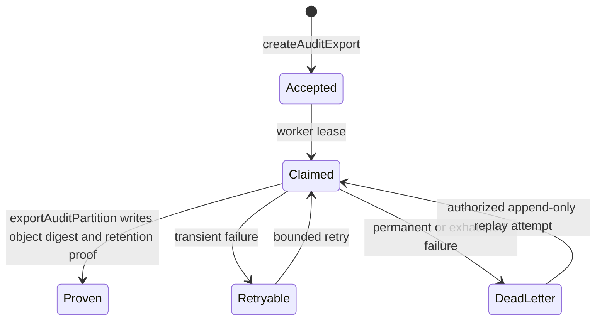

# Feature Specification: Audit, Admin Aggregates, and Observability

## 0. Metadata and traceability

| Field                      | Value                                                                                                                                                                                                                                                                                                                      |
| -------------------------- | -------------------------------------------------------------------------------------------------------------------------------------------------------------------------------------------------------------------------------------------------------------------------------------------------------------------------- |
| SpecKit feature ID         | `008-audit-admin-aggregates-observability`                                                                                                                                                                                                                                                                                 |
| Status                     | `SPEC_APPROVED — OPEN-PRIV-001 closed for graduation engineering`                                                                                                                                                                                                                                                          |
| Target FR IDs              | `FR-ADMIN-002` audit read/export slice retained by the traceability matrix; `FR-ADMIN-003` closure owner                                                                                                                                                                                                                   |
| Target NFR IDs             | `NFR-SEC-001`, `NFR-SEC-002`, `NFR-SEC-004`, `NFR-SEC-005`, `NFR-SEC-006`, `NFR-SEC-007`, `NFR-PRIV-002`, `NFR-PRIV-004`, `NFR-I18N-001`, `NFR-A11Y-001`, `NFR-PERF-002`, `NFR-AVAIL-001`, `NFR-AVAIL-002`, `NFR-DATA-001`, `NFR-DATA-002`, `NFR-API-001`, `NFR-API-002`, `NFR-OBS-001`, `NFR-QUALITY-001`, `NFR-PORT-001` |
| Scope eligibility          | `ACTIVE / SPEC_APPROVED — PRD v2.1.3; frozen roadmap row 008; predecessor 007 merged at bde8e51cc1e357656e68a30be02c98a32b2237b8; OPEN-PRIV-001 closed by approved package v1.0.0`                                                                                                                                         |
| Target app/service/package | `apps/admin`, Core API, `services/worker` export adapter, `packages/observability`, `packages/contracts`, `packages/api-client`, `packages/core`, PostgreSQL/object-storage adapters                                                                                                                                       |
| Owner                      | Yousef Osama — Product Owner, Team Lead, Architecture Lead, SpecKit/Governance Owner                                                                                                                                                                                                                                       |
| Reviewers                  | Product/Architecture `[Yousef Osama — approved]`; Security `[Yousef Osama — approved for engineering]`; Data `[Yousef Osama — approved]`; Project DPO/Privacy `[Yousef Osama — approved for engineering]`; QA `[pending tasks/evidence]`; Clinical `[N/A]`; Design/A11y `[later gated evidence]`                           |
| Risk class                 | `sensitive-data / privileged administration / privacy disclosure / security audit`                                                                                                                                                                                                                                         |
| Regulatory domains         | `PDPL; security audit evidence; production processing/retention remains gated`                                                                                                                                                                                                                                             |
| Clinical sign-off required | `No — this feature does not diagnose, prescribe, dispense, or govern clinical content`                                                                                                                                                                                                                                     |
| Dependencies               | `001–007 foundations, especially Feature 007 real MFA/session step-up; API Catalog v1.2.0; current Data/RLS, UI, Architecture, and traceability contracts`                                                                                                                                                                 |
| Parent roadmap entry       | `docs/governance/SHIFAA-Remaining-Specs-Roadmap.md`, Feature 008                                                                                                                                                                                                                                                           |
| Created / updated          | `2026-09-01 / 2026-09-02`                                                                                                                                                                                                                                                                                                  |

## Clarifications

### Session 2026-09-01

- Q: What is the exact remote-operation boundary? → A: Only `getAdminSummary`,
  `listAuditEvents`, `getAuditEvent`, `createAuditExport`, `exportAuditPartition`, `healthLive`, and
  `healthReady`; no operation may be added, renamed, or absorbed from another feature.
- Q: Does Feature 008 own audit hash chaining? → A: Yes, only because the frozen roadmap and
  `NFR-SEC-006` explicitly require append-only, partition hash-chained audit events and export proofs.
  This does not absorb or modify `security/sec-001-002-remediation`, create a separate SEC-004
  remediation, or widen the seven-operation boundary.
- Q: Who may read or export the general audit stream? → A: Current `super_admin` only, after AAL2
  and purpose capture, through redacted API projections. A DPO designation is not a sixth admin role
  and grants no general audit access.
- Q: What minimum-cell policy governs Feature 008? → A: Approved package `1.0.0-approved` closes
  `OPEN-PRIV-001` for graduation engineering with `k=11`, suppression of 0–10, distinct-subject
  counting, fixed dimensions/combinations, and deterministic complementary/linked-release controls.
  `metrics: []` activates no metric but does not block specification approval or planning; each
  metric and status mapping remains fail-closed until later approved configuration.
- Q: Does this feature close observability? → A: It establishes the shared redaction, correlation,
  low-cardinality metric, health, and outbox visibility foundation; the roadmap explicitly says it
  does not finally close `NFR-OBS-001` for every later feature.

## 1. Problem and scope

### Problem statement

SHIFAA has transactional audit and outbox foundations, but it does not yet provide the governed
platform capability to inspect redacted audit evidence, produce verifiable audit exports, expose
privacy-safe administrative aggregates, or distinguish process liveness from dependency readiness.
Platform administrators need attributable, purpose-limited evidence and operational health without
turning audit, dashboards, logs, or metrics into a second source of patient detail.

### Actors and authorization context

| Actor                                    | Facility/patient relationship                               | Permitted outcome                                                         | Explicitly prohibited                                                                                             |
| ---------------------------------------- | ----------------------------------------------------------- | ------------------------------------------------------------------------- | ----------------------------------------------------------------------------------------------------------------- |
| Any active platform admin role (`ADM-*`) | Current action-level admin grant                            | Read only the role-authorized, minimum-cell-protected dashboard summary   | Selecting a patient, bypassing suppression, inferring patient detail, or gaining access from role hierarchy alone |
| `super_admin`                            | Current active `super_admin` grant, AAL2, purpose           | List/get redacted audit evidence and request an audit export              | Raw table access, secret/PHI payload access, missing-purpose access, or general patient-record access             |
| DPO                                      | Current restricted governance designation                   | No new Feature 008 general-audit outcome                                  | General dashboard/audit grant; DPO access remains limited to separately assigned privacy work                     |
| Worker/system                            | Service-authenticated, non-owner, non-`BYPASSRLS` execution | Claim the minimum export work and create a write-once object/digest/proof | User-driven reads, arbitrary partitions, plaintext secrets, PHI payloads, or bypassing export authorization       |
| Platform probe/operator                  | Private-network probe or authorized operator                | Read liveness/readiness without dependency or secret detail               | Patient/admin data, credentials, topology secrets, or a false-ready result                                        |

### In scope

- Close `FR-ADMIN-003` with role-projected aggregate counts protected by the approved configurable
  minimum-cell threshold and dimensions; individual metrics remain disabled until their later
  approved configuration exists.
- Complete the retained `FR-ADMIN-002` audit slice through purpose-limited, AAL2, redacted audit
  list/detail/export operations for `super_admin` only.
- Realize append-only, partitioned, hash-chained `audit.events`, append-only
  `audit.signature_evidence`, and `audit.export_batches` with digest and write-once-retention proof.
- Provide process-only liveness and database/outbox readiness summaries through the two internal
  health operations, without dependency/secret detail.
- Establish shared request/trace correlation, structured redaction, low-cardinality metrics, outbox
  lag/dead-letter signals, feature-flag/health projections, and the applicable SLO/restore evidence.
- Realize admin `/dashboard` and `/audit` in Arabic-first RTL and complete English LTR parity with
  the contracted accessibility and edge states.

### Non-goals

- Patient-level admin analytics, patient selectors, drill-down from suppressed cells, raw PHI audit
  payloads, raw PHI logs/metrics/traces, or full request/clinical payload telemetry.
- A guessed minimum-cell value, guessed suppression dimensions, or an implementation-time choice
  that substitutes for the `OPEN-PRIV-001` approval artifact.
- General DPO audit access, a new DPO/admin role, or changes to existing DSR assignments.
- Production WORM compliance claims without object-lock/retention evidence and a verified tabletop.
- A new API operation, gRPC surface, public health endpoint, admin role, notification channel, or
  patient/facility feature.
- Absorbing or modifying `security/sec-001-002-remediation`, or treating this feature as the owner of
  any standalone SEC-004 remediation beyond the already-canonical `NFR-SEC-004` AAL2 requirement.
- Final closure of `NFR-OBS-001` for later features, production retention automation, or formal
  pixel-identical/reference-device claims while their gates remain open.

### Dependencies and assumptions

| Item                                                                  | Type (`verified fact`, `SHIFAA policy`, `assumption`, `OPEN`) | Evidence / open ID                                      |
| --------------------------------------------------------------------- | ------------------------------------------------------------- | ------------------------------------------------------- |
| Feature order, exact seven operations, tables, routes, and exclusions | verified fact                                                 | Frozen roadmap Feature 008                              |
| Feature 007 session/MFA step-up is the privileged-auth foundation     | verified fact                                                 | Merged predecessor and traceability matrix              |
| Audit actor/context fields and redacted access matrix                 | SHIFAA policy                                                 | Data/RLS Sections 8–9; PRD `NFR-SEC-006`                |
| Aggregate threshold, dimensions, config, and test set                 | approved SHIFAA policy                                        | `OPEN-PRIV-001` package v1.0.0 — closed for engineering |
| Physical payload schemas and full active API/DDL/client parity        | OPEN implementation evidence                                  | `OPEN-TECH-002`                                         |
| Production PHI licenses, processors, retention, and article mapping   | OPEN production evidence                                      | `OPEN-LEGAL-001`, `OPEN-LEGAL-002`, `OPEN-LEGAL-007`    |
| Formal UI baseline, visual tolerance, and reference environment       | OPEN plan/verification evidence                               | `OPEN-UX-001`, `OPEN-UX-002`, `OPEN-TECH-003`           |
| UAT persona/workflow baseline                                         | OPEN release evidence                                         | `OPEN-PRODUCT-001`                                      |

## 2. Egyptian regulatory and legal validation

- [x] The existing processing inventory must record admin aggregation, audit evidence, export object,
      operational telemetry, owners, purposes, recipients/processors, countries, and retention class.
- [x] Audit actor/context and any patient/facility references are sensitive; dashboard disclosure is
      controlled by approved OPEN-PRIV-001 policy and remains inactive without later per-metric
      configuration.
- [x] This feature adds no consent collection or withdrawal path; Arabic-first notices and existing
      lawful-basis/DSR controls remain authoritative.
- [x] Raw National ID, identity values, document images, free-text notes, tokens, signed links, full
      clinical/request payloads, and secrets are prohibited from audit payloads and telemetry.
- [x] `SECURITY_AUDIT` may classify audit rows/objects, but no duration or automatic deletion rule is
      selected while `OPEN-LEGAL-002` remains open.
- [x] Production geography, processors, object storage, PDPC permits, and DPO registration/category
      remain evidence under `OPEN-LEGAL-001` and `OPEN-LEGAL-007`.
- [x] Yousef Osama approved the minimum-cell re-identification-risk assessment,
      threshold/configuration, dimensions, and test vectors for graduation engineering under the
      four recorded solo-team approval roles; no statutory registration or production approval is
      inferred.
- [x] Facility/professional, EDA/MoHP/MOSS/UHI/CBE, controlled-drug, payment, donation, and AI gates
      are not changed by this feature.
- [x] Audit/export/health evidence must support incident and restore exercises without claiming that
      engineering evidence itself grants production authorization.
- [x] No new article-level Egyptian legal claim is made; unofficial research remains labeled and
      cannot replace counsel evidence.

**Specification blockers:** none. `OPEN-PRIV-001` is closed for graduation engineering.
`OPEN-LEGAL-001/002/007`, `OPEN-TECH-001/002/003`, `OPEN-UX-001/002`, and `OPEN-PRODUCT-001` retain
their canonical later-stage effects.

## 3. User Scenarios & Testing

### Journey J-01 — Privacy-safe admin summary

1. Given an authenticated admin with a current action-level role and the Feature 008 aggregate flag.
2. When the admin opens `/dashboard` or calls `getAdminSummary`.
3. The system returns only role-authorized aggregate cells; any cell below the approved threshold or
   unsafe under the approved dimension rules is suppressed without exposing the underlying count.
4. Audit/notification/next state: the sensitive read is attributable; no notification is created.

OPEN-PRIV-001 closure does not activate an aggregate metric. While `metrics: []` or a metric lacks
later approved configuration, the flag remains disabled and the route/API reports the
legal/privacy-gate state rather than returning guessed aggregates.

### Journey J-02 — Purpose-limited audit investigation

1. Given a current `super_admin` at AAL2 who supplies an allowed purpose.
2. When the actor filters `listAuditEvents` and opens one event with `getAuditEvent`.
3. The system returns cursor-bounded, redacted evidence plus the event's hash-chain evidence; the
   actor receives no secret payload, clinical free text, or unrelated raw row.
4. Audit/notification/next state: each sensitive read is itself attributable; no notification is
   created.

### Journey J-03 — Verifiable audit export

1. Given a current `super_admin` at AAL2 with purpose and an allowed partition/time range.
2. When `createAuditExport` accepts an idempotent request.
3. The worker consumes only the minimum queued export reference and the internal
   `exportAuditPartition` operation creates an object, digest, and write-once-retention proof.
4. Audit/notification/next state: request, claim, result, and failures are attributable; retries and
   dead-letter handling preserve the original request and per-aggregate order.

### Journey J-04 — Honest platform health

1. Given private-network platform probes.
2. When liveness and readiness are checked.
3. `healthLive` reports process liveness without dependency details; `healthReady` reports only the
   bounded database/outbox readiness summary and is not ready when a required dependency is unsafe.
4. Audit/notification/next state: operational correlation is emitted without patient/admin data.

### Alternate, failure, and degraded paths

| Case                      | Trigger                                                                              | UI/API result                                             | State/audit effect                                           | Recovery                                                                   |
| ------------------------- | ------------------------------------------------------------------------------------ | --------------------------------------------------------- | ------------------------------------------------------------ | -------------------------------------------------------------------------- |
| Permission denied         | Non-admin, wrong action grant, DPO-only designation, or non-super admin audit access | `forbidden`; permission state                             | Denied access attributable where required; no data           | Obtain the correct governed assignment; never elevate from client metadata |
| AAL/purpose missing       | Audit actor is AAL1/stale or supplies no allowed purpose                             | `mfa-required` or `purpose-required`                      | No audit result/export                                       | Complete Feature 007 step-up and purpose capture                           |
| Aggregate metric inactive | Approved per-metric configuration absent                                             | `legal-gate-disabled`; gated dashboard state              | No aggregate cells or patient detail                         | Approve and deploy the metric config; do not infer or reopen policy scope  |
| Cell suppression          | Approved threshold/dimension rule identifies disclosure risk                         | Localized suppressed/insufficient-data state              | No raw count or drill-down                                   | Broaden an approved query dimension; never reveal the cell                 |
| Offline/disconnected      | Admin client loses connection                                                        | Explicit offline/stale state; no export queued            | No mutation queue                                            | Reconnect, reconcile from server, and show last-updated time               |
| Export transient failure  | Object/export adapter times out                                                      | Queued/retryable status without WORM claim                | Retry receipt and audit evidence; no duplicate object effect | Bounded backoff, then operator review                                      |
| Export permanent failure  | Schema/auth/proof failure                                                            | Failed/dead-letter state                                  | Original event immutable; alert emitted                      | Authorized replay appends an attempt                                       |
| Duplicate/replay          | Same export key/body repeats                                                         | Stored result or in-progress response                     | One request effect                                           | Poll/retry safely; changed body is `409 idempotency-key-reused`            |
| Hash tamper               | Event/previous hash/object digest changed                                            | Verification failure and operator alert                   | Evidence remains immutable                                   | Incident runbook; never rewrite chain history                              |
| Readiness degraded        | Database or outbox readiness check fails                                             | Not-ready summary without secret topology                 | Operational metric/trace only                                | Drain traffic and restore dependency                                       |
| Stale data                | Dashboard/readiness freshness exceeds the approved projection rule                   | Timestamp plus stale/unknown; no misleading current claim | No hidden mutation                                           | Refresh/reconcile                                                          |

## 4. Requirements

### Functional Requirements

| Target PRD requirement              | Required feature behavior                                                                                                                                           | Acceptance coverage       |
| ----------------------------------- | ------------------------------------------------------------------------------------------------------------------------------------------------------------------- | ------------------------- |
| `FR-ADMIN-002` retained audit slice | Require current `super_admin`, AAL2, and purpose for redacted audit list/detail/export; make every sensitive read/export attributable and immutable                 | `AC-03`–`AC-07`           |
| `FR-ADMIN-003` closure              | Return only role-authorized aggregate counts protected by the approved minimum-cell threshold/dimensions, with no patient-level selector or unsafe count disclosure | `AC-01`, `AC-02`, `AC-08` |

### Non-functional Requirements

| Target NFR        | Feature 008 obligation                                                                                                       |
| ----------------- | ---------------------------------------------------------------------------------------------------------------------------- |
| `NFR-SEC-001`     | API authorization and forced RLS independently deny unauthorized aggregate/audit/export access through non-owner roles.      |
| `NFR-SEC-002`     | Audit/export storage and backups are encrypted; write-once evidence and keys remain outside user-readable database payloads. |
| `NFR-SEC-004`     | Audit-sensitive operations require Feature 007 AAL2; this is the canonical NFR and not a standalone remediation assignment.  |
| `NFR-SEC-005`     | Both POST operations use the global non-null-principal idempotency contract; same-key/different-body is `409`.               |
| `NFR-SEC-006`     | Events are append-only and hash-chained per partition; exports carry object digest/write-once proof and no secret payloads.  |
| `NFR-SEC-007`     | Applicable ASVS L2 plus admin/health-data L3 and API Top 10 controls remain release-gating.                                  |
| `NFR-PRIV-002`    | Production PHI and processors remain disabled without the PDPC/DPO evidence gate.                                            |
| `NFR-PRIV-004`    | Assign retention classes but do not invent statutory durations or production deletion automation.                            |
| `NFR-I18N-001`    | `/dashboard` and `/audit` have complete `ar-EG` RTL and `en-EG` LTR string/state parity; codes remain bidi-isolated.         |
| `NFR-A11Y-001`    | Both routes meet WCAG 2.2 AA, keyboard/screen-reader/focus/contrast/target/resize/reduced-motion requirements.               |
| `NFR-PERF-002`    | Read p95 is at most 400 ms and mutations at most 800 ms in-region, excluding external vendors, under the approved dataset.   |
| `NFR-AVAIL-001`   | Establish 99.9% monthly API target, RPO at most 15 minutes, RTO at most 60 minutes, and quarterly restore evidence.          |
| `NFR-AVAIL-002`   | Admin projections reconcile after reconnect and always show last-updated/stale state; no offline export queue.               |
| `NFR-DATA-001`    | PostgreSQL remains authoritative; audit/signature history is append-only and export proof changes are transactional.         |
| `NFR-DATA-002`    | All timestamps are UTC `TIMESTAMPTZ`/RFC 3339; no implicit local-time partition semantics.                                   |
| `NFR-API-001`     | The exact seven `/v1` operations use generated OpenAPI 3.1.1 and RFC 9457 errors; no undocumented endpoint.                  |
| `NFR-API-002`     | Audit collections use opaque cursors; every response carries `X-Request-Id`; no unbounded list.                              |
| `NFR-OBS-001`     | Establish shared request/trace IDs, redaction, and low-cardinality metrics; do not claim final cross-feature closure.        |
| `NFR-QUALITY-001` | All applicable format/lint/type/unit/contract/migration/RLS/a11y/security/e2e gates pass.                                    |
| `NFR-PORT-001`    | Core aggregation/audit/export policy remains vendor-free; object/export/telemetry providers are tested adapters.             |

## 5. Domain model and invariants

### Entities and ownership

| Entity                      | Owning domain  | Authoritative source                                               | Lifecycle owner                            |
| --------------------------- | -------------- | ------------------------------------------------------------------ | ------------------------------------------ |
| Audit event                 | Audit/platform | `audit.events`                                                     | Core API transaction; append only          |
| Signature evidence          | Audit/platform | `audit.signature_evidence`                                         | Governed signing use case; append only     |
| Audit export batch          | Platform/audit | `audit.export_batches` plus private object adapter                 | Core API request and worker/export adapter |
| Admin aggregate projection  | Platform/admin | Approved aggregate query/projection over authoritative domain data | Core API; no patient-level analytics store |
| Feature flag                | Platform       | `platform.feature_flags`                                           | Governed config/approval owner             |
| Health/readiness projection | Platform       | Computed process/database/outbox signals                           | API/platform runtime; no PHI persistence   |

### State machine

The canonical baseline defines the observable export flow, not physical enum names:

Planning may map these observable states to existing outbox/export fields, but may not invent a new
public operation or mutate the original audit/export request. Aggregate and health projections are
read-only and have no domain state transition.

### Invariants and concurrency

- `audit.events` and `audit.signature_evidence` are append-only; update/delete is denied.
- Every event hash binds the canonical event representation and `previous_hash` inside its partition;
  a changed event or chain link fails verification rather than being repaired in place.
- An export range/partition is authorized from server-side facts, and the object digest must match the
  recorded export proof before success is reported.
- `createAuditExport`, its minimum audit/outbox effects, and idempotency result commit atomically.
- Worker claims use bounded leases/`FOR UPDATE SKIP LOCKED`, unique receipts, and per-aggregate order.
- Dashboard suppression happens before serialization; role filtering and suppression cannot be
  reversed from response metadata, error detail, logs, cache validators, or drill-down links.
- Health output cannot include credentials, hostnames/topology secrets, SQL errors, patient/admin
  context, or raw outbox payloads.

## 6. Exact data and RLS contract

### Tables and fields

| Table.column                 | Type                                                                                                                     | Null/default                                                                       | Key/check/index                                                                         | Classification                    | Encryption                                                             | Retention class                                           |
| ---------------------------- | ------------------------------------------------------------------------------------------------------------------------ | ---------------------------------------------------------------------------------- | --------------------------------------------------------------------------------------- | --------------------------------- | ---------------------------------------------------------------------- | --------------------------------------------------------- |
| `audit.events.*`             | Canonical event fields: UUID ID; UTC timestamps; actor/context/action/outcome identifiers; `previous_hash`; `event_hash` | Context fields may be absent only when not applicable; payload/free text is absent | Append-only; partition/time and authorization indexes; per-partition chain verification | Sensitive security/audit metadata | Encrypted volume/backup; designated fields only if separately approved | `SECURITY_AUDIT` duration/action remains `OPEN-LEGAL-002` |
| `audit.signature_evidence.*` | Resource type/id/version, signer, signer role, decision, artifact digest, `signed_at`, audit-event reference             | No plaintext signature secret                                                      | Append-only; resource/version and audit-event references                                | Sensitive governance evidence     | Signature material remains external/KMS-backed                         | `SECURITY_AUDIT`                                          |
| `audit.export_batches.*`     | Partition range, private object reference, digest, write-once-retention proof, `exported_at`                             | Proof absent until verified export completion                                      | Range/object/digest integrity; no overwrite of proven batch                             | Sensitive audit-export metadata   | Private encrypted object/storage                                       | `SECURITY_AUDIT`                                          |
| `platform.feature_flags.*`   | Code, environment, enabled, constraints, approver, version                                                               | Disabled until approved config exists                                              | Unique code/environment; optimistic version                                             | Internal configuration            | Encrypted storage/backups                                              | `TRANSIENT_TECHNICAL` unless approved otherwise           |
| Health/readiness projection  | Computed bounded status/freshness only                                                                                   | No patient/admin payload                                                           | No user-writable table is authorized by the baseline                                    | Operational, non-PHI              | N/A beyond transport/runtime controls                                  | `TRANSIENT_TECHNICAL` if persisted as telemetry           |

The canonical baseline has not frozen physical column types for every audit/export field or the
aggregate response schema. Those details may be specified during planning under `OPEN-TECH-002`;
this approved specification does not invent them.

### Migration

- Forward order: not approved for execution. A later plan must use expand/migrate/contract, create
  non-owner access and forced-RLS policies before routes, backfill no guessed audit chain, and enable
  aggregates only after the approved privacy config/test set is installed.
- Existing-data validation/backfill: verify any existing event representation before establishing a
  chain origin; never synthesize success evidence or rewrite historical event meaning.
- Rollback or roll-forward: append-only evidence uses roll-forward; disable the feature flag/routes
  before any corrective migration that could affect verification.
- Backup/restore impact: export objects, digests, chain anchors, database, and object-retention proof
  must be included in the RPO/RTO restore prerequisite set.

### RLS/action matrix

| Actor/context                                | SELECT                                                                  | INSERT                                            | UPDATE                                                                                  | DELETE/state action    | Negative test ID                                 |
| -------------------------------------------- | ----------------------------------------------------------------------- | ------------------------------------------------- | --------------------------------------------------------------------------------------- | ---------------------- | ------------------------------------------------ |
| Admin role on aggregate                      | Approved role projection only; suppression applies                      | none                                              | none                                                                                    | none                   | `TV-PRIV-SMALL-CELL-SUPPRESS`                    |
| `super_admin`, current AAL2 + purpose        | Redacted audit projection through API only                              | Export request through API transaction            | No event/signature rewrite; only catalogued lease/status metadata through worker policy | Denied                 | `TV-ADMIN-MFA-PURPOSE`, `TV-AUDIT-TAMPER-EXPORT` |
| DPO designation only                         | No general audit/aggregate grant                                        | none                                              | none                                                                                    | none                   | DPO general-audit denial vector                  |
| Facility workforce/patient/guardian/delegate | No raw audit table; own-action receipt only where separately catalogued | none                                              | none                                                                                    | none                   | Cross-role audit denial vector                   |
| Worker/system                                | Minimum append/export/lease projection only                             | Append event/signature/export proof as authorized | Lease/status metadata only                                                              | Denied; replay appends | Worker overreach denial vector                   |

All online tables use `ENABLE ROW LEVEL SECURITY` and `FORCE ROW LEVEL SECURITY`. Online queries use
non-owner, non-`BYPASSRLS` roles. Security-definer helpers fix `search_path`, return bounded booleans
or projections, and re-evaluate current grants/AAL/purpose rather than trusting stale JWT metadata.

## 7. API endpoint specifications

All paths are under `/v1`; authenticated/sensitive responses are `Cache-Control: private, no-store`,
use `ar-EG` by default, return/generated `X-Request-Id`, and use RFC 9457 problems. The API Catalog is
authoritative where this specification cannot safely select an unstated payload field or numeric
rate limit.

### `getAdminSummary` — `GET /admin/dashboard-summary`

| Field                       | Contract                                                                                                                                                |
| --------------------------- | ------------------------------------------------------------------------------------------------------------------------------------------------------- |
| FR/NFR                      | `FR-ADMIN-003`; `FR-ADMIN-001` supplies existing role mapping; applicable target NFRs                                                                   |
| Actors/context/AAL/purpose  | `ADM-*`, filtered by current action permission; no patient selector                                                                                     |
| Headers                     | Authorization, Accept-Language, X-Request-Id; Idempotency-Key/If-Match N/A                                                                              |
| Path/query                  | No catalogued input; no dimension or threshold selector may be invented                                                                                 |
| Request body                | N/A                                                                                                                                                     |
| Success                     | `200`, role-projected minimum-cell aggregate counts; policy is package v1.0.0 and exact metrics remain fail-closed pending later approved configuration |
| Errors                      | `401 authentication-required`; `403 forbidden`; `503 legal-gate-disabled` until approved config exists                                                  |
| Idempotency scope/TTL       | N/A                                                                                                                                                     |
| Concurrency/pagination/rate | Read-only bounded summary; risk-based rate policy, no guessed number                                                                                    |
| Audit                       | Sensitive summary read with actor/role/request/purpose where required; no underlying patient values                                                     |
| Events                      | None                                                                                                                                                    |

### `listAuditEvents` — `GET /admin/audit/events`

| Field                       | Contract                                                                                                        |
| --------------------------- | --------------------------------------------------------------------------------------------------------------- |
| FR/NFR                      | `FR-ADMIN-002`, `NFR-SEC-006` and applicable target NFRs                                                        |
| Actors/context/AAL/purpose  | Current `ADM-SUPER`, AAL2, required allowed purpose                                                             |
| Headers                     | Authorization, Accept-Language, X-Request-Id; Idempotency-Key/If-Match N/A                                      |
| Path/query                  | `actor`, `action`, `resource`, `time`, `outcome`, `purpose`, opaque `cursor`, `limit` default 25/max 100        |
| Request body                | N/A                                                                                                             |
| Success                     | `200 {data, meta}`, redacted event projections only                                                             |
| Errors                      | `401 authentication-required`; `403 mfa-required`, `purpose-required`, or `forbidden`; validation/rate problems |
| Idempotency scope/TTL       | N/A                                                                                                             |
| Concurrency/pagination/rate | Cursor pagination; endpoint-defined stable ordering; risk-based rate policy                                     |
| Audit                       | Audit the audit read; exclude payload values, clinical free text, credentials, and secret material              |
| Events                      | None                                                                                                            |

### `getAuditEvent` — `GET /admin/audit/events/{eventId}`

| Field                       | Contract                                                                                 |
| --------------------------- | ---------------------------------------------------------------------------------------- |
| FR/NFR                      | `FR-ADMIN-002`, `NFR-SEC-006` and applicable target NFRs                                 |
| Actors/context/AAL/purpose  | Current `ADM-SUPER`, AAL2, required allowed purpose                                      |
| Headers                     | Authorization, Accept-Language, X-Request-Id; Idempotency-Key/If-Match N/A               |
| Path/query                  | `eventId: uuid`; `purpose` required by the catalog contract                              |
| Request body                | N/A                                                                                      |
| Success                     | `200`, redacted event plus hash-chain evidence; no raw payload                           |
| Errors                      | `401`; `403 mfa-required`/`purpose-required`/`forbidden`; `404 not-found`; rate problems |
| Idempotency scope/TTL       | N/A                                                                                      |
| Concurrency/pagination/rate | Immutable point read; risk-based rate policy                                             |
| Audit                       | Audit the detail read without recursively embedding the source event payload             |
| Events                      | None                                                                                     |

### `createAuditExport` — `POST /admin/audit/exports`

| Field                       | Contract                                                                                                                        |
| --------------------------- | ------------------------------------------------------------------------------------------------------------------------------- |
| FR/NFR                      | `FR-ADMIN-002`, `NFR-SEC-005`, `NFR-SEC-006` and applicable target NFRs                                                         |
| Actors/context/AAL/purpose  | Current `ADM-SUPER`, AAL2, required allowed purpose                                                                             |
| Headers                     | Authorization, Accept-Language, X-Request-Id, Idempotency-Key required; If-Match N/A                                            |
| Path/query                  | N/A                                                                                                                             |
| Request body                | Catalogued partition, time range, and purpose only; full generated schema waits for `OPEN-TECH-002`                             |
| Success                     | Accepted queued export; exact `201` versus `202` and response fields must be frozen by approved contract work, not guessed here |
| Errors                      | Authentication/AAL/purpose/authorization/validation; `409 idempotency-key-reused`; retryable in-progress/rate problems          |
| Idempotency scope/TTL       | Authenticated actor + route + canonical body; exact TTL follows global platform policy when approved                            |
| Concurrency/pagination/rate | One effect per idempotency scope; bounded range and risk-based rate policy                                                      |
| Audit                       | Request/result/failure with range metadata only; no exported payload in audit/logs                                              |
| Events                      | Minimum outbox work reference; event name/payload schema is not invented in this specification                                  |

### `exportAuditPartition` — `POST /internal/audit/exports`

| Field                       | Contract                                                                                                                 |
| --------------------------- | ------------------------------------------------------------------------------------------------------------------------ |
| FR/NFR                      | `NFR-SEC-005`, `NFR-SEC-006`, `NFR-PORT-001`                                                                             |
| Actors/context/AAL/purpose  | Authenticated `SYS`/service with the authorized queued request; no user credential reuse                                 |
| Headers                     | Service authorization, X-Request-Id, Idempotency-Key required; If-Match N/A                                              |
| Path/query                  | N/A                                                                                                                      |
| Request body                | Minimum approved export request reference/range; no raw secret or unrelated partition selector                           |
| Success                     | Creates the write-once export object/proof and records its digest; exact payload/status waits for approved contract work |
| Errors                      | Service auth, validation, range/proof conflict, idempotency, adapter-unavailable problems without secret detail          |
| Idempotency scope/TTL       | Non-null verified service/work principal + route + body; one object effect                                               |
| Concurrency/pagination/rate | Per-export claim/order; bounded worker batch and lease                                                                   |
| Audit                       | Claim/result/proof digest and failure class; never exported payload or credentials                                       |
| Events                      | Receipt/result through existing outbox/receipt contract; no new public event is authorized here                          |

### `healthLive` — `GET /internal/health/live`

| Field                       | Contract                                                                        |
| --------------------------- | ------------------------------------------------------------------------------- |
| FR/NFR                      | `NFR-AVAIL-001`, `NFR-OBS-001`                                                  |
| Actors/context/AAL/purpose  | Private platform probe                                                          |
| Headers                     | X-Request-Id; user Authorization/Idempotency-Key/If-Match N/A                   |
| Path/query                  | N/A                                                                             |
| Request body                | N/A                                                                             |
| Success                     | Process liveness only; no dependency or secret detail                           |
| Errors                      | Generic unavailable response without stack, topology, credential, or PHI detail |
| Idempotency scope/TTL       | N/A                                                                             |
| Concurrency/pagination/rate | Cheap bounded probe; platform controls prevent abuse                            |
| Audit                       | Operational trace/metric only; no patient/admin context                         |
| Events                      | None                                                                            |

### `healthReady` — `GET /internal/health/ready`

| Field                       | Contract                                                                                             |
| --------------------------- | ---------------------------------------------------------------------------------------------------- |
| FR/NFR                      | `NFR-AVAIL-001`, `NFR-OBS-001`                                                                       |
| Actors/context/AAL/purpose  | Private platform probe                                                                               |
| Headers                     | X-Request-Id; user Authorization/Idempotency-Key/If-Match N/A                                        |
| Path/query                  | N/A                                                                                                  |
| Request body                | N/A                                                                                                  |
| Success                     | Bounded database/outbox readiness summary; no raw errors, payloads, topology, or secrets             |
| Errors                      | Not-ready when a required dependency is unsafe; exact threshold config must be approved, not guessed |
| Idempotency scope/TTL       | N/A                                                                                                  |
| Concurrency/pagination/rate | Cheap bounded probe; platform controls prevent abuse                                                 |
| Audit                       | Low-cardinality readiness metrics/traces only                                                        |
| Events                      | None                                                                                                 |

## 8. UI/UX and edge-state matrix

| App/route/viewport                                | State                                                             | Arabic/English content                                                                        | Controls/focus                                                                                    | Permission/offline behavior                                                       | Design baseline ID |
| ------------------------------------------------- | ----------------------------------------------------------------- | --------------------------------------------------------------------------------------------- | ------------------------------------------------------------------------------------------------- | --------------------------------------------------------------------------------- | ------------------ |
| Admin `/dashboard`, wide/medium/stacked below 768 | loading/empty/gated/suppressed/stale/error/success                | Complete `ar-EG` first and `en-EG` parity; suppression uses visible text, not only icon/color | Stable keyboard-first filters/refresh; focus reaches gate/suppression explanation                 | No guessed counts; offline shows cached timestamp/stale and queues no action      | `OPEN-UX-001`      |
| Admin `/audit`, wide/medium/stacked below 768     | AAL2/purpose/loading/empty/permission/offline/stale/error/success | Bilingual filter, evidence, digest, and export states; codes/digests bidi-isolated LTR        | Step-up and purpose focus flow; table converts to labeled stacked rows; result announced politely | Non-super/DPO denied; offline queues no export; reconnect reconciles server state | `OPEN-UX-001`      |
| Admin `/audit`, export status                     | queued/retrying/failed/dead-letter/proven                         | Bilingual status, reference, time, next step, and proof digest; no toast-only success         | Focus remains stable; retry information does not expose internals                                 | Replay is never a client-side offline queue and requires governed operator flow   | `OPEN-UX-001`      |

The routes use SHIFAA semantic tokens, Arabic root RTL/English LTR, IBM Plex Sans Arabic/Inter,
visible focus, correct focus return, screen-reader names/live regions, 200% text, 400% web reflow,
high contrast, reduced motion, and at least 44×44 CSS-pixel targets. Tables become labeled stacked rows
below 768 without hiding core actions behind horizontal page scrolling. No glass/blur, hover-only
meaning, color-only state, or moving primary action is permitted. Snapshots at 768×1024 and 1440×900
in both locales are engineering evidence only while `OPEN-UX-001/002` remain open.

## 9. Notifications and asynchronous events

| Source event      | Recipient policy                                                   | Template/channel                                         | Allowed data fields                                                                                                                       | Dedup key                                                     | Retry/DLQ                                                             | Acknowledgement/escalation                                          |
| ----------------- | ------------------------------------------------------------------ | -------------------------------------------------------- | ----------------------------------------------------------------------------------------------------------------------------------------- | ------------------------------------------------------------- | --------------------------------------------------------------------- | ------------------------------------------------------------------- |
| Audit export work | Worker/system only; no human notification recipient in Feature 008 | Internal outbox/export adapter; no user template/channel | Stable export request/batch ID and minimum range/proof metadata; never audit payload, actor secret, PHI, token, or destination credential | Existing event/consumer receipt plus export idempotency scope | 1m/5m/30m/2h/12h+jitter; permanent/schema/auth to DLQ; replay appends | Alert on oldest-pending/dead-letter SLO; authorized operator action |

Emergency Contacts receive **zero** Feature 008 events. No SMS, email, push, or patient notification
template is added by this feature.

## 10. Security, privacy, and abuse cases

| Threat/misuse                     | Control                                                                                      | Verification                                                                       |
| --------------------------------- | -------------------------------------------------------------------------------------------- | ---------------------------------------------------------------------------------- |
| Broken admin/action authorization | Current-grant API preflight plus forced RLS and non-owner execution                          | Admin-role/action matrix including DPO and stale-JWT negatives                     |
| Missing/stale MFA or purpose      | Feature 007 AAL/AMR reconciliation and purpose requirement                                   | AAL1, stale factor, absent/invalid purpose denial vectors                          |
| Aggregate re-identification       | Feature disabled until approved threshold/dimensions; suppress before serialization          | Approved below/equal/above-boundary and differencing vectors under `OPEN-PRIV-001` |
| Audit table/chain tamper          | Append-only grants, per-partition canonical hashes, external export digest/proof             | Event, previous-hash, partition-order, object, and digest tamper vectors           |
| Replay/race/duplicate export      | Global idempotency, atomic outbox, lease, receipt, per-aggregate ordering                    | Same key/same body, changed body, concurrent claim, lease expiry, replay tests     |
| Insider/excessive audit access    | `super_admin` only, AAL2, purpose, redacted projection, private/no-store                     | Self/grant/purpose/AAL/DPO/filter-exfiltration denial matrix                       |
| Export adapter/object abuse       | Private adapter, bounded range, digest validation, no plaintext secrets, write-once evidence | Wrong service, range, object overwrite, digest mismatch, provider failure tests    |
| PHI/secret in telemetry           | Shared allowlisted structured fields, redaction scanner, low-cardinality dimensions          | Sentinel scan across logs/traces/metrics/audit/outbox/evidence                     |
| Health endpoint reconnaissance    | Private routing and bounded non-secret result                                                | Public access, verbose-error, dependency-detail, rate-abuse tests                  |

## 11. Success Criteria

### Measurable Outcomes

| ID       | Outcome                                            | Measurement method                                                 | Required threshold                                                                     |
| -------- | -------------------------------------------------- | ------------------------------------------------------------------ | -------------------------------------------------------------------------------------- |
| `SC-001` | Admin aggregates disclose no unsafe cell           | Approved `OPEN-PRIV-001` re-identification and boundary set        | 0 unsafe cells; 100% suppression vectors pass                                          |
| `SC-002` | Unauthorized/general-DPO audit access is denied    | API + RLS negative matrix                                          | 100% denial; 0 redacted/raw rows returned                                              |
| `SC-003` | Audit/export tampering is detected                 | Chain/object/digest deterministic vector set                       | 100% injected tampering detected; 0 history rewrites                                   |
| `SC-004` | Telemetry contains no prohibited values            | Sentinel scan across every evidence surface                        | 0 raw National IDs, free text, tokens, signed links, images, or full clinical payloads |
| `SC-005` | Health distinguishes liveness/readiness honestly   | Process/database/outbox degraded scenarios                         | 100% expected ready/not-ready decisions; 0 secret/dependency detail                    |
| `SC-006` | APIs meet the canonical regional SLO               | Approved load profile                                              | Read p95 ≤400 ms; mutation p95 ≤800 ms                                                 |
| `SC-007` | Restore prerequisites preserve audit verifiability | Quarterly restore/tabletop evidence                                | RPO ≤15 min, RTO ≤60 min, chain/export proof verifies after restore                    |
| `SC-008` | Admin routes are bilingual and accessible          | AR/EN keyboard, NVDA, zoom/reflow, contrast, reduced-motion matrix | 100% P0 checks pass; snapshots remain informative until UX gates close                 |

### Acceptance Criteria and Test Vectors

### AC-01 — Aggregate gate fails closed

- **Given** no approved per-metric configuration under OPEN-PRIV-001 package v1.0.0 in the
  environment.
- **When** an otherwise authorized admin calls `getAdminSummary`.
- **Then** the API returns the stable legal/privacy-gate problem and the UI shows the bilingual gated state.
- **And** no aggregate cell, raw count, patient selector, or drill-down is returned.
- **Automated by** `TV-PRIV-SMALL-CELL-SUPPRESS` gate-disabled vector.

### AC-02 — Approved suppression boundary

- **Given** approved OPEN-PRIV-001 package v1.0.0 plus a later approved per-metric configuration
  with below/equal/above and differencing vectors, role, locale, and approved dimensions.
- **When** `getAdminSummary` evaluates each vector.
- **Then** every unsafe cell is suppressed according to that artifact and every allowed cell is
  role-projected.
- **And** response/errors/logs do not leak the suppressed raw value.
- **Automated by** the approved package's deterministic vector set and the later metric fixture set.

### AC-03 — Audit role, AAL, and purpose denial matrix

- **Given** patient, workforce, each non-super admin role, DPO-only, stale grant, AAL1, stale AAL2,
  absent purpose, and current `super_admin`/AAL2/purpose actors.
- **When** each calls the three admin audit operations.
- **Then** only the final authorized combination receives a redacted result or queued export.
- **And** every denied case returns zero audit rows/export effects.
- **Automated by** `TV-ADMIN-MFA-PURPOSE` plus Feature 008 RLS matrix.

### AC-04 — Redacted cursor-bounded audit read

- **Given** more than 100 synthetic audit events containing redaction sentinels in prohibited source
  fields and a current authorized actor.
- **When** the actor pages/filter-lists and gets one event.
- **Then** pages obey opaque cursor/default/max limits and detail includes verifiable chain evidence.
- **And** no prohibited sentinel or raw payload appears in API, cache, log, trace, or evidence output.
- **Automated by** audit contract/redaction tests.

### AC-05 — Export idempotency and concurrency

- **Given** two concurrent requests with one idempotency key/body and a third changed body.
- **When** `createAuditExport` processes them and workers race to claim the work.
- **Then** one export effect is accepted/claimed, the identical replay returns the stored/in-progress
  outcome, and the changed body returns `409 idempotency-key-reused`.
- **And** no duplicate export object/proof is created.
- **Automated by** export replay/race tests.

### AC-06 — Hash-chain and export-proof tamper detection

- **Given** valid partitions/exports plus cases with modified event content, previous hash, order,
  object bytes, or recorded digest.
- **When** verification runs.
- **Then** the valid case passes and every injected tamper case fails with attributable evidence.
- **And** no row/object is rewritten to hide failure.
- **Automated by** `TV-AUDIT-TAMPER-EXPORT`.

### AC-07 — Export failure, retry, DLQ, and replay

- **Given** transient, permanent-schema, service-auth, and lease-expiry adapter outcomes.
- **When** the worker processes the queued request.
- **Then** transient failures follow bounded backoff, permanent/auth failures dead-letter, expired
  leases are reclaimed once, and authorized replay appends a new attempt.
- **And** the original event/request remains immutable and per-aggregate order is preserved.
- **Automated by** export worker adapter tests.

### AC-08 — Bilingual accessible admin routes

- **Given** `/dashboard` and `/audit` in `ar-EG`/RTL and `en-EG`/LTR at 768×1024 and 1440×900,
  including loading, empty, gated, AAL2, purpose, permission, suppressed, offline, stale, retry,
  failure, and success states.
- **When** keyboard/NVDA, 200% text, 400% zoom, forced colors, and reduced motion are exercised.
- **Then** content/action parity, focus order/return, names/announcements, reflow, targets, and visible
  non-color meaning meet WCAG 2.2 AA.
- **And** no offline export mutation is queued and snapshots are not called pixel-identical proof.
- **Automated by** admin accessibility/i18n/viewport tests.

### AC-09 — Liveness/readiness degraded behavior

- **Given** a live process with healthy, database-unavailable, and outbox-unsafe dependency cases.
- **When** the two health operations are called from the platform network.
- **Then** liveness reflects process state and readiness fails for required unsafe dependencies.
- **And** no response/log exposes credentials, topology, SQL errors, PHI, or outbox payloads.
- **Automated by** health degraded/readiness contract tests.

### AC-10 — Restore and performance prerequisites

- **Given** the approved deployment/dataset profile and a backup containing audit/database/object
  evidence.
- **When** load and restore/tabletop verification run.
- **Then** read/mutation p95, RPO, RTO, restored chain, and export digest meet their target.
- **And** the evidence identifies any still-open reference-environment or production gate.
- **Automated by** performance and disaster-recovery evidence harnesses.

## 12. Observability, rollout, rollback, and incidents

- SLO/SLI and capacity assumption: 99.9% monthly API; RPO ≤15 min; RTO ≤60 min; read p95
  ≤400 ms; mutation p95 ≤800 ms. Dataset/resources must be declared by the later approved plan.
- Metrics/traces/logs and redaction: shared request/trace IDs across client/API/database
  audit/worker/adapter; low-cardinality pseudonymous dimensions; error, saturation, outbox lag,
  dead-letter, export failure, chain verification, and readiness signals; prohibited fields are
  rejected by sentinel scanning.
- Dashboard/alerts and owner: on-call alerts for slow query, capacity/saturation/error,
  oldest-pending outbox age, dead-letter count, export/chain/readiness failure; exact ownership and
  thresholds cannot be guessed in this specification.
- Feature flag and cohort: aggregate cells remain disabled until an approved per-metric
  configuration under OPEN-PRIV-001 package v1.0.0 exists; audit/export/health rollout must remain
  independently killable.
- Data migration/rollback or roll-forward: expand/migrate/contract; append-only audit/export evidence
  rolls forward; disable reads/export before unsafe corrective work.
- Kill switch/degraded behavior: disable aggregates or exports without disabling liveness; audit event
  writing remains fail-closed/attributable according to the approved transaction policy.
- Incident/runbook link: later planning must bind repository runbooks for audit-chain failure,
  export-object proof failure, outbox backlog, health degradation, key/storage loss, and restore.

## 13. Evidence and approvals

| Gate                   | Reviewer(s)                | Artifact/version/digest                                                      | Decision/date                        | Blocking findings                                                   |
| ---------------------- | -------------------------- | ---------------------------------------------------------------------------- | ------------------------------------ | ------------------------------------------------------------------- |
| Product / Architecture | Yousef Osama               | Approved specification plus OPEN-PRIV-001 package v1.0.0 and SHA-256 sidecar | `APPROVED` / 2026-09-02              | None at `SPEC_APPROVED`                                             |
| Security               | Yousef Osama               | OPEN-PRIV-001 controls, residual-risk assessment, and deterministic vectors  | `APPROVED` / 2026-09-02              | Implementation security evidence remains required                   |
| Data                   | Yousef Osama               | Distinct-subject/configuration and linked-release contract                   | `APPROVED` / 2026-09-02              | Individual metrics remain fail-closed pending later approved config |
| Project DPO / Privacy  | Yousef Osama               | OPEN-PRIV-001 package v1.0.0                                                 | `APPROVED` / 2026-09-02              | Production legal/DPO gates remain                                   |
| QA                     | Assigned QA                | Later tasks and deterministic execution evidence                             | Pending implementation evidence      | Does not block planning/task generation                             |
| Clinical               | N/A                        | N/A                                                                          | N/A                                  | None introduced                                                     |
| Design/Accessibility   | Product/Design/A11y owners | `OPEN-UX-001/002` artifacts                                                  | Not supplied                         | No pixel-identical/formal visual claim                              |
| Release                | Named release owners       | Evidence manifest                                                            | Not applicable before implementation | Production/legal/technology/UAT gates remain                        |

## 14. Open items and change log

`OPEN-PRIV-001` is **CLOSED** for graduation engineering by approved decision
package v1.0.0. Its empty initial metric list activates no aggregate and does not
block planning; individual metrics and status mappings remain fail-closed until
later approved configuration.

| Open ID                 | Owner                                  | Next action/evidence                                                                                                   | Blocks gate                                   |
| ----------------------- | -------------------------------------- | ---------------------------------------------------------------------------------------------------------------------- | --------------------------------------------- |
| `OPEN-LEGAL-001`        | Legal counsel + registered DPO         | Archive controller/processor, permit, DPO, processor, and geography evidence                                           | Production PHI / `RELEASE_APPROVED`           |
| `OPEN-LEGAL-002`        | Legal counsel + DPO + Medical Director | Sign per-class retention/action schedule                                                                               | Production retention automation               |
| `OPEN-LEGAL-007`        | Legal counsel + registered DPO         | Archive controlling Arabic texts and signed article mapping                                                            | Production PHI legal claims                   |
| `OPEN-UX-001/002`       | Product + Design + QA                  | Approve source designs, viewports, renderer, tolerances, and diff rule                                                 | Pixel-identical/formal visual acceptance      |
| `OPEN-TECH-001/002/003` | Architecture + Platform + API/Data/QA  | Preserve reproducibility evidence; complete Feature 008 schemas/DDL/clients after approval; approve reference profiles | Canonical implementation/verification effects |
| `OPEN-PRODUCT-001`      | Product + UX Research                  | Complete target-user workflow validation                                                                               | UAT/release baseline                          |

| Date       | Version           | Change and affected FR/NFR/contracts                                                                                                                                                                 |
| ---------- | ----------------- | ---------------------------------------------------------------------------------------------------------------------------------------------------------------------------------------------------- |
| 2026-09-02 | SPEC_APPROVED 1.0 | Recorded Yousef Osama's four-role OPEN-PRIV-001 approval, adopted package v1.0.0, closed the specification blocker, and preserved fail-closed per-metric configuration plus every later-stage gate   |
| 2026-09-01 | DRAFT 0.1         | Created exact Feature 008 boundary from the frozen roadmap; resolved canonical scope questions; recorded `OPEN-PRIV-001` as the pre-plan/pre-approval blocker; made no implementation/API/DDL change |
