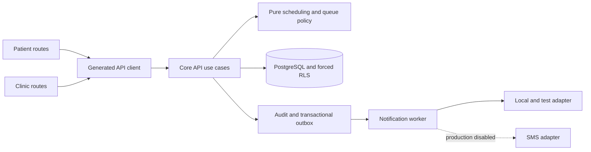

# Implementation Plan: Clinic Scheduling, Appointments, and Queue

> **Feature:** `009-clinic-scheduling-appointments-queue` · **Spec:** `0.5.0 / SPEC_APPROVED + planning-only PLAN_APPROVED`
>
> **Scope:** `FR-FAC-005`, `FR-CLINIC-001..005`, `FR-CLINIC-008`, doctor-search slice of `FR-DISC-001`, PATIENT NFR profile, `NFR-AVAIL-001` · **Owner:** Yousef Osama, Product Owner · **Updated:** 2026-09-12

## 1. Approved inputs

| Input                               | Version/digest                                                                                    | Approval/gate                                                 |
| ----------------------------------- | ------------------------------------------------------------------------------------------------- | ------------------------------------------------------------- |
| `spec.md`                           | `0.5.0-plan-approved`                                                                             | `SPEC_APPROVED` and planning-only `PLAN_APPROVED`, 2026-09-10 |
| Remaining-specs roadmap             | current canonical Feature 009 row; exactly 18 operations                                          | ACTIVE and scope-eligible                                     |
| Constitution                        | current Articles I-XV                                                                             | checked below                                                 |
| PRD/Master/API/Data-RLS/UI Contract | current repository versions cited by `spec.md`                                                    | frozen boundary retained                                      |
| P0 visual source                    | `SHIFAA-F009-P0-SOURCE@1.0.0-candidate`                                                           | Product Owner and Feature 009 Design Lead approved            |
| Visual manifest                     | SHA-256 `3ac755cc03c263826d1a07d53e08716e8390857249dbda1eb936833265ac0a4c`; 492 PNGs              | `OPEN-UX-001` satisfied for Feature 009 affected UI only      |
| Later gates                         | `OPEN-UX-002`, `OPEN-TECH-002/003`, `OPEN-PRODUCT-001`, `OPEN-VENDOR-002`, applicable legal gates | remain open at their recorded stages                          |

Planning does not authorize implementation, tasks, Issues, commit, or push.

## 2. Constitution check

| Article                                | Result and evidence                                                                                                                                               |
| -------------------------------------- | ----------------------------------------------------------------------------------------------------------------------------------------------------------------- |
| I Least privilege/default deny         | PASS — every clinical table uses enabled/forced RLS, narrow runtime grants, and cross-subject/scope/action negative tests.                                        |
| II Internal typed identity             | PASS — actors, patients, and doctors reference `identity.people.id`; no vendor identity becomes authority.                                                        |
| III Canonical care relationships       | PASS — GUA/DEL management requires the existing active relationship plus `appointment.manage`; no relationship type is added.                                     |
| IV Facility membership/attribution     | PASS — writes bind verified facility, active membership, licensed doctor, and exact date/interval.                                                                |
| V Patient-centric purpose-limited data | PASS — subject/representative and public reads use minimum projections; reasons, queue details, and private contacts do not leak.                                 |
| VI Dual clinical governance            | N/A — no medication or clinical-content rule is created; doctor licence validity is still enforced.                                                               |
| VII Regulated evidence gate            | PASS — synthetic data only until later production approvals; production SMS stays disabled.                                                                       |
| VIII Separation of duties              | PASS — existing notification author/publisher controls are reused; feature operations cannot publish templates.                                                   |
| IX MFA/purpose                         | PASS — existing context/AAL/purpose checks gate privileged clinic actions and receive negative tests.                                                             |
| X Portable domain logic                | PASS — recurrence, availability, transitions, ordering, and estimates live in pure `packages/core`; adapters remain ports.                                        |
| XI One app per surface                 | PASS — patient routes remain in `apps/patient`, clinic routes in `apps/clinic`; no app-to-app imports.                                                            |
| XII Arabic-first consent/privacy       | PASS — Arabic-first localized reasons, confirmations, notices, and privacy-safe projections follow approved compositions.                                         |
| XIII Accessibility/localization        | PASS — all eight baseline families require AR/EN, RTL/LTR, focus, keyboard, screen-reader, reflow, contrast, targets, forced colors, and reduced-motion evidence. |
| XIV Safety UI clarity                  | PASS — stale/conflict/offline states, destructive confirmations, non-held offers, effects, and result regions are explicit.                                       |
| XV Human authority over AI             | N/A — no AI decision or automation is introduced.                                                                                                                 |

**Gate result:** PASS. Retained OPEN gates are implementation, verification, UAT, vendor, or production-release overlays rather than planning blockers.

## 3. Technical context

- Targets: `apps/patient`, `apps/clinic`, `services/core-api`, `services/notification-worker`, `packages/contracts`, `packages/api-client`, `packages/core`, `packages/design-system`, `packages/i18n`, `packages/test-utils`, `supabase/migrations`.
- Toolchain: Node.js `24.18.0`, pnpm `11.13.0`, TypeScript `7.0.2`, Vitest `4.1.0`, Supabase CLI `2.113.0`, PostgreSQL `17` in the checked-in stack.
- Reuse: `identity.people`, verified facilities/memberships/licences, care-relationship permissions, hardened idempotency, audit, outbox, notification-template releases, request context, feature flags, RFC 9457, OpenAPI generation, and observability/restore harnesses.
- SLO/evidence: preserve the PATIENT NFR profile and `NFR-AVAIL-001`; record synthetic scale, hardware, concurrency, warm-up, percentiles, errors, RPO, and RTO.
- External boundary: production SMS is disabled under `OPEN-VENDOR-002`; no new vendor, payment adapter, route, role, or operation. `cash_on_arrival` is the only payment method.

## 4. Proposed design and dependency flow

The API owns authorization and transaction orchestration. Pure core modules own civil-time slot derivation, state-policy decisions, queue ordering, and wait estimates. PostgreSQL constraints are the final concurrency guard. Apps use only the generated client and shared UI/i18n packages. Delivery failures cannot reverse committed clinical operations.

## 5. Work products

### Data and migration

- Add `clinical.schedules`, `clinical.schedule_windows`, `clinical.schedule_exceptions`, `clinical.appointments`, `clinical.queue_scopes`, and `clinical.queue_entries`; exact columns and indexes are in `data-model.md`.
- Normalize weekly windows; validate IANA timezones; represent inclusive civil validity as generated half-open date ranges; use GiST exclusions for active validity, local-window overlap, ordinary same-type exception overlap, and appointment occupancy.
- Use row/scope locks plus constraints for exception precedence, slot acquisition, atomic same-row reschedule, queue number allocation/reorder, delay supersession, and absence cascades.
- Force RLS everywhere. Minimum public/patient projections use SECURITY DEFINER functions with `search_path=''`, explicit ownership, narrow EXECUTE grants, and negative tests.
- Sequence expand → validate/backfill → feature-flag activate → later contract. No destructive contract step occurs during initial activation; after durable writes, incidents disable and roll forward.

### API and generated clients

- `contracts/openapi.yaml` contains exactly the approved 18 operation IDs and paths. Mutations preserve catalog idempotency/version requirements; responses use typed schemas and localized RFC 9457 failures.
- CI compares roadmap/catalog ↔ OpenAPI ↔ generated TypeScript exports and fails on added, renamed, or missing operations.
- `createAppointment` returns `confirmed`; check-in ends at appointment `checked_in` and creates queue `waiting`; complete changes queue `called` → `completed`. Appointment `requested`, `in_queue`, `in_consultation`, `completed`, `no_show`, and queue `in_service` have no Feature 009 producer.
- Use bounded opaque cursors, private/no-store sensitive responses, request correlation, scoped throttles, deterministic conflicts, canonical idempotent replay, audit, and transactional outbox.

### UI, localization, and accessibility

- Only patient `/discover`, `/doctors/:id`, `/appointments/new`, `/appointments/:id` and clinic `/today`, `/queue`, `/schedule`, `/appointments/:id` are planned.
- Route containers use generated-client adapters and explicit view states. Server state is authoritative; offline is read-only; stale/conflict reconciliation never implies success and restores focus per the approved result regions.
- Compose current design-system components against all eight `F009-P0-*` families. References are immutable evidence, not shipped assets; `OPEN-UX-002` still gates formal pixel-regression acceptance.
- Arabic `ar-EG` is first and English `en-EG` is structurally equivalent, with logical layout, bidi isolation, keyboard/focus restoration, announcements, 200% text, applicable 400% reflow, forced colors, reduced motion, and approved target sizes.

### Events, notifications, and vendors

- Aggregate-versioned minimum-payload events: schedule changed, appointment changed, queue changed, doctor delay declared, and doctor absence declared. Never include raw reasons, coordinates, destinations, tokens, or unrelated PHI.
- Author versioned bilingual delay/absence candidate templates through the existing release lifecycle. They are not existing/published; an independent publisher decision is required before dispatch eligibility.
- Same-key replay creates no second audit/event/notification. Worker receipts deduplicate aggregate/event/version; retries are bounded and dead-lettered; provider failure cannot roll back the domain transaction.
- Local/test uses synthetic recipients. Production SMS and claims remain disabled under `OPEN-VENDOR-002`.

### Security, privacy, and abuse controls

- Cover horizontal/vertical authorization, forged scope, stale versions, slot/queue races, duplicate keys, enumeration, reason injection, oversized cursors, mass booking/reorder/delay abuse, and outbox replay.
- Cancellation/reorder/absence reasons are restricted: governed retention/encryption, no logs/events/analytics, and only scoped authorized reads.
- Telemetry uses request/event/aggregate IDs, result class, latency, and redacted scope; never patient names, contacts, raw reasons, precise public location, or appointment details.

## 6. Test and evidence plan

| Family                     | Level and vectors                                                        | Required evidence                                                            |
| -------------------------- | ------------------------------------------------------------------------ | ---------------------------------------------------------------------------- |
| Exact scope                | static/contract; frozen inventory                                        | 18/18 operations, zero extras, generated-client parity                       |
| Recurrence/DST             | unit/property/integration; normal, nonexistent, ambiguous, inclusive end | deterministic UTC identity; no nonexistent/duplicate slot                    |
| Availability               | unit/integration; all exception combinations                             | `absence > blocked > added > base`; delay affects estimates only             |
| Schedule/exception overlap | DB/race; boundary, overlap, same/different key                           | boundary allowed; overlap conflicts; replay identical; no partial effect     |
| Appointment transitions    | unit/contract/DB; all nine states                                        | only approved producers; producerless states remain producerless             |
| Slot/reschedule race       | DB race; competing create/reschedule and failed replacement              | one winner; original unchanged unless replacement acquired atomically        |
| Queue                      | unit/DB race; check-in/call/reorder/complete/stale version               | unique number/entry; waiting-only reorder; atomic positions/estimates        |
| Absence                    | integration/race; intersecting/nonintersecting rows                      | exact reschedule-required/removed effects and no-hold suggestions            |
| Delay                      | integration/race; replay and concurrent distinct declarations            | sole latest overlay; no compound minutes or duplicate work                   |
| RLS/auth                   | DB negative; PAT/GUA/DEL/CLN and wrong scope/action/AAL/purpose          | default deny, no existence leak, no side effect                              |
| Idempotency/audit/outbox   | integration; success/conflict/crash/retry                                | one durable effect/audit/event and ordered deduped replay                    |
| Eight routes               | component/E2E; approved state inventory                                  | evidence mapped to every `F009-P0-*` family                                  |
| AR/EN/a11y                 | E2E/manual; canonical viewports and assistive modes                      | structural parity, focus/results, zero critical violations                   |
| Offline/stale/conflict     | component/E2E; disconnect/reconnect/version conflict                     | no queued writes; authoritative refresh and safe recovery                    |
| Performance/DR             | load/chaos/restore; recorded synthetic scale                             | percentiles/error budget, outbox recovery, consistent restore/RPO/RTO        |
| Privacy/security           | static/dynamic/negative                                                  | minimum disclosure, redaction, throttling, no production PHI/vendor delivery |
| Migration                  | clean/upgrade/flag off-on/restore                                        | expand/validate/activate evidence and irreversible boundary                  |

Every acceptance criterion and deterministic vector in `spec.md` must map to a later task and evidence path.

## 7. Delivery sequence

1. Freeze exact OpenAPI, inventories, state matrices, and failing contract tests.
2. Add expand migrations, constraints, indexes, functions, forced RLS, and negative/race tests with the flag off.
3. Add pure recurrence, DST, availability, transition, ordering, and estimate policy tests/code.
4. Add repositories/use cases with authorization, idempotency, versioning, audit, and outbox transaction tests.
5. Generate and verify the client; no handwritten transport types.
6. Add patient/clinic route states, then AR/EN/a11y/responsive evidence against approved P0 contracts.
7. Add candidate templates and worker handling under local/test adapters only.
8. Run integrated concurrency, load, security, migration, restore, and degraded-path evidence.
9. Update traceability, runbooks, and evidence manifests; rerun exact-scope checks.
10. Activate only in approved local/test cohorts; retain production/vendor/release gates.

Pure core, OpenAPI schema, UI composition scaffolding, and migration fixture work can run in parallel after contract freeze. Persistence waits on expand schema; client integration waits on generation; UI mutation wiring waits on client parity; activation waits on RLS/concurrency/security evidence.

## 8. Rollout, rollback, and operations

- A Feature 009 server/UI flag defaults off; enable synthetic local/test cohorts only after validation.
- Before the first durable write, disable and roll back additive code if needed. Afterwards, disable mutations/dispatch independently, preserve clinical/idempotency/audit/outbox rows, and roll forward—never drop populated clinical tables as incident rollback.
- Extend dashboards with operation latency/error/conflict/replay, contention, queue-version conflicts, delay/absence effects, outbox age/retry/dead-letter, RLS denial categories, and restore freshness; alerts contain no PHI.
- Safe reads remain available under mutation kill switches with explicit localized degraded states.
- Restore drills recover clinical rows, idempotency, audit, and outbox to a consistent point, then prove replay/dedup correctness.

## 9. Binary evidence persistence recommendation

The approved set is 492 PNGs, 29,237,789 bytes (27.883 MiB). Repository policy marks PNGs binary, defines no LFS filter, commits earlier visual evidence directly, and uses CI artifacts only for transient SBOM/SARIF. The recommended eventual persistence is one versioned feature PR containing this exact byte-identical set beside its source, inventory, validator, and manifest. CI artifacts must not become authority. If future program-wide growth warrants LFS, approve it separately at repository scope before migration. This turn applies no storage decision.

## 10. Plan approval state

| Gate                   | Reviewer                              | Decision/date                      | Evidence/blocker                                 |
| ---------------------- | ------------------------------------- | ---------------------------------- | ------------------------------------------------ |
| Product planning       | Yousef Osama                          | `PLAN_APPROVED` / 2026-09-10       | planning only                                    |
| Architecture/data      | assigned reviewer                     | pending later review               | plan, research, model, contracts                 |
| Security/privacy/legal | assigned reviewers                    | later-stage gates retained         | synthetic/non-production only                    |
| Design/accessibility   | Yousef Osama, Feature 009 Design Lead | exact P0 set approved / 2026-09-10 | F009 `OPEN-UX-001` satisfied; `OPEN-UX-002` open |
| QA/Product acceptance  | assigned QA + Product Owner           | pending implementation/UAT         | `OPEN-PRODUCT-001`, `OPEN-TECH-002/003`          |

**Task-generation readiness:** READY. No unresolved technical decision prevents `speckit-tasks`; task generation still requires a separate user instruction. Implementation remains unauthorized.
