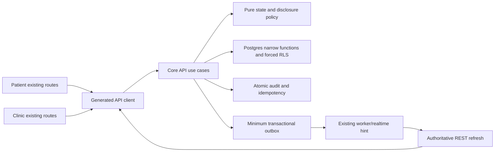

# Implementation Plan: Feature 010 — Encounters, Referrals, and Contextual Chat

> **Input:** `SPEC_APPROVED` by Yousef Osama, Product Owner / Architecture Lead, 2026-09-26. **Plan status:** `PLAN_APPROVED` on 2026-09-26 under the approved pre-implementation operating model; see the dated Feature 010 Plan Gate record.
> **Scope:** `FR-FAC-006`, `FR-CLINIC-006`, `FR-CLINIC-007`; exactly 23 PATIENT ∪ REALTIME NFR IDs and ten existing operation IDs. Updated 2026-09-26.

## 1. Approved inputs

| Input | Version / boundary | Decision or gate |
|---|---|---|
| `spec.md` and checklist | Feature 010 `0.4.0`, `SPEC_APPROVED`, 19/19 | Product Owner approval; QA and affected clinical domain lead review evidence unrecorded |
| `docs/governance/SHIFAA-Feature-010-Reconciliation-2026-09-26.md` | Four resolved F010 decisions plus specification-gate addendum | Product Owner / Architecture authority only |
| PRD, Master, Remaining-Specs Roadmap | Three active FRs, PATIENT ∪ REALTIME profile, ten operation IDs | Eight Feature 010 `OPEN-*` gates retained |
| `.specify/memory/constitution.md` | Ratified 2.1.0, Articles I–XV | Check below; no exception |
| API Catalog §1/§4, Data/RLS §§3/17, UI Contract §8, Traceability §7 and Completion Coverage §7.6 | Current API/data/UI/coverage authorities | Generated-client/physical/formal visual evidence still pending |
| Feature 009 spec, data model, OpenAPI and appointment/queue migration | Existing predecessor state/booking contract | Dependency, no Feature 009 operation or producer changed |

The sole Feature 010 operations are `createEncounter`, `getEncounter`, `updateEncounter`, `signEncounterNote`, `completeEncounter`, `createReferral`, `listReferrals`, `acceptReferral`, `listContextMessages`, and `sendContextMessage`. The plan adds no permission code, route, patient inbox, order/prescription chat, open consultation channel, upload intent, offline clinical write or Feature 011 safety logic.

The exact 23 NFR IDs are `NFR-SEC-001`, `NFR-SEC-002`, `NFR-SEC-003`, `NFR-SEC-004`, `NFR-SEC-005`, `NFR-SEC-006`, `NFR-SEC-007`, `NFR-PRIV-001`, `NFR-PRIV-002`, `NFR-PRIV-004`, `NFR-I18N-001`, `NFR-A11Y-001`, `NFR-PERF-001`, `NFR-PERF-002`, `NFR-AVAIL-001`, `NFR-AVAIL-002`, `NFR-DATA-001`, `NFR-DATA-002`, `NFR-API-001`, `NFR-API-002`, `NFR-OBS-001`, `NFR-QUALITY-001`, and `NFR-PORT-001`. No NFR outside PATIENT ∪ REALTIME is activated.

## 2. Constitution check

| Article | Result and planned evidence |
|---|---|
| I Least privilege/default deny | **PASS by design** — exact API/forced-RLS action matrix and negative tests in `data-model.md`. |
| II Internal typed identity | **PASS by design** — UUID actor/resource identity only. |
| III Canonical care relationships | **PASS by design** — live PAT/GUA/DEL checks; no relationship-inferred consent or chat. |
| IV Facility membership | **PASS by design** — named current CLN membership, facility, action and audit. |
| V Patient data/purpose | **PASS by design** — note visibility, two-field referral allowlist, context-only messages. |
| VI Dual clinical governance | **N/A to prescription/safety content**; affected clinical workflow review remains unrecorded. |
| VII Regulated evidence | **BLOCKED for production** — `OPEN-LEGAL-001/002/007`; synthetic-only work. |
| VIII Separation of duties | **PASS by design** — CLN cannot accept for subject; correction signer rule enforced. |
| IX MFA/purpose | **PASS by design** — inherited AAL2/current-purpose checks; no shadow session. |
| X Portable core | **PASS by design** — pure core policy; DB, encryption, realtime behind adapters. |
| XI One app/surface | **PASS by design** — existing patient/clinic apps and routes only. |
| XII Arabic-first privacy | **PASS by design, production blocked** — exact-field acceptance; Legal/DPO gates remain. |
| XIII A11y/i18n | **Functional baseline approved for Feature 010** — 87 states/408 TEST-ONLY references satisfy its `OPEN-UX-001` composition prerequisite; `OPEN-UX-002` formal visual and `OPEN-TECH-003` device/accessibility verification remain. |
| XIV Safety UI clarity | **N/A to safety override**; referral/structural confirmation still needs clear bilingual UI and focus. |
| XV AI authority | **N/A** — no AI operation. |

Post-design recheck: all five plan artifacts preserve these outcomes. Yousef Osama's dated Product Owner + Acting Design Lead approval satisfies Feature 010's affected-UI functional `OPEN-UX-001` baseline prerequisite at manifest SHA-256 `18e4471d686990e797e8a5e370a20ceda7ea823020e3f84fdea0e03a65394310`. The separate 2026-09-26 Plan Gate record applies the approved solo pre-implementation operating model and records `PLAN_APPROVED`; no independent QA, owning-engineer, or affected clinical sign-off is claimed. Their implementation and verification evidence remains pending.

## 3. Technical context

- **Targets:** `apps/patient` `/records`, `/encounters/:id`; `apps/clinic` `/patients/:id/summary`, `/encounters/:id`, `/referrals`, `/messages`; `services/api`, `services/worker`, `packages/core`, `packages/contracts`, `packages/api-client`, `packages/auth`, `packages/design-system`, `packages/i18n`, `packages/observability`, additive migrations and synthetic tests.
- **Checked-in toolchain:** Node 24.18.0, pnpm 11.13.0, TypeScript 7.0.2; existing PostgreSQL/Supabase/Fastify stack. No dependency upgrade.
- **Targets, not measurements:** patient cold-start LCP p95 ≤3.0 s/input p95 ≤200 ms on reference profile, API read p95 ≤400 ms/mutation p95 ≤800 ms, 99.9% monthly API availability and restore RPO ≤15 min/RTO ≤60 min. Exact device/network/dataset profile remains `OPEN-TECH-003`.
- **Reuse:** Feature 009 appointment/queue state guards, slot exclusion/availability, server EGP fee and `cash_on_arrival`, idempotency, audit/outbox and forced-RLS patterns. No new grant or vendor adapter.

## 4. Proposed design and dependency flow

API validation/authentication precedes a named-actor transaction. Core has no vendor/framework import. Postgres rechecks live membership, relationship, purpose, AAL, context and state under lock; forced RLS independently denies unrelated rows. Mutations, minimum audit/outbox work and completed idempotency result commit together. Realtime is a hint, never read/send authority; reconnect discards stale client claims and reauthorizes through REST. There is no browser-to-PostgREST clinical write.

## 5. Work products

### Data and migration

- `data-model.md` specifies the six canonical data areas, fields/nullability, checks/index intents, state machines, lock order and all ten API/RLS actions. Existing Feature 009 appointment `status` and queue `state` are dependency rows; only `createEncounter` and `completeEncounter` gain the approved consultation/service/completion producers.
- A forward Feature 010 migration and narrow functions enforce one open encounter/appointment, one server-derived responsible-clinician interval at creation, authorized end of current non-responsible intervals without a Feature 010 add path, immutable signed notes, exact statuses, accepted referral/link uniqueness, SQL-null message attachment, forced RLS/default deny/non-owner grants. Refactor Feature 009 booking into one composable internal primitive while retaining the externally identical `createAppointment` wrapper; do not edit old migrations. Validate predecessor rows/constraints before extending producer guards. No fabricated backfill or destructive rollback.
- Sensitive free text uses designated encryption and narrow projections. Retention duration and production PHI remain under `OPEN-LEGAL-001/002/007`. Exact physical DDL and generated policy parity remain `OPEN-TECH-002` evidence.

### API and generated clients

- `contracts/openapi.yaml` is an OpenAPI 3.1.1 **planning** contract for exactly ten catalogued `/v1` operations, with closed typed inputs/results, role-projected notes/referrals, RFC 9457 errors, bearer/locale/request-ID/cache headers, seven `Idempotency-Key` mutations, three `If-Match` mutations, and bounded cursor reads. `CreateEncounterRequest` has no responsible-clinician or participant ID; the API derives the responsible clinician from the linked appointment and current authorized treating-clinician context and creates only that active interval. `UpdateEncounterRequest` has interval-end input only, rejects participant addition and cannot end the responsible interval while open.
- Same-key/same-body replay returns the stored result; changed body/stale version/slot conflict yield stable problems without partial effect. `acceptReferral` owns its idempotency/audit/outbox/canonical response and calls the internal booking primitive inside one transaction. Its closed `TargetSlot` request contains no fee, currency or payment mode; server derives the fee and fixes EGP/cash_on_arrival. Before booking, authoritative Feature 009 data must confirm slot specialty and every specified target doctor/facility; specialty-only permits any currently eligible verified doctor/facility for that specialty. This is routing validation, not clinical appropriateness.
- The primitive owns Feature 009 current schedule/time/fee/exclusion checks and no operation-level records. For Feature 010 it compares `availabilityVersion` with the selected schedule's version under lock and proves the exact selected start/end/timezone/civil-date tuple remains in authoritative Feature 009 effective availability, including windows and exceptions. Target eligibility is checked in the same transaction; GiST exclusion is the final one-winner guard. The external `createAppointment` request has no availability-version field; its unchanged wrapper calls the primitive without these Feature 010-only preconditions and retains its existing response, idempotency, audit and outbox behavior. Regression tests must prove parity for fee, replay, existing schedule/time guards and slot races.
- Implementation must generate the single source and clients from `packages/contracts` and prove parity with this plan and the API Catalog. This YAML does not close `OPEN-TECH-002` or authorize handwritten divergent clients.

### UI, localization and accessibility

- Patient `/records` owns pending referral list/preview/acceptance; `/encounters/:id` owns released record and subject-PAT appointment-context body-only composition. Clinic `/referrals` has creation/tracking, no acceptance; `/messages` requires explicit eligible appointment selection. Clinic encounter routes show authorized participants, notes, optional references and structural completion.
- The 2026-09-26 Product Owner / Architecture UX placement decisions put **Start encounter** on clinic `/patients/:id/summary` only for a current-patient linked `checked_in` appointment with matching `called` queue; optional review precedes `createEncounter`, API rechecks eligibility, and success navigates to existing `/encounters/:id`. Clinic `/encounters/:id` owns **Edit participants** modal/drawer to review active/historical intervals and explicitly confirm ending an active non-responsible workforce interval; the responsible clinician remains visible and non-removable while open. There is no Feature 010 participant-add picker/UI. `listFacilityMemberships` remains owner-scoped and cannot serve as a general treating-clinician source; any later addition UI requires a separately approved authoritative current-facility workforce picker. No new route or operation follows.
- Loading, empty, denied, recoverable/terminal error, offline blocked write, stale/last-updated, version/slot conflict and success states are required. Interval end/completion cuts off chat history/composer; reconnect reauthorizes. Show exact selected fields and server EGP/cash terms before acceptance; no private note or attachment control.
- `ar-EG` RTL first with bundled IBM Plex Sans Arabic, `en-EG` LTR with Inter, and semantic design tokens; bidi isolation, logical focus/return, semantic/live status, WCAG 2.2 AA, 44×44 targets and 48 px patient primary actions, 200% text/400% web reflow, forced colors and zero decorative clinical motion. Viewports 360×800, 412×915, 768×1024, 1440×900. Feature 010's six TEST-ONLY source compositions and 87-state/408-reference baseline were approved for its functional `OPEN-UX-001` prerequisite by Yousef Osama as Product Owner + Acting Design Lead for this feature only; source version `SHIFAA-F010-P0-SOURCE@0.3.0-test-only`, manifest SHA-256 `18e4471d686990e797e8a5e370a20ceda7ea823020e3f84fdea0e03a65394310`. Final visual identity belongs to post-026 Polish; Feature 009 references do not transfer.

### Events, notifications and vendors

- Internal minimum outbox marker families: encounter opened/completed/participant changed, note signed, referral pending/accepted, context message created. Payload contains aggregate/resource IDs, required scope/state/version, UTC time and correlation only; no note, summary, reason or message body. Existing aggregate-version ordering, retry/dedup/DLQ apply. Consumers re-fetch current REST authority.
- No patient notification template/version or channel is approved for Feature 010. Any future delivery needs paired Arabic/English template and live recipient check; Emergency Contacts receive none. No upload, PSP, clinical-content or new vendor adapter.

### Security, privacy and abuse

- Negative vectors cover cross-patient/facility, stale representative grants, private-note leakage, premature target disclosure, signed-note overwrite, slot race/replay, client-supplied workforce IDs at creation, participant-add request, attempted responsible-clinician removal, participant removal/revoked chat, forged context, attachment property including null, offline replay and prohibited PHI telemetry.
- API and forced RLS recheck actor, action, subject, facility, purpose, current care/grant, AAL and interval. Online execution is non-owner, never `BYPASSRLS`; fixed-search-path functions return approved projections only. Audit omits free text; outbox/logs/metrics do not contain clinical bodies or full patient payloads.

## 6. Test and evidence plan

| Requirement / criteria | Synthetic levels and vectors | Planned evidence |
|---|---|---|
| `FR-CLINIC-006`, AC-01/04/09/12 | Core/Postgres/API/E2E: checked-in/called, missing queue, duplicate open, zero optional refs, blank summary, false confirmation, stale version, offline block | Atomic rows/audit/outbox, forced-RLS and AR/EN clinic flows |
| `FR-CLINIC-006`, AC-02/03/12 | PAT/GUA/DEL/CLN projections, private/patient-visible versions, signed same-encounter supersession, unauthorized signer/cross-patient reference | Encrypted append-only and no-body-leak tests |
| `FR-CLINIC-007`, AC-05/06/07/13 | Pending/source worklist, PAT/GUA/DEL live grants, one-grant DEL denial, revoked next page, target denied before acceptance, exact fields and fee preview | Contract/RLS/E2E target-projection evidence |
| `FR-CLINIC-007`, AC-07/09 | One-winner acceptance/slot race, stale availability/version, blocked/absent effective slot or exception, changed-body replay, client fee/currency/method rejection; specialty-only and each specified doctor/facility match/mismatch | Feature 009 wrapper parity and real-Postgres atomic transaction proof |
| `FR-FAC-006`, AC-08/10/14 | PAT/active CLN body-only read/send, GUA/DEL denial, interval/completion cutoff, attachment including null, REST reconnect/offline block | Context RLS/E2E/realtime and SQL-null attachment assertions |
| All 23 NFRs, AC-11/SC-004/005/006 | ar-EG/en-EG keyboard/screen reader/reflow/forced color, redaction, latency/restore | Synthetic browser/device/performance/security/restore reports at their gates |

All fourteen spec ACs are mapped above. `quickstart.md` provides runnable validation order and expected outcomes. Add operation/schema parity, unknown-property rejection, RLS non-owner negatives, encryption, migration replay/restore, outbox ordering/DLQ and PHI-canary scans. Prescription override/vendor failure tests are inapplicable because those operations are excluded; no passing evidence is fabricated.

## 7. Delivery sequence

1. Freeze planning contract/fixtures and obtain plan-gate decisions before production code.
2. Generate schema source/parity in `packages/contracts`; add contract tests.
3. Forward Feature 010 migration with forced-RLS negatives, narrow Feature 009 state-producer extension and composable booking primitive; leave old migrations intact and prove the `createAppointment` wrapper's existing behavior.
4. Pure core state/authorization tests, then API lock/idempotency/audit/outbox integration.
5. Generate API client from approved contract; wire existing patient/clinic routes under the exact approved Feature 010 functional baseline only after the separate Plan Gate and implementation authorization.
6. Worker/realtime reconciliation and redaction tests; no new notification channel.
7. Integrated race, migration, restore, security, accessibility/performance and full `corepack pnpm verify` in later implementation/verification; live Arabic/English acceptance and PR evidence under `AGENTS.md` before integration.

Contract fixtures and migration/RLS design can be parallel after the plan gate. UI implementation must preserve the approved Feature 010 functional baseline and later verification gates. No task ledger is created here.

## 8. Rollout, rollback and operations

- Feature 010 entry paths stay disabled outside synthetic local/test cohorts until later approved implementation/gates; no production enablement date or real-PHI cohort.
- Deploy additive schema/guards, then generated contract/API parity, then client/routes; prove Feature 009 rows and constraints before/after migration.
- Roll back by disabling Feature 010 entry paths and rolling forward corrective migrations. Never delete signed notes, accepted referrals, audit or retained messages. Restore proof uses synthetic data and does not claim RPO/RTO passed.
- Use existing request/trace IDs, redacted counters, worker retry/DLQ and incident/DSR process. On-call assignment, alert thresholds and runbook evidence remain implementation and verification work.

## 9. Plan approval and retained gates

| Gate | Current decision and effect |
|---|---|
| Plan gate: Architecture + QA + owning engineer | **`PLAN_APPROVED` 2026-09-26** by Yousef Osama as Architecture Lead, SpecKit/Governance Owner and current pre-implementation engineering decision authority, under the approved v2.1.2 `OPEN-TEAM-001` operating model. Master §11.3 review intent is documented in the dated Feature 010 Plan Gate record. No independent QA/owning-engineer or affected clinical sign-off is represented; assigned QA and engineering implementation/evidence work remains later-stage. |
| `OPEN-UX-001` | **Satisfied for Feature 010 TEST-ONLY functional affected UI** by the dated Product Owner + Acting Design Lead approval of source version `SHIFAA-F010-P0-SOURCE@0.3.0-test-only` and manifest `18e4471d686990e797e8a5e370a20ceda7ea823020e3f84fdea0e03a65394310`; other UI features and final identity retain their own approval requirements. |
| `OPEN-UX-002` | **Open; `VERIFYING`** visual tolerance/capture evidence. |
| `OPEN-TECH-002` | **Open; `IMPLEMENTING`** generated schema/client and physical DDL/RLS parity. |
| `OPEN-TECH-003` | **Open; `VERIFYING`** device/network/a11y/performance profile. |
| `OPEN-PRODUCT-001` | **Open; release/UAT** evidence. |
| `OPEN-LEGAL-001`, `OPEN-LEGAL-002`, `OPEN-LEGAL-007` | **Open; production PHI, retention and article-level claims blocked**. |
| Clinical workflow/formal clinical gate | **No sign-off claimed**; no prescription/safety content enters this plan. |

`PLAN_APPROVED` is limited to the reviewed synthetic-data engineering plan. No implementation, clinical, Legal/DPO, `OPEN-UX-002` formal visual verification, final visual identity, production or release approval is claimed. `/speckit.tasks` has not run.
